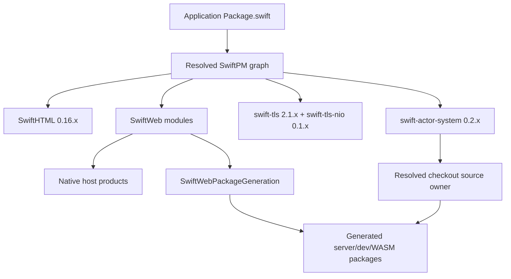

# SwiftWeb

## Purpose and Scope

SwiftWeb is the system package for server-rendered Swift applications and
optional Swift WASM browser runtimes. This document is the package-level master
for the 0.14.0 release.

SwiftWeb preserves Swift Distributed Actor declarations and calls as the
application-facing model for identity-scoped remote participants. Deployment
chooses where those participants run. Actor connection policy and destination
examples are owned by the [Actor integration design](Sources/SwiftWebRuntime/Actors/DESIGN.md#connection-roles),
including the distinction between Actor hosts, invocation executors, and
external resources. Ordinary HTTP routes and Server Actions retain their own
contracts.

The package root has four directly maintained design children:

- [Package generation](Sources/SwiftWebDevelopment/PackageGeneration/DESIGN.md)
  owns generated package materialization and runtime source mirroring.
- [Development server](Sources/SwiftWebDevelopment/DevServer/DESIGN.md) owns
  desired-state convergence, worker transitions, and generated-input lifetime.
- [Actor integration](Sources/SwiftWebRuntime/Actors/DESIGN.md) owns the
  SwiftWeb-facing Distributed Actor boundary.
- [Client runtime](Sources/SwiftWebBrowser/ClientRuntime/DESIGN.md) owns
  browser callback scheduling, state reconciliation, and terminal detachment.

The package root does not replace the module README files or the external
dependency contracts they reference.

## Responsibilities and Boundaries

The package manifest owns the SwiftPM dependency graph, package products,
platform minimum, and target composition. The package's modules own rendering,
browser state, host adapters, development orchestration, package generation,
and actor integration within their existing module boundaries.

The package does not own the internals of SwiftHTML, swift-actor-system,
swift-tls, or swift-tls-nio; each remains an independently released package.
Deployment adapters and cloud lifecycle are outside this package's runtime
proof boundary.

## Related Designs

| Design | Relationship | Contract used | Summary | Cautions |
|---|---|---|---|---|
| [Package generation](Sources/SwiftWebDevelopment/PackageGeneration/DESIGN.md) | child | Server, development, and WASM materialization | Owns generated package inputs | Recheck source-owner lookup when dependency layout changes. |
| [Development server](Sources/SwiftWebDevelopment/DevServer/DESIGN.md) | child | Generated-input and Native-worker convergence | Owns development transitions | Preserve compiler inputs owned by an active transition. |
| [Actor integration](Sources/SwiftWebRuntime/Actors/DESIGN.md) | child | Distributed Actor interface, destination substitution, binding, and host policy | Owns the Actor connection policy | Runtime ownership remains in the standalone package; examples do not imply shipped adapters. |
| [Client runtime](Sources/SwiftWebBrowser/ClientRuntime/DESIGN.md) | child | Callback scheduling and lifetime | Owns browser runtime execution | Recheck detachment and profile parity when lifecycle changes. |
| [SwiftWebDevelopment facade](Sources/SwiftWebDevelopment/Facade/README.md) | used by child | CLI-facing development lifecycle | Exposes development orchestration | The facade does not own generated source contents. |
| [SwiftWebCore](Sources/SwiftWebRuntime/Core/README.md) | constituent module | Rendering and request/runtime boundary | Composes application behavior | Keep host and browser ownership separate. |
| [Adapter contract](docs/AdapterContract.md) | coordinates with | Schema-3 discovery and service bindings | Supplies build/deploy composition | A Service build unit is not automatically an Actor API. |
| [Toolchain contract](docs/Toolchain.md) | package constraint | Pinned Swift 6.4 host and WASM SDKs | Selects the build tuple | Toolchain, SDK, and target are one build contract. |
| [HTML authoring model](docs/HTMLAuthoringModel.md) | depends on | SwiftHTML document and component surface | Supplies rendering primitives | Rendering semantics belong to SwiftHTML. |

## Architecture

Native targets link the released package products. Generated standard and
Embedded WASM packages copy only the runtime source targets required by their
profile from the resolved checkouts; they do not link the host-only graph.

## Contracts and Invariants

| Boundary | Assumption | Guarantee |
|---|---|---|
| SwiftPM graph | SwiftPM provides the dependency topology and checkout paths, and `Package.resolved` provides source-control pins | Remote adapter requirements materialize as exact versions or exact immutable revisions, never silently as checkout paths. Local paths remain limited to explicit local development and the generated application's own root composition. |
| Adapter Swift module references | A generated launcher may import a module whose identifier is shadowed by an application or service type | The adapter materializer applies the collision-only launcher alias contract from [Adapter contract](docs/AdapterContract.md); original package/module identity, Actor/schema identity, and non-colliding source semantics remain unchanged. |
| Platform | The host is macOS 26.2 or newer | The package and generated host consumers use the same minimum platform. |
| Toolchain | The pinned Swift 6.4 snapshot and matching SDKs are selected | Host, standard WASM, and Embedded WASM evidence is attributed only to that tuple. |
| Actor source ownership | SwiftPM resolves `swift-actor-system` | SwiftWeb has no vendored Actor source tree; generation mirrors the resolved checkout. |
| WASM projection | The selected profile supplies its required actor targets | Standard uses `ActorSystemCore` plus `ActorSystemDistributed`; Embedded uses `ActorSystemCore` plus `ActorSystemEmbedded`. |
| Actor call policy | swift-actor-system supplies immutable initializer defaults and task-scoped `ActorCallOptions` | A scoped value can drive a generated call deadline without mutating SwiftWeb's shared Embedded actor system; `.defaults`, nesting, parallel requests, errors, and cancellation preserve the lower-level scope contract. |
| Standard-WASM browser gate | Playwright Chromium and WebKit are installed for an explicitly enabled browser E2E run | Both npm counter commands require both engines. Chromium retains the full development/HMR suite; WebKit must launch before expensive build work, hydrate the generated runtime, mutate the Native Actor through the client component without navigation, and observe the new Actor value after a page reload. |
| Development generated-root lifetime | An active worker transition may retain compiler and build inputs below the current generated root until the transition terminates | The reconciler does not run its materializing fast path while a transition or shutdown owns that lifetime. A changed desired fingerprint remains pending and is prepared after the transition-completion wake; crash handling and failure latching retain their existing order. |
| Public surface | The release adopts fixed dependency versions and additive Hosting SPI | Existing Distributed Actor, scene binding, `ActorGroup`, `@RemoteActor`, HTTP, and WSS APIs remain compatible. `WebActorSystem.installActorClock` supplies the Embedded platform clock through Hosting SPI; scoped call options come from ActorSystem 0.2.x. Generated launcher collision handling does not change authored Actor identity. |

An absent runtime source or an invalid resolved graph is a materialization
failure. It is never replaced with an empty or pseudo-runtime source set.

Document metadata, including optional favicon links, follows the
[HTML authoring model](docs/HTMLAuthoringModel.md#favicon-metadata).
The convenience owns document composition only; applications own asset serving,
and generic browser reconciliation retains its existing runtime boundary.

## Runtime Flows

1. SwiftPM resolves the application graph and records `Package.resolved`.
2. The adapter dependency loader joins dependency identities from the inspected
   graph with their source-control pins from `Package.resolved`. Separately, the
   package-generation materializer discovers the resolved SwiftWeb and SwiftHTML
   roots and locates the Actor targets from that dependency context.
3. The adapter materializer renders collision-safe launcher module references;
   package generation writes isolated server, development, and profile-specific
   WASM packages.
4. During development, the reconciler prepares or replaces that generated
   root only when no transition owns compiler/build inputs below it. Changes
   observed during an active transition update the desired fingerprint and are
   prepared after that transition terminates and wakes convergence again.
5. Native hosts serve rendered documents; standard WASM performs browser
   hydration and state reconciliation; Embedded WASM uses the generated actor
   projection where its target supports it.
6. The opt-in standard-WASM counter runner proves the existing Chromium suite,
   then runs WebKit against the same Native Actor: it records the rendered
   server value, increments through the hydrated client component, rejects a
   navigation, and reloads to prove the incremented value came from Actor
   state rather than browser-only state.

## State, Ownership, and Lifecycle

The application owns authoring sources and `Package.swift`. SwiftPM owns
resolved dependency checkouts. SwiftWeb owns generated package directories as
replaceable build state. The standalone Actor package owns Actor runtime source
identity and lifecycle semantics.

The materializer's transaction owns staging and rollback of generated output;
it does not mutate dependency checkouts. Development workers and host
adapters own their process lifetimes under the existing development contracts.
An active reconciler transition owns the generated paths consumed by its build
until `runTransition` reaches its terminal state. The reconciler keeps newer
desired input pending rather than replacing those paths during that lifetime.

## Failure, Concurrency, and Constraints

Materialization is serialized per application package and commits generated
roots atomically. Source lookup is ordered and validated by required target
directories. A remote adapter requirement whose exact version or resolved revision
cannot be established fails materialization instead of falling back to its
local checkout path. The generated profile must not import an inactive Actor
target or host-only dependency. Direct browser-script execution remains opt-in,
but each npm counter command is a required two-engine gate once invoked:
missing or unlaunchable WebKit is a preflight failure, not a successful skip.
An explicit required invocation without the opt-in is a configuration failure.
Browser E2E is bounded; cloud deployment is not part of the 0.13.0 proof.

## Verification and Change Impact

| Evidence | Scope |
|---|---|
| `SwiftWebGeneratedPackageMaterializerTests` | Source projection, target selection, and generated package contracts. |
| `SwiftWebLifecycleTests` | Adapter requirement provenance, including exact version, exact revision, explicit local path, and missing remote pin failure. |
| `SwiftWebDevReconcilerTests` | Single-flight transition ownership, deferred fast-path preparation, latest-fingerprint convergence, crash precedence, failure latching, and shutdown behavior. |
| `SwiftWebActorGroupTests`, `SwiftWebActorHostTests` | Native actor ownership, authorization, lifecycle, and failure behavior. |
| `ClientRuntimeConcurrencyTests`, `SwiftWebHTTPServerHostTests` | Browser runtime scheduling and HTTP/TLS/WSS host behavior. |
| Generated standard/Embedded package compile and link | Profile-specific source and dependency graph validity only. |
| `counter-wasm` Chromium and WebKit E2E | Real standard-WASM browser state and remote Actor call path; Chromium owns the unchanged full development/HMR assertions, while WebKit owns hydration, navigation-free Actor mutation, reload persistence, diagnostics, and browser cleanup. |
| `SwiftWebServiceActorBrowserTests` | Native Main-to-Service HTTP Actor boundary, not generated WASM or cloud E2E. |
| Native 1 MiB frame/HTTP/WSS probes | Retained owner/range, codec bounds, and real-server equality; required-copy reasons remain in [Actor integration](Sources/SwiftWebRuntime/Actors/DESIGN.md). |
| `ActorTransportBoundary` Standard/Embedded Chromium probe | Controlled execution of the common browser HTTP owner at the exact public JavaScriptKit revision; [ClientRuntime](Sources/SwiftWebBrowser/ClientRuntime/DESIGN.md) owns ABI-copy measurements and source-backed intermediate storage accounting. Not full Embedded browser or cloud E2E. |
| Page-access performance and stress profiles | One-time unchanged HelloWorld latency, liveness, diagnostics, and cleanup evidence in [BrowserE2E](Tests/BrowserE2E/README.md); not a cold-start or repository-wide performance claim. |

Changes to a child contract require rechecking this master and the directly
dependent module designs. Full release integration additionally proves the
public version graph and remote release targets.
