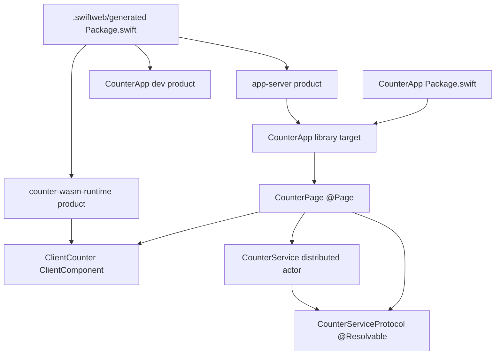
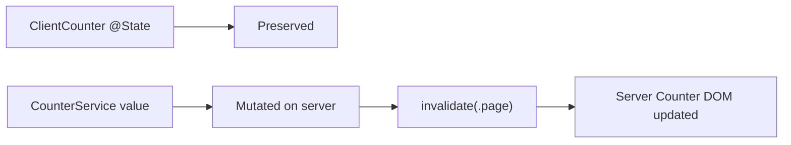
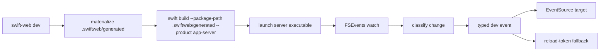

# CounterApp

CounterApp is the primary SwiftWeb sample for validating the intended application shape:

- `Package.swift` declares only the user app library.
- `CounterApp` owns route mounting through `SwiftWeb.App`.
- `CounterPage` keeps server data loading and page UI in one `@Page`.
- `ClientCounter` owns client-side `@State` and is copied into the generated WASM client target.
- `CounterServiceProtocol` exposes the client-visible distributed actor contract through Apple's `@Resolvable`.
- `CounterService` implements that contract and exposes page invalidation actions through function-level `@ServerAction`.
- `.swiftweb/generated` owns launchers, server executable packaging, distributed actor runtime copies, client-runtime source copies, and WASM runtime packaging.

## Structure



| Area | Responsibility |
|---|---|
| `Examples/CounterApp/Package.swift` | User-owned app module only. No launchers, no server executable, no WASM linker flags. |
| `Sources/CounterApp` | Pages, client components, app declaration, and page-local services. |
| `.swiftweb/generated/Package.swift` | Generated build package for dev launcher, server launcher, and WASM runtime targets. |
| `.swiftweb/generated/Sources/AppServerLauncher` | Thin generated server entrypoint that calls `CounterApp.run()`. |
| `.swiftweb/generated/Sources/SwiftWebDevLauncher` | Generated Xcode/CLI-friendly dev entrypoint that delegates to `SwiftWebDevRuntime`. |
| `.swiftweb/generated/Sources/CounterApp` | Generated client-only source copy for WASM builds. |
| `.swiftweb/generated/Sources/SwiftWebActors` | Generated copy of the shared distributed actor runtime for client-side `@Resolvable` service calls. |
| `.swiftweb/generated/Sources/SwiftWebUI` | Generated copy of the client UI component library used by the WASM build. |
| `swift-html` package dependency | Client HTML runtime used by server rendering and WASM builds. |
| `.swiftweb/generated/Sources/CounterWasmRuntime` | Generated WASM exports for client-side state and event dispatch. |

The hand-written app surface is intentionally small:

```text
CounterApp
├─ App.swift                  SwiftWeb.App declaration
├─ ClientCounter.swift        ClientComponent used by server render and WASM runtime
├─ Routes/CounterPage.swift   @Page body
├─ Services/CounterServiceProtocol.swift
│  └─ CounterServiceProtocol  @Resolvable typed RPC contract copied to WASM
└─ Actions/CounterService.swift
   └─ CounterService          server-only distributed actor and server actions
```

`CounterApp` mounts routes only:

```swift
public var body: some AppContent {
    Redirect("/", to: "/counter")
    CounterPage()
}
```

`CounterPage` owns its server counter service for the route lifetime:

```swift
private let counterService = CounterService(actorSystem: .shared)

func load() async throws -> Int {
    try await counterService.currentValue()
}

Button("Increment", action: counterService.incrementAction)
```

`CounterServiceProtocol` is the contract that a future client WASM component resolves through `$CounterServiceProtocol.resolve(id:using:)` when it needs direct, type-safe RPC. The form buttons intentionally use `@ServerAction` instead because their job is to mutate server state and invalidate the current page render.

The server counter value lives inside `CounterService`. It is not stored in the URL query and it is not a client-side hidden field.

The server action mutates actor state and returns `ActionResult.invalidate(.page)`. When the client WASM runtime is available, it posts the action, fetches the current page again, refreshes the server-owned counter DOM, and preserves `ClientCounter`'s local `@State`.



## Run

Run the development server with rebuild/restart and dev browser updates:

```bash
swift-web dev --package-path Examples/CounterApp
```

Open:

```text
http://127.0.0.1:3000/counter
```

`swift-web dev` materializes `.swiftweb/generated/Package.swift`, builds `app-server` from that generated package, starts the Vapor child process, watches the app package plus local package dependencies, and emits typed development events to the browser runtime.

The intended browser transport is `/__swiftweb/dev/events` through EventSource. Because the current Vapor 5 alpha HTTP server path does not yet write streaming response bodies, CounterApp currently relies on the `/__swiftweb/dev/reload` token fallback for reliable browser update signaling until response streaming is wired.



Build the server without running it:

```bash
swift-web build --package-path Examples/CounterApp
```

Run from Xcode:

```text
Open Examples/CounterApp/.swiftweb/generated in Xcode and select the CounterApp scheme.
```

The generated `CounterApp` scheme builds `SwiftWebDevLauncher`. Running it starts the same `SwiftWebDevRuntime` used by `swift-web dev`, including FSEvents rebuild, child restart, parent PID cleanup, typed dev events, and reload-token fallback signaling.

Build the user app library only:

```bash
swift build --package-path Examples/CounterApp
```

## Build WASM Runtime

```bash
swift-web build \
  --package-path Examples/CounterApp \
  --wasm \
  --swift-sdk swift-6.3.1-RELEASE_wasm \
  -c release
```

The generated WASM branch compiles a generated client-only `CounterApp` target from `.swiftweb/generated/Sources/CounterApp`, links `SwiftHTML` from the `swift-html` package dependency, uses the generated `SwiftWebUI` source copy, then links `CounterWasmRuntime`. Server-only sources stay in the user app library and are not part of the WASM target.

The WASM runtime is required for the client counter's `@State`, client-side event dispatch, action posting, and state-preserving invalidation behavior. Without the WASM asset, server rendering still produces HTML, but client-owned state and component event handling are not available.

The output is written to the shared SwiftPM scratch path:

```text
.build/wasm32-unknown-wasip1/release/counter-wasm-runtime.wasm
```
