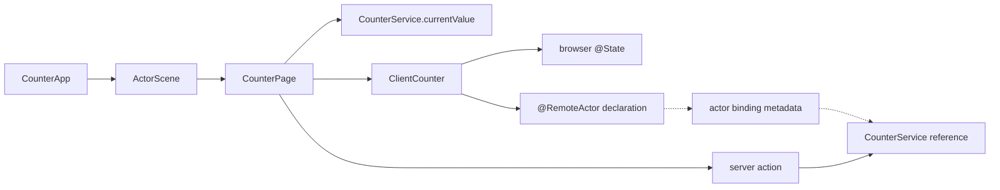

# CounterApp

CounterApp is the end-to-end SwiftWeb sample. It combines a loaded page,
SwiftWebUI, browser-owned state, server actions, and a concrete distributed
actor bound into the client rendering scope.

## Architecture


```mermaid
flowchart LR
  App["CounterApp"] --> ActorScene["ActorScene"]
  ActorScene --> Page["CounterPage"]
  Page --> Load["CounterService.currentValue"]
  Page --> Client["ClientCounter"]
  Client --> State["browser @State"]
  Client --> Remote["@RemoteActor declaration"]
  Remote -.-> Binding["actor binding metadata"]
  Binding -.-> Service["CounterService reference"]
  Page --> Action["server action"]
  Action --> Service
```

| Source | Responsibility |
|---|---|
| `App.swift` | Redirects `/` and mounts the counter service and page in `ActorScene` |
| `Routes/CounterPage.swift` | Loads server state and renders the complete document |
| `ClientCounter.swift` | Owns browser `@State` and declares the concrete `@RemoteActor` binding used by generated client projection |
| `Actions/CounterService.swift` | Declares the concrete distributed actor contract and implements server state and distributed calls |
| `Actions/CounterActions.swift` | Maps page-local Server Actions to counter actor mutations and page invalidation |

The user package remains a library. `sweb` owns concrete launch products under
`.swiftweb/generated`:

```text
.swiftweb/generated/
├─ dev/       Xcode and development launchers
├─ server/    production HTTP server launcher
└─ wasm/      client-only source copies and runtime products
```

## State Ownership

The two counters intentionally have different owners:

| Value | Owner | Update path |
|---|---|---|
| Client counter | `ClientCounter` in browser WASM | Local event handler mutates `@State` |
| Server counter | `CounterService` distributed actor | Page loading reads it and Server Actions mutate it |

A server action returns page invalidation. SwiftWeb fetches the current page,
patches server-owned DOM, and preserves the client component's local state.

This example verifies same-application actor hosting and binding. It does not
claim a browser-originated remote actor invocation. Cross-application and
multi-endpoint Actor examples are specified in
[Remote Connection Architecture](../../docs/RemoteConnectionArchitecture.md).

## Run

Configure the pinned toolchain from [Toolchain](../../docs/Toolchain.md), then:

```bash
sweb dev
```

Open [http://127.0.0.1:3000/counter](http://127.0.0.1:3000/counter). If the
port is occupied, use the URL printed by `sweb dev`.

The persistent DevHost serves application traffic and EventSource updates while
replaceable `SwiftWebHTTPServerHost` workers build and restart behind it.

## Xcode

```bash
sweb xcode
```

Open the generated `CounterApp-dev` scheme. It runs the same development
reconciler used by `sweb dev`.

## Production Builds

Build the native server:

```bash
sweb build
```

Build optimized browser runtimes and compression sidecars:

```bash
sweb build \
  --wasm \
  --runtime standard \
  --swift-sdk swift-6.4.x-DEVELOPMENT-SNAPSHOT-2026-08-14-a_wasm \
  -c release
```

CounterApp is the fixture used by the real Chromium development-server gate in
[Development Reconciler Verification](../../docs/DevServerReconcilerVerification.md).
