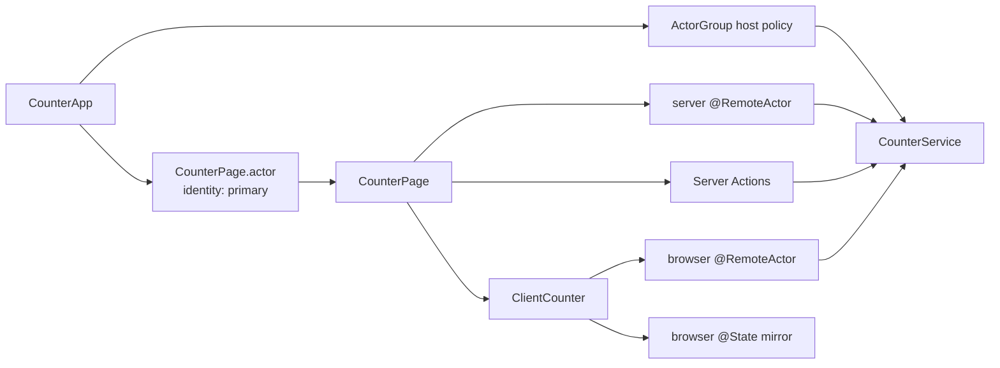

# CounterApp

CounterApp is the end-to-end SwiftWeb sample. It combines a loaded page,
SwiftWebUI, browser state, server actions, and direct distributed actor calls
through the same identity-scoped interface used for a remote Service Actor.
The sample is intentionally public: its app-wide actor policy and its
caller-addressed actor scope both declare `.allowAll`. Production apps should
replace either layer with their authentication and identity policy.

## Architecture


```mermaid
flowchart LR
  App["CounterApp"] --> Host["ActorGroup host policy"]
  Host --> Actor["CounterService"]
  App --> Bind["CounterPage.actor<br/>identity: primary"]
  Bind --> Page["CounterPage"]
  Page --> Load["server @RemoteActor"]
  Page --> Action["Server Actions"]
  Page --> Client["ClientCounter"]
  Client --> Remote["browser @RemoteActor"]
  Remote --> Actor
  Load --> Actor
  Action --> Actor
  Client --> State["browser @State mirror"]
```

| Source | Responsibility |
|---|---|
| `App.swift` | Registers the public demo actor's addressed authorization and construction policy, then binds `CounterPage` to the logical `primary` identity with the Scene modifier |
| `Actions/CounterServiceIdentity.swift` | Owns the logical identity selected by Swift code |
| `Routes/CounterPage.swift` | Resolves the bound actor, loads its current value, and renders the complete document |
| `ClientCounter.swift` | Calls the concrete actor from browser WASM and mirrors successful results in local `@State` |
| `Actions/CounterService.swift` | Declares the concrete distributed actor contract and implements server state and distributed calls |
| `Actions/CounterActions.swift` | Resolves the same actor and maps page-local Server Actions to mutations and page invalidation |

The user package remains a library. `sweb` owns concrete launch products under
`.swiftweb/generated`:

```text
.swiftweb/generated/
├─ dev/       Xcode and development launchers
├─ server/    production HTTP server launcher
└─ wasm/      client-only source copies and runtime products
```

## State Ownership

The displayed values have distinct storage owners, but both mutation paths use
the same actor:

| Value | Owner | Update path |
|---|---|---|
| Actor value | `CounterService` distributed actor | Browser `@RemoteActor` calls and Server Actions mutate it |
| Client display | `ClientCounter` in browser WASM | Successful actor results replace the local `@State` mirror |
| Server display | Rendered page document | Page loading reads the actor after invalidation |

A server action returns page invalidation. SwiftWeb fetches the current page,
patches server-owned DOM, and preserves the client component's local state.

The local environment uses `ActorGroup` to host `CounterService` in the same
application. Because this is a public counter demo, its caller-addressed
identity explicitly uses `allowAll`; production applications should select an
authorization policy that matches ownership of their actor identity. The caller
remains `CounterPage().actor(CounterService.self, identity: ...)`; a
Service-enabled environment can supply a transport route for that binding
without changing the page, `@RemoteActor`, or distributed method surface. See
the [Actor runtime documentation](../../Sources/SwiftWebRuntime/Actors/README.md).

## Run

Configure the pinned toolchain from [Toolchain](../../docs/Toolchain.md), then:

```bash
sweb dev
```

Open [http://127.0.0.1:3000/counter](http://127.0.0.1:3000/counter). If the
port is occupied, use the URL printed by `sweb dev`.

The persistent DevHost serves application traffic and EventSource updates while
replaceable `SwiftWebHTTPServerHost` workers build and restart behind it.

## Xcode

```bash
sweb xcode
```

Open the generated `CounterApp-dev` scheme. It runs the same development
reconciler used by `sweb dev`.

## Build

```bash
sweb build --environment local --runtime standard
```

The selected Host lifecycle builds the native server, browser runtime, and
compression sidecars before verifying the local deployment.

CounterApp is the fixture used by the real Chromium development-server gate in
[Development Reconciler Verification](../../docs/DevServerReconcilerVerification.md).
