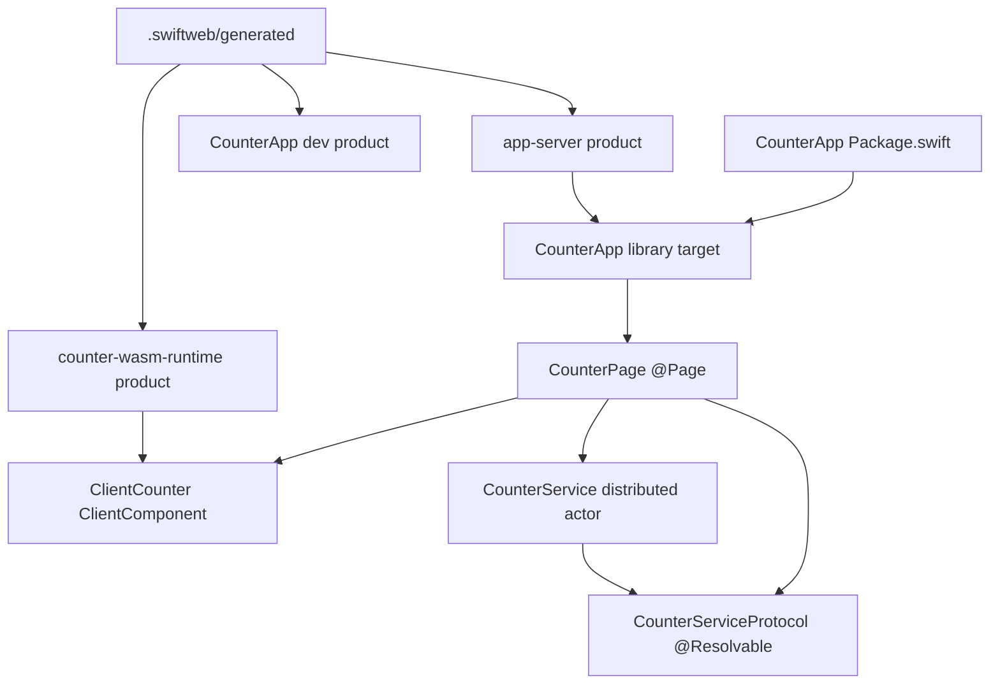
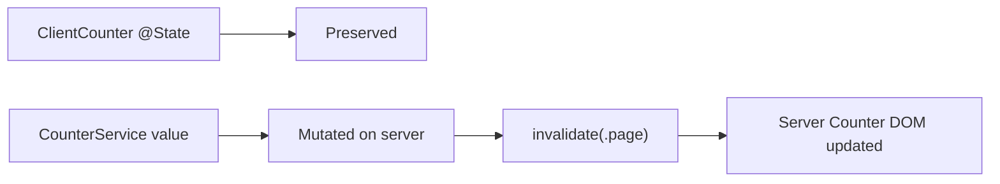
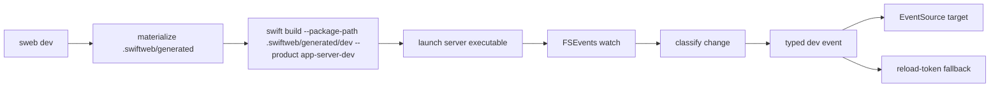

# CounterApp

CounterApp is the primary SwiftWeb sample for validating the intended application shape:

- `Package.swift` declares only the user app library.
- `CounterApp` owns route mounting through `SwiftWeb.App`.
- `CounterPage` keeps server data loading and page UI in one `@Page`.
- `ClientCounter` owns client-side `@State` and is copied into the generated WASM client target.
- `CounterServiceProtocol` exposes the client-visible distributed actor contract through Apple's `@Resolvable`.
- `CounterService` implements that contract and exposes page invalidation actions through function-level `@ServerAction`.
- `.swiftweb/generated` owns launchers, server executable packaging, distributed actor runtime copies, client-runtime source copies, and WASM runtime packaging.

## Toolchain

CounterApp uses the repository's pinned Swift 6.4 snapshot and matching standard
WASM SDK:

```bash
export SWIFT_WEB_TOOLCHAIN_BIN="$HOME/Library/Developer/Toolchains/swift-6.4.x-DEVELOPMENT-SNAPSHOT-2026-07-17-a.xctoolchain/usr/bin"
export SWIFT_WEB_HOST_SWIFT="$SWIFT_WEB_TOOLCHAIN_BIN/swift"
export SWIFT_WEB_WASM_SWIFT="$SWIFT_WEB_TOOLCHAIN_BIN/swift"
export SWIFT_WEB_WASM_TOOLCHAIN_BIN="$SWIFT_WEB_TOOLCHAIN_BIN"
```

See [Swift 6.4 Toolchain Migration](../../docs/Swift64ToolchainMigration.md)
for the version contract and verification commands.

## Structure


```mermaid
flowchart TD
  UserPackage["CounterApp Package.swift"]
  AppTarget["CounterApp library target"]
  GeneratedPackage[".swiftweb/generated"]
  DevProduct["CounterApp dev product"]
  ServerProduct["app-server product"]
  WasmProduct["counter-wasm-runtime product"]
  Page["CounterPage @Page"]
  Client["ClientCounter ClientComponent"]
  Contract["CounterServiceProtocol @Resolvable"]
  Service["CounterService distributed actor"]

  UserPackage --> AppTarget
  AppTarget --> Page
  Page --> Client
  Page --> Contract
  Page --> Service
  Service --> Contract
  GeneratedPackage --> DevProduct
  GeneratedPackage --> ServerProduct
  GeneratedPackage --> WasmProduct
  ServerProduct --> AppTarget
  WasmProduct --> Client
```

| Area | Responsibility |
|---|---|
| `Examples/CounterApp/Package.swift` | User-owned app module only. No launchers, no server executable, no WASM linker flags. |
| `Sources/CounterApp` | Pages, client components, app declaration, and page-local services. |
| `.swiftweb/generated/server/Package.swift` | Generated production server package. |
| `.swiftweb/generated/server/Sources/AppServerLauncher` | Thin generated server entrypoint that calls `CounterApp.run()`. |
| `.swiftweb/generated/dev/Package.swift` | Generated development package for CLI/Xcode launchers. |
| `.swiftweb/generated/dev/Sources/SwiftWebDevLauncher` | Generated Xcode/CLI-friendly dev entrypoint that delegates to `SwiftWebDevRuntime`. |
| `.swiftweb/generated/wasm/Sources/CounterApp` | Generated client-only source copy for WASM builds. |
| `.swiftweb/generated/wasm/Sources/SwiftWebActors` | Generated copy of the shared distributed actor runtime for client-side `@Resolvable` service calls. |
| `.swiftweb/generated/wasm/Sources/SwiftWebUI` | Generated copy of the client UI component library used by the WASM build. |
| `swift-html` package dependency | Client HTML runtime used by server rendering and WASM builds. |
| `.swiftweb/generated/wasm/Sources/CounterWasmRuntime` | Generated WASM exports for client-side state and event dispatch. |

The hand-written app surface is intentionally small:

```text
CounterApp
├─ App.swift                  SwiftWeb.App declaration
├─ ClientCounter.swift        ClientComponent used by server render and WASM runtime
├─ Routes/CounterPage.swift   @Page body
├─ Services/CounterServiceProtocol.swift
│  └─ CounterServiceProtocol  @Resolvable typed RPC contract copied to WASM
└─ Actions/CounterService.swift
   └─ CounterService          server-only distributed actor, typed RPC, and server actions
```

`CounterApp` provides the server actor to the counter scene:

```swift
private let counterService = CounterService(actorSystem: .shared)

public var body: some Scene {
    Redirect("/", to: "/counter")
    CounterPage(counterService: counterService)
        .actor(counterService)
}
```

`CounterPage` uses the same server counter service for page loading and server
actions:

```swift
func load() async throws -> Int {
    try await counterService.currentValue()
}

Button("Increment", action: counterService.incrementAction)
```

`CounterServiceProtocol` is also the contract that `ClientCounter` resolves
through `@Actor` when it needs direct, type-safe RPC. The server counter buttons
use `@ServerAction` because their job is to mutate server state and invalidate
the current page render.

The server counter value lives inside `CounterService`. It is not stored in the URL query and it is not a client-side hidden field.

The server action mutates actor state and returns `ActionResult.invalidate(.page)`. When the client WASM runtime is available, it posts the action, fetches the current page again, refreshes the server-owned counter DOM, and preserves `ClientCounter`'s local `@State`.


```mermaid
flowchart LR
  A["ClientCounter @State"] --> B["Preserved"]
  C["CounterService value"] --> D["Mutated on server"]
  D --> E["invalidate(.page)"]
  E --> F["Server Counter DOM updated"]
```

## Run

Run the development server with rebuild/restart and dev browser updates:

```bash
sweb dev
```

Refresh the generated development packages without running the server:

```bash
sweb prepare
```

Open:

```text
http://127.0.0.1:3000/counter
```

`sweb dev` materializes `.swiftweb/generated`, builds `app-server-dev` from the generated dev package, starts the Vapor child process, watches the app package plus local package dependencies, and emits typed development events to the browser runtime.

The intended browser transport is `/__swiftweb/dev/events` through EventSource. Because the current Vapor 5 alpha HTTP server path does not yet write streaming response bodies, CounterApp currently relies on the `/__swiftweb/dev/reload` token fallback for reliable browser update signaling until response streaming is wired.


```mermaid
flowchart LR
  A["sweb dev"] --> B["materialize .swiftweb/generated"]
  B --> C["swift build --package-path .swiftweb/generated/dev --product app-server-dev"]
  C --> D["launch server executable"]
  D --> E["FSEvents watch"]
  E --> F["classify change"]
  F --> G["typed dev event"]
  G --> H["EventSource target"]
  G --> I["reload-token fallback"]
```

Build the server without running it:

```bash
sweb build
```

Run from Xcode:

```bash
sweb xcode
```

`sweb xcode` materializes `.swiftweb/generated`, opens `.swiftweb/generated/dev`
in Xcode, and exposes the `CounterApp-dev` scheme. Running that scheme starts the
same `SwiftWebDevRuntime` used by `sweb dev`, including FSEvents rebuild, child
restart, parent PID cleanup, typed dev events, and reload-token fallback signaling.
If port `3000` is already in use, add `SWIFT_WEB_DEV_PORT` to the Xcode scheme
environment.

Build the user app library only:

```bash
"$SWIFT_WEB_HOST_SWIFT" build
```

## Build WASM Runtime

```bash
export SWIFT_WEB_TOOLCHAIN_BIN="$HOME/Library/Developer/Toolchains/swift-6.4.x-DEVELOPMENT-SNAPSHOT-2026-07-17-a.xctoolchain/usr/bin"
export SWIFT_WEB_HOST_SWIFT="$SWIFT_WEB_TOOLCHAIN_BIN/swift"
export SWIFT_WEB_WASM_SWIFT="$SWIFT_WEB_TOOLCHAIN_BIN/swift"
export SWIFT_WEB_WASM_TOOLCHAIN_BIN="$SWIFT_WEB_TOOLCHAIN_BIN"

sweb build \
  --wasm \
  --swift-sdk swift-6.4.x-DEVELOPMENT-SNAPSHOT-2026-07-17-a_wasm \
  -c release
```

The generated WASM branch compiles a generated client-only `CounterApp` target from `.swiftweb/generated/wasm/Sources/CounterApp`, links `SwiftHTML` from the `swift-html` package dependency, uses the generated `SwiftWebUI` source copy, then links `CounterWasmRuntime`. Server-only sources stay in the user app library and are not part of the WASM target.

The WASM runtime is required for the client counter's `@State`, client-side event dispatch, action posting, and state-preserving invalidation behavior. Without the WASM asset, server rendering still produces HTML, but client-owned state and component event handling are not available.

SwiftPM 6.4 writes the processed artifact and its production sidecars to:

```text
.swiftweb/generated/.build/wasm/out/Products/Release-webassembly-wasm32/
├─ counter-app-wasm-runtime.wasm
├─ counter-app-wasm-runtime.wasm.size.json
├─ counter-app-wasm-runtime.wasm.compression.json
├─ counter-app-wasm-runtime.wasm.gz
└─ counter-app-wasm-runtime.wasm.br
```
