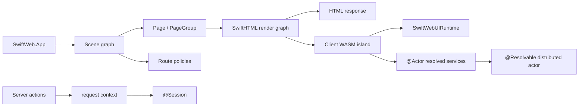
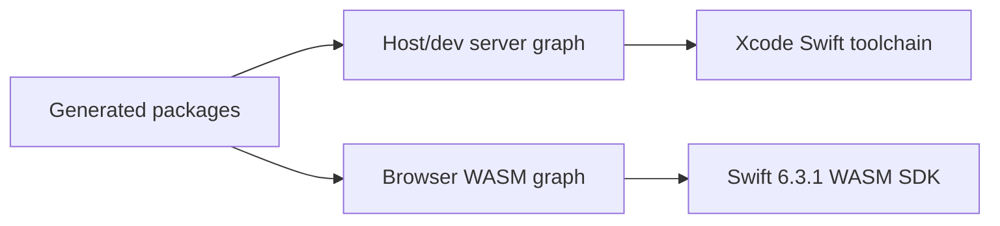
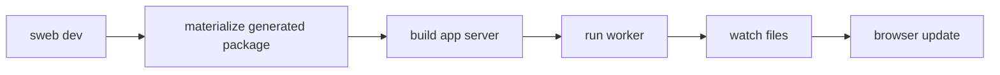
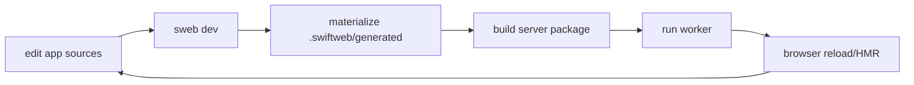
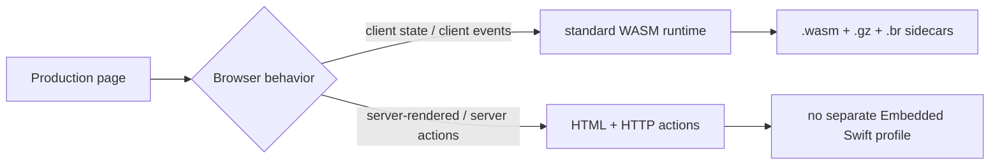

# SwiftWeb

SwiftWeb is a Swift server and browser runtime for building HTML-first web apps with
typed routing, server actions, SwiftWebUI components, and WebAssembly-powered client
islands.

> Status: developer preview. The browser/WASM path targets Swift 6.3.1 and the
> current host development server uses a toolchain split documented below.



## Packages

SwiftWeb keeps product names stable while grouping source directories by
responsibility. `Sources/` direct children are ownership boundaries; nested
directories describe the responsibility implemented by each SwiftPM target.

```text
Sources/
  SwiftWeb/
  SwiftWebRuntime/{Core,Actors}/
  SwiftWebBrowser/{Runtime,ClientRuntime}/
  SwiftWebHTTPServer/{Vapor,VaporWebActors}/
  SwiftWebUI/{Components,Style,Theme}/
  SwiftWebDevelopment/{Facade,Hooks,DevServer,PackageGeneration,WasmBuild,StoryboardTooling,Storyboard}/
  SwiftWebCLI/
  SwiftWebMacros/
```

| Product | Source directory | Responsibility |
|---|---|---|
| `SwiftWeb` | `Sources/SwiftWeb/` | Public app facade and source macro entrypoints. |
| `SwiftWebCore` | `Sources/SwiftWebRuntime/Core/` | Route, action, page, session, security, streaming, and server-rendering contracts used by host adapters. |
| `SwiftWebActors` | `Sources/SwiftWebRuntime/Actors/` | Transport-neutral distributed actor invocation support. |
| `SwiftWebBrowserRuntime` | `Sources/SwiftWebBrowser/Runtime/` | Browser runtime descriptors, WASM asset routes, host scripts, and HTML runtime injection. |
| `SwiftWebUIRuntime` | `Sources/SwiftWebBrowser/ClientRuntime/` | Browser-side WASM bridge and JavaScriptKit runtime adapter for client components. |
| `SwiftWebVapor` | `Sources/SwiftWebHTTPServer/Vapor/` | HTTP server adapter for local development workers, Cloud Run, and native/container server builds. |
| `SwiftWebVaporWebActors` | `Sources/SwiftWebHTTPServer/VaporWebActors/` | Optional HTTP server gateway for actor RPC. |
| `SwiftWebUI` | `Sources/SwiftWebUI/Components/` | SwiftUI-inspired component layer built on top of SwiftHTML. |
| `SwiftWebStyle` | `Sources/SwiftWebUI/Style/` | Atomic style classes, typed selectors, and CSS-safe declaration registration. |
| `SwiftWebUITheme` | `Sources/SwiftWebUI/Theme/` | Host-neutral theme tokens, the `Theme` model, root stylesheet, colors, materials, and spacing values. |
| `SwiftWebDevelopmentHooks` | `Sources/SwiftWebDevelopment/Hooks/` | Worker-side development hooks and typed HMR contracts. |
| `SwiftWebWasmBuild` | `Sources/SwiftWebDevelopment/WasmBuild/` | Toolchain resolution, WASM artifact processing, compression, and build profiles. |
| `SwiftWebPackageGeneration` | `Sources/SwiftWebDevelopment/PackageGeneration/` | Generated server/dev/WASM package materialization and manifest inspection. |
| `SwiftWebDevServer` | `Sources/SwiftWebDevelopment/DevServer/` | Persistent dev host, watcher, HMR event stream, worker supervision, and rebuild orchestration. |
| `SwiftWebStoryboardTooling` | `Sources/SwiftWebDevelopment/StoryboardTooling/` | Managed Storyboard package scaffold/materialization and dev runtime launch. |
| `SwiftWebStoryboard` | `Sources/SwiftWebDevelopment/Storyboard/` | Storyboard catalog components and routes. |
| `SwiftWebDevelopment` | `Sources/SwiftWebDevelopment/Facade/` | Convenience facade that re-exports development modules. |
| `sweb` | `Sources/SwiftWebCLI/` | CLI for new projects, dev server, Storyboard, and production builds. |

## Architecture Direction

SwiftWeb is moving toward a host-neutral runtime core with separate host adapters for
Vapor/container servers and Cloudflare Workers. Vapor remains the native server host
for local development, Cloud Run, and other container targets, while Cloudflare support
should lower the same `App`/`Scene`/`Page`/`Worker` model into generated TypeScript
entrypoints and Swift/Wasm artifacts.

See [Platform Host Architecture](docs/PlatformHostArchitecture.md) for the target
responsibility split, `Worker` model, `@Session` API, Cloudflare placement, and Vapor
extraction plan. See [Directory And File Structure Design](docs/DirectoryFileStructureDesign.md)
for the source layout and file placement rules. See [Actor Injection Design](docs/ActorInjectionDesign.md)
for the `@Actor` client component API over Apple's `@Resolvable` distributed
actor model.

## Requirements

| Area | Requirement |
|---|---|
| Swift tools version | `6.3` |
| Browser WASM toolchain | Swift `6.3.1` release toolchain |
| Browser WASM SDK | `swift-6.3.1-RELEASE_wasm` |
| Host toolchain (resolve + build) | **Swift 6.4** toolchain, e.g. Xcode-beta (see "Why Swift 6.4" below) |
| Platforms | macOS package development; browser runtime via WASM |

SwiftWeb keeps the host toolchain and browser WASM toolchain separate:



Use the real Swift 6.3.1 toolchain executable for WASM builds, not a `swiftly` shim:

```bash
export SWIFT_WEB_WASM_SWIFT="$(swiftly run +6.3.1 which swift)"
export SWIFT_WEB_WASM_TOOLCHAIN_BIN="$(dirname "$SWIFT_WEB_WASM_SWIFT")"
```

### Why Swift 6.4

SwiftWeb's host HTTP stack builds on the next-generation server packages
[`swift-http-server`](https://github.com/swift-server/swift-http-server)
(`NIOHTTPServer`) and
[`swift-http-api-proposal`](https://github.com/apple/swift-http-api-proposal)
(`HTTPAPIs`). Both declare `// swift-tools-version:6.4` and enable the
`LifetimeDependence` upcoming feature (the `Span` / lifetime-dependency model
used for zero-copy HTTP I/O), so they can only be resolved and built with a
Swift 6.4 toolchain. SwiftPM refuses to even resolve a graph whose dependency
manifest declares a newer tools version than the installed toolchain, which is
why the 6.3.1 toolchain fails at `swift package resolve`.

This is also why SwiftWeb ships as a developer preview: the host stack rides
Apple's still-evolving 6.4-era server APIs (pinned to specific revisions). Once
Swift 6.4 reaches general availability, the release Xcode toolchain satisfies
this on its own and the `DEVELOPER_DIR` override below is no longer needed.

## Installation

SwiftWeb's first developer-preview release is `0.1.0`. Depend on it by version.
The host-side HTTP stack is still pinned to specific upstream revisions, so a
resolved build pulls those exact revisions transitively:

```swift
// swift-tools-version: 6.3
import PackageDescription

let package = Package(
    name: "MyApp",
    platforms: [
        .macOS("26.2"),
    ],
    products: [
        .library(name: "MyApp", targets: ["MyApp"]),
    ],
    dependencies: [
        .package(url: "https://github.com/1amageek/swift-web.git", from: "0.1.0"),
        .package(url: "https://github.com/1amageek/swift-html.git", from: "0.8.1"),
    ],
    targets: [
        .target(
            name: "MyApp",
            dependencies: [
                .product(name: "SwiftHTML", package: "swift-html"),
                .product(name: "SwiftWeb", package: "swift-web"),
                .product(name: "SwiftWebUI", package: "swift-web"),
            ],
            swiftSettings: [
                .enableUpcomingFeature("ApproachableConcurrency"),
            ]
        ),
    ],
    swiftLanguageModes: [.v6]
)
```

> **Toolchain:** resolving and building SwiftWeb requires a **Swift 6.4**
> toolchain (see [Why Swift 6.4](#why-swift-64)); the default 6.3.1 fails at
> `swift package resolve`. Point SwiftPM at 6.4 — e.g. Xcode-beta:
>
> ```bash
> export DEVELOPER_DIR=/Applications/Xcode-beta.app/Contents/Developer
> xcrun swift build        # resolves against 6.4
> ```
>
> The browser/WASM build stays on the separate 6.3.1 WASM SDK (see Requirements).

### Install The CLI With Mint

Mint can install the `sweb` executable product directly from the repository. Pin
`@0.1.0` for a reproducible install; `@main` tracks the latest development.

Mint invokes `swift` from `PATH`, so it must find the **6.4** toolchain (the
default 6.3.1 fails to resolve the host HTTP stack). Put the 6.4 toolchain first:

```bash
XBIN=/Applications/Xcode-beta.app/Contents/Developer/Toolchains/XcodeDefault.xctoolchain/usr/bin
env DEVELOPER_DIR=/Applications/Xcode-beta.app/Contents/Developer PATH="$XBIN:$PATH" \
  mint install 1amageek/swift-web@0.1.0 sweb
```

| Need | Command |
|---|---|
| Install and link `sweb` globally | `mint install 1amageek/swift-web@0.1.0 sweb` |
| Run without linking | `mint run 1amageek/swift-web@0.1.0 sweb <command>` |
| Print the installed executable path | `mint which 1amageek/swift-web@0.1.0 sweb` |

```bash
mint install 1amageek/swift-web@0.1.0 sweb
sweb --help
sweb new MyApp --output ../MyApp
```

## Usage

### 1. Run The CLI From This Repository

When developing SwiftWeb itself, clone the repository and run the CLI from the
checkout:

```bash
git clone https://github.com/1amageek/swift-web.git
cd swift-web
xcrun swift run sweb --help
```

### 2. Create An App

Generate a new app package next to the SwiftWeb checkout:

```bash
xcrun swift run sweb new MyApp --output ../MyApp
```

The default app has this shape:

```text
MyApp
├─ Package.swift
├─ Sources/MyApp/App.swift
├─ Sources/MyApp/Routes/HomePage.swift
└─ .swiftweb/generated
   ├─ server
   ├─ dev
   └─ wasm
```

Generate a chat-first app shell for AI work:

```bash
xcrun swift run sweb new Chat --ai --output ../Chat
```

The AI template adds a SwiftWebUI chat surface:

```text
Chat
├─ Package.swift
├─ Sources/Chat/App.swift
├─ Sources/Chat/Routes/ChatPage.swift
├─ Sources/Chat/Components/ChatPanel.swift
└─ .swiftweb/generated
   ├─ server
   ├─ dev
   └─ wasm
```

The app package depends on the SwiftWeb `main` branch and released `swift-html 0.7.1`.
`sweb new` also materializes the generated launchers, dev packages, server packages,
and WASM packages under `.swiftweb/generated`. Use `sweb prepare` only when you want
to refresh generated packages for an existing SwiftWeb app without building or
running it:

Apply a deployment platform adapter by preset or GitHub repository slug:

```bash
xcrun swift run sweb new Chat --ai --platform cloudflare --output ../Chat
xcrun swift run sweb new Chat --ai --platform 1amageek/swift-web-cloudflare --output ../Chat
xcrun swift run sweb new Chat --ai --platform 1amageek/swift-web-cloudflare/chat --output ../Chat
```

`cloudflare` resolves to `1amageek/swift-web-cloudflare`. `sweb new` clones the
adapter repository, validates `sweb.json`, copies the selected template
files into the app package, renders `{{app.*}}` placeholders, and records the source
in `.swiftweb/platform.json`. Custom platform template repositories can be referenced
as `owner/repo` when they implement the platform adapter template contract. Add a
path after the repository, such as `owner/repo/chat`, to select a named template
inside that adapter repository.
The contract is documented in
[`docs/PlatformAdapterTemplateContract.md`](docs/PlatformAdapterTemplateContract.md).

```bash
cd ../MyApp
sweb prepare
```

### 3. Open The Xcode Package

From the app package directory:

```bash
sweb xcode
```

`sweb xcode` runs the same materialization step as `sweb prepare`, then opens
`.swiftweb/generated/dev` in Xcode.

The generated Xcode package includes a `<AppName>-dev` scheme that starts the same
development runtime used by `sweb dev`.

### 4. Run The Development Server

From the app package directory:

```bash
sweb dev
```

Open:

```text
http://127.0.0.1:3000/
```

The dev command materializes `.swiftweb/generated`, builds the app server, starts the
worker process, watches source changes, and sends browser update events.



### 5. Add Routes

`Sources/MyApp/App.swift` mounts pages:

```swift
import SwiftWeb

public struct MyApp: App {
    public init() {}

    public var body: some Scene {
        HomePage()
    }
}
```

`Sources/MyApp/Routes/HomePage.swift` defines the route:

```swift
import SwiftHTML
import SwiftWeb

@Page("/")
struct HomePage {
    func body() -> some HTML {
        div {
            h1 { "Hello SwiftWeb" }
            p { "Rendered by SwiftHTML and served through SwiftWeb." }
        }
    }
}
```

Add another route by creating another `@Page` type and mounting it from `App.body`:

```swift
@Page("/about")
struct AboutPage {
    func body() -> some HTML {
        main {
            h1 { "About" }
            p { "This page is rendered on the server." }
        }
    }
}
```

```swift
public var body: some Scene {
    HomePage()
    AboutPage()
}
```

Use `PageGroup` when a set of pages shares a path prefix:

```swift
public var body: some Scene {
    HomePage()

    PageGroup("admin") {
        AdminDashboardPage()
        AdminUsersPage()
    }
}
```

### 6. Read The Request Session

Use `@Session` inside request-time surfaces such as page bodies and server actions.
The wrapped value is `WebSession`, not a raw host request object.

```swift
@Page("/account")
struct AccountPage {
    @Session var session

    func body() -> some HTML {
        if session.isAuthenticated {
            AccountView()
        } else {
            LoginView()
        }
    }
}
```

| Session API | Meaning |
|---|---|
| `session.isAuthenticated` | Reads SwiftWeb's authentication marker or stored `userID`. |
| `session.userID` | Reads the stored user identifier. |
| `session["key"]` | Reads or writes string session state. |
| `session.authenticate(userID:)` | Stores the user identifier and marks the session authenticated. |
| `session.clearAuthentication()` | Removes SwiftWeb authentication keys. |
| `session.destroy()` | Invalidates the current persisted session. |

`@Session` is request-scoped. Do not read it from `App.body` or `Scene.body`, because
those build app topology without an active request. Scene-level access control belongs
to route policy descriptors such as the planned `.restrict(...)` modifier.

```swift
public var body: some Scene {
    PageGroup("admin") {
        AdminDashboardPage()
    }
    // Target route-policy shape; this is a request-time descriptor.
    // .restrict(.authenticated, redirectTo: "/login")
}
```

### 7. Use SwiftWebUI Components

Import `SwiftWebUI` when you want the higher-level component layer:

```swift
import Foundation
import SwiftHTML
import SwiftWeb
import SwiftWebUI

@Page("/")
struct HomePage {
    func body() -> some HTML {
        main {
            GridSystem {
                Pane(span: 12) {
                    VStack(spacing: .medium) {
                        Text("Hello SwiftWeb")
                            .font(.title)

                        Link("Continue", destination: URL(string: "/about")!)
                            .buttonStyle(.borderedProminent)
                    }
                }
            }
            .frame(maxWidth: 720)
        }
    }
}
```

SwiftWebUI lowers into the SwiftHTML graph. It does not replace SwiftHTML; raw SwiftHTML
elements remain available when you need exact HTML control.

### 8. Inspect Components With Storyboard

Run the SwiftWebUI component Storyboard from the SwiftWeb checkout:

```bash
xcrun swift run sweb storyboard
```

Open:

```text
http://127.0.0.1:3001/storyboard
```

Storyboard generates an isolated package under `.swiftweb/storyboard`; it does not edit
your app package.

Run Storyboard with production WASM artifacts and compression sidecars:

```bash
xcrun swift run sweb storyboard \
  --production \
  --runtime standard \
  -c release
```

This path builds the generated Storyboard WASM runtime through the production artifact
processor, writes `.wasm.gz` and `.wasm.br`, then starts the production `app-server`.
SwiftWeb supports the standard WASM profile for Storyboard production validation.

### 9. Build For Production

Build the generated server package:

```bash
sweb build
```

Build browser WASM artifacts:

```bash
export SWIFT_WEB_WASM_SWIFT="$(swiftly run +6.3.1 which swift)"
export SWIFT_WEB_WASM_TOOLCHAIN_BIN="$(dirname "$SWIFT_WEB_WASM_SWIFT")"

sweb build \
  --wasm \
  --swift-sdk swift-6.3.1-RELEASE_wasm \
  -c release
```

SwiftWeb's browser support boundary is the standard Swift WASM SDK:

| Runtime profile | Support | Browser artifact shape |
|---|---|---|
| `standard` | Supported. Full `ClientComponent` hydration, client state, browser events, and SwiftWebUI runtime behavior. | App client source, `SwiftHTML`, `SwiftWebUI`, `SwiftWebUIRuntime`, `SwiftWebActors`, JavaScriptKit. |
| Embedded Swift WASM | Not supported. Current Swift SDK and runtime dependencies do not provide the required `Distributed`, `Codable`, and Foundation capabilities for SwiftWeb's browser graph. | No public artifact contract. |

Production WASM builds strip debug/producers sections, optionally run `wasm-opt -Oz`,
write `<artifact>.wasm.size.json`, and create cached `.gz` / `.br` sidecars.

### 10. Try The Examples

The repository includes a minimal hello world app and a counter app with server
actions, page invalidation, and a client-side counter component.

Run the minimal app:

```bash
cd Examples/HelloWorld
sweb dev
```

Open:

```text
http://127.0.0.1:3000/
```

Run the counter app:

```bash
cd Examples/CounterApp
sweb dev
```

Open:

```text
http://127.0.0.1:3000/counter
```

## CLI

| Command | Purpose |
|---|---|
| `sweb new <AppName>` | Generate a minimal SwiftWeb app package. |
| `sweb new <AppName> --ai` | Generate a chat-first SwiftWebUI app shell for AI interfaces. |
| `sweb new <AppName> --platform cloudflare` | Apply a preset deployment adapter template. |
| `sweb new <AppName> --platform owner/repo` | Apply a GitHub-backed custom platform adapter template. |
| `sweb new <AppName> --platform owner/repo/template` | Apply a custom platform adapter and named template path. |
| `sweb prepare` | Materialize generated server, dev, and WASM packages for an existing app. |
| `sweb xcode` | Materialize generated packages and open the dev package in Xcode. |
| `sweb dev` | Run the development server with generated packages and HMR. |
| `sweb storyboard` | Run the SwiftWebUI component Storyboard. |
| `sweb build` | Build the generated production server package. |
| `sweb build --wasm` | Build browser WASM runtime artifacts and production sidecars. |

Package commands default to the current directory. Run them from the directory that
contains `Package.swift`, or pass `--package-path` when targeting a package from
another directory.

`sweb dev` uses a compact color console for dev status, rebuilds, HMR, and common
errors. It honors `NO_COLOR`; set `SWIFT_WEB_LOG_STYLE=plain` to keep the underlying
swift-log output.

## Development Workflow With sweb

Use `sweb` from inside the application package. The CLI treats the directory that
contains `Package.swift` as the app root, materializes generated packages under
`.swiftweb/generated`, and keeps your editable source under `Sources/<AppName>`.



| Step | Command | When to use it |
|---|---|---|
| Create an app | `sweb new MyApp --output ../MyApp` | Start a new SwiftWeb package and materialize `.swiftweb/generated`. |
| Create an AI chat app | `sweb new Chat --ai --output ../Chat` | Start with a SwiftWebUI chat page and client-side composer. |
| Apply a Cloudflare adapter | `sweb new Chat --ai --platform cloudflare --output ../Chat` | Copy the selected template and record `1amageek/swift-web-cloudflare` in `.swiftweb/platform.json`. |
| Apply a custom adapter | `sweb new App --platform owner/repo --output ../App` | Use any GitHub repository that implements the platform adapter template contract. |
| Apply an adapter template | `sweb new Chat --platform 1amageek/swift-web-cloudflare/chat --output ../Chat` | Use the `chat` template from that platform adapter repository. |
| Refresh generated packages | `sweb prepare` | Refresh `.swiftweb/generated` for an existing app without starting the server. |
| Open the generated dev package | `sweb xcode` | Inspect or debug the generated development package in Xcode. |
| Run the dev loop | `sweb dev` | Start the server, watcher, rebuild loop, and browser updates. |
| Build the server package | `sweb build` | Validate the generated production server package. |
| Build browser WASM | `sweb build --wasm --swift-sdk swift-6.3.1-RELEASE_wasm -c release` | Produce optimized browser runtime artifacts and compression sidecars. |

The normal loop is:

```bash
cd MyApp
sweb dev
```

Then edit route, component, and client island source files in `Sources/MyApp`.
Generated packages are implementation output; inspect them when debugging, but keep
source changes in the app package or in SwiftWeb itself.

For Xcode-based debugging, run:

```bash
cd MyApp
sweb xcode
```

This opens `.swiftweb/generated/dev`, whose `<AppName>-dev` scheme runs the same
development runtime as `sweb dev`.

Before release-oriented checks, run:

```bash
cd MyApp
sweb build
export SWIFT_WEB_WASM_SWIFT="$(swiftly run +6.3.1 which swift)"
export SWIFT_WEB_WASM_TOOLCHAIN_BIN="$(dirname "$SWIFT_WEB_WASM_SWIFT")"
sweb build --wasm --swift-sdk swift-6.3.1-RELEASE_wasm -c release
```

## Browser Runtime

SwiftWeb browser runtime packages copy runtime-only sources into generated WASM packages:

| Runtime source | Browser WASM behavior |
|---|---|
| SwiftHTML | Runtime source copy; preview/doc sources are excluded. |
| SwiftWebUI | Runtime source copy for client components. |
| SwiftWebUIRuntime | JavaScriptKit-backed browser adapter. |
| JavaScriptKit | Runtime-only copy; BridgeJS macros are not included by default. |
| SwiftSyntax | Not included in generated browser runtime packages. |

`sweb build --wasm` uses the standard Swift WASM compiler profile. SwiftWeb does
not expose Embedded Swift WASM as a supported runtime profile. Embedded Swift can
be revisited only if the browser runtime can be expressed without `Distributed`,
`Codable`, Foundation, or profile-specific source families.

The intended production split is:



Historical Embedded Swift measurements are research notes only and are not part of
the public support contract.

### Client Bundles

`ClientComponent` values are lowered into WASM bundles by contract. The default
contract joins the eager main bundle:

```swift
public struct ClientSummary: ClientComponent, Sendable {
    @State private var count = 0

    public init() {}

    public var body: some HTML {
        Button("Count \(count)") {
            count += 1
        }
    }
}
```

Use `loadPolicy` to decide when the browser loads a client island, and `bundle`
to decide which logical bundle groups related islands:

```swift
public struct ClientChart: ClientComponent, Sendable {
    public static let loadPolicy: LoadPolicy = .visible
    public static let bundle: BundlePolicy = .named("analytics")

    public init() {}

    public var body: some HTML {
        GroupBox {
            Text("Chart").as(.h2)
            Text("Loaded when the chart approaches the viewport.").foregroundStyle(.secondary)
        }
    }
}
```

Page-local overrides can be written where the client island is used:

```swift
ClientInspector()
    .loadPolicy(.manual)
    .bundle(.shared("tools"))
```

| Policy | Purpose |
|---|---|
| `.main` | Keep small or common eager components in the initial runtime. |
| `.component` | Split one large isolated client island. |
| `.named("analytics")` | Group page or app features under a readable bundle name. |
| `.shared("workspace")` | Group reusable client components that should share one bundle. |

| Load policy | Browser behavior |
|---|---|
| `.eager` | Load and instantiate during initial runtime startup. |
| `.visible` | Load when the island approaches the viewport. |
| `.interaction` | Load on hover, focus, touch, press, or click intent. |
| `.idle` | Load during a browser idle window. |
| `.manual` | Wait for an explicit runtime request. |

Modifiers must be attached to the outermost `ClientComponent` island. Nested
client components share the outer island's bundle contract. The default WASM
split strategy coalesces non-eager bundles by load policy, while
`SWIFTWEB_WASM_SPLIT_BUILD_STRATEGY=resolved` builds one artifact per resolved
logical bundle. See [ClientBundleLoadingDesign](docs/ClientBundleLoadingDesign.md)
for the full design.

Production WASM builds generate `.wasm.gz` and `.wasm.br` sidecars. Brotli defaults to
quality 11 for production transfer size, and sidecars are cached by the post-processed
WASM content hash so unchanged artifacts are not recompressed.

## Development Notes

| Topic | Current contract |
|---|---|
| Swift version | Keep `Package.swift` at `// swift-tools-version: 6.3`. |
| `swift-html` | Released dependency for generated apps: `0.7.1`. Storyboard development can still use a local sibling checkout when present. |
| Host compatibility | Current Vapor 5 HTTP stack may require an Xcode Swift toolchain for host/dev builds. |
| WASM compatibility | Browser runtime remains pinned to Swift 6.3.1 and the matching WASM SDK. |
| Versioned SwiftPM release | Blocked until branch/revision host dependencies are replaced or explicitly scoped out. |

## License

SwiftWeb is released under the MIT License. See [LICENSE](LICENSE).
