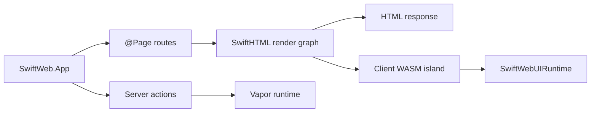
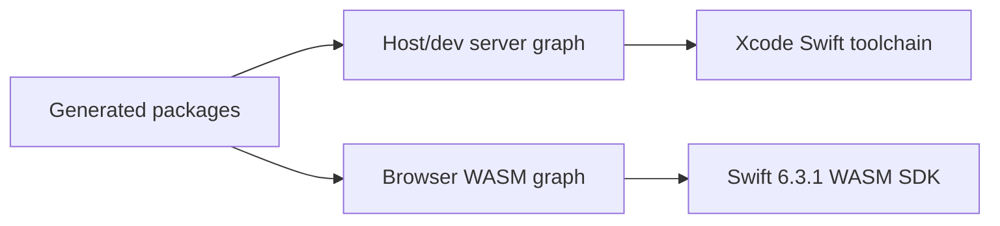

# SwiftWeb

SwiftWeb is a Swift server and browser runtime for building HTML-first web apps with
typed routing, server actions, SwiftWebUI components, and WebAssembly-powered client
islands.

> Status: developer preview. The browser/WASM path targets Swift 6.3.1 and the
> current host development server uses a toolchain split documented below.



## Packages

| Product | Purpose |
|---|---|
| `SwiftWeb` | Public app facade, page routing, server actions, Vapor integration, and runtime hosting. |
| `SwiftWebUI` | SwiftUI-inspired component layer built on top of SwiftHTML. |
| `SwiftWebUIRuntime` | Browser-side WASM runtime bridge for SwiftWebUI client components. |
| `SwiftWebActors` | Shared distributed actor runtime support for server/client actor calls. |
| `SwiftWebDevelopment` | Development server, generated packages, HMR, Storyboard, and WASM build tooling. |
| `swift-web` | CLI for new projects, dev server, Storyboard, and production builds. |

## Requirements

| Area | Requirement |
|---|---|
| Swift tools version | `6.3` |
| Browser WASM toolchain | Swift `6.3.1` release toolchain |
| Browser WASM SDK | `swift-6.3.1-RELEASE_wasm` |
| Host development build | Xcode Swift toolchain may be required by the current Vapor 5 HTTP stack |
| Platforms | macOS package development; browser runtime via WASM |

SwiftWeb keeps the host toolchain and browser WASM toolchain separate:



Use the real Swift 6.3.1 toolchain executable for WASM builds, not a `swiftly` shim:

```bash
export SWIFT_WEB_WASM_SWIFT=/Users/1amageek/Library/Developer/Toolchains/swift-6.3.1-RELEASE.xctoolchain/usr/bin/swift
export SWIFT_WEB_WASM_TOOLCHAIN_BIN=/Users/1amageek/Library/Developer/Toolchains/swift-6.3.1-RELEASE.xctoolchain/usr/bin
```

## Installation

For the current developer preview, depend on the repository branch until the host-side
HTTP dependencies are fully versioned for SwiftPM release consumption:

```swift
// swift-tools-version: 6.3
import PackageDescription

let package = Package(
    name: "MyApp",
    platforms: [
        .macOS("26.2"),
    ],
    products: [
        .library(name: "MyApp", targets: ["MyApp"]),
    ],
    dependencies: [
        .package(url: "https://github.com/1amageek/swift-web.git", branch: "main"),
        .package(url: "https://github.com/1amageek/swift-html.git", from: "0.5.0"),
    ],
    targets: [
        .target(
            name: "MyApp",
            dependencies: [
                .product(name: "SwiftHTML", package: "swift-html"),
                .product(name: "SwiftWeb", package: "swift-web"),
                .product(name: "SwiftWebUI", package: "swift-web"),
            ],
            swiftSettings: [
                .enableUpcomingFeature("ApproachableConcurrency"),
            ]
        ),
    ],
    swiftLanguageModes: [.v6]
)
```

## Quick Start

Create a project:

```bash
swift run swift-web new MyApp
cd MyApp
swift run swift-web dev
```

Define an app:

```swift
import SwiftWeb

public struct MyApp: App {
    public init() {}

    public var body: some AppContent {
        HomePage()
    }
}
```

Define a page:

```swift
import SwiftHTML
import SwiftWeb

@Page("/")
struct HomePage {
    func body() -> some HTML {
        div {
            h1 { "Hello SwiftWeb" }
            p { "Rendered by SwiftHTML and served through SwiftWeb." }
        }
    }
}
```

## CLI

| Command | Purpose |
|---|---|
| `swift-web new <AppName>` | Generate a minimal SwiftWeb app package. |
| `swift-web dev` | Run the development server with generated packages and HMR. |
| `swift-web storyboard` | Run the SwiftWebUI component Storyboard. |
| `swift-web build` | Build the generated production server package. |
| `swift-web build --wasm` | Build browser WASM runtime artifacts and production sidecars. |

## Browser Runtime

SwiftWeb browser runtime packages copy runtime-only sources into generated WASM packages:

| Runtime source | Browser WASM behavior |
|---|---|
| SwiftHTML | Runtime source copy; preview/doc sources are excluded. |
| SwiftWebUI | Runtime source copy for client components. |
| SwiftWebUIRuntime | JavaScriptKit-backed browser adapter. |
| JavaScriptKit | Runtime-only copy; BridgeJS macros are not included by default. |
| SwiftSyntax | Not included in generated browser runtime packages. |

Production WASM builds generate `.wasm.gz` and `.wasm.br` sidecars. Brotli defaults to
quality 11 for production transfer size, and sidecars are cached by the post-processed
WASM content hash so unchanged artifacts are not recompressed.

## Development Notes

| Topic | Current contract |
|---|---|
| Swift version | Keep `Package.swift` at `// swift-tools-version: 6.3`. |
| `swift-html` | Released dependency: `0.5.0`. |
| Host compatibility | Current Vapor 5 HTTP stack may require an Xcode Swift toolchain for host/dev builds. |
| WASM compatibility | Browser runtime remains pinned to Swift 6.3.1 and the matching WASM SDK. |
| Versioned SwiftPM release | Blocked until branch/revision host dependencies are replaced or explicitly scoped out. |

## License

SwiftWeb is released under the MIT License. See [LICENSE](LICENSE).
