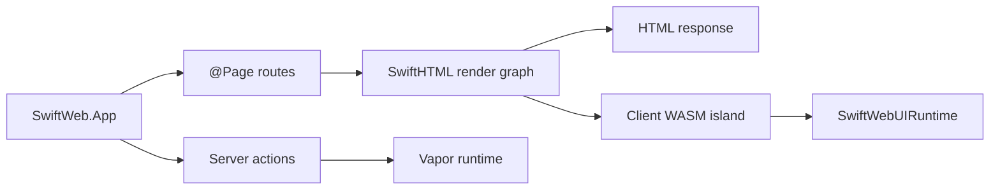
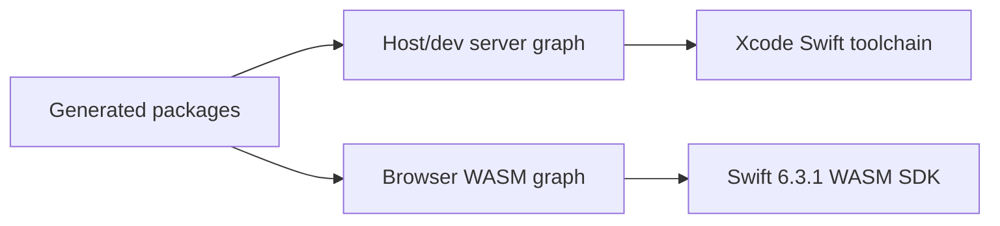
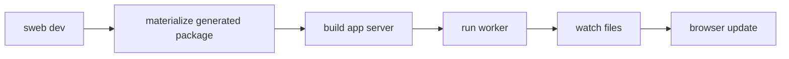

# SwiftWeb

SwiftWeb is a Swift server and browser runtime for building HTML-first web apps with
typed routing, server actions, SwiftWebUI components, and WebAssembly-powered client
islands.

> Status: developer preview. The browser/WASM path targets Swift 6.3.1 and the
> current host development server uses a toolchain split documented below.



## Packages

| Product | Purpose |
|---|---|
| `SwiftWeb` | Public app facade, page routing, server actions, Vapor integration, and runtime hosting. |
| `SwiftWebUI` | SwiftUI-inspired component layer built on top of SwiftHTML. |
| `SwiftWebUIRuntime` | Browser-side WASM runtime bridge for SwiftWebUI client components. |
| `SwiftWebActors` | Shared distributed actor runtime support for server/client actor calls. |
| `SwiftWebDevelopment` | Development server, generated packages, HMR, Storyboard, and WASM build tooling. |
| `sweb` | CLI for new projects, dev server, Storyboard, and production builds. |

## Requirements

| Area | Requirement |
|---|---|
| Swift tools version | `6.3` |
| Browser WASM toolchain | Swift `6.3.1` release toolchain |
| Browser WASM SDK | `swift-6.3.1-RELEASE_wasm` |
| Host development build | Xcode Swift toolchain may be required by the current Vapor 5 HTTP stack |
| Platforms | macOS package development; browser runtime via WASM |

SwiftWeb keeps the host toolchain and browser WASM toolchain separate:



Use the real Swift 6.3.1 toolchain executable for WASM builds, not a `swiftly` shim:

```bash
export SWIFT_WEB_WASM_SWIFT=/Users/1amageek/Library/Developer/Toolchains/swift-6.3.1-RELEASE.xctoolchain/usr/bin/swift
export SWIFT_WEB_WASM_TOOLCHAIN_BIN=/Users/1amageek/Library/Developer/Toolchains/swift-6.3.1-RELEASE.xctoolchain/usr/bin
```

## Installation

For the current developer preview, depend on the repository branch until the host-side
HTTP dependencies are fully versioned for SwiftPM release consumption:

```swift
// swift-tools-version: 6.3
import PackageDescription

let package = Package(
    name: "MyApp",
    platforms: [
        .macOS("26.2"),
    ],
    products: [
        .library(name: "MyApp", targets: ["MyApp"]),
    ],
    dependencies: [
        .package(url: "https://github.com/1amageek/swift-web.git", branch: "main"),
        .package(url: "https://github.com/1amageek/swift-html.git", from: "0.5.0"),
    ],
    targets: [
        .target(
            name: "MyApp",
            dependencies: [
                .product(name: "SwiftHTML", package: "swift-html"),
                .product(name: "SwiftWeb", package: "swift-web"),
                .product(name: "SwiftWebUI", package: "swift-web"),
            ],
            swiftSettings: [
                .enableUpcomingFeature("ApproachableConcurrency"),
            ]
        ),
    ],
    swiftLanguageModes: [.v6]
)
```

## Usage

### 1. Run The CLI From This Repository

SwiftWeb is currently published as a developer preview. Clone the repository and run the
CLI from the checkout:

```bash
git clone https://github.com/1amageek/swift-web.git
cd swift-web
xcrun swift run sweb --help
```

### 2. Create An App

Generate a new app package next to the SwiftWeb checkout:

```bash
xcrun swift run sweb new MyApp --output ../MyApp
```

The generated app has this shape:

```text
MyApp
├─ Package.swift
├─ Sources/MyApp/App.swift
├─ Sources/MyApp/Routes/HomePage.swift
└─ .swiftweb/generated
   ├─ server
   ├─ dev
   └─ wasm
```

The app package depends on the local SwiftWeb checkout and released `swift-html 0.5.0`.
Generated launchers, dev packages, server packages, and WASM packages stay under
`.swiftweb/generated`.

You can materialize the generated development environment for any existing SwiftWeb app
without building or running it:

```bash
xcrun swift run sweb prepare --package-path ../MyApp
```

### 3. Run The Development Server

From the SwiftWeb checkout:

```bash
xcrun swift run sweb dev --package-path ../MyApp
```

Open:

```text
http://127.0.0.1:3000/
```

The dev command materializes `.swiftweb/generated`, builds the app server, starts the
worker process, watches source changes, and sends browser update events.



### 4. Add Routes

`Sources/MyApp/App.swift` mounts pages:

```swift
import SwiftWeb

public struct MyApp: App {
    public init() {}

    public var body: some AppContent {
        HomePage()
    }
}
```

`Sources/MyApp/Routes/HomePage.swift` defines the route:

```swift
import SwiftHTML
import SwiftWeb

@Page("/")
struct HomePage {
    func body() -> some HTML {
        div {
            h1 { "Hello SwiftWeb" }
            p { "Rendered by SwiftHTML and served through SwiftWeb." }
        }
    }
}
```

Add another route by creating another `@Page` type and mounting it from `App.body`:

```swift
@Page("/about")
struct AboutPage {
    func body() -> some HTML {
        main {
            h1 { "About" }
            p { "This page is rendered on the server." }
        }
    }
}
```

```swift
public var body: some AppContent {
    HomePage()
    AboutPage()
}
```

### 5. Use SwiftWebUI Components

Import `SwiftWebUI` when you want the higher-level component layer:

```swift
import SwiftHTML
import SwiftWeb
import SwiftWebUI

@Page("/")
struct HomePage {
    func body() -> some HTML {
        VStack(spacing: .medium) {
            Text("Hello SwiftWeb")
                .font(.title)

            Button("Continue", href: "/about")
                .buttonStyle(.borderedProminent)
        }
        .padding(.large)
    }
}
```

SwiftWebUI lowers into the SwiftHTML graph. It does not replace SwiftHTML; raw SwiftHTML
elements remain available when you need exact HTML control.

### 6. Inspect Components With Storyboard

Run the SwiftWebUI component Storyboard from the SwiftWeb checkout:

```bash
xcrun swift run sweb storyboard
```

Open:

```text
http://127.0.0.1:3001/storyboard
```

Storyboard generates an isolated package under `.swiftweb/storyboard`; it does not edit
your app package.

### 7. Build For Production

Build the generated server package:

```bash
xcrun swift run sweb build --package-path ../MyApp
```

Build browser WASM artifacts:

```bash
export SWIFT_WEB_WASM_SWIFT=/Users/1amageek/Library/Developer/Toolchains/swift-6.3.1-RELEASE.xctoolchain/usr/bin/swift
export SWIFT_WEB_WASM_TOOLCHAIN_BIN=/Users/1amageek/Library/Developer/Toolchains/swift-6.3.1-RELEASE.xctoolchain/usr/bin

xcrun swift run sweb build \
  --package-path ../MyApp \
  --wasm \
  --swift-sdk swift-6.3.1-RELEASE_wasm \
  -c release
```

Production WASM builds strip debug/producers sections, optionally run `wasm-opt -Oz`,
write `<artifact>.wasm.size.json`, and create cached `.gz` / `.br` sidecars.

### 8. Try The Counter Example

The repository includes a sample app with server actions, page invalidation, and a
client-side counter component:

```bash
xcrun swift run sweb dev --package-path Examples/CounterApp
```

Open:

```text
http://127.0.0.1:3000/counter
```

## CLI

| Command | Purpose |
|---|---|
| `sweb new <AppName>` | Generate a minimal SwiftWeb app package. |
| `sweb prepare` | Materialize generated server, dev, and WASM packages for an existing app. |
| `sweb dev` | Run the development server with generated packages and HMR. |
| `sweb storyboard` | Run the SwiftWebUI component Storyboard. |
| `sweb build` | Build the generated production server package. |
| `sweb build --wasm` | Build browser WASM runtime artifacts and production sidecars. |

## Browser Runtime

SwiftWeb browser runtime packages copy runtime-only sources into generated WASM packages:

| Runtime source | Browser WASM behavior |
|---|---|
| SwiftHTML | Runtime source copy; preview/doc sources are excluded. |
| SwiftWebUI | Runtime source copy for client components. |
| SwiftWebUIRuntime | JavaScriptKit-backed browser adapter. |
| JavaScriptKit | Runtime-only copy; BridgeJS macros are not included by default. |
| SwiftSyntax | Not included in generated browser runtime packages. |

Production WASM builds generate `.wasm.gz` and `.wasm.br` sidecars. Brotli defaults to
quality 11 for production transfer size, and sidecars are cached by the post-processed
WASM content hash so unchanged artifacts are not recompressed.

## Development Notes

| Topic | Current contract |
|---|---|
| Swift version | Keep `Package.swift` at `// swift-tools-version: 6.3`. |
| `swift-html` | Released dependency: `0.5.0`. |
| Host compatibility | Current Vapor 5 HTTP stack may require an Xcode Swift toolchain for host/dev builds. |
| WASM compatibility | Browser runtime remains pinned to Swift 6.3.1 and the matching WASM SDK. |
| Versioned SwiftPM release | Blocked until branch/revision host dependencies are replaced or explicitly scoped out. |

## License

SwiftWeb is released under the MIT License. See [LICENSE](LICENSE).
