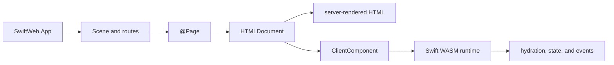
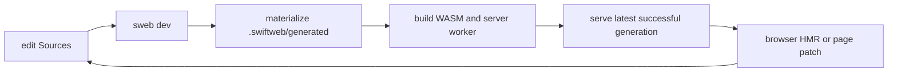

# SwiftWeb

SwiftWeb is a Swift framework for server-rendered web applications with an
optional Swift WASM browser runtime. Applications describe routes and complete
HTML documents in Swift, use SwiftWebUI for higher-level components, and opt
individual client components into hydration, local state, and browser events.

> SwiftWeb 0.8 is a developer preview. It requires the pinned Swift 6.4
> development snapshot because its HTTP host uses the current lifetime-aware
> Swift server APIs.

## What You Build


```mermaid
flowchart LR
  App["SwiftWeb.App"] --> Scene["Scene and routes"]
  Scene --> Page["@Page"]
  Page --> Document["HTMLDocument"]
  Document --> HTML["server-rendered HTML"]
  Document --> Island["ClientComponent"]
  Island --> WASM["Swift WASM runtime"]
  WASM --> Browser["hydration, state, and events"]
```

| Layer | Responsibility |
|---|---|
| `SwiftHTML` | HTML elements, reusable `Component` values, documents, and rendering |
| `SwiftWeb` | Application scenes, pages, routing, request context, actions, and actors |
| `SwiftWebUI` | Layout, controls, themes, modifiers, and client components |
| `sweb` | Project generation, generated packages, development server, independent services, Storyboard, and production builds |

## Requirements

SwiftWeb pins the host toolchain and WASM SDK to the same snapshot.

| Item | Required value |
|---|---|
| Swift tools version | `6.4` |
| Swiftly selector | `6.4.x-snapshot-2026-08-14` |
| Swift toolchain | `swift-6.4.x-DEVELOPMENT-SNAPSHOT-2026-08-14-a` |
| Browser SDK | `swift-6.4.x-DEVELOPMENT-SNAPSHOT-2026-08-14-a_wasm` |
| Package platform | macOS 26.2 or newer |

For WASM commands, point SwiftWeb at the real toolchain directory. A `swiftly`
shim does not contain the matching `wasm-ld` executable.

```bash
export SWIFT_WEB_TOOLCHAIN_BIN="$HOME/Library/Developer/Toolchains/swift-6.4.x-DEVELOPMENT-SNAPSHOT-2026-08-14-a.xctoolchain/usr/bin"
export SWIFT_WEB_HOST_SWIFT="$SWIFT_WEB_TOOLCHAIN_BIN/swift"
export SWIFT_WEB_WASM_SWIFT="$SWIFT_WEB_TOOLCHAIN_BIN/swift"
export SWIFT_WEB_WASM_TOOLCHAIN_BIN="$SWIFT_WEB_TOOLCHAIN_BIN"

"$SWIFT_WEB_HOST_SWIFT" --version
test -x "$SWIFT_WEB_WASM_TOOLCHAIN_BIN/wasm-ld"
```

See [Toolchain](docs/Toolchain.md) for the complete host and WASM setup.

## Quick Start

Install the `sweb` executable from the 0.11.0 release with
[Mint](https://github.com/yonaskolb/Mint):

```bash
export PATH="$SWIFT_WEB_TOOLCHAIN_BIN:$PATH"
mint install 1amageek/swift-web@0.11.0 sweb
sweb --help
```

Create and run an application:

```bash
sweb new MyApp --output .
cd MyApp
sweb dev
```

Open [http://127.0.0.1:3000](http://127.0.0.1:3000). If port 3000 is
occupied, `sweb dev` selects the next available port and prints it.

The generated package depends on released versions of SwiftWeb and SwiftHTML:

```swift
// swift-tools-version: 6.4

import PackageDescription

let package = Package(
    name: "MyApp",
    platforms: [.macOS("26.2")],
    products: [
        .library(name: "MyApp", targets: ["MyApp"]),
    ],
    dependencies: [
        .package(url: "https://github.com/1amageek/swift-web.git", from: "0.11.0"),
        .package(url: "https://github.com/1amageek/swift-html.git", from: "0.15.0"),
    ],
    targets: [
        .target(
            name: "MyApp",
            dependencies: [
                .product(name: "SwiftHTML", package: "swift-html"),
                .product(name: "SwiftWeb", package: "swift-web"),
            ],
            swiftSettings: [
                .enableUpcomingFeature("ApproachableConcurrency"),
            ]
        ),
    ],
    swiftLanguageModes: [.v6]
)
```

## Authoring Model

### Application and routes

An application declares its route topology through `App.body`:

```swift
import SwiftWeb

public struct MyApp: SwiftWeb.App {
    public init() {}

    public var body: some Scene {
        HomePage()
        AboutPage()
    }
}
```

`App` owns only the declarative application definition. The host owns its
server configuration and lifecycle, then renders the app through SwiftWeb's
common rendering boundary:

```swift
import SwiftWebHTTPServerHost

let host = HTTPServerHost(hostname: "127.0.0.1", port: 8080)
let installation = try await host.render(MyApp())
defer { installation.shutdown() }
try await installation.serve()
```

`App.run()` is the command-line convenience over this same path. Host adapter
authors should follow the [Host Rendering Contract](docs/HostRenderingContract.md).

### Actor connections

SwiftWeb uses Swift Distributed Actors for identity-scoped remote state. The
concrete actor declaration remains the interface whether the actor is local or
hosted by another Service application.

```swift
public distributed actor DatabaseActor {
    public typealias ActorSystem = WebActorSystem

    public distributed func execute(_ request: ActorByteBuffer) async throws
        -> ActorByteBuffer
    {
        // Host-side implementation.
    }
}
```

Bind an externally hosted actor at the page or scene that consumes it:

```swift
DatabasePage()
    .actor(DatabaseActor.self, identity: "production")
```

Client and server-side WASM code receives the same concrete reference through
`@RemoteActor` and calls its `distributed func` directly. Swift code owns the
type and logical identity. `sweb.json` selects the Service build/deploy unit,
and the deployment adapter supplies transport and endpoint templates. URLs,
credentials, adapter names, and artifact names do not enter the actor call
site. Destinations without Actor ownership and isolation remain Server
connections.

See [Actor Injection](docs/ActorInjectionDesign.md) and
[Remote Connections](docs/RemoteConnectionArchitecture.md).

### HTTPS and WSS

The native host can terminate TLS directly through
[`swift-tls-nio`](https://github.com/1amageek/swift-tls-nio). Supply a
server-side `TLSConfiguration` through the host-owned transport configuration:

```swift
import SwiftWebHTTPServerHost
import TLS

let identity = TLSIdentity(
    privateKey: privateKeyBytes,
    keyType: .ecdsaP256,
    certificateChain: [Certificate(der: leafCertificateDER)]
)
let transport = try HTTPServerTransportConfiguration.tls(
    .server(identity: identity, alpn: ["http/1.1"])
)
let host = HTTPServerHost(
    hostname: "0.0.0.0",
    port: 8443,
    transport: transport
)

try await host.run(MyApp())
```

The same listener serves HTTPS routes and WSS upgrades. TLS is installed before
the HTTP/1.1 and WebSocket handlers, so route and WebSocket APIs continue to
receive plaintext while transport bytes remain encrypted. An empty ALPN list is
normalized to `http/1.1`; unsupported protocols fail during transport
configuration instead of selecting a codec the host cannot serve.

Browser clients should derive WebSocket URLs from the page origin. An HTTPS
page therefore resolves its socket endpoint to `wss://`; HTTP continues to use
`ws://` for explicitly plaintext development listeners.

Binary callbacks receive `WebSocketBinaryBuffer`, an immutable owner plus a
readable range. Slicing and forwarding that value retain adapter-native storage
without materializing `[UInt8]`; `withUnsafeBytes` provides a scoped borrow and
`copyBytes()` is the explicit conversion for APIs that require an array.

A static page returns a complete `HTMLDocument`:

```swift
import SwiftHTML
import SwiftWeb

@Page("/")
struct HomePage {
    var document: some HTMLDocument {
        PageDocument(
            title: "Home",
            description: "A SwiftWeb application."
        ) {
            main {
                h1 { "Hello SwiftWeb" }
                p { "Rendered on the server with SwiftHTML." }
            }
        }
    }
}
```

Use `load()` and `document(_:)` when rendering needs asynchronous data:

```swift
import SwiftHTML
import SwiftWeb

@Page("/profile")
struct ProfilePage {
    struct Model: Sendable {
        let displayName: String
    }

    func load() async throws -> Model {
        Model(displayName: "Taylor")
    }

    func document(_ model: Model) -> some HTMLDocument {
        PageDocument(title: model.displayName) {
            main {
                h1 { model.displayName }
            }
        }
    }
}
```

`Component` is the reusable, nestable authoring unit. `HTMLDocument` owns a
complete page and cannot be nested inside a component. The full contract is in
[HTML Authoring Model](docs/HTMLAuthoringModel.md).

### SwiftWebUI

Add the `SwiftWebUI` product when you want higher-level layout and controls:

```swift
.product(name: "SwiftWebUI", package: "swift-web")
```

SwiftWebUI components lower into the same SwiftHTML graph, so raw HTML elements
and SwiftWebUI values can be composed at one page boundary.

```swift
import Foundation
import SwiftHTML
import SwiftWeb
import SwiftWebUI

@Page("/")
struct HomePage {
    var document: some HTMLDocument {
        PageDocument(title: "Home") {
            main {
                VStack(spacing: .large) {
                    Text("Hello SwiftWeb").as(.h1)
                    Link("About", destination: URL(string: "/about")!)
                }
                .frame(maxWidth: 720)
            }
        }
    }
}
```

### Browser components

`ClientComponent` runs in the generated standard Swift WASM runtime. Its
`@State` values and event handlers remain in the browser:

```swift
import SwiftHTML
import SwiftWebUI

public struct Counter: ClientComponent {
    @State private var count = 0

    public init() {}

    public var content: some Component {
        VStack(spacing: .small) {
            Text("Count: \(count)")
            Button("Increment") {
                count += 1
            }
        }
    }
}
```

The default contract places small client components in the eager main bundle.
Large or deferred islands can declare a loading and bundle policy:

```swift
public static let loadPolicy: LoadPolicy = .visible
public static let bundle: BundlePolicy = .named("analytics")
```

Available load policies are `.eager`, `.visible`, `.interaction`, `.idle`, and
`.manual`. See [Client Bundle Loading](docs/ClientBundleLoadingDesign.md) for
bundle resolution, ownership, and production behavior.

## Development Workflow

`sweb dev` maintains desired source state and the currently serving worker. It
materializes generated packages, rebuilds changed browser/server paths, swaps a
ready worker, and recovers from build failures without discarding the last good
application.


```mermaid
flowchart LR
  Edit["edit Sources"] --> Dev["sweb dev"]
  Dev --> Prepare["materialize .swiftweb/generated"]
  Prepare --> Build["build WASM and server worker"]
  Build --> Serve["serve latest successful generation"]
  Serve --> HMR["browser HMR or page patch"]
  HMR --> Edit
```

Generated content is build output. Keep application changes in `Package.swift`
and `Sources`; do not edit `.swiftweb/generated` directly.

| Command | Purpose |
|---|---|
| `sweb new <Name> [--output <directory>]` | Create a minimal application |
| `sweb new <Name> --ai` | Create a chat-oriented SwiftWebUI application |
| `sweb new <Name> --adapter <owner/repository>` | Add an adapter package and configured production environment |
| `sweb prepare [--environment <name>] [--runtime standard|embedded]` | Resolve adapters and materialize configured environments |
| `sweb xcode` | Refresh and open `.swiftweb/generated/dev` |
| `sweb dev [--environment <name>] [--host <host>] [--port <port>]` | Build and run the selected environment locally |
| `sweb storyboard` | Generate and run the SwiftWebUI component Storyboard |
| `sweb build [--environment <name>] [--runtime standard|embedded]` | Build and verify the selected environment |
| `sweb deploy [--environment <name>] [--runtime standard|embedded]` | Build, verify, and deploy the selected environment |
| `sweb clean [--storyboard] [--swiftpm] [--all]` | Remove selected generated output |

All package commands accept `--package-path <directory>`. Lifecycle commands
select their default environment from the source-controlled `sweb.json`.

Run `sweb xcode` to use the generated `<AppName>-dev` scheme in Xcode:

```bash
cd MyApp
sweb xcode
```

## Production Builds and Deployment

Build the complete selected environment. Service adapters build independent
service applications, the Host adapter owns primary application compilation,
and the Deployment adapter owns platform validation:

```bash
cd MyApp
sweb build --environment production
```

Deploy only after the same environment has passed prepare and build:

```bash
sweb deploy --environment production
```

`sweb deploy` reruns prepare and build before the deployment operation. Remote
state changes remain isolated to selected Service and Deployment adapter deploy
tasks.

The browser runtime profile is selected at the build boundary. Application
source keeps the same actor call surface in both profiles:

```bash
sweb build --environment production --runtime embedded
```

Embedded builds use the pinned matching Embedded WASM SDK. The development
server remains a Standard WASM workflow; use `prepare`, `build`, or `deploy` for
Embedded artifacts.

## Project Layout

```text
MyApp/
├─ Package.swift
├─ sweb.json                  source-controlled environments
├─ Sources/MyApp/
│  ├─ App.swift
│  ├─ Routes/
│  └─ Components/
└─ .swiftweb/                 generated; do not edit
   └─ generated/
      ├─ environments/<name>/workspace/
      │  └─ services/<service-name>/
      ├─ dev/
      ├─ server/
      └─ wasm/
```

SwiftWeb itself is split into runtime, browser, UI, development, and host
targets. The [documentation index](docs/README.md) maps each current contract
to its owning area.

## Host, Deployment, and Service Adapters

Deployment integrations live outside the core package. `sweb new` adds the
selected adapter as a SwiftPM dependency and writes its environment selection
to `sweb.json`:

```bash
sweb new Chat --ai --adapter owner/repository --output .
sweb new App --adapter owner/repository --output .
```

The adapter repository contract is documented in
[Host, Deployment, and Service Adapter Contract](docs/AdapterContract.md).
Service applications remain build/deploy units rather than Swift-facing
interfaces. The Actor-versus-Server connection decision and cross-application
Actor design are documented in
[Remote Connection Architecture](docs/RemoteConnectionArchitecture.md).

## Examples

| Example | Demonstrates |
|---|---|
| [HelloWorld](Examples/HelloWorld) | Minimal app, static `@Page`, SwiftHTML, and SwiftWebUI rendering |
| [CounterApp](Examples/CounterApp) | Loaded pages, client state, hydration, server actions, and same-application distributed actor binding |

```bash
cd Examples/HelloWorld
sweb dev
```

## Documentation

Read the [changelog](CHANGELOG.md) for release-level changes, then use the
[documentation index](docs/README.md) for current public contracts,
architecture decisions, and verification runbooks.

## Contributing

Use the pinned toolchain for every validation command. Native tests run through
Xcode with a timeout guard:

```bash
TOOLCHAINS=org.swift.64202608141a \
scripts/swift-test-hang-guard.sh \
  --repeats 1 \
  --timeout 1200 \
  --build-timeout 1200 \
  -- xcodebuild test \
    -scheme swift-web-Package \
    -destination platform=macOS \
    -jobs 2 \
    -parallel-testing-enabled NO
```

The complete browser-visible development path is verified separately:

```bash
cd Tests/BrowserE2E
npm run counter-wasm
```

See [Development Reconciler Verification](docs/DevServerReconcilerVerification.md)
for the required environment and acceptance conditions.

## License

SwiftWeb is available under the [MIT License](LICENSE).
