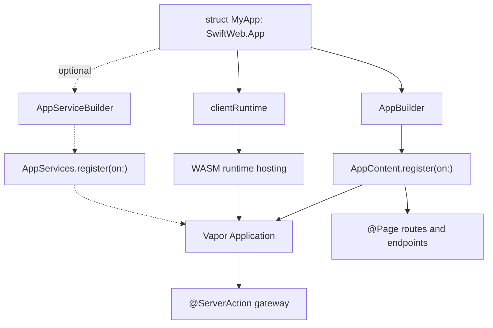
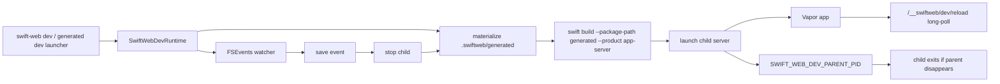
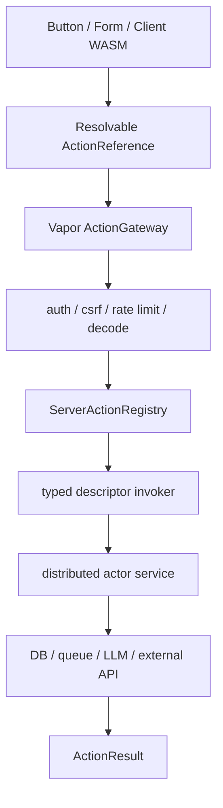
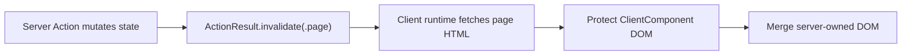

# SwiftWeb

SwiftWeb is the Vapor integration layer and page runtime for SwiftHTML.

It owns page routing, request context, route actions, streaming, uploads, WebSocket/SSE registration, HTML responses, development hot reload, and the hosted WASM runtime assets. It does not own the visual component library or the HTML graph engine.

## Responsibility

| Area | Responsibility |
|---|---|
| App composition | Defines `App`, `AppContent`, `AppBuilder`, app-level route/runtime declarations, and optional app-wide service registration. |
| Page routing | Defines `Page`, `PageRoute`, `NoParams`, `NoSearchParams`, route path handling, and parameter decoding. |
| Page metadata | Resolves async `title`, `description`, and `language` values before rendering the document shell. |
| Macro surface | Exposes `@Page` as the public macro imported by applications. |
| Request context | Provides request-scoped values, params, search params, and server-only values. |
| Responses | Wraps page bodies in `PageDocument` and converts rendered SwiftHTML artifacts into Vapor `Response` values. |
| Actions | Provides route actions, Distributed Actor based server action gateway contracts, `ClientAction`, `ActionResult`, `ActionReference`, and action contexts. |
| Actor runtime | Provides `WebActorSystem`, an ActorRuntime-backed local distributed actor system for typed service registration and invocation. |
| Streaming | Provides `StreamingPage`, `StreamWriter`, `SSERoute`, and SSE event support. |
| Uploads | Provides upload route registration and upload context types. |
| WebSockets | Provides WebSocket route registration and context wrappers. |
| WASM hosting | Serves runtime host scripts, JavaScriptKit runtime support, manifests, and WASM assets. |
| Dev reload | Injects a development reload client that waits on a dedicated reload endpoint during `swift-web dev`. |
| Dev runtime | Provides `SwiftWebDevRuntime`, the shared watch/build/restart parent process used by CLI and Xcode launchers. |
| Dev logging | Emits structured startup, ready, reload, child-exit, and shutdown logs through `swift-log`. |

## Directory Layout

| Directory | Responsibility |
|---|---|
| `App/` | Declarative application composition, redirects, page/action registration, route endpoints, optional `AppServices`, and WASM bundle mounting. |
| `Core/` | Public page protocols, page metadata, cache policy, query defaults, and macro exports. |
| `Routing/` | Vapor route lowering, request context, route environment, parameter decoding, and HTML response conversion. |
| `Actions/` | Form actions, upload actions, typed server action references, gateway invocation, and action results. |
| `Streaming/` | Streaming pages, stream writer, SSE route registration, and SSE event/context types. |
| `Realtime/` | WebSocket route registration and socket context wrappers. |
| `Runtime/Client/` | Client runtime descriptors, render options, and rendered HTML runtime injection. |
| `Runtime/Development/` | FSEvents file watching, reload wait endpoint, parent-process monitoring, and shared dev server orchestration. |
| `Runtime/Wasm/` | Hosted WASM runtime routes, host script, JavaScriptKit runtime support, and asset serving. |
| `Runtime/Diagnostics/` | Debug diagnostics emitted during rendering and hydration setup. |

## Route Lowering Model

SwiftWeb is a thin layer over Vapor routing.


## App Composition

`SwiftWeb.App` is the application-level declaration surface. It keeps Vapor setup, generated page registries, action gateways, and WASM hosting out of the user entrypoint while still lowering to native Vapor routes.



`body`, `services`, and `clientRuntime` are intentionally separate. Routes describe the HTTP surface, optional app services describe shared application-level capabilities, and client runtime describes how browser-side WASM is hosted. Page-specific services should normally be stored on the page that uses them.

```swift
public struct CounterApp: SwiftWeb.App {
    public init() {}

    public var clientRuntime: ClientRuntimeConfiguration {
        .wasm(
            id: "counter-runtime",
            assetPath: "/assets/counter-wasm-runtime.wasm",
            artifact: SwiftPMWasmArtifact.location(target: "CounterWasmRuntime"),
            metricsMode: .detailed
        )
    }

    public var body: some AppContent {
        Redirect("/", to: "/counter")
        CounterPage()
    }
}
```

User app packages should expose an app library. The generated package owns the concrete `@main` launchers for CLI dev, Xcode dev, and server builds.

Page-specific server services should be ordinary stored properties on the page. They are held for the route lifetime because `@Page` registers the page instance, not a fresh `Self()` per request.

```swift
@Page("/counter")
struct CounterPage {
    private let counterService = CounterService(actorSystem: .shared)

    var cache: CachePolicy {
        .noStore
    }

    func load() async throws -> Int {
        try await counterService.currentValue()
    }

    func body(_ value: Int) -> some HTML {
        HStack {
            Button("Decrement", action: counterService.decrementAction)
            Text(String(value))
            Button("Increment", action: counterService.incrementAction)
        }
    }
}
```

| Location | Responsibility |
|---|---|
| `body: AppContent` | Mount pages, redirects, and endpoints. |
| `services: AppServices` | Optionally register application-wide services and gateways. Page-local server actions do not require this. |
| Page stored properties | Hold page-local route-lifetime services. |
| `Page.cache` | Declare response cache behavior for the page. |
| `.environment(...)` | Pass client-visible UI context such as theme, locale, and color scheme. |

## Development Runtime Lifecycle

`swift-web dev` and generated dev launchers both delegate to `SwiftWebDevRuntime`. The runtime materializes `.swiftweb/generated/Package.swift`, builds the generated server product, launches the executable directly, restarts it after save events, and notifies the browser through the dev reload endpoint.



| Mechanism | Responsibility |
|---|---|
| Generated package | Keeps launchers, server executable packaging, and WASM runtime packaging out of the user app package. |
| FSEvents watcher | Detects file saves in the app package and local package dependencies. |
| Reload token | Changes on every child restart and drives full-page browser reload. |
| Long-poll reload endpoint | Lets the browser wait for the next token without request spam. |
| Parent PID monitor | Stops the child server when the dev parent process is killed from Xcode or the terminal. |
| `swift-log` | Emits startup, ready, reload, child-exit, and shutdown events. |

WASM builds use the same generated package boundary but switch to a client-only graph: the generated package copies the app's client components plus `SwiftWebUI` and `SwiftWebUIRuntime` sources, and resolves `SwiftHTML` from the `swift-html` package dependency. `SwiftHTML` and `SwiftWebUI` stay browser-runtime neutral, while `SwiftWebUIRuntime` carries the JavaScriptKit-backed browser adapter used by the generated WASM runtime targets.

`SwiftPMWasmArtifact.location(target:)` resolves the served `.wasm` file from the user app package root, the app's `.swiftweb/generated` package root, and local `.package(path:)` dependency roots. This lets `swift-web build --wasm` write into the shared SwiftWeb scratch directory while the app still declares the asset from its own `clientRuntime`.

## Distributed Server Actions

Server Action is the typed command boundary from a SwiftWeb UI into a server-side service. It is not a hand-written Vapor request handler and not a render-time closure registry. The canonical implementation is a Distributed Actor method invocation exposed through a resolvable action reference.



The public service boundary should be a `distributed actor` method annotated as a server action.

```swift
distributed actor ReservationService {
    typealias ActorSystem = WebActorSystem

    @ServerAction
    distributed func reserve(
        _ input: ReservationInput,
        context: ActionInvocationContext
    ) async throws -> ActionResult {
        // Mutate server-side state or call a server-side service.
    }
}
```

`@ServerAction` generates a runtime descriptor and an instance-owned action reference. Page-owned services are registered by `@Page` when the stored service uses `WebActorSystem`, so `AppContent` does not need per-method route declarations.

The UI consumes the generated action reference. It should not hold a server closure.

```swift
Button("Reserve", action: reservationService.reserveAction)
```

The UI should pass the generated `ActionReference` directly. An extra server-specific button wrapper is intentionally not part of the public API because the function annotation already declares the server boundary.

### Action Results

`ActionResult.invalidate(.page)` is the default result for server-side mutations that should refresh server-rendered data without resetting client-owned state. The WASM runtime posts the action, fetches the current page, protects client bundle subtrees, and merges only server-owned DOM.



| Result | Browser behavior |
|---|---|
| `.invalidate(.page)` | Revalidates the current page and preserves ClientComponent `@State`. |
| `.invalidate(.path(path))` | Revalidates another rendered path and merges the returned server DOM. |
| `.redirect(path)` | Performs navigation and starts a fresh page/runtime state. |
| `.html`, `.text`, `.json`, `.empty` | Returns direct action output for specialized handlers. |

### Vapor Architecture

Vapor hosts the transport and security boundary. The service execution boundary remains a typed Distributed Actor method. SwiftWeb does not reconstruct compiler-internal mangled distributed targets from form metadata.

| Layer | Responsibility |
|---|---|
| `WebActorSystem` | Provides the local Distributed Actor system and ActorRuntime-backed registry primitives. |
| `Application.swiftWebServerActions` | Holds generated action descriptors, actor identities, and typed invokers exposed to the gateway. |
| Vapor middleware | Provides session, authentication, CSRF, rate limiting, tracing, and request IDs. |
| `ActionGateway` | Decodes input, builds `ActionInvocationContext`, resolves the registered action, invokes the typed distributed method, maps errors, and encodes `ActionResult`. |
| Distributed Actor service | Owns server state, domain mutation, external side effects, and session-scoped behavior. |


### Resolvable Actions

Generated server actions must be client-resolvable. Rendering should export a typed action handle into the hydration manifest, not a raw Vapor route and not a Swift closure.

```swift
public protocol Resolvable: Sendable, Codable {
    associatedtype Resolved

    func resolve(using resolver: any ActionReferenceResolving) async throws -> Resolved
}
```

```swift
public struct ActionReference<Input, Output>: Sendable, Codable, Resolvable
where Input: Codable & Sendable, Output: Sendable {
    public typealias Resolved = RemoteServerAction<Input, Output>

    public func resolve(using resolver: any ActionReferenceResolving) async throws -> RemoteServerAction<Input, Output> {
        try await resolver.resolve(self)
    }
}
```

`ActionReference` should carry stable type and invocation identity.

```swift
public struct ActionReference<Input, Output>: Sendable, Codable
where Input: Codable & Sendable, Output: Sendable {
    public let actorID: String
    public let actorName: String
    public let methodName: String
    public let targetIdentifier: String
    public let inputType: String
    public let outputType: String
    public let capabilityToken: String
}
```

Service actors can be singleton services or session services.

| Service type | Actor identity | Use cases |
|---|---|---|
| Singleton service | Fixed application actor ID | Reservation, billing, publishing, cache invalidation, background job enqueue. |
| Session service | User, chat, document, game, or terminal actor ID | AI chat sessions, collaborative editing, terminal sessions, game rooms, workflow state. |

`ActionInvocationContext` should be a normalized, sendable context. It must not expose raw `Vapor.Request` to the actor method.

```swift
public struct ActionInvocationContext: Sendable, Codable {
    public let id: UUID
    public let requestPath: String
    public let method: String
    public let actorID: String?
    public let actionName: String?
    public let targetIdentifier: String?
    public let idempotencyKey: String?
}
```

## Not Responsible For

| Not owned by SwiftWeb | Owner |
|---|---|
| HTML component protocol and graph | `SwiftHTML` |
| Diff algorithm | `SwiftHTML` |
| SwiftUI-like components and theme defaults | `SwiftWebUI` |
| Macro code generation details | `SwiftWebMacros` |
| App templates and file watching | `SwiftWebCLI` |
| Replacing Vapor routing | Vapor / RoutingKit |

## Design Notes

- `@Page` lowers to Vapor routes; SwiftWeb must not become a custom router.
- Route grouping, middleware, priority, and matching belong to Vapor.
- Params and search params are decoded before page execution.
- Page `body` returns page content only; `PageDocument` owns `html`, `head`, `title`, metadata, and `body`.
- `title`, `description`, and `language` are async page properties so they may read request context or server-side stores.
- Server Action represents explicit intent to mutate server-side state or call a server-side service.
- Server Action is a typed Distributed Actor invocation; Vapor only hosts the gateway and transport.
- Server Action references must be `Resolvable` so Client WASM can resolve and invoke them through the runtime.
- Render-time anonymous server closures are not the canonical Server Action model and must not be used for distributed or production service boundaries.
- Server-only values are explicit and must not leak into client components.
- Development reload is a full-page reload mechanism, not state-preserving HMR.
- Runtime assets are served through explicit SwiftWeb routes.
