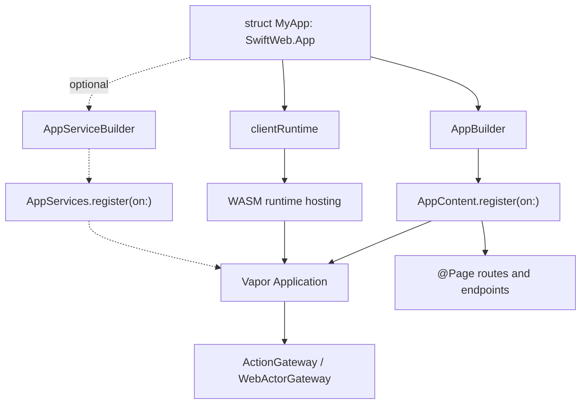
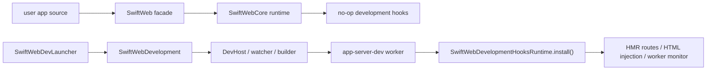
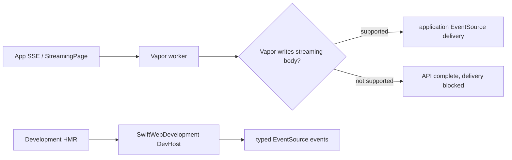
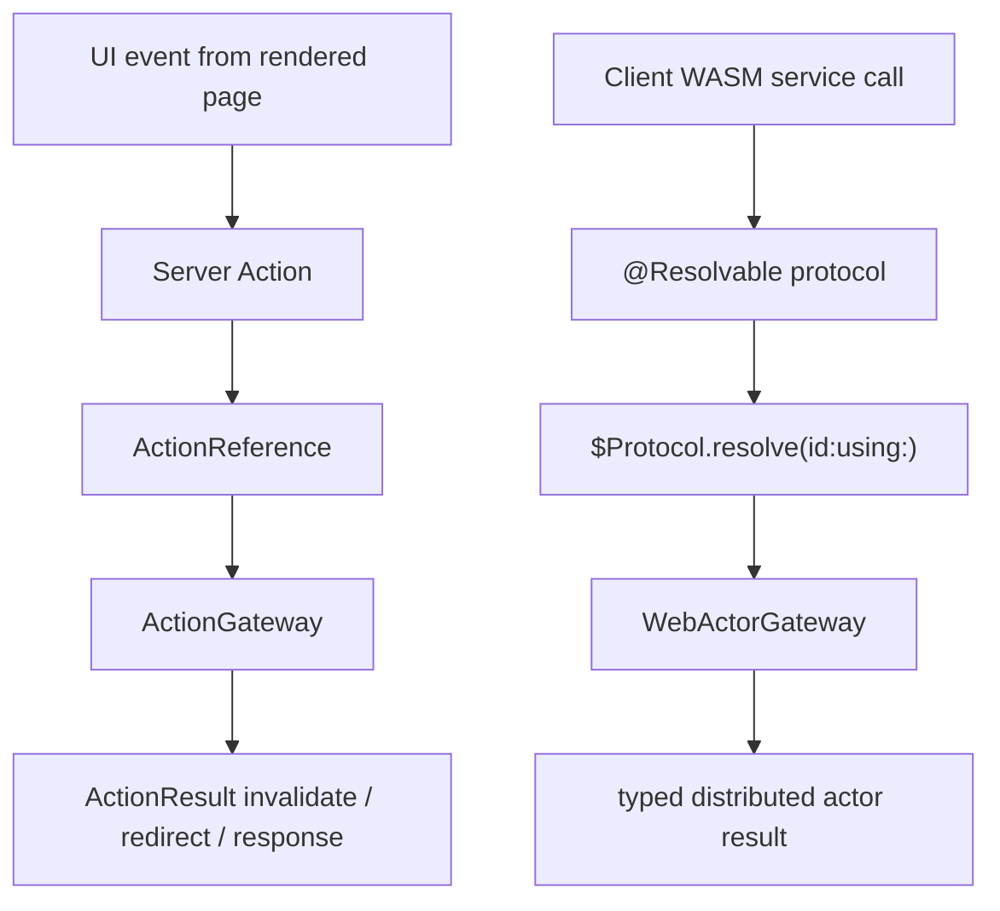
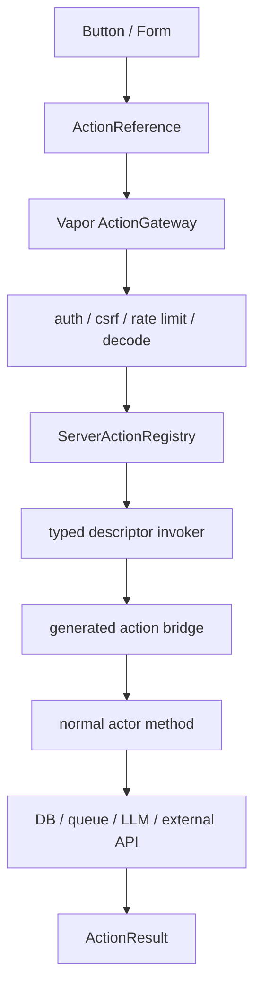
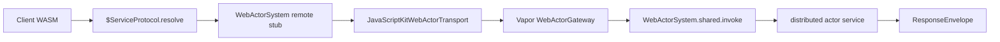
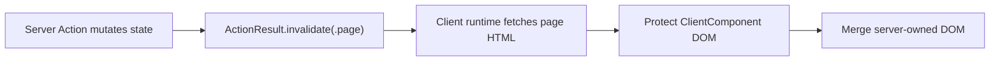
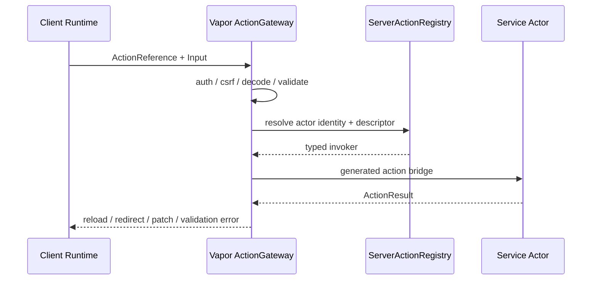

# SwiftWeb

SwiftWeb is the Vapor integration layer and page runtime for SwiftHTML.

It owns page routing, request context, route actions, streaming, uploads, WebSocket/SSE registration, HTML responses, production runtime hooks, and the hosted WASM runtime assets. It does not own the visual component library, the HTML graph engine, or the development watch/HMR implementation.

## Responsibility

| Area | Responsibility |
|---|---|
| App composition | Defines `App`, `AppContent`, `AppBuilder`, app-level route/runtime declarations, and optional app-wide service registration. |
| Page routing | Defines `Page`, `PageRoute`, `NoParams`, `NoSearchParams`, route path handling, and parameter decoding. |
| Page metadata | Resolves async `title`, `description`, and `language` values before rendering the document shell. |
| Macro surface | Exposes `@Page` as the public macro imported by applications. |
| Request context | Provides request-scoped values, params, search params, and server-only values. |
| Responses | Wraps page bodies in `PageDocument` and converts rendered SwiftHTML artifacts into Vapor `Response` values. |
| Actions | Provides route actions, form/button server action gateway contracts, `ClientAction`, `ActionResult`, `ActionReference`, and action contexts. |
| Actor gateway | Hosts the Vapor gateway for ActorRuntime invocation envelopes. The shared distributed actor system lives in `SwiftWebActors`. |
| Streaming | Defines `StreamingPage`, `StreamWriter`, `SSERoute`, and SSE event types. End-to-end delivery depends on Vapor HTTP response streaming support. |
| Uploads | Provides upload route registration and upload context types. |
| WebSockets | Provides WebSocket route registration and context wrappers. |
| WASM hosting | Serves runtime host scripts, JavaScriptKit runtime support, manifests, and WASM assets. |
| Development hook boundary | Provides no-op production hooks that `SwiftWebDevelopment` can install during `sweb dev`. |

## Directory Layout

| Directory | Responsibility |
|---|---|
| `App/` | Declarative application composition, redirects, page/action registration, route endpoints, optional `AppServices`, and WASM bundle mounting. |
| `Core/` | Public page protocols, page metadata, cache policy, query defaults, and macro exports. |
| `Routing/` | Vapor route lowering, request context, route environment, parameter decoding, and HTML response conversion. |
| `Actions/` | Form actions, upload actions, typed server action references, Vapor actor gateway invocation, and action results. |
| `Streaming/` | Streaming pages, stream writer, SSE route registration, and SSE event/context types. |
| `Realtime/` | WebSocket route registration and socket context wrappers. |
| `Runtime/Client/` | Client runtime descriptors, render options, and rendered HTML runtime injection. |
| `Runtime/DevelopmentSupport/` | No-op production hook registry used by `SwiftWebDevelopment` when a dev child server is launched. |
| `Runtime/Wasm/` | Hosted WASM runtime routes, host script, JavaScriptKit runtime support, and asset serving. |
| `Runtime/Diagnostics/` | Debug diagnostics emitted during rendering and hydration setup. |

## Route Lowering Model

SwiftWeb is a thin layer over Vapor routing.


## App Composition

`SwiftWeb.App` is the application-level declaration surface. It keeps Vapor setup, generated page registries, action gateways, and WASM hosting out of the user entrypoint while still lowering to native Vapor routes.



`body`, `services`, and `clientRuntime` are intentionally separate. Routes describe the HTTP surface, optional app services describe shared application-level capabilities, and client runtime describes how browser-side WASM is hosted. Page-specific services should normally be stored on the page that uses them.

```swift
public struct CounterApp: SwiftWeb.App {
    public init() {}

    public var clientRuntime: ClientRuntimeConfiguration {
        .wasm(
            id: "counter-runtime",
            assetPath: "/assets/counter-wasm-runtime.wasm",
            artifact: SwiftPMWasmArtifact.location(target: "CounterWasmRuntime"),
            metricsMode: .detailed
        )
    }

    public var body: some AppContent {
        Redirect("/", to: "/counter")
        CounterPage()
    }
}
```

User app packages should expose an app library. The generated package owns the concrete `@main` launchers for CLI dev, Xcode dev, and server builds.

Page-specific server services should be ordinary stored properties on the page. They are held for the route lifetime because `@Page` registers the page instance, not a fresh `Self()` per request.

```swift
@Page("/counter")
struct CounterPage {
    private let counterService = CounterService(actorSystem: .shared)

    var cache: CachePolicy {
        .noStore
    }

    func load() async throws -> Int {
        try await counterService.currentValue()
    }

    func body(_ value: Int) -> some HTML {
        HStack {
            Button("Decrement", action: counterService.decrementAction)
            Text(String(value))
            Button("Increment", action: counterService.incrementAction)
        }
    }
}
```

| Location | Responsibility |
|---|---|
| `body: AppContent` | Mount pages, redirects, and endpoints. |
| `services: AppServices` | Optionally register application-wide services and gateways. Page-local server actions do not require this. |
| Page stored properties | Hold page-local route-lifetime services. |
| `Page.cache` | Declare response cache behavior for the page. |
| `.environment(...)` | Pass client-visible UI context such as theme, locale, and color scheme. |

## Development Boundary

The production runtime lives in `SwiftWebCore`. The public `SwiftWeb` product is a thin facade that re-exports `SwiftWebCore` and exposes source macros such as `@Page` and `@ServerAction`. The long-lived dev host uses `SwiftWebDevelopment`; the short-lived Vapor worker installs the smaller `SwiftWebDevelopmentHooks` runtime before `App.run()`.



| Mechanism | Responsibility |
|---|---|
| `SwiftWebCore` product | Contains route/action/page/WASM hosting runtime and no source macro dependency. |
| `SwiftWeb` product | Public facade for app source that re-exports `SwiftWebCore` and provides macros. |
| `SwiftWebDevelopment` product | Contains generated package materialization, FSEvents watching, HMR events, reload fallback, artifact cleanup, and dev process supervision. |
| `SwiftWebDevelopmentHooks` product | Contains only worker-side development hooks and typed HMR contracts needed inside the Vapor worker. |
| Generated server package | Builds the production `app-server` product without linking `SwiftWebDevelopment`. |
| Generated dev package | Builds the dev launcher and the dev child server product that installs `SwiftWebDevelopmentHooks`. |

### Streaming Runtime Boundary

`StreamingPage` and `SSERoute` lower to Vapor streaming responses, so application-level SSE delivery depends on Vapor's HTTP response-body streaming implementation. The development HMR EventSource endpoint is different: it is served by `SwiftWebDevelopment`'s persistent DevHost, which uses a streaming-capable HTTP server and proxies to the current Vapor worker.



WASM builds use the same generated package boundary but switch to a client-only graph. The generated package copies the app's client components plus runtime-only `SwiftHTML`, `SwiftWebActors`, `SwiftWebUI`, `SwiftWebUIRuntime`, and JavaScriptKit source targets. It intentionally excludes SwiftHTML preview macros, JavaScriptKit BridgeJS macros, and their `swift-syntax` toolchain dependencies from the WASM package graph. `SwiftHTML` and `SwiftWebUI` stay browser-runtime neutral, while `SwiftWebUIRuntime` carries the JavaScriptKit-backed browser adapter used by the generated WASM runtime targets.

`SwiftPMWasmArtifact.location(target:)` resolves the served `.wasm` file from the user app package root, the app's `.swiftweb/generated` package root, and local `.package(path:)` dependency roots. This lets `sweb build --wasm` write into the shared SwiftWeb scratch directory while the app still declares the asset from its own `clientRuntime`.

Client bundle loading is contract-first and documented in [`docs/ClientBundleLoadingDesign.md`](../../docs/ClientBundleLoadingDesign.md). `SwiftWeb` hosts resolved manifests and content-hashed WASM assets; `ClientComponent` contracts and modifiers decide bundle/load policy, while the runtime validates those contracts and serves the resulting assets.

WASM asset routes are sidecar-aware. If a built artifact has `.wasm.br` or `.wasm.gz` siblings, `SwiftWeb` selects the best accepted variant from `Accept-Encoding` and sets `Content-Encoding` plus `Vary: Accept-Encoding`. The production artifact processor that creates those sidecars lives in `SwiftWebDevelopment` / `sweb build --wasm`; `SwiftWeb` only owns HTTP serving.

## Server Interaction Methods

SwiftWeb intentionally supports two server interaction methods. They are related because both can execute server-side service code, but they serve different developer intents and use different runtime contracts.



| Method | Use when | Developer-facing API | Runtime path | Result model |
|---|---|---|---|---|
| Server Action | A button/form intentionally mutates server state and the page should refresh, redirect, or return a command result. | `@ServerAction` + generated `ActionReference` consumed by `Button`/`Form`. | HTML form/action metadata -> `ActionGateway` -> registered server action invoker. | `ActionResult` or another typed codable output. |
| Resolvable RPC | Client WASM needs to talk to a typed service directly, especially for stateful sessions or repeated service calls. | Apple `@Resolvable protocol` + `$Protocol.resolve(id:using:)`. | ActorRuntime envelope -> `WebActorGateway` -> `WebActorSystem`. | Direct typed `distributed func` return value. |

`ActionReference` is a form/action handle. It is not Apple's `@Resolvable` model. Client-visible typed service APIs should use an `@Resolvable` protocol. Conversely, a `@Resolvable` protocol is not a replacement for a page mutation action when the intended result is page invalidation.

| Question | Prefer |
|---|---|
| Does this start from a rendered button or form and should refresh server-rendered UI? | Server Action |
| Does this need direct typed calls from a ClientComponent running in WASM? | Resolvable RPC |
| Does this need long-lived conversational/session state such as chat, terminal, game room, or collaborative document state? | Resolvable RPC |
| Does this mutate server data and then re-render the current page while preserving client state? | Server Action |

### Server Action Flow

Server Action is the typed command boundary from SwiftWeb UI into server-side code. It is not a hand-written Vapor request handler, not a render-time closure registry, and not the `@Resolvable` RPC path.



In the current implementation, `@ServerAction` is attached to a normal method on a `distributed actor` because the registry uses actor identity and the generated descriptor stores an actor-bound invoker. The macro generates an internal invocation bridge for the runtime. The action method itself is not distributed; Server Action is a page command model, not the `@Resolvable` RPC model.

```swift
distributed actor ReservationService {
    typealias ActorSystem = WebActorSystem

    @ServerAction
    func reserve(
        _ input: ReservationInput,
        context: ActionInvocationContext
    ) async throws -> ActionResult {
        // Mutate server-side state or call a server-side service.
    }
}
```

`@ServerAction` generates a runtime descriptor and an instance-owned action reference. Page-owned services are registered by `@Page` when the stored service uses `WebActorSystem`, so `AppContent` does not need per-method route declarations.

The UI consumes the generated action reference. It should not hold a server closure.

```swift
Button("Reserve", action: reservationService.reserveAction)
```

The UI should pass the generated `ActionReference` directly. An extra server-specific button wrapper is intentionally not part of the public API because the function annotation already declares the server boundary.

Server Action should be the default for page-driven mutation:

| Trait | Server Action behavior |
|---|---|
| Transport | HTTP POST through Vapor action routes. |
| Security | Same-origin, CSRF, capability token, auth middleware, and rate limiting happen before invocation. |
| State ownership | Server service owns the mutation; client state is not the source of truth. |
| UI update | `ActionResult.invalidate(.page)` refreshes server-rendered DOM while preserving compatible ClientComponent state. |
| API shape | The UI receives an `ActionReference`, not a remote actor stub. |

### Resolvable Distributed Services

Client WASM should call long-lived or session-scoped services through an Apple `@Resolvable` protocol. This is the Swift-native RPC path and is the right model for typed service APIs, AI chat sessions, terminal sessions, collaborative editing, and other stateful service conversations.

```swift
@Resolvable
public protocol CounterServiceProtocol: DistributedActor
where ActorSystem == WebActorSystem {
    distributed func currentValue() async throws -> Int
    distributed func increment() async throws -> Int
}
```

```swift
public distributed actor CounterService: CounterServiceProtocol {
    public typealias ActorSystem = WebActorSystem

    private var value = 0

    public distributed func currentValue() async throws -> Int {
        value
    }

    public distributed func increment() async throws -> Int {
        value += 1
        return value
    }
}
```

```swift
let service = try $CounterServiceProtocol.resolve(id: actorID, using: actorSystem)
let value = try await service.increment()
```



`WebActorGateway` is mounted at `/_swiftweb/actors/invoke`. It validates state-changing request security, decodes the raw ActorRuntime `InvocationEnvelope`, dispatches through `WebActorSystem.shared`, and returns a `ResponseEnvelope`. Browser WASM clients use `SwiftWebUIRuntime.JavaScriptKitWebActorTransport` to post the envelope with same-origin credentials and the active CSRF header from the runtime security descriptor.

Resolvable RPC should be the default for client-owned interaction loops:

| Trait | Resolvable RPC behavior |
|---|---|
| Transport | ActorRuntime envelope over `WebActorTransport`. |
| Security | Gateway request validation plus application middleware around the actor gateway route. |
| State ownership | Actor identity represents the service/session being called. |
| UI update | Client code decides how to update local state from the typed result. |
| API shape | Client code resolves `$ServiceProtocol` and calls `distributed func` as if it were local. |

### Action Results

`ActionResult.invalidate(.page)` is the default result for server-side mutations that should refresh server-rendered data without resetting client-owned state. The WASM runtime posts the action, fetches the current page, protects client bundle subtrees, and merges only server-owned DOM.



| Result | Browser behavior |
|---|---|
| `.invalidate(.page)` | Revalidates the current page and preserves ClientComponent `@State`. |
| `.invalidate(.path(path))` | Revalidates another rendered path and merges the returned server DOM. |
| `.redirect(path)` | Performs navigation and starts a fresh page/runtime state. |
| `.html`, `.text`, `.json`, `.empty` | Returns direct action output for specialized handlers. |

### Vapor Architecture

Vapor hosts the transport and security boundary. The service execution boundary remains a typed actor method on a registered distributed actor service, reached through the macro-generated action bridge. SwiftWeb does not reconstruct compiler-internal mangled distributed targets from form metadata.

| Layer | Responsibility |
|---|---|
| `SwiftWebActors.WebActorSystem` | Provides the local Distributed Actor system and ActorRuntime-backed registry primitives. |
| `Application.swiftWebServerActions` | Holds generated action descriptors, actor identities, and typed invokers exposed to the gateway. |
| Vapor middleware | Provides session, authentication, CSRF, rate limiting, tracing, and request IDs. |
| `ActionGateway` | Decodes input, builds `ActionInvocationContext`, resolves the registered action, invokes the generated action bridge, maps errors, and encodes `ActionResult`. |
| `WebActorGateway` | Receives raw ActorRuntime invocation envelopes for `@Resolvable` distributed service calls. |
| Distributed Actor service | Owns server state, domain mutation, external side effects, and session-scoped behavior. |



### Action Reference Metadata

Generated server actions should export stable action metadata into the rendered form/hydration surface. The metadata identifies the actor instance, method, target identifier, input/output type names, and optional capability token. It does not resolve to a remote actor proxy by itself.

```swift
public struct ActionReference<Input, Output>: Sendable, Codable
where Input: Codable & Sendable, Output: Sendable {
    public let actorID: String
    public let actorName: String
    public let methodName: String
    public let targetIdentifier: String
    public let inputType: String
    public let outputType: String
    public let capabilityToken: String
}
```

Service actors can be singleton services or session services.

| Service type | Actor identity | Use cases |
|---|---|---|
| Singleton service | Fixed application actor ID | Reservation, billing, publishing, cache invalidation, background job enqueue. |
| Session service | User, chat, document, game, or terminal actor ID | AI chat sessions, collaborative editing, terminal sessions, game rooms, workflow state. |

`ActionInvocationContext` should be a normalized, sendable context. It must not expose raw `Vapor.Request` to the actor method.

```swift
public struct ActionInvocationContext: Sendable, Codable {
    public let id: UUID
    public let requestPath: String
    public let method: String
    public let actorID: String?
    public let actionName: String?
    public let targetIdentifier: String?
    public let idempotencyKey: String?
}
```

## Not Responsible For

| Not owned by SwiftWeb | Owner |
|---|---|
| HTML component protocol and graph | `SwiftHTML` |
| Diff algorithm | `SwiftHTML` |
| SwiftUI-like components and theme defaults | `SwiftWebUI` |
| Macro code generation details | `SwiftWebMacros` |
| App templates and file watching | `SwiftWebCLI` |
| Replacing Vapor routing | Vapor / RoutingKit |

## Design Notes

- `@Page` lowers to Vapor routes; SwiftWeb must not become a custom router.
- Route grouping, middleware, priority, and matching belong to Vapor.
- Params and search params are decoded before page execution.
- Page `body` returns page content only; `PageDocument` owns `html`, `head`, `title`, metadata, and `body`.
- `title`, `description`, and `language` are async page properties so they may read request context or server-side stores.
- Server Action represents explicit intent to mutate server-side state or call a server-side service.
- The current Server Action implementation uses distributed actor backing for identity and typed invocation, but Server Action remains a page command model, not the `@Resolvable` RPC model.
- Server Action references are form/action metadata; client-side typed service calls use Apple `@Resolvable` protocols and `WebActorSystem`.
- Render-time anonymous server closures are not the canonical Server Action model and must not be used for distributed or production service boundaries.
- Server-only values are explicit and must not leak into client components.
- Development browser updates use the DevHost typed EventSource stream and fall back to reload-token waiting only as a compatibility path.
- True component-level HMR requires streaming response delivery, successful client WASM asset builds, and matching state/environment schema hashes.
- Streaming route APIs are defined in SwiftWeb, but end-to-end incremental delivery depends on Vapor 5 HTTP response streaming support.
- Runtime assets are served through explicit SwiftWeb routes.
