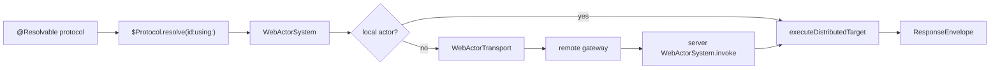

# SwiftWebActors

SwiftWebActors is the shared Distributed Actor runtime boundary for SwiftWeb server and client builds.

It owns the `WebActorSystem` adapter, invocation envelope encoding/decoding, result handling, and the transport protocol used to move ActorRuntime envelopes across process or network boundaries. It does not own Vapor route registration, page rendering, UI components, or browser DOM updates.

## Responsibility

| Area | Responsibility |
|---|---|
| Actor system | Provides `WebActorSystem`, the `DistributedActorSystem` used by SwiftWeb service actors. |
| Registry | Holds local distributed actor instances and resolves local actor IDs. |
| Remote resolution | Returns `nil` from `resolve(id:as:)` for non-local actors so Swift can create remote stubs. |
| Invocation codec | Wraps ActorRuntime's Codable invocation encoder and decoder with SwiftWeb's `Codable & Sendable` requirement. |
| Result handling | Encodes successful returns, void returns, and typed runtime failures into `ResponseEnvelope`. |
| Transport boundary | Defines `WebActorTransport` so clients can send `InvocationEnvelope` values to a server gateway. Browser-specific transport implementations live outside this module. |

## Runtime Flow



## Usage Boundary

Client-visible service contracts should be protocols annotated with Apple's `@Resolvable` macro.

```swift
@Resolvable
public protocol CounterServiceProtocol: DistributedActor
where ActorSystem == WebActorSystem {
    distributed func currentValue() async throws -> Int
    distributed func increment() async throws -> Int
}
```

Server implementations are ordinary distributed actors using `WebActorSystem`.

```swift
public distributed actor CounterService: CounterServiceProtocol {
    public typealias ActorSystem = WebActorSystem

    private var value = 0

    public distributed func currentValue() async throws -> Int {
        value
    }

    public distributed func increment() async throws -> Int {
        value += 1
        return value
    }
}
```

Client runtimes resolve the protocol stub, not an `ActionReference`.

```swift
let service = try $CounterServiceProtocol.resolve(id: actorID, using: actorSystem)
let value = try await service.increment()
```

## Difference From Server Actions

SwiftWeb has two server interaction methods. SwiftWebActors owns only the direct RPC method.

| Method | Owned here? | Caller shape | Runtime shape |
|---|---|---|---|
| Server Action | No | `Button("Save", action: service.saveAction)` | SwiftWeb `ActionReference` through `ActionGateway`, usually returning `ActionResult`. |
| Resolvable RPC | Yes | `try await service.increment()` after `$Protocol.resolve(id:using:)` | ActorRuntime invocation envelope through `WebActorTransport`. |

Server Actions can be backed by distributed actor services in the current SwiftWeb implementation, but they are still page command handles, not remote actor stubs. A client that needs direct typed calls should resolve an `@Resolvable` protocol instead of using `ActionReference`.

## Not Responsible For

| Not owned by SwiftWebActors | Owner |
|---|---|
| HTTP route registration and CSRF checks | `SwiftWeb` |
| Server action form handling | `SwiftWeb.ActionGateway` |
| Page routing and rendering | `SwiftWeb` and `SwiftHTML` |
| Component state and DOM patching | `SwiftHTML` / `SwiftWebUIRuntime` |
| Project templates and generated package materialization | `SwiftWebCLI` and `SwiftWeb` development runtime |

## Design Notes

- `WebActorSystem.resolve(id:as:)` returns a local actor only when the ID exists in the local registry.
- Missing local actors are treated as remote, allowing Swift's distributed actor machinery to create stubs for `@Resolvable` protocols.
- `WebActorTransport` moves raw ActorRuntime envelopes; it must not depend on Vapor types.
- Vapor integration belongs in `SwiftWeb.WebActorGateway`.
- Browser fetch integration belongs in `SwiftWebUIRuntime.JavaScriptKitWebActorTransport`.
- `ActionReference` is not this module's responsibility and is not Apple's `@Resolvable` model.
