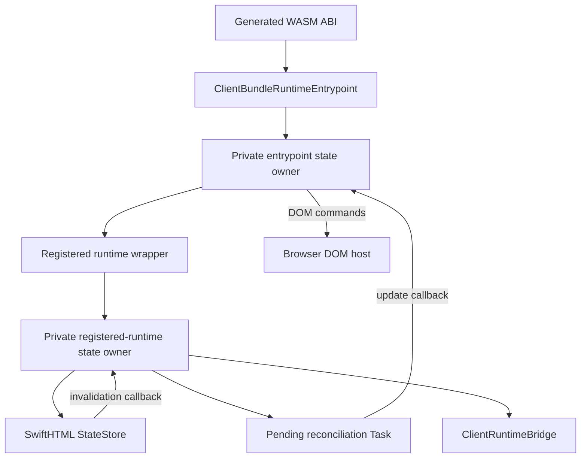

# SwiftWeb Client Runtime

## Purpose and Scope

This module owns the generated browser runtime's synchronous ABI entrypoints,
state reconciliation, DOM adapter calls, and callback/task lifetime. It is a
child of the [SwiftWeb package design](../../../DESIGN.md). Its direct
implementation children are the entrypoint, bridge, actor transport, and DOM
adapter files in this directory; behavioral ownership is exercised by
`ClientRuntimeConcurrencyTests`.

The module does not own SwiftHTML state semantics, Distributed Actor protocol
semantics, HTTP server routing, or deployment. Those contracts remain in
SwiftHTML, [Actor integration](../../SwiftWebRuntime/Actors/DESIGN.md), and
the host modules.

## Responsibilities and Boundaries

The public `ClientBundleRuntimeEntrypoint` is a thin ABI-facing wrapper. A
private entrypoint state owner holds the runtime state, access gate, response
storage, actor installation, and DOM host. A private registered-runtime state
owner holds each component's `StateStore`, bridge, update handler, and pending
task. Callback closures capture only these private state owners; they never
capture either public wrapper.

The wrappers synchronously detach callback handlers and cancel pending work in
`deinit`. An explicit shutdown additionally retains the existing
`ActorSystemTermination` until its asynchronous dependencies finish and reports
the existing failure status. The module does not require callers to invoke
shutdown merely to release a dropped wrapper.

## Related Designs

| Design | Relationship | Contract Used | Summary | Cautions |
|---|---|---|---|---|
| [SwiftWeb package](../../../DESIGN.md) | parent | Generated profile and release boundaries | Integrates this module into native, standard WASM, and Embedded WASM products. | Re-check all three target profiles after lifecycle edits. |
| [Package generation](../../SwiftWebDevelopment/PackageGeneration/DESIGN.md) | used by | Profile-specific source projection | Copies this module into generated WASM packages. | Generated source must use the same callback owner contract. |
| [Actor integration](../../SwiftWebRuntime/Actors/DESIGN.md) | depends on | Actor binding and shutdown contract | Provides the actor route and system lifecycle consumed by the client bridge. | A client callback failure is not an actor protocol success. |
| SwiftHTML `StateStore` | depends on | Invalidation handler and dirty-cycle contract | Notifies one runtime owner after a state transition. | Detach the handler before releasing the runtime owner. |
| [JavaScriptEventLoop](https://github.com/1amageek/JavaScriptKit/blob/166dc39b6e282a0f039762381332ba6333ec809c/Sources/JavaScriptEventLoop/DESIGN.md) | depends on | Installed immediate and MainActor executor | Allows the request driver's MainActor hop on the fixed WASI SDK. | Use the exact resolved public revision; Embedded does not gain delayed SchedulingExecutor conformance. |

## Architecture

The StateStore and registered-runtime state form a private callback cycle while
the runtime is active. Wrapper deinitialization removes the StateStore handler,
update handler, and pending task, breaking that cycle synchronously without a
target-specific weak/strong branch. A callback already executing may finish
against the private owner; it cannot create new work after detachment.

## Contracts and Invariants

| Concern | Assumption | Guarantee |
|---|---|---|
| Callback owner | A callback can outlive the call that installed it. | It retains private state only, never a public wrapper. |
| Wrapper release | Native callers may drop a wrapper without calling shutdown. | `deinit` detaches handlers and cancels pending work, allowing ARC cleanup. |
| Explicit shutdown | ABI shutdown cannot await directly. | The returned/internal termination owns pending work and actor shutdown until completion and preserves failure reporting. |
| Shared state | Native, standard WASM, and Embedded WASM use the same logical state. | `Mutex` storage, `Sendable` contracts, read paths, mutation paths, and detachment semantics are identical across profiles. |
| Post-shutdown work | A callback or task may race terminal detachment. | The access gate/state phase rejects updates with the existing shutdown error; no DOM update is applied. |
| CSS deduplication | Atomic style rules use substring identity. | A `String.Index` scan over `Substring` prefixes has the same exact substring semantics and suppresses duplicate rules without materializing character arrays. |
| Actor frame JavaScript ABI | WASM and JavaScript cannot share ownership of an Actor frame. | The selected `JavaScriptKitActorTransport` borrows the encoded `ActorByteBuffer` without an intermediate Swift array, creates one JavaScript-owned `Uint8Array`, and reuses it for the selected request API. A response allocates and initializes one final Swift byte array directly from the whole response `Uint8Array`; the required copy in each direction is not described as zero-copy. |

## Runtime Flows

1. Bootstrap creates private runtime state, installs actor bindings, and
   registers one StateStore invalidation callback per component runtime.
2. A dirty state transition schedules at most one reconciliation task. The task
   flushes the bridge and submits the update to the entrypoint state owner.
3. The entrypoint state owner verifies the active phase, applies DOM commands,
   and records the next hydration index.
4. Shutdown or wrapper deinitialization clears StateStore and update handlers,
   cancels pending tasks, and removes runtime entries. Explicit shutdown then
   awaits the retained actor and bridge terminations.
5. A browser Actor request encodes into an owned `ActorByteBuffer`, borrows that
   storage only while JavaScriptKit synchronously creates its owning typed
   array, and reuses that typed array for either fetch or the optional host
   request. The response copies the whole zero-offset JavaScript typed array
   directly into one final Swift array before Actor decoding.

## State, Ownership, and Lifecycle

| Target | Storage | Isolation | Read entrypoint | Mutation entrypoint | Detachment / release |
|---|---|---|---|---|---|
| Native | Private owner `Mutex` state | `ClientRuntimeAccessGate` plus `Mutex` | Wrapper forwards to owner | Wrapper forwards to owner | Wrapper `deinit` detaches; explicit shutdown awaits termination. |
| Standard WASM | Same private owner `Mutex` state | Same gate and `Mutex` contract | Same ABI methods | Same ABI methods | Same synchronous detachment and explicit termination. |
| Embedded WASM | Same private owner `Mutex` state | Same gate and `Mutex` contract | Same ABI methods | Same ABI methods | Same synchronous detachment and explicit termination. |

The private owners are the only callback capture targets. Their deinitializers
are defensive and repeat detachment idempotently; detachment never performs
awaiting or external I/O.

## Failure, Concurrency, and Constraints

The synchronous ABI access gate rejects reentrant operations. The owner state
is protected by `Mutex`; no callback, DOM operation, or `await` runs while a
state mutex is held. Cancellation is cooperative: a pending task is canceled,
then explicit shutdown retains a termination that awaits its completion. A
callback already captured before detachment may finish safely against the
private owner, but it cannot publish a new DOM update after detachment.

Embedded restrictions are handled by the shared lifecycle design, not by
weakening ownership, removing synchronization, or adding raw-pointer escape
hatches.

The Actor-frame borrow cannot escape its closure or cross an `await`.
JavaScriptKit owns the copied outbound typed array after the closure returns.
Inbound allocation uses the typed-array length supplied by the existing
whole-response driver, initializes the complete final array before publishing
it, and handles an empty response without passing a nil base address to
JavaScriptKit. Existing frame bounds remain the codec's responsibility after
ownership transfer. This contract applies to
the whole `ArrayBuffer` response currently constructed by the request driver;
it does not infer equivalent offset semantics for arbitrary typed-array views.

## Verification and Change Impact

`ClientRuntimeConcurrencyTests` owns the callback lifecycle contract. Changes
to this module require focused proof of Native drop-without-shutdown cleanup,
explicit terminal shutdown, pending-task termination, post-shutdown update
rejection, and CSS substring deduplication. The generated Standard and
Embedded package compile/link gates recheck profile projection; Counter
Chromium E2E rechecks the live Standard WASM state and Actor call path.
A bounded JavaScript ABI fixture additionally runs this common transport owner
under the pinned Standard-WASM and Embedded-WASM profiles and checks one 1 MiB
request/response for byte equality and the one-copy-per-direction accounting.
The Embedded profile disables the Distributed Actor trait so that the existing
`hasFeature(Embedded)` facade is selected; it does not change the transport
implementation being measured. This controlled JavaScript ABI fixture is not
an Embedded browser or cloud E2E. Compile/link or native buffer identity alone
does not prove either WASM execution path.

The [ActorTransportBoundary fixture](../../../Tests/BrowserE2E/ActorTransportBoundary/README.md)
records the measured copy boundary. Its Standard before-edit run used the
verified browser JavaScriptKit 0.57.2 source; both post-edit profiles use the
same shared transport source and public JavaScriptKit `166dc39b6e282a0f039762381332ba6333ec809c`.

| Boundary | Before | After | Evidence |
|---|---|---|---|
| Swift frame to JavaScript, fetch | One ABI copy | One ABI copy | Measured typed-array creation calls and bytes |
| Swift frame to JavaScript, host request | Two ABI copies | One ABI copy reused by options and host request | Same ABI counters on the selected branch |
| JavaScript response to Swift | One ABI copy | One ABI copy into the final owner | Measured typed-array copy calls and bytes |
| Outbound intermediate Swift array | `encoded.bytes` materializes the whole frame | No intermediate array; nonescaping owner borrow | Source accounting on the executed path, not allocator instrumentation |
| Inbound temporary Swift storage | Temporary copied buffer followed by final array construction | Direct initialization of the final array | Source accounting on the executed path, not allocator instrumentation |

The remaining ABI copies transfer bytes between distinct JavaScript and Swift
owners; they are required ownership boundaries, not zero-copy claims. The
0-byte and 1 MiB payload cases retain content, cancellation, terminal stream,
and failure checks under both Debug WASI profiles. The transport's phase remains
under the same `Mutex`, and request state remains under the same `@MainActor`;
neither storage nor Sendable is conditional on Embedded. Native compilation and
27 focused ClientRuntime tests separately preserve the Native runtime surface;
they do not execute this WASI-only transport.

Changes to the private owner contract require rechecking the parent package
design and the package-generation child design because generated source copies
this module into both WASM profiles.
