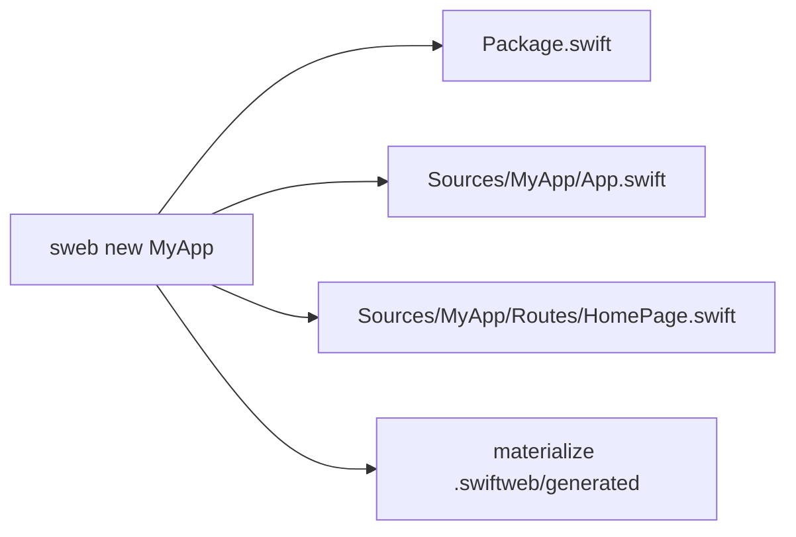
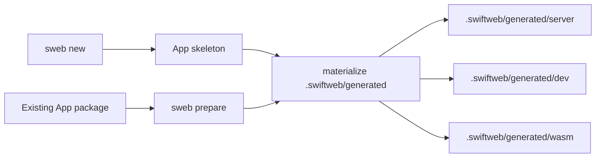
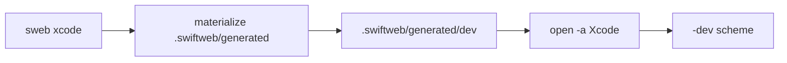
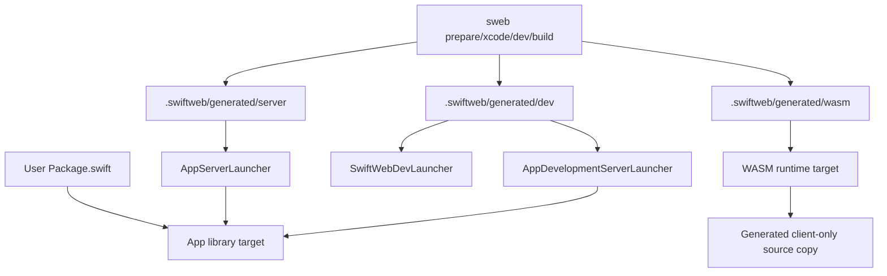
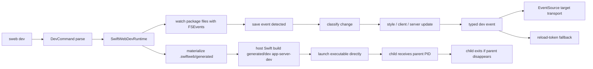
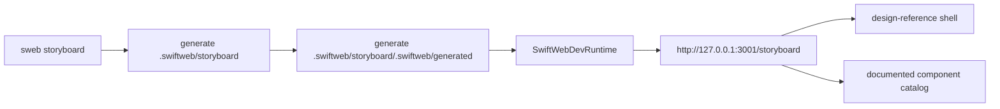
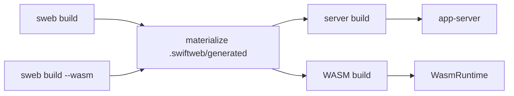
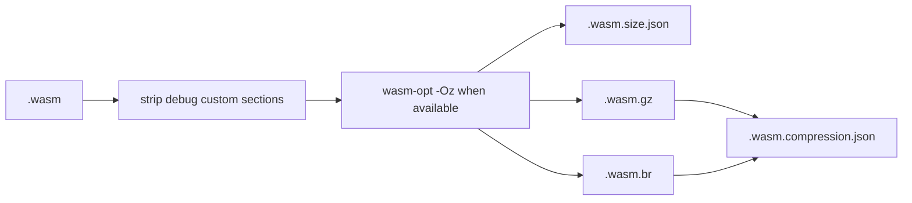
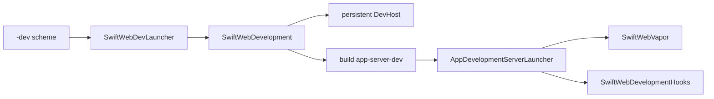
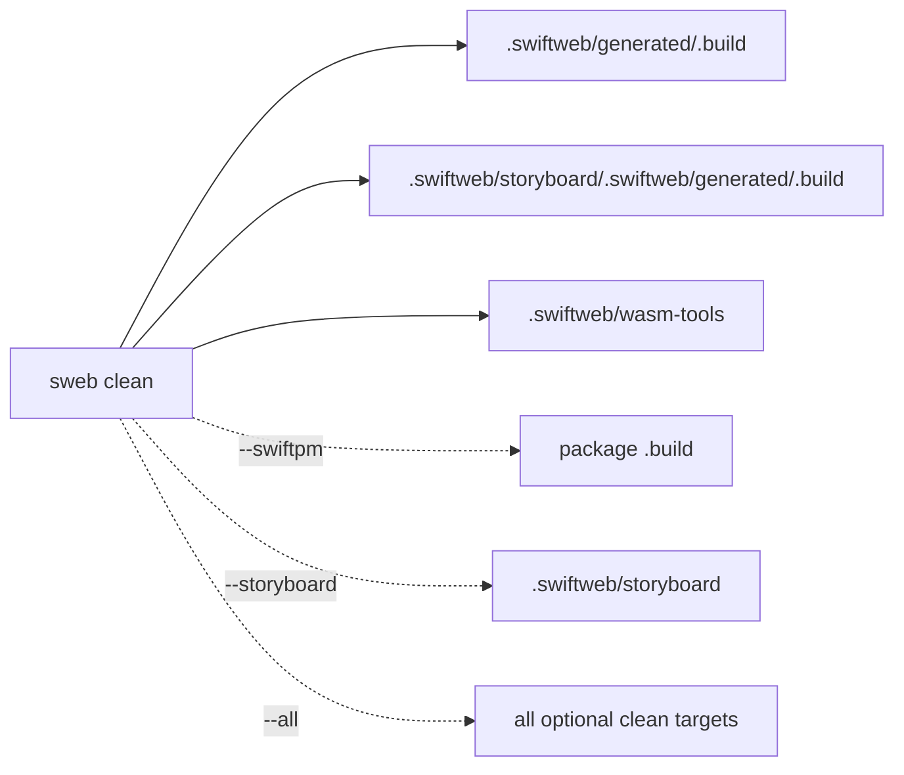

# SwiftWebCLI

SwiftWebCLI provides the `sweb` executable.

It owns command parsing and project scaffolding. Generated package materialization and development server orchestration live in `SwiftWebDevelopment`.

## Responsibility

| Area | Responsibility |
|---|---|
| Command parsing | Parses `sweb` command names and command-line options. |
| Project creation | Generates minimal named app skeletons through the `new` command. |
| Prepare command | Materializes generated dev, server, and WASM packages for existing app packages. |
| Xcode command | Materializes generated packages and opens the generated dev package in Xcode. |
| Generated package | Delegates `.swiftweb/generated` materialization to `SwiftWebDevelopment`. |
| Dev command | Parses CLI options and delegates to `SwiftWebDevelopment.SwiftWebDevRuntime`. |
| Build command | Builds the generated server product or generated WASM runtime product. |
| Storyboard command | Generates an isolated SwiftWebUI component style board and runs it through the same dev runtime. |

## New Command

`sweb new <AppName>` creates the smallest runnable SwiftWeb package. It gives the package, library product, target, source directory, and `SwiftWeb.App` type the provided app name.

| Generated file | Responsibility |
|---|---|
| `Package.swift` | Declares the app library and depends on `SwiftWeb` plus `SwiftHTML`. |
| `Sources/<AppName>/App.swift` | Mounts the app routes through `SwiftWeb.App`. |
| `Sources/<AppName>/Routes/HomePage.swift` | Defines a single `@Page("/")` route that renders `Hello World`. |
| `.swiftweb/generated` | Generated launcher and WASM packages created through the same prepare path used for existing apps. |

## Prepare Command

`sweb prepare` materializes generated packages for an existing SwiftWeb app without building or running them. `sweb new` already runs the same materialization path after writing the initial app skeleton.

Package commands default to the current directory. Run `sweb xcode`, `sweb dev`,
`sweb build`, and `sweb clean` from the directory that contains the app's
`Package.swift`; use `sweb prepare` only when you want to refresh generated
packages without starting or building the app. `--package-path` is for targeting a
package from another directory.

| Option | Behavior |
|---|---|
| `--package-path <directory>` | Selects the existing app package. Defaults to the current directory. |
| `--product <name>` | Selects the generated server product name. Defaults to `app-server`. |

## Xcode Command

`sweb xcode` uses the same generated package materialization path as `sweb prepare`,
then opens `.swiftweb/generated/dev` in Xcode. The generated package exposes a
`<AppName>-dev` scheme that runs `SwiftWebDevRuntime`.

| Option | Behavior |
|---|---|
| `--package-path <directory>` | Selects the existing app package. Defaults to the current directory. |
| `--product <name>` | Selects the generated server product name. Defaults to `app-server`. |
| `--no-open` | Materializes packages and prints the generated Xcode package path without launching Xcode. |

## Package Boundary

User packages should stay small: one app library target plus SwiftWeb dependencies. Production server launchers, dev launchers, dev child server launchers, WASM linker flags, client source copies, and client-runtime source copies belong to `.swiftweb/generated`.

Client WASM bundle generation follows the contract in [`docs/ClientBundleLoadingDesign.md`](../../docs/ClientBundleLoadingDesign.md). The CLI and generated packages materialize the resolved main bundle plus explicitly declared split bundles; they should not expose automatic bundle planning as a user-facing feature.

## Dev Command Flow

`SwiftWebDevRuntime` checks the configured host and port before starting the child server. If the port is already occupied, the CLI exits with a clear error before Vapor can fail during bind.

The generated host worker build and the Client WASM build use separate Swift toolchain contracts. Host worker builds use `SwiftWebHostSwiftToolchain`; override it with `SWIFT_WEB_HOST_SWIFT` or `SWIFT_WEB_HOST_TOOLCHAIN_BIN` when a host-only dependency requires a specific Xcode toolchain. Client WASM builds continue to use the Swift 6.3 WASM toolchain through `SWIFT_WEB_WASM_SWIFT`, `SWIFT_WEB_WASM_TOOLCHAIN_BIN`, and `SWIFT_WEB_WASM_SDK`.

The runtime watches the app package plus local `.package(path:)` dependencies so edits in a checked-out SwiftWeb framework also trigger rebuilds. The dev child server receives `SWIFT_WEB_DEV_PARENT_PID`, imports `SwiftWebDevelopmentHooks`, and installs development hooks before `App.run()`.

Startup, ready, reload, child-exit, and shutdown events are emitted through `swift-log` with `codes.swiftweb.dev` as the logger label.

The CLI does not implement HMR itself. It delegates to `SwiftWebDevRuntime`, which emits typed development events such as `stylePatch`, `clientComponentUpdate`, `serverBuildStarted`, `serverRestarted`, `pagePatch`, `fullReload`, and `error`. The browser runtime connects to `/__swiftweb/dev/events` through the persistent DevHost and uses `/__swiftweb/dev/reload` token waiting only as a compatibility fallback.

The public DevHost is a long-lived development control plane that keeps the configured port stable while worker processes rebuild. Application routes still run in the Vapor worker, but HMR event streaming is served by the DevHost so it does not depend on Vapor response-body streaming support.

## Dev Console Output

`sweb dev` installs a CLI console log handler before starting `SwiftWebDevRuntime`.
The handler formats common development events as compact status lines, applies ANSI
color when stderr is a terminal, honors `NO_COLOR`, and falls back to the underlying
swift-log output when `SWIFT_WEB_LOG_STYLE=plain`.

Successful SwiftPM build output is captured and discarded so normal dev startup stays
focused on framework status. If a build process fails, the captured SwiftPM output is
replayed before the CLI exits.

## Storyboard Command Flow

`sweb storyboard` is a framework inspection tool. It does not edit the user's app source. It generates a managed package under `.swiftweb/storyboard`, mounts `StoryboardPage`, and runs on port `3001` by default so it can stay open beside an app running through `sweb dev` on port `3000`.

The storyboard follows the checked-in design reference and only lists components that are part of the current SwiftWebUI public surface. It documents semantic `Text(as:)`, container and layout primitives, actions, navigation, presentation, selection/input, and status components through stable per-component paths such as `/storyboard/list` and `/storyboard/stacks`.

## Build Command Flow

| Mode | Product | Notes |
|---|---|---|
| Server | `app-server` by default | Uses the app library product from the user package. |
| WASM `standard` | Main generated `*WasmRuntime` plus coalesced policy runtimes when non-eager islands exist | Defaults to release, sets `SWIFTWEB_WASM_BUILD=1`, uses the shell-selected `swift`, and builds the generated client-only package without reading the user app's server dependencies. `SWIFTWEB_WASM_SPLIT_BUILD_STRATEGY=resolved-bundles` forces one physical WASM product per resolved split for diagnostics. |
| WASM `embedded` | Main generated `*WasmRuntime` backed by `SwiftHTMLEmbedded` | Uses `--runtime embedded`, sets `SWIFTWEB_WASM_RUNTIME_PROFILE=embedded`, enables experimental embedded flags for SwiftHTML and JavaScriptKit, and selects the matching `-embedded` Swift SDK suffix when needed. |

The `standard` runtime profile is the default because it preserves full `ClientComponent`
hydration semantics. The `embedded` profile is a size-first production profile. It omits
the app client target, `SwiftHTML`, `SwiftWebActors`, `SwiftWebUI`, and `SwiftWebUIRuntime`
from the generated browser package, then generates a small export-compatible runtime shell
over `SwiftHTMLEmbedded` and JavaScriptKit.

After a WASM build, the CLI runs the production artifact processor:

`SWIFTWEB_WASM_OPTIMIZE=0` skips `wasm-opt`. `SWIFTWEB_WASM_BROTLI_QUALITY` can lower Brotli quality when release build time matters more than maximum transfer compression. Existing gzip/Brotli sidecars are reused when `.wasm.compression.json` proves that the post-processed WASM content hash and compression signature are unchanged.

## Generated Files

| File | Responsibility |
|---|---|
| `.swiftweb/generated/server/Package.swift` | Production server package. |
| `.swiftweb/generated/server/Sources/AppServerLauncher/ServerLauncher.swift` | Thin production entrypoint that calls `<AppName>.run()` without importing `SwiftWebDevelopment`. |
| `.swiftweb/generated/dev/Package.swift` | Development package for Xcode/CLI launchers. |
| `.swiftweb/generated/dev/Sources/SwiftWebDevLauncher/DevLauncher.swift` | Dev entrypoint that delegates to `SwiftWebDevRuntime`. |
| `.swiftweb/generated/dev/Sources/AppDevelopmentServerLauncher/ServerLauncher.swift` | Dev child server entrypoint that installs `SwiftWebDevelopmentHooks` before running the app. |
| `.swiftweb/generated/wasm/Sources/<AppName>` | Client-only source copy used by standard WASM runtime targets. |
| `.swiftweb/generated/wasm/Sources/SwiftHTML` | Standard runtime-only SwiftHTML source copy. Preview macros and `swift-syntax` are not included in the WASM package graph. |
| `.swiftweb/generated/wasm/Sources/SwiftHTMLEmbedded` | Embedded runtime source copy used by `--runtime embedded`. |
| `.swiftweb/generated/wasm/Sources/SwiftWebActors` | Standard generated copy of the shared distributed actor runtime used by WASM runtime targets. |
| `.swiftweb/generated/wasm/Sources/SwiftWebUI` | Standard client UI component source copy used by WASM runtime targets. |
| `.swiftweb/generated/wasm/Sources/SwiftWebUIRuntime` | Standard JavaScriptKit-backed client runtime source copy used by WASM runtime targets. |
| `.swiftweb/generated/wasm/Sources/JavaScriptKit` | Runtime-only JavaScriptKit source copy. BridgeJS macro definitions and `swift-syntax` are not included in the WASM package graph. |
| `.swiftweb/generated/wasm/Sources/_CJavaScriptKit` | C shim target required by the runtime-only JavaScriptKit target. |
| `.swiftweb/generated/wasm/Sources/*WasmRuntime` | App-specific WASM export entrypoint. |
| `.swiftweb/storyboard` | Managed app package generated by `sweb storyboard` for visual component inspection. |
| `swift-html` package dependency | Client HTML runtime used by the app and server packages; WASM uses a runtime-only source copy to keep macro dependencies out. |

The JavaScriptKit boundary is an accepted decision in [`docs/BrowserRuntimeJavaScriptKitDecision.md`](../../docs/BrowserRuntimeJavaScriptKitDecision.md). SwiftWebUI features should be modeled as SwiftWebUI primitives first; generated browser WASM packages do not include JavaScriptKit BridgeJS or `swift-syntax` unless a future explicit opt-in mode is added.

Open `.swiftweb/generated/dev` in Xcode to run the generated `<AppName>-dev` scheme. That scheme builds `SwiftWebDevLauncher`, which starts the same `SwiftWebDevRuntime` used by `sweb dev`.

The generated `app-server-dev` worker target intentionally depends on `SwiftWebDevelopmentHooks` rather than full `SwiftWebDevelopment`.

This boundary keeps the worker out of the watcher, proxy, SwiftSyntax classifier, package materializer, and child-process supervisor. The worker launcher imports `SwiftWebVapor` for host execution instead of the public macro facade. It does not by itself remove macro expansion from the app target; apps using `@Page` or `@ServerAction` still need the macro toolchain during app compilation.

## Clean Command

`sweb clean` removes generated build products that are safe to recreate. It is intended to keep repeated dev, Storyboard, and WASM builds from accumulating unnecessary storage.

| Option | Behavior |
|---|---|
| Default | Removes generated SwiftWeb build caches and WASM helper caches. |
| `--swiftpm` | Also removes the package-level `.build` directory. |
| `--storyboard` | Removes the managed Storyboard package source as well as its generated caches. |
| `--all` | Enables both `--swiftpm` and `--storyboard`. |

The shared development WASM artifact cache is bounded separately by
`SWIFTWEB_WASM_ARTIFACT_CACHE_MAX_BYTES` and prunes least-recently-used entries after new
stores. It is not removed by the default package-local clean command because multiple
generated packages can reuse the same content-addressed artifact.

## Not Responsible For

| Not owned by SwiftWebCLI | Owner |
|---|---|
| HTTP response rendering | `SwiftWeb` and `SwiftHTML` |
| Development browser runtime injection | `SwiftWebDevelopment` |
| Development watch/restart runtime | `SwiftWebDevelopment` |
| Component layout and style behavior | `SwiftWebUI` |
| Macro expansion | `SwiftWebMacros` |
| Vapor server lifecycle and route registration | `SwiftWebVapor` with current route-lowering support still in `SwiftWebCore` |
| Client WASM graph, diff, and hydration internals | `SwiftHTML` |

## Design Notes

- The CLI should parse commands and delegate development runtime behavior to `SwiftWebDevelopment`.
- The dev command delegates browser update behavior to `SwiftWebDevRuntime`. That runtime uses the DevHost EventSource stream for normal HMR and keeps reload-token waiting as a compatibility fallback.
- Component-level HMR is a SwiftWeb runtime responsibility. The CLI only starts the runtime and materializes the generated package used by server and WASM builds.
- Client WASM builds should use stable generated package layouts, write-if-changed materialization, dirty bundle rebuilds, and content-addressed caches keyed by sources, dependencies, toolchain, SDK, and build flags.
- Child server cleanup is part of the dev runtime contract, not something each app should implement manually.
- Templates should demonstrate supported features without becoming the source of runtime behavior.
- The storyboard is generated output for framework authors. It must stay isolated from application source and should cover style regressions broadly enough to make visual changes reviewable.
- Storyboard materialization replaces only managed generated sources by default. Build caches are cleaned by `sweb clean` so normal regeneration does not throw away useful incremental build state.
- Generated projects should depend on library APIs rather than private implementation details.
