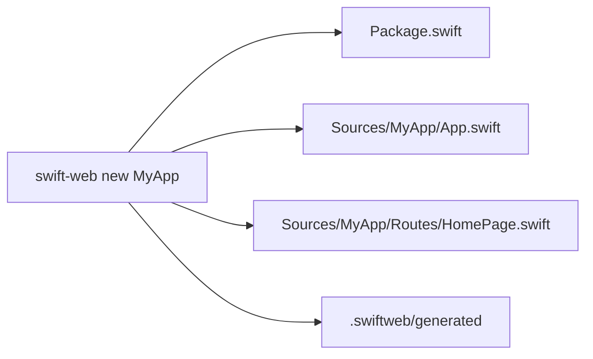
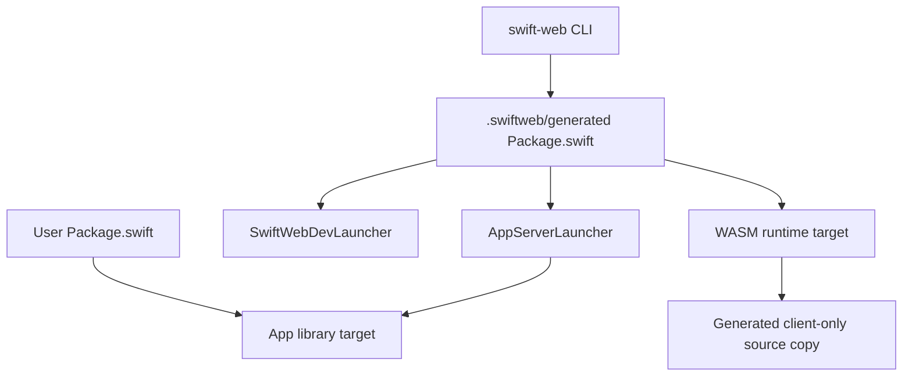
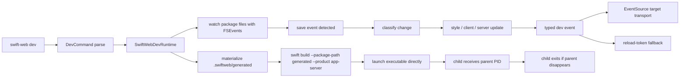
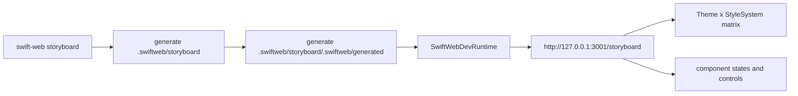
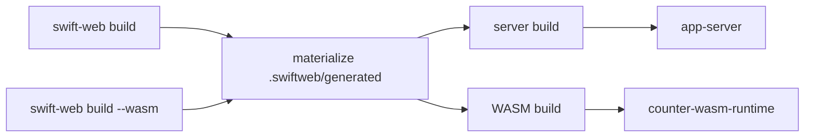
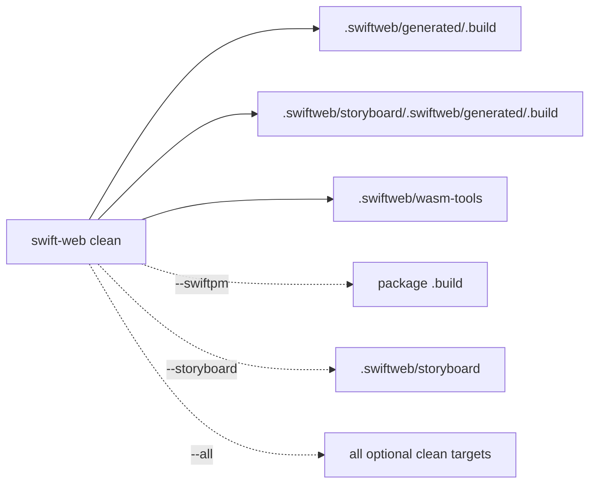

# SwiftWebCLI

SwiftWebCLI provides the `swift-web` executable.

It owns command parsing, project scaffolding, and generated build package preparation. The development server orchestration loop lives in `SwiftWeb` as `SwiftWebDevRuntime`.

## Responsibility

| Area | Responsibility |
|---|---|
| Command parsing | Parses `swift-web` command names and command-line options. |
| Project creation | Generates minimal named app skeletons through the `new` command. |
| Generated package | Materializes `.swiftweb/generated/Package.swift` for launchers, server builds, and WASM runtime builds. |
| Dev command | Parses CLI options and delegates to `SwiftWebDevRuntime`. |
| Build command | Builds the generated server product or generated WASM runtime product. |
| Storyboard command | Generates an isolated SwiftWebUI component style board and runs it through the same dev runtime. |

## New Command

`swift-web new <AppName>` creates the smallest runnable SwiftWeb package. It gives the package, library product, target, source directory, and `SwiftWeb.App` type the provided app name.

| Generated file | Responsibility |
|---|---|
| `Package.swift` | Declares the app library and depends on `SwiftWeb` plus `SwiftHTML`. |
| `Sources/<AppName>/App.swift` | Mounts the app routes through `SwiftWeb.App`. |
| `Sources/<AppName>/Routes/HomePage.swift` | Defines a single `@Page("/")` route that renders `Hello World`. |
| `.swiftweb/generated` | Generated launcher package for dev/server builds. |

## Package Boundary

User packages should stay small: one app library target plus SwiftWeb dependencies. Dev launchers, server launchers, WASM linker flags, client source copies, and client-runtime source copies belong to `.swiftweb/generated`.

## Dev Command Flow

`SwiftWebDevRuntime` checks the configured host and port before starting the child server. If the port is already occupied, the CLI exits with a clear error before Vapor can fail during bind.

The runtime watches the app package plus local `.package(path:)` dependencies so edits in a checked-out SwiftWeb framework also trigger rebuilds. The child server receives `SWIFT_WEB_DEV_PARENT_PID`; `AppRunner` starts a monitor that exits the child when the dev parent disappears.

Startup, ready, reload, child-exit, and shutdown events are emitted through `swift-log` with `codes.swiftweb.dev` as the logger label.

The CLI does not implement HMR itself. It delegates to `SwiftWebDevRuntime`, which emits typed development events such as `stylePatch`, `clientComponentUpdate`, `serverBuildStarted`, `serverRestarted`, `pagePatch`, `fullReload`, and `error`. The browser runtime prefers `/__swiftweb/dev/events` through EventSource and falls back to `/__swiftweb/dev/reload` token waiting when streaming responses are unavailable.

In the current Vapor 5 alpha HTTP server path, streaming response bodies are not yet written by the server handler. That means the typed EventSource contract is present, but the reload-token fallback remains the reliable browser transport until Vapor response streaming is wired.

## Storyboard Command Flow

`swift-web storyboard` is a framework inspection tool. It does not edit the user's app source. It generates a managed package under `.swiftweb/storyboard`, mounts `StoryboardPage`, and runs on port `3001` by default so it can stay open beside an app running through `swift-web dev` on port `3000`.

The storyboard includes the default SwiftWebUI style, Material-style overrides, Liquid Glass-style overrides, light/dark theme coverage, control states, semantic `Text(as:)`, local `@State` controls, lists, navigation links, lazy stacks, and layout fill behavior.

## Build Command Flow

| Mode | Product | Notes |
|---|---|---|
| Server | `app-server` by default | Uses the app library product from the user package. |
| WASM | First generated `*WasmRuntime` product by default | Sets `SWIFTWEB_WASM_BUILD=1`, uses the shell-selected `swift`, and builds the generated client-only package without reading the user app's server dependencies. |

## Generated Files

| File | Responsibility |
|---|---|
| `.swiftweb/generated/Package.swift` | Generated SwiftPM package for dev/server/WASM builds. |
| `.swiftweb/generated/Sources/AppServerLauncher/ServerLauncher.swift` | Thin server entrypoint that calls `<AppName>.run()`. |
| `.swiftweb/generated/Sources/SwiftWebDevLauncher/DevLauncher.swift` | Dev entrypoint that delegates to `SwiftWebDevRuntime`. |
| `.swiftweb/generated/Sources/<AppName>` | Client-only source copy used by WASM runtime targets. |
| `.swiftweb/generated/Sources/SwiftWebActors` | Generated copy of the shared distributed actor runtime used by WASM runtime targets. |
| `.swiftweb/generated/Sources/SwiftWebUI` | Client UI component source copy used by WASM runtime targets. |
| `.swiftweb/generated/Sources/SwiftWebUIRuntime` | JavaScriptKit-backed client runtime source copy used by WASM runtime targets. |
| `.swiftweb/generated/Sources/*WasmRuntime` | App-specific WASM export entrypoint. |
| `.swiftweb/storyboard` | Managed app package generated by `swift-web storyboard` for visual component inspection. |
| `swift-html` package dependency | Client HTML runtime used by generated server and WASM packages. |

Open `.swiftweb/generated` in Xcode to run the generated `<AppName>` scheme. That scheme builds `SwiftWebDevLauncher`, which starts the same `SwiftWebDevRuntime` used by `swift-web dev`.

## Clean Command

`swift-web clean` removes generated build products that are safe to recreate. It is intended to keep repeated dev, Storyboard, and WASM builds from accumulating unnecessary storage.

| Option | Behavior |
|---|---|
| Default | Removes generated SwiftWeb build caches and WASM helper caches. |
| `--swiftpm` | Also removes the package-level `.build` directory. |
| `--storyboard` | Removes the managed Storyboard package source as well as its generated caches. |
| `--all` | Enables both `--swiftpm` and `--storyboard`. |

## Not Responsible For

| Not owned by SwiftWebCLI | Owner |
|---|---|
| HTTP response rendering | `SwiftWeb` and `SwiftHTML` |
| Development browser runtime injection | `SwiftWeb` |
| Development watch/restart runtime | `SwiftWeb` |
| Component layout and theme behavior | `SwiftWebUI` |
| Macro expansion | `SwiftWebMacros` |
| Vapor route registration | `SwiftWeb` |
| Client WASM graph, diff, and hydration internals | `SwiftHTML` |

## Design Notes

- The CLI should parse commands and delegate runtime behavior to `SwiftWeb`.
- The dev command delegates browser update behavior to `SwiftWebDevRuntime`. That runtime prefers typed EventSource HMR events and keeps reload-token waiting as a compatibility fallback.
- Component-level HMR is a SwiftWeb runtime responsibility. The CLI only starts the runtime and materializes the generated package used by server and WASM builds.
- Child server cleanup is part of the dev runtime contract, not something each app should implement manually.
- Templates should demonstrate supported features without becoming the source of runtime behavior.
- The storyboard is generated output for framework authors. It must stay isolated from application source and should cover style regressions broadly enough to make visual changes reviewable.
- Storyboard materialization replaces only managed generated sources by default. Build caches are cleaned by `swift-web clean` so normal regeneration does not throw away useful incremental build state.
- Generated projects should depend on library APIs rather than private implementation details.
