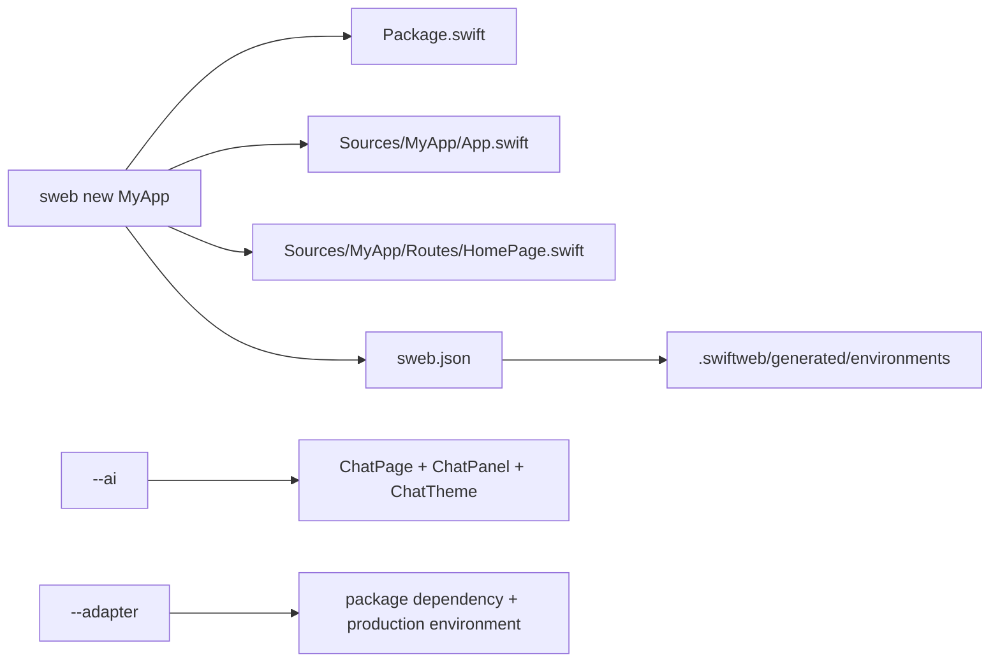
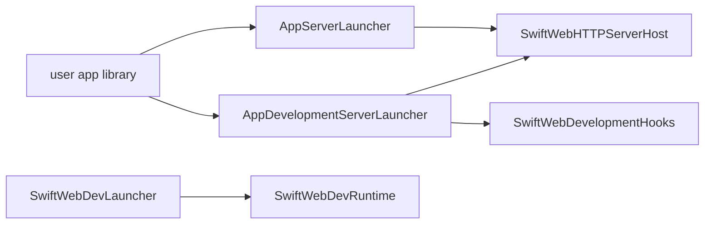

# SwiftWebCLI

SwiftWebCLI provides the `sweb` executable. It parses user commands and
delegates package generation, development orchestration, Storyboard generation,
and WASM processing to the corresponding development targets.

## Commands

| Command | Owner after parsing |
|---|---|
| `new` | CLI template writer plus `SwiftWebPackageGeneration` |
| `prepare` | Adapter resolver, environment materializer, and lifecycle executor |
| `xcode` | `SwiftWebPackageGeneration`, then the macOS `open` command |
| `dev` | Selected Service, Host, and Deployment tasks; persistent processes are supervised together |
| `storyboard` | `SwiftWebStoryboardTooling` and, in development mode, `SwiftWebDevServer` |
| `build` | Selected Service, Host, and Deployment build tasks |
| `deploy` | Selected Service and Deployment tasks after successful prepare and build |
| `clean` | `SwiftWebDevBuildArtifactCleaner` |

The command grammar is defined by `CommandLineInterface` in `App.swift`:

```text
sweb new <AppName> [--output <directory>] [--force] [--ai] [--adapter <owner/repository>]
sweb prepare [--package-path <directory>] [--environment <name>] [--runtime standard|embedded]
sweb xcode [--package-path <directory>] [--product <name>] [--no-open]
sweb build [--package-path <directory>] [--environment <name>] [--runtime standard|embedded]
sweb clean [--package-path <directory>] [--storyboard] [--swiftpm] [--all]
sweb dev [--package-path <directory>] [--environment <name>] [--host <host>] [--port <port>]
sweb deploy [--package-path <directory>] [--environment <name>] [--runtime standard|embedded]
sweb storyboard [--package-path <directory>] [--output <directory>] [--host <host>] [--port <port>] [--no-run] [--force] [--production] [--runtime standard|embedded] [--swift-sdk <sdk>] [-c debug|release]
```

## Project Creation

`sweb new` writes an app library package, source files, `sweb.json`, and
generated launch packages. The default template uses SwiftWeb 0.11.0 and SwiftHTML
0.15.0 dependencies.


```mermaid
flowchart LR
  New["sweb new MyApp"] --> Manifest["Package.swift"]
  New --> App["Sources/MyApp/App.swift"]
  New --> Page["Sources/MyApp/Routes/HomePage.swift"]
  New --> Project["sweb.json"]
  Project --> Generated[".swiftweb/generated/environments"]
  AI["--ai"] --> Chat["ChatPage + ChatPanel + ChatTheme"]
  Selection["--adapter"] --> Adapter["package dependency + production environment"]
```

The generated user package remains a library. Concrete server, development,
and WASM launch products live below `.swiftweb/generated`.

Deployment adapters are SwiftPM packages. The CLI reads `Adapter/sweb.json`
from direct resolved dependencies, validates Host/Deployment artifact
and Service compatibility, materializes their isolated templates, and executes
their lifecycle task graph. See
[Host, Deployment, and Service Adapter Contract](../../docs/AdapterContract.md).

A Service manifest entry is an independent build/deploy unit. It does not
select a Swift client programming model. Server connections keep their existing
request/response surface; Actor connections retain concrete Swift Distributed
Actor references as defined by
[the Actor runtime contract](../SwiftWebRuntime/Actors/README.md).

## Generated Packages

| Directory | Purpose |
|---|---|
| `.swiftweb/generated/server` | Production `app-server` package and launcher |
| `.swiftweb/generated/dev` | Xcode/CLI development launchers and `<AppName>-dev` scheme |
| `.swiftweb/generated/wasm` | Client-only source copies and browser runtime products |
| `.swiftweb/generated/environments/<name>/workspace` | Materialized primary Host and Deployment workspace |
| `.swiftweb/generated/environments/<name>/workspace/services/<service>` | Isolated service workspace |

`sweb prepare`, `sweb dev`, `sweb build`, and `sweb deploy` use the same adapter
resolver and environment materializer. The native Host continues to use the
existing generated package materializer. Generated output is replaceable build
state and is not an application authoring location.

Production and development server launchers import `SwiftWebHTTPServerHost`.
Development workers also import `SwiftWebDevelopmentHooks`; they do not import
the watcher, proxy, package materializer, or process supervisor.


```mermaid
flowchart LR
  User["user app library"] --> Server["AppServerLauncher"]
  User --> Worker["AppDevelopmentServerLauncher"]
  Server --> Host["SwiftWebHTTPServerHost"]
  Worker --> Host
  Worker --> Hooks["SwiftWebDevelopmentHooks"]
  Dev["SwiftWebDevLauncher"] --> Runtime["SwiftWebDevRuntime"]
```

## Development Runtime

`sweb dev` runs a persistent public DevHost in front of replaceable app workers.
The reconciler derives a source fingerprint, prepares one desired generation,
builds changed client/server products, waits for a replacement worker to become
ready, and then switches traffic.


```mermaid
flowchart LR
  Source["source state"] --> Fingerprint["desired fingerprint"]
  Fingerprint --> Prepare["prepare packages and WASM"]
  Prepare --> Build["build worker"]
  Build --> Ready["readiness check"]
  Ready --> Swap["activate worker"]
  Swap --> Events["HMR / page patch events"]
```

The public port remains stable while internal workers restart. EventSource at
`/__swiftweb/dev/events` is the normal browser update transport. The reload-token
endpoint remains a compatibility fallback.

Build failures are latched against their source fingerprint. The previous good
worker remains available, and a later source change can recover without
restarting `sweb dev`. Worker crashes trigger relaunch against the serving
fingerprint.

Child builds run in isolated process groups and are paired with an owner-lifetime
monitor. The monitor tracks descendants even when SwiftPM or SwiftBuild moves a
compiler into another process group. Timeout, task cancellation, normal leader
exit, and abrupt `sweb` termination drain the complete tracked process tree
before operation ownership is released.

## Browser Generations

Client HMR publishes immutable generation directories and atomically moves the
`current` symlink after every runtime succeeds. A single
`clientRuntimeBatchUpdate` event names exact content-hashed generation URLs.

The host negotiates Brotli, gzip, or identity representations and streams an
already-open descriptor in bounded chunks. Collected generations return
`410 Gone`; the browser performs an explicit full reload instead of accepting
bytes from another generation.

## Build and Deploy Commands

`sweb build` runs the selected Host build before the selected Deployment
verification. For `swift-web/http-server`, this builds both the server and the
browser runtime. Platform adapters own their compiler and artifact rules.

```bash
sweb build --environment production
sweb deploy --environment production
```

`deploy` always runs prepare and build first. Only Service and Deployment tasks
in the deploy operation may change remote state. Task IDs and dependencies are
validated as a DAG before execution.

`prepare`, `build`, and `deploy` carry one explicit WASM runtime profile through
package projection, SDK selection, built-in build tasks, and adapter command
environments. `dev` accepts only `standard` because its incremental runtime does
not consume Embedded artifacts.

The exact compiler and linker environment is documented in
[Toolchain](../../docs/Toolchain.md).

## Storyboard

`sweb storyboard` generates a managed package under `.swiftweb/storyboard` and
runs the component catalog without editing application source. Production mode
uses the same WASM artifact processor as the native Host build:

```bash
sweb storyboard --production --runtime standard -c release
```

## Clean

| Option | Removed output |
|---|---|
| default | Generated SwiftWeb build caches and WASM helper caches |
| `--swiftpm` | Also the app package `.build` directory |
| `--storyboard` | Also the managed Storyboard package |
| `--all` | Both optional groups |

The shared content-addressed development WASM artifact cache is bounded by
`SWIFTWEB_WASM_ARTIFACT_CACHE_MAX_BYTES` and is not removed by the default
package-local clean operation.

## Boundaries

SwiftWebCLI does not implement HTML rendering, browser hydration, route
semantics, component styling, or actor invocation. Its responsibility ends at
argument validation, user-facing process setup, and delegation to the owning
module.
