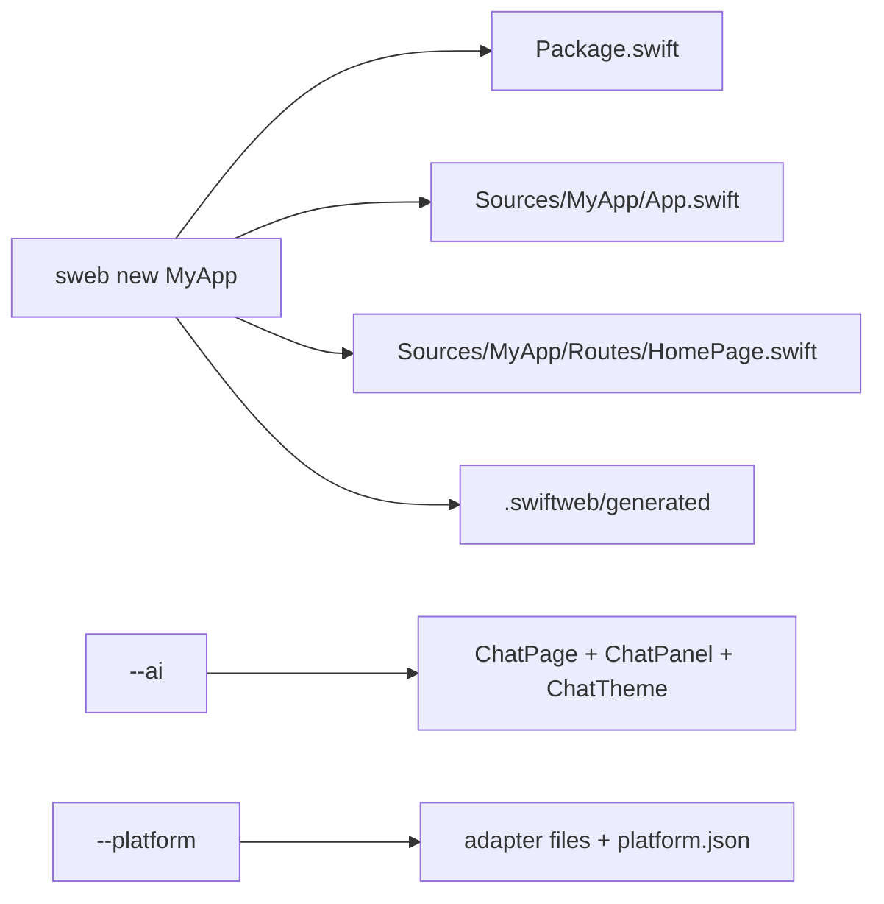
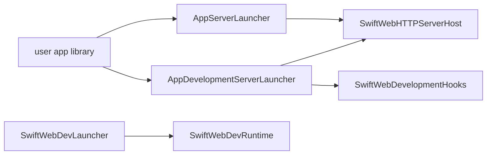
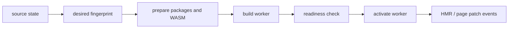

# SwiftWebCLI

SwiftWebCLI provides the `sweb` executable. It parses user commands and
delegates package generation, development orchestration, Storyboard generation,
and WASM processing to the corresponding development targets.

## Commands

| Command | Owner after parsing |
|---|---|
| `new` | CLI template writer plus `SwiftWebPackageGeneration` |
| `prepare` | `SwiftWebPackageGeneration` |
| `xcode` | `SwiftWebPackageGeneration`, then the macOS `open` command |
| `dev` | `SwiftWebDevServer` |
| `storyboard` | `SwiftWebStoryboardTooling` and, in development mode, `SwiftWebDevServer` |
| `build` | `SwiftWebPackageGeneration` and `SwiftWebWasmBuild` |
| `clean` | `SwiftWebDevBuildArtifactCleaner` |

The command grammar is defined by `CommandLineInterface` in `App.swift`:

```text
sweb new <AppName> [--output <directory>] [--force] [--ai] [--platform <preset|owner/repo[/template]>]
sweb prepare [--package-path <directory>] [--product <name>]
sweb xcode [--package-path <directory>] [--product <name>] [--no-open]
sweb build [--package-path <directory>] [--product <name>] [--wasm] [--runtime standard] [--swift-sdk <sdk>] [-c debug|release]
sweb clean [--package-path <directory>] [--storyboard] [--swiftpm] [--all]
sweb dev [--package-path <directory>] [--product <name>] [--host <host>] [--port <port>]
sweb storyboard [--package-path <directory>] [--output <directory>] [--host <host>] [--port <port>] [--no-run] [--force] [--production] [--runtime standard] [--swift-sdk <sdk>] [-c debug|release]
```

## Project Creation

`sweb new` writes an app library package, source files, and generated launch
packages. The default template uses the released SwiftWeb 0.7.0 and SwiftHTML
0.13.0 dependencies.


```mermaid
flowchart LR
  New["sweb new MyApp"] --> Manifest["Package.swift"]
  New --> App["Sources/MyApp/App.swift"]
  New --> Page["Sources/MyApp/Routes/HomePage.swift"]
  New --> Generated[".swiftweb/generated"]
  AI["--ai"] --> Chat["ChatPage + ChatPanel + ChatTheme"]
  Platform["--platform"] --> Adapter["adapter files + platform.json"]
```

The generated user package remains a library. Concrete server, development,
and WASM launch products live below `.swiftweb/generated`.

Deployment adapters are external GitHub templates. The CLI validates their
`sweb.json`, renders `{{app.*}}` placeholders, copies the selected template,
and records its origin in `.swiftweb/platform.json`. See
[Platform Adapter Template Contract](../../docs/PlatformAdapterTemplateContract.md).

## Generated Packages

| Directory | Purpose |
|---|---|
| `.swiftweb/generated/server` | Production `app-server` package and launcher |
| `.swiftweb/generated/dev` | Xcode/CLI development launchers and `<AppName>-dev` scheme |
| `.swiftweb/generated/wasm` | Client-only source copies and browser runtime products |

`sweb prepare`, `sweb xcode`, `sweb dev`, and `sweb build` use the same
materializer. Generated output is replaceable build state and is not an
application authoring location.

Production and development server launchers import `SwiftWebHTTPServerHost`.
Development workers also import `SwiftWebDevelopmentHooks`; they do not import
the watcher, proxy, package materializer, or process supervisor.


```mermaid
flowchart LR
  User["user app library"] --> Server["AppServerLauncher"]
  User --> Worker["AppDevelopmentServerLauncher"]
  Server --> Host["SwiftWebHTTPServerHost"]
  Worker --> Host
  Worker --> Hooks["SwiftWebDevelopmentHooks"]
  Dev["SwiftWebDevLauncher"] --> Runtime["SwiftWebDevRuntime"]
```

## Development Runtime

`sweb dev` runs a persistent public DevHost in front of replaceable app workers.
The reconciler derives a source fingerprint, prepares one desired generation,
builds changed client/server products, waits for a replacement worker to become
ready, and then switches traffic.


```mermaid
flowchart LR
  Source["source state"] --> Fingerprint["desired fingerprint"]
  Fingerprint --> Prepare["prepare packages and WASM"]
  Prepare --> Build["build worker"]
  Build --> Ready["readiness check"]
  Ready --> Swap["activate worker"]
  Swap --> Events["HMR / page patch events"]
```

The public port remains stable while internal workers restart. EventSource at
`/__swiftweb/dev/events` is the normal browser update transport. The reload-token
endpoint remains a compatibility fallback.

Build failures are latched against their source fingerprint. The previous good
worker remains available, and a later source change can recover without
restarting `sweb dev`. Worker crashes trigger relaunch against the serving
fingerprint.

Child builds run in isolated process groups. Timeout, task cancellation, and
normal leader exit drain descendants before operation ownership is released.

## Browser Generations

Client HMR publishes immutable generation directories and atomically moves the
`current` symlink after every runtime succeeds. A single
`clientRuntimeBatchUpdate` event names exact content-hashed generation URLs.

The host negotiates Brotli, gzip, or identity representations and streams an
already-open descriptor in bounded chunks. Collected generations return
`410 Gone`; the browser performs an explicit full reload instead of accepting
bytes from another generation.

## Build Command

Server builds use the generated server package. `sweb build --wasm` uses the
standard Swift WASM profile and defaults to release configuration.

```bash
sweb build --wasm \
  --runtime standard \
  --swift-sdk swift-6.4.x-DEVELOPMENT-SNAPSHOT-2026-07-17-a_wasm \
  -c release
```

The artifact processor strips non-runtime custom sections, runs
`wasm-opt -Oz` when available, writes a size report, and generates cached gzip
and Brotli sidecars. `SWIFTWEB_WASM_SPLIT_BUILD_STRATEGY=resolved-bundles`
forces one physical product per resolved split for diagnostics; the default
coalesces non-eager products by load policy.

The exact compiler and linker environment is documented in
[Toolchain](../../docs/Toolchain.md).

## Storyboard

`sweb storyboard` generates a managed package under `.swiftweb/storyboard` and
runs the component catalog without editing application source. Production mode
uses the same WASM artifact processor as `sweb build --wasm`:

```bash
sweb storyboard --production --runtime standard -c release
```

## Clean

| Option | Removed output |
|---|---|
| default | Generated SwiftWeb build caches and WASM helper caches |
| `--swiftpm` | Also the app package `.build` directory |
| `--storyboard` | Also the managed Storyboard package |
| `--all` | Both optional groups |

The shared content-addressed development WASM artifact cache is bounded by
`SWIFTWEB_WASM_ARTIFACT_CACHE_MAX_BYTES` and is not removed by the default
package-local clean operation.

## Boundaries

SwiftWebCLI does not implement HTML rendering, browser hydration, route
semantics, component styling, or actor invocation. Its responsibility ends at
argument validation, user-facing process setup, and delegation to the owning
module.
