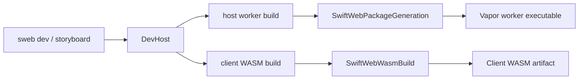
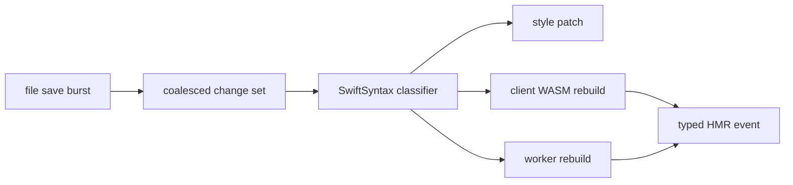
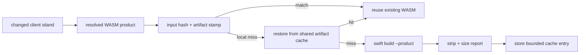
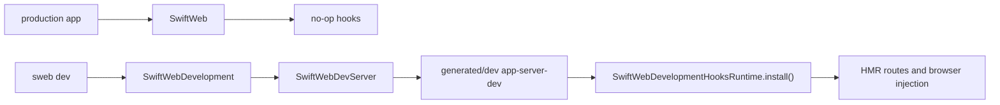
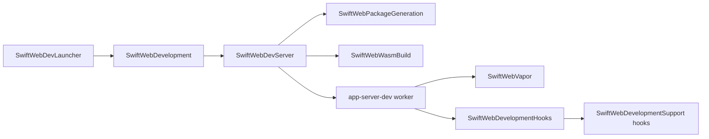
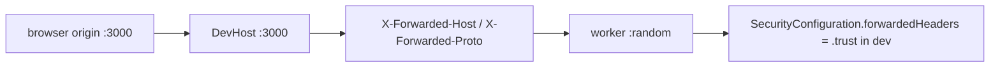

# SwiftWebDevelopment

SwiftWebDevelopment is the convenience facade for development-only SwiftWeb tooling.

It re-exports the smaller development modules so command-line tools can import one
product while implementation ownership stays split. Applications that depend only on
`SwiftWeb` do not link the file watcher, HMR event pipeline, generated package
materializer, dev browser overlay, or dev child-process supervisor.

## Responsibility

| Module | Responsibility |
|---|---|
| `SwiftWebDevelopment` | Re-exports the development modules and installs development hooks through `SwiftWebDevelopment.install()`. |
| `SwiftWebDevelopmentHooks` | Worker-side HMR contracts, browser injection hooks, context propagation, and dev event schema. |
| `SwiftWebPackageGeneration` | Materializes `.swiftweb/generated/server`, `.swiftweb/generated/dev`, and `.swiftweb/generated/wasm`. |
| `SwiftWebDevServer` | Builds and launches the generated dev child server product, watches files, restarts workers, streams HMR events, and proxies through the persistent DevHost. |
| `SwiftWebWasmBuild` | Resolves the Swift WASM SDK, processes artifacts, writes size reports, and creates compressed sidecars for production builds. |
| `SwiftWebStoryboardTooling` | Generates the managed Storyboard package and launches it through the dev runtime. |

Swift 6.3 host compatibility is tracked in
[`docs/Swift63HostCompatibilityTODO.md`](../../../docs/Swift63HostCompatibilityTODO.md). Do not
treat a host build with a Swift 6.4-capable Xcode toolchain as proof that the true Swift 6.3
host compiler can build the current Vapor 5 HTTP stack.

Build-time performance is tracked separately in
[`docs/BuildTimePerformanceTODO.md`](../../../docs/BuildTimePerformanceTODO.md). Do not treat a
passing HMR E2E run as proof that cold or warm dev build latency is acceptable.

Client WASM builds use generated-package inputs plus the selected Swift executable, Swift WASM SDK, and artifact-processing signature as a build-stamp key. When the stamp and artifact hash still match, the dev runtime reuses the existing WASM artifact and emits the same client update manifest without invoking SwiftPM again.

Generated browser WASM packages use a runtime-only JavaScriptKit source copy by default. This keeps JavaScriptKit BridgeJS and `swift-syntax` out of the browser package graph while still allowing `SwiftWebUIRuntime` to use `JSObject`, `JSValue`, and `JSPromise` for DOM operations and WebActor transport. The decision is recorded in [`docs/BrowserRuntimeJavaScriptKitDecision.md`](../../../docs/BrowserRuntimeJavaScriptKitDecision.md).

The dev runtime also keeps a bounded content-addressed WASM artifact cache. This is development-only and exists to avoid rebuilding the same generated client runtime after `.swiftweb` or temporary E2E directories are recreated.

Host worker builds are separate from Client WASM builds. `SwiftWebDevServerProcess`
never assumes that `swift` on `PATH` is the correct host compiler. It resolves a
host Swift executable through `SwiftWebHostSwiftToolchain` in
`SwiftWebPackageGeneration`, while `SwiftWebDevBuildProcess` resolves the Swift 6.3
WASM toolchain through `SwiftWebWasmToolchain` in `SwiftWebWasmBuild`.

| Variable | Behavior |
|---|---|
| `SWIFT_WEB_PACKAGE_PATH` | Overrides the SwiftWeb source package used when materializing generated packages. |
| `SWIFT_WEB_HOST_SWIFT` | Overrides the Swift executable used to build generated host/dev worker products. |
| `SWIFT_WEB_HOST_TOOLCHAIN_BIN` | Overrides the host Swift toolchain `usr/bin` directory. |
| `SWIFTWEB_WASM_ARTIFACT_CACHE` | Set to `0`, `false`, `no`, or `off` to disable the shared dev artifact cache. |
| `SWIFTWEB_WASM_ARTIFACT_CACHE_PATH` | Overrides the shared cache directory. Defaults to `~/Library/Caches/SwiftWeb/wasm-artifacts/v1`. |
| `SWIFTWEB_WASM_ARTIFACT_CACHE_MAX_BYTES` | Maximum cache size in bytes. Defaults to `536870912`; least-recently-used entries are removed after new stores. |
| `SWIFT_WEB_WASM_SWIFT` | Overrides the Swift executable used only for WASM builds. |
| `SWIFT_WEB_WASM_TOOLCHAIN_BIN` | Overrides the WASM toolchain `usr/bin` directory. |

Dev artifact processing strips debug/producers custom sections and writes `<artifact>.wasm.size.json` so size attribution is available during framework work. It does not write gzip or Brotli sidecars by default, because local HMR should not spend seconds recompressing every standalone Swift/WASM product. Production `sweb build --wasm` owns precompressed sidecars and reuses them through `<artifact>.wasm.compression.json` when the post-processed WASM content hash and compression signature are unchanged.

File changes are coalesced before classification. A burst of save events is treated as one change set so style patches, client WASM rebuilds, and worker rebuilds are planned together rather than racing through separate rebuild cycles.

Swift file classification uses SwiftSyntax. `ClientComponent` declarations map to dirty client WASM runtimes, while `@Page`, `@ServerAction`, server component protocols, app entry protocols, and `distributed actor` declarations require a worker rebuild. If one Swift file contains both client and server runtime surfaces, the runtime performs both the client update and the worker rebuild.

## Runtime Boundary

Production server builds use `.swiftweb/generated/server` and the `app-server` product. Dev runs use `.swiftweb/generated/dev`. The `SwiftWebDevLauncher` target imports `SwiftWebDevelopment`; the `app-server-dev` worker target imports `SwiftWebVapor` plus `SwiftWebDevelopmentHooks`.

The long-lived dev host depends on `SwiftWebDevServer` through the
`SwiftWebDevelopment` facade. The short-lived Vapor worker imports `SwiftWebVapor`
plus `SwiftWebDevelopmentHooks`, which contain the route injection, browser HMR
metadata, context propagation, and dev event contracts needed inside the worker. This
keeps the worker out of the file watcher, package materializer, SwiftSyntax
classifier, HTTP proxy, and child-process supervisor.

Cold worker builds can still compile macro infrastructure because the user app target normally imports the public `SwiftWeb` facade and uses `@Page` / `@ServerAction`. The hooks split, `SwiftWebCore` boundary, and `SwiftWebVapor` host adapter remove macro dependencies from the worker launcher and hooks targets, but they do not remove macro expansion from app compilation. Before claiming dev startup speed is solved, measure the generated `app-server-dev` cold build and record whether `SwiftSyntax` still appears in the build log.

## DevHost Proxy Security

DevHost is a persistent reverse proxy in front of short-lived Vapor workers. Browser requests use the public DevHost origin, while the active worker listens on an internal loopback port. DevHost therefore forwards the public origin with `X-Forwarded-Host` and `X-Forwarded-Proto`.

`SwiftWebDevelopmentHooksRuntime.install()` transforms the app security policy only when `SWIFT_WEB_DEV=1`, setting `forwardedHeaders` to `.trust`. This keeps Server Actions, form submissions, CORS, redirects, and HSTS decisions aligned with the browser-visible DevHost origin during development. Production hooks are no-op and do not trust forwarded headers unless the app configures that explicitly.

## Not Responsible For

| Not owned by SwiftWebDevelopment facade | Owner |
|---|---|
| Page protocols, route lowering, action gateways, and WASM asset hosting | `SwiftWeb` |
| HTML graph, state, hydration records, and DOM command model | `SwiftHTML` |
| Visual component APIs and styles | `SwiftWebUI` |
| Browser-side JavaScriptKit bridge | `SwiftWebUIRuntime` |
