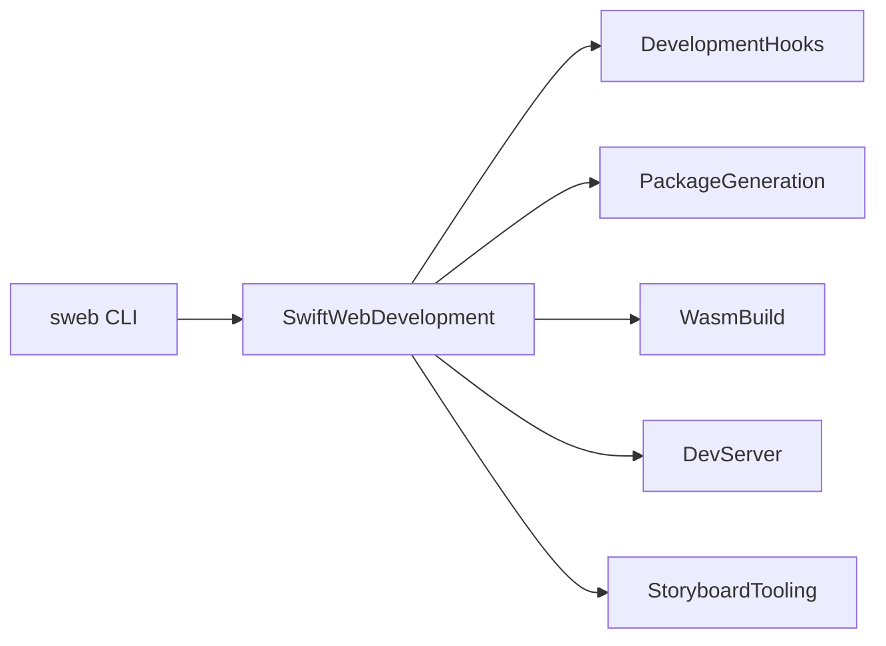
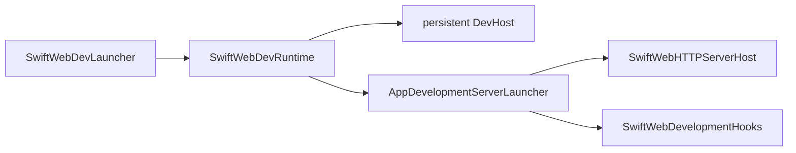

# SwiftWebDevelopment

`SwiftWebDevelopment` is a facade target. It re-exports the development modules
used by the CLI and generated development launcher; implementation remains in
the owning targets.

## Module Map

| Module | Responsibility |
|---|---|
| `SwiftWebDevelopmentHooks` | Worker-side development events, context, parent monitoring, and hook installation |
| `SwiftWebPackageGeneration` | Generated server, dev, and WASM packages |
| `SwiftWebWasmBuild` | Toolchain resolution, artifact processing, size reports, and compression |
| `SwiftWebDevServer` | DevHost, reconciler, watcher, worker supervision, HMR, and process ownership |
| `SwiftWebStoryboardTooling` | Managed Storyboard scaffold and launch |

```mermaid
flowchart LR
  CLI["sweb CLI"] --> Facade["SwiftWebDevelopment"]
  Facade --> Hooks["DevelopmentHooks"]
  Facade --> Generation["PackageGeneration"]
  Facade --> Wasm["WasmBuild"]
  Facade --> Dev["DevServer"]
  Facade --> Storyboard["StoryboardTooling"]
```

## Generated Runtime Boundary

The long-lived development process owns file watching, package generation,
builds, the public reverse proxy, and worker supervision. The replaceable app
worker owns application routes and imports only the native HTTP host plus
development hooks.

```mermaid
flowchart LR
  Launcher["SwiftWebDevLauncher"] --> Runtime["SwiftWebDevRuntime"]
  Runtime --> Host["persistent DevHost"]
  Runtime --> Worker["AppDevelopmentServerLauncher"]
  Worker --> HTTP["SwiftWebHTTPServerHost"]
  Worker --> Hooks["SwiftWebDevelopmentHooks"]
```

This split prevents watcher, process, SwiftSyntax classifier, and package
materializer dependencies from entering the application worker launcher.

## Build Contract

Host and browser builds use the same pinned Swift 6.4 snapshot. Browser builds
must use the real toolchain directory containing `swift` and `wasm-ld`, together
with the matching standard WASM SDK. See [Toolchain](../../../docs/Toolchain.md).

## Verification

The development system is complete only when the real browser-visible path
passes. Unit tests, generated manifest inspection, or a successful WASM link do
not replace that gate. See
[Development Reconciler Verification](../../../docs/DevServerReconcilerVerification.md).

## Facade Rule

Do not add implementation to this target. New development behavior belongs in
the smallest owning target above and is re-exported here only when CLI or
generated launcher consumers need it.
