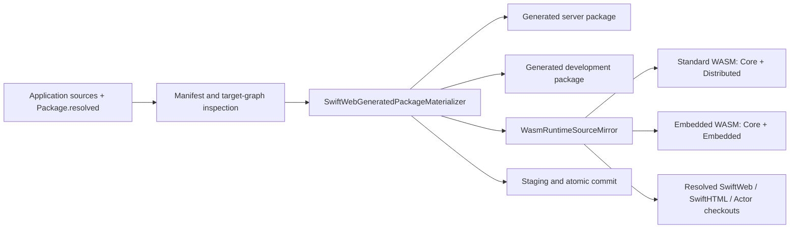

# SwiftWebPackageGeneration

## Purpose and Scope

This module owns the generated package materialization used by SwiftWeb's
native host, development server, and browser runtime. It is a child of the
[SwiftWeb package design](../../../DESIGN.md), with no component design below
this directory.

The module covers package inspection, target-graph evaluation, actor source
projection, runtime source mirroring, generated manifests, and transactional
output replacement. It does not own the runtime semantics of the copied
libraries or the public application APIs.

## Responsibilities and Boundaries

`SwiftWebGeneratedPackageMaterializer` coordinates target discovery and the
three generated package formats. `WasmRuntimeSourceMirror` copies the
profile-specific client sources and required runtime sources. The generated
format types render manifests and launchers. `PackageResolvedSynchronizer`
copies the application lockfile into generated packages.

SwiftPM remains the authority for dependency resolution. The module may read a
resolved checkout and mirror source files, but it must not create a second
dependency resolver or make the vendored copy an alternate source owner.

## Related Designs

| Design | Relationship | Contract used | Cautions |
|---|---|---|---|
| [SwiftWeb package master](../../../DESIGN.md) | parent | Released dependency graph and generated-profile invariants | Recheck root dependency changes before changing lookup order. |
| [Actor integration](../../SwiftWebRuntime/Actors/DESIGN.md) | depends on | Profile-specific Actor target requirements | Do not duplicate Actor runtime lifecycle rules here. |
| [Adapter contract](../../../docs/AdapterContract.md) | used by generated launchers | Application and adapter package boundaries | Adapter materialization is separate from client runtime mirroring. |
| [Toolchain contract](../../../docs/Toolchain.md) | used by target graph | Exact host/WASM toolchain and SDK selection | A successful host build does not prove browser runtime behavior. |

## Architecture

SwiftWeb package-root selection gives an explicit local development root
precedence over an older application SwiftWeb checkout. After that root is
selected, each dependency source mirror uses its own resolved-checkout order.
Actor sources check the application checkout first, then the selected
SwiftWeb checkout, its parent checkout, and the compiled package contexts.
Every candidate is accepted only when the required target source directories
exist.

## Contracts and Invariants

| Input or output | Assumption | Guarantee |
|---|---|---|
| Application package | `Package.swift` and a valid application target exist | Materialization fails with a typed error when either is missing. |
| SwiftWeb dependency | SwiftPM resolves the package or an explicit local development root is supplied | The explicit local root wins over an older application checkout. |
| SwiftHTML dependency | SwiftHTML source contains the runtime targets needed by the generated profile | Only runtime-safe sources are copied; preview and documentation trees are skipped. |
| Actor dependency | The resolved package exposes `ActorSystemCore` and the selected profile target | The generated package contains exactly those Actor source targets; lookup does not re-rank the dependency checkout relative to the application context. |
| Standard profile | The browser target supports Distributed Actor code | `ActorSystemDistributed` is mirrored and `ActorSystemEmbedded` is absent. |
| Embedded profile | The browser target supports Embedded Actor code | `ActorSystemEmbedded` is mirrored and `ActorSystemDistributed` is absent. |
| Generated output | Existing output may contain build state | Staging/rollback preserves unrelated state and commits a complete generated root atomically. |

The source mirror copies the selected source bytes and does not silently fall
back to a different profile, an empty directory, or a legacy Actor runtime.

## Runtime Flows

1. Resolve the SwiftWeb source root, SwiftHTML source root, and lockfile
   snapshot.
2. Evaluate the native and profile-specific target graphs with the pinned
   toolchain.
3. Project application actor declarations and write generated actor sources.
4. Mirror application client sources and runtime sources into the WASM package.
5. Render manifests and launchers, synchronize lockfiles, and commit the staged
   package transaction.

## State, Ownership, and Lifecycle

The application package owns input source files and its resolved graph. The
materializer owns only staged and committed generated roots. `GeneratedPackageFileWriter`
owns file replacement and cleanup operations inside those roots. Source
checkouts are read-only inputs for this module and outlive each materialization
operation.

## Failure, Concurrency, and Constraints

Materialization acquires the existing package-directory lock and uses a
staging transaction so concurrent callers cannot publish partial output. The
source mirror validates target presence before copying. Generated standard and
Embedded manifests are mutually exclusive at the Actor target boundary.
Generated build outputs may be cleaned after verification, but source checkouts,
logs, and unrelated worktree state remain outside cleanup scope.

## Verification and Change Impact

`SwiftWebGeneratedPackageMaterializerTests` is the module owner for projection,
profile selection, source lookup precedence, lockfile synchronization, and
transaction behavior. The generated standard and Embedded packages must each
compile/link under their matching pinned SDKs. Changes to source lookup or
profile target names require rechecking the parent package design and the
browser counter E2E; changes to actor lifecycle semantics belong to the Actor
integration owner.
