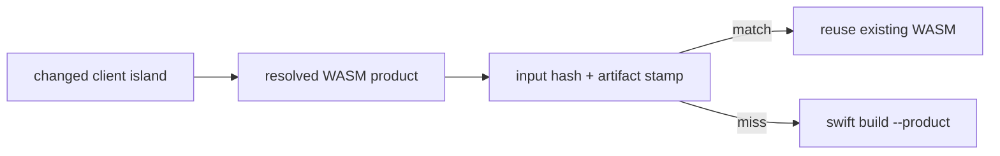
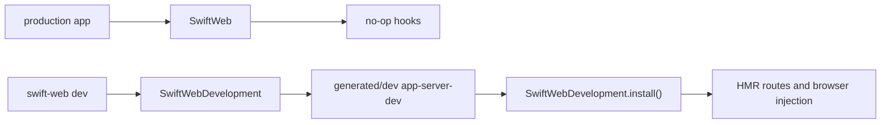

# SwiftWebDevelopment

SwiftWebDevelopment owns development-only runtime behavior for SwiftWeb.

It is intentionally separate from the `SwiftWeb` production runtime. Applications that depend only on `SwiftWeb` do not link the file watcher, HMR event pipeline, generated package materializer, dev browser overlay, or dev child-process supervisor.

## Responsibility

| Area | Responsibility |
|---|---|
| Dev hook installation | Installs development hooks into `SwiftWebDevelopmentSupport` for dev child servers. |
| Generated packages | Materializes `.swiftweb/generated/server`, `.swiftweb/generated/dev`, and `.swiftweb/generated/wasm`. |
| Dev server runtime | Builds and launches the generated dev child server product, watches files, and restarts when required. |
| HMR events | Emits typed style, client component, server restart, page patch, full reload, and error events. |
| Browser dev runtime | Injects development-only HMR script and boundary metadata when `SWIFT_WEB_DEV=1`. |
| Cleanup | Removes generated build caches through `swift-web clean`. |
| WASM tooling | Resolves the configured Swift WASM SDK and builds generated client runtime products. |

Client WASM builds use generated-package inputs plus the selected Swift executable and Swift WASM SDK as a build-stamp key. When the stamp and artifact hash still match, the dev runtime reuses the existing WASM artifact and emits the same client update manifest without invoking SwiftPM again.

## Runtime Boundary

Production server builds use `.swiftweb/generated/server` and the `app-server` product. Dev runs use `.swiftweb/generated/dev` and the `app-server-dev` product. Only the dev product imports `SwiftWebDevelopment`.

## Not Responsible For

| Not owned by SwiftWebDevelopment | Owner |
|---|---|
| Page protocols, route lowering, action gateways, and WASM asset hosting | `SwiftWeb` |
| HTML graph, state, hydration records, and DOM command model | `SwiftHTML` |
| Visual component APIs and styles | `SwiftWebUI` |
| Browser-side JavaScriptKit bridge | `SwiftWebUIRuntime` |
