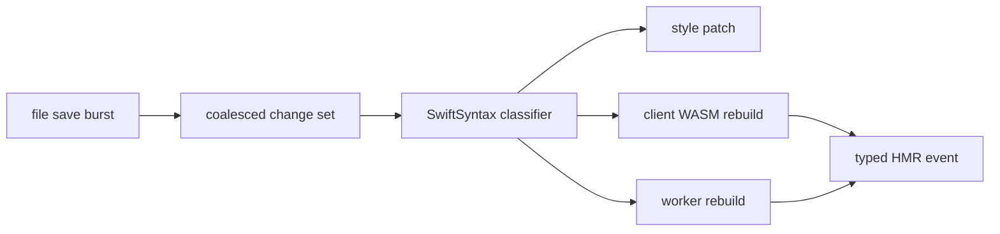
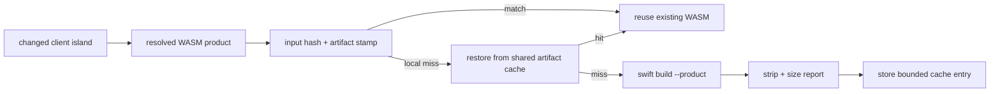
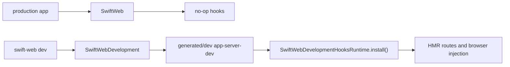
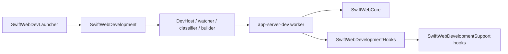
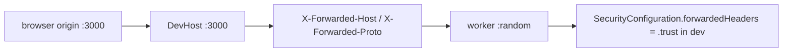

# SwiftWebDevelopment

SwiftWebDevelopment owns development-only runtime behavior for SwiftWeb.

It is intentionally separate from the `SwiftWeb` production runtime. Applications that depend only on `SwiftWeb` do not link the file watcher, HMR event pipeline, generated package materializer, dev browser overlay, or dev child-process supervisor.

## Responsibility

| Area | Responsibility |
|---|---|
| Dev hook installation | Installs development hooks into `SwiftWebDevelopmentSupport` for dev child servers. |
| Generated packages | Materializes `.swiftweb/generated/server`, `.swiftweb/generated/dev`, and `.swiftweb/generated/wasm`. |
| Dev server runtime | Builds and launches the generated dev child server product, watches files, and restarts when required. |
| HMR events | Emits typed style, client component, server restart, page patch, full reload, and error events. |
| Persistent DevHost | Keeps the public dev port alive, streams HMR events, proxies requests to the active Vapor worker, and swaps workers after server rebuilds. |
| Browser dev runtime | Injects development-only HMR script and boundary metadata when `SWIFT_WEB_DEV=1`. |
| Cleanup | Removes generated build caches through `swift-web clean`. |
| WASM tooling | Resolves the configured Swift WASM SDK and builds generated client runtime products. |

Swift 6.3 host compatibility is tracked in
[`docs/Swift63HostCompatibilityTODO.md`](../../docs/Swift63HostCompatibilityTODO.md). Do not
treat a host build with a Swift 6.4-capable Xcode toolchain as proof that the true Swift 6.3
host compiler can build the current Vapor 5 HTTP stack.

Build-time performance is tracked separately in
[`docs/BuildTimePerformanceTODO.md`](../../docs/BuildTimePerformanceTODO.md). Do not treat a
passing HMR E2E run as proof that cold or warm dev build latency is acceptable.

Client WASM builds use generated-package inputs plus the selected Swift executable, Swift WASM SDK, and artifact-processing signature as a build-stamp key. When the stamp and artifact hash still match, the dev runtime reuses the existing WASM artifact and emits the same client update manifest without invoking SwiftPM again.

The dev runtime also keeps a bounded content-addressed WASM artifact cache. This is development-only and exists to avoid rebuilding the same generated client runtime after `.swiftweb` or temporary E2E directories are recreated.

| Variable | Behavior |
|---|---|
| `SWIFTWEB_WASM_ARTIFACT_CACHE` | Set to `0`, `false`, `no`, or `off` to disable the shared dev artifact cache. |
| `SWIFTWEB_WASM_ARTIFACT_CACHE_PATH` | Overrides the shared cache directory. Defaults to `~/Library/Caches/SwiftWeb/wasm-artifacts/v1`. |
| `SWIFTWEB_WASM_ARTIFACT_CACHE_MAX_BYTES` | Maximum cache size in bytes. Defaults to `536870912`; least-recently-used entries are removed after new stores. |

Dev artifact processing strips debug/producers custom sections and writes `<artifact>.wasm.size.json` so size attribution is available during framework work. It does not write gzip or Brotli sidecars by default, because local HMR should not spend seconds recompressing every standalone Swift/WASM product. Production `swift-web build --wasm` owns precompressed sidecars.

File changes are coalesced before classification. A burst of save events is treated as one change set so style patches, client WASM rebuilds, and worker rebuilds are planned together rather than racing through separate rebuild cycles.

Swift file classification uses SwiftSyntax. `ClientComponent` declarations map to dirty client WASM runtimes, while `@Page`, `@ServerAction`, server component protocols, app entry protocols, and `distributed actor` declarations require a worker rebuild. If one Swift file contains both client and server runtime surfaces, the runtime performs both the client update and the worker rebuild.

## Runtime Boundary

Production server builds use `.swiftweb/generated/server` and the `app-server` product. Dev runs use `.swiftweb/generated/dev`. The `SwiftWebDevLauncher` target imports `SwiftWebDevelopment`; the `app-server-dev` worker target imports only `SwiftWebDevelopmentHooks`.

The long-lived dev host depends on `SwiftWebDevelopment`. The short-lived Vapor worker imports `SwiftWebCore` plus `SwiftWebDevelopmentHooks`, which contain the route injection, browser HMR metadata, context propagation, and dev event contracts needed inside the worker. This keeps the worker out of the file watcher, package materializer, SwiftSyntax classifier, HTTP proxy, and child-process supervisor.

Cold worker builds can still compile macro infrastructure because the user app target normally imports the public `SwiftWeb` facade and uses `@Page` / `@ServerAction`. The hooks split and `SwiftWebCore` boundary remove macro dependencies from the worker launcher and hooks targets, but they do not remove macro expansion from app compilation. Before claiming dev startup speed is solved, measure the generated `app-server-dev` cold build and record whether `SwiftSyntax` still appears in the build log.

## DevHost Proxy Security

DevHost is a persistent reverse proxy in front of short-lived Vapor workers. Browser requests use the public DevHost origin, while the active worker listens on an internal loopback port. DevHost therefore forwards the public origin with `X-Forwarded-Host` and `X-Forwarded-Proto`.

`SwiftWebDevelopmentHooksRuntime.install()` transforms the app security policy only when `SWIFT_WEB_DEV=1`, setting `forwardedHeaders` to `.trust`. This keeps Server Actions, form submissions, CORS, redirects, and HSTS decisions aligned with the browser-visible DevHost origin during development. Production hooks are no-op and do not trust forwarded headers unless the app configures that explicitly.

## Not Responsible For

| Not owned by SwiftWebDevelopment | Owner |
|---|---|
| Page protocols, route lowering, action gateways, and WASM asset hosting | `SwiftWeb` |
| HTML graph, state, hydration records, and DOM command model | `SwiftHTML` |
| Visual component APIs and styles | `SwiftWebUI` |
| Browser-side JavaScriptKit bridge | `SwiftWebUIRuntime` |
