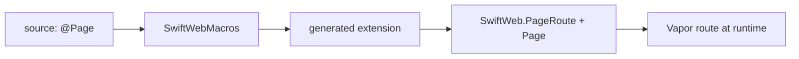

# SwiftWebMacros

SwiftWebMacros contains compile-time code generation for SwiftWeb.

It owns syntax analysis and generated Swift declarations for page types and action references. It does not perform runtime routing, request decoding, rendering, actor resolution, or server execution.

## Responsibility

| Area | Responsibility |
|---|---|
| Macro implementation | Implements the `@Page` macro using SwiftSyntax. |
| Page conformance | Generates `PageRoute` and `Page` conformance for annotated page types. |
| Route registration | Generates calls that lower page paths to Vapor route registration. |
| Parameter checks | Cross-checks path parameters with `Params` declarations where possible. |
| Metadata lowering | Generates calls to async page metadata before response encoding. |
| Server action references | Validates current `@ServerAction distributed func` declarations and generates typed action references plus runtime descriptors. |
| Diagnostics | Emits compile-time errors for unsupported or inconsistent page declarations. |

## Boundary With SwiftWeb

## Server Interaction Macro Boundaries

SwiftWeb has two server interaction methods, and only one of them is owned by SwiftWebMacros.

| Method | Macro owner | Purpose |
|---|---|---|
| Server Action | `SwiftWebMacros.@ServerAction` | Generate a form/button action descriptor and an `ActionReference` for page-driven mutation. |
| Resolvable RPC | Apple `@Resolvable` | Generate the `$Protocol.resolve(id:using:)` entrypoint for direct typed client-to-service calls. |

`@ServerAction` does not generate `$Protocol` resolvers. Apple's `@Resolvable` does not generate SwiftWeb action references.

## Server Action Lowering

In the current implementation, `@ServerAction` belongs on a `distributed func`. The macro validates that the function is a supported server-side command boundary and generates a typed `ActionReference` that can be exported to SwiftWebUI button/form rendering.

```mermaid
flowchart LR
  A["@ServerAction distributed func"] --> B["signature validation"]
  B --> C["ServerActionDescriptor"]
  B --> D["instance ActionReference<Input, Output>"]
  C --> E["@Page page-owned service registration"]
  D --> F["SwiftWebUI Button/Form"]
  E --> G["SwiftWeb ActionGateway"]
  G --> H["typed distributed func invoker"]
```

The `distributed` requirement is a current implementation constraint for actor identity and typed invoker registration. It is not the reason a developer chooses Server Action. A developer chooses Server Action when a rendered UI command should mutate server state and produce an `ActionResult`.

The macro should reject unsupported signatures instead of letting invalid actions fail at runtime.

| Requirement | Reason |
|---|---|
| Function is `distributed` | Current runtime registry uses a `WebActorSystem` actor identity and actor-bound invoker. |
| Input is `Codable & Sendable` | Client and gateway need a stable transport contract. |
| Output is `Codable & Sendable` or `ActionResult` | Runtime needs typed result encoding. |
| Context is `ActionInvocationContext` | Actor methods receive normalized request context, not raw Vapor request state. |
| Actor identity is representable | Client handles must resolve to a concrete singleton or session actor. |

## Not Responsible For

| Not owned by SwiftWebMacros | Owner |
|---|---|
| Runtime route matching | Vapor / `SwiftWeb` |
| Request context storage | `SwiftWeb` |
| HTML rendering | `SwiftHTML` |
| UI components | `SwiftWebUI` |
| CLI templates and dev server | `SwiftWebCLI` |
| Runtime validation that requires a live request | `SwiftWeb` |
| Actor registration and typed invocation | `SwiftWeb` and the configured `DistributedActorSystem` |

## Design Notes

- Macro output should be small and predictable.
- The macro should generate code that calls public SwiftWeb APIs instead of duplicating runtime logic.
- Compile-time diagnostics should catch path/parameter mismatches early.
- The macro must not maintain route manifests, route trees, or matching state.
- `@ServerAction` marks the exported action method explicitly; no actor-level grouping macro is required.
- Page-owned distributed actor services are registered through generated `@Page` instance registration when their actor system is `WebActorSystem`.
- Generated descriptors should carry a typed invoker instead of requiring SwiftWeb to synthesize compiler-internal distributed target names.
- Generated action references should describe actor name, method name, input type, output type, actor identity policy, and capability metadata.
- Apple's `@Resolvable` belongs on client-visible distributed actor protocols, not on SwiftWeb `ActionReference`.
