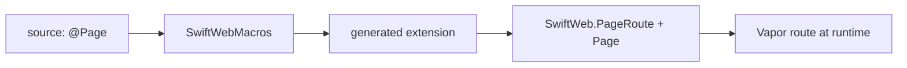

# SwiftWebMacros

SwiftWebMacros contains compile-time code generation for SwiftWeb.

It owns syntax analysis and generated Swift declarations for page types and action references. It does not perform runtime routing, request decoding, rendering, actor resolution, or server execution.

## Responsibility

| Area | Responsibility |
|---|---|
| Macro implementation | Implements the `@Page` macro using SwiftSyntax. |
| Page conformance | Generates `PageRoute` and `Page` conformance for annotated page types. |
| Route registration | Generates calls that lower page paths to Vapor route registration. |
| Parameter checks | Cross-checks path parameters with `Params` declarations where possible. |
| Metadata lowering | Generates calls to async page metadata before response encoding. |
| Server action references | Validates `@ServerAction` HTTP handler methods and generates typed action references, runtime descriptors, and internal invocation bridges. |
| Diagnostics | Emits compile-time errors for unsupported or inconsistent page declarations. |

## Boundary With SwiftWeb

## Server Interaction Macro Boundaries

SwiftWeb has two server interaction methods, and only one of them is owned by SwiftWebMacros.

| Method | Macro owner | Purpose |
|---|---|---|
| Server Action | `SwiftWebMacros.@ServerAction` | Generate a typed HTTP endpoint descriptor and an `ActionReference` for page-local HTTP work. |
| Resolvable RPC | Apple `@Resolvable` | Generate the `$Protocol.resolve(id:using:)` entrypoint for direct typed client-to-service calls. |

`@ServerAction` does not generate `$Protocol` resolvers. Apple's `@Resolvable` does not generate SwiftWeb action references.

## Server Action Lowering

`@ServerAction` belongs on an instance method inside a page or page-owned server handler. The macro validates that the function is a supported HTTP boundary and generates a typed `ActionReference` that can be exported to SwiftWebUI button/form rendering. Stored page services opt into route registration by conforming to `PageOwnedServerActions`; ordinary stored properties are not treated as server handlers.

```mermaid
flowchart LR
  A["@ServerAction(.post, 'save') func"] --> B["signature validation"]
  B --> C["ServerActionDescriptor"]
  B --> D["ActionReference<Input, Output>"]
  B --> I["generated action bridge"]
  C --> E["@Page route registration"]
  D --> F["SwiftWebUI Button/Form"]
  E --> G["Vapor HTTP route"]
  G --> I
  I --> H["handler method"]
```

The generated descriptor carries an HTTP method and path. Relative paths are resolved under the owning page route during `@Page` registration. The action method is not distributed because Server Action is ordinary HTTP, not direct RPC. The macro owns the generated bridge that lets the runtime invoke the local handler method safely.

The macro should reject unsupported signatures instead of letting invalid actions fail at runtime.

| Requirement | Reason |
|---|---|
| Function is declared inside a page, actor, or class | The runtime needs a concrete instance for route registration and typed invocation. |
| Function is not `distributed` | Server Action is an HTTP endpoint, not an Apple distributed actor RPC endpoint. |
| Attribute declares `ServerActionMethod` and path | The public contract is HTTP method + path. |
| Input is `Codable & Sendable` | Client and gateway need a stable HTTP transport contract. |
| Output is `Codable & Sendable` or `ActionResult` | Runtime needs typed result encoding. |
| Context is `ActionInvocationContext` | Action methods receive normalized request context, not raw Vapor request state. |

## Not Responsible For

| Not owned by SwiftWebMacros | Owner |
|---|---|
| Runtime route matching | Vapor / `SwiftWeb` |
| Request context storage | `SwiftWeb` |
| HTML rendering | `SwiftHTML` |
| UI components | `SwiftWebUI` |
| CLI templates and dev server | `SwiftWebCLI` |
| Runtime validation that requires a live request | `SwiftWeb` |
| Handler registration and typed invocation | `SwiftWeb` |

## Design Notes

- Macro output should be small and predictable.
- The macro should generate code that calls public SwiftWeb APIs instead of duplicating runtime logic.
- Compile-time diagnostics should catch path/parameter mismatches early.
- The macro must not maintain route manifests, route trees, or matching state.
- `@ServerAction` marks the exported HTTP handler method explicitly; no actor-level grouping macro is required.
- Page-owned handlers are registered as Vapor routes through generated `@Page` instance registration.
- Generated descriptors should carry a typed invoker instead of requiring SwiftWeb to synthesize compiler-internal distributed target names.
- Generated action references should describe HTTP method and path. They should not expose handler names, action names, target identifiers, actor IDs, or RPC metadata.
- Apple's `@Resolvable` belongs on client-visible distributed actor protocols, not on SwiftWeb `ActionReference`.
