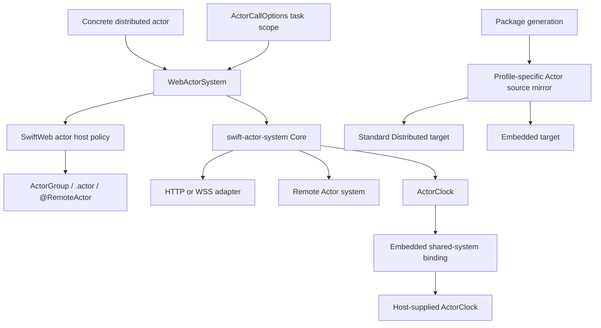
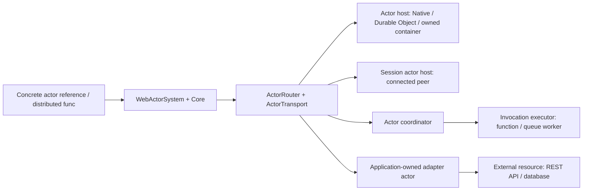
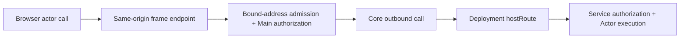

# SwiftWeb Actors

## Purpose and Scope

This module owns SwiftWeb's application-facing integration with the standalone
[swift-actor-system](https://github.com/1amageek/swift-actor-system) package.
It is a child of the [SwiftWeb package design](../../../DESIGN.md) and is the
authority for SwiftWeb's Actor connection policy, binding, hosting, and
implementation boundaries. [Actors README](README.md) is the authoring guide.
The SwiftPM target root is `Sources/SwiftWebRuntime/Actors`; this design has no
child designs.

The accepted direction preserves Swift's Distributed Actor interface across
deployment targets. A server is a place that can host actors and HTTP routes;
an actor reference identifies the domain participant being called. The
destination examples below specify adapter requirements, not shipped adapters.

## Responsibilities and Boundaries

`WebActorSystem` adapts Swift Distributed Actor requirements to the released
Actor runtime. SwiftWeb actor host types own application authorization,
activation, scene binding, and host policy. `ActorGroup`, `.actor(_:identity:)`,
and `@RemoteActor` preserve the concrete actor authoring surface.

The module does not own frame encoding, correlation, generic transport
semantics, or Embedded Actor storage; those remain in swift-actor-system. HTTP,
WebSocket, TLS, and deployment adapters own their transport and platform
boundaries.

## Related Designs

| Design | Relationship | Contract used | Summary | Cautions |
|---|---|---|---|---|
| [SwiftWeb package master](../../../DESIGN.md) | parent | Dependency and profile invariants | Composes this module into SwiftWeb | Recheck source mirroring when Actor targets change. |
| [Actor authoring guide](README.md) | used by | Concrete actor declarations and scene binding | Shows existing call sites | Examples consume this design. |
| [swift-actor-system](https://github.com/1amageek/swift-actor-system) | depends on | Core, Distributed, Embedded, generation, and build support | Owns the transport-neutral runtime | The standalone release is the only Actor source owner. |
| [Adapter contract](../../../docs/AdapterContract.md) | coordinates with | Structured service actor routes | Supplies deployment placement | A service entry does not generate a Swift protocol. |
| [Client runtime](../../SwiftWebBrowser/ClientRuntime/DESIGN.md) | coordinates with | Browser Actor HTTP byte ownership | Owns the measured JavaScript ABI copy boundary | Controlled ABI peers do not prove cloud routing. |

## Architecture



SwiftWeb owns binding and host policy at the facade boundary. The released
Actor package owns the transport-neutral runtime beneath it.

### Connection roles



| Role | Responsibility | Required distinction |
|---|---|---|
| Actor host | Owns an address's activation, isolated state, and method execution | Durable state and restart continuity are additional host/domain contracts. |
| Invocation executor | Performs admitted work for a coordinator | A function invocation or queue consumer does not independently establish Actor ownership. |
| External resource | Supplies a protocol consumed by an application-owned actor | A URL or resource ID alone establishes neither Actor isolation nor single ownership. |

An actor may be stateless. What matters is the declared identity, execution,
and failure contract, not the existence of a stored property. Ordinary HTTP
routes and Server Actions remain supported. A foreign implementation can be
an Actor peer only through a boundary that implements the generated schema,
frame protocol, authority, and observable semantics; a shared `async throws`
method spelling is insufficient.

## Contracts and Invariants

| Boundary | Guarantee |
|---|---|
| Authoring | The concrete Distributed Actor type remains the caller's interface on local and remote paths. |
| Identity | Logical actor identity is selected by Swift code; `ActorAddress` remains location-free. `SwiftWebActorRouteBindingRecord` carries placement separately. |
| Ownership | One actor address is either locally hosted or forwarded; conflicting ownership is rejected. |
| Profile projection | One actor source authored with `ActorSystem = WebActorSystem` and one schema lock produce a Native authored actor plus generated registration, and an Embedded generated client. Native `WebActorSystem` delegates registration and invocation to its `SwiftActorSystem` backend; on Embedded, `WebActorSystem` aliases the generated client's `EmbeddedActorSystem`. Actor type, method, error type, and schema fingerprint identities remain equal even though the Swift actor types differ. |
| Embedded deadline clock | `WebActorSystem.installActorClock(_:)` returns `true` after binding the platform clock for the default Embedded system before the first deadline-clock use, and `false` for a custom system whose configuration is left untouched. A deadline-free call keeps the binding window open; the first clock sleep seals it. Repeated and late installation throw typed configuration errors. |
| Call options | `ActorCallOptions.withValue(_:operation:)` scopes options to an asynchronous task. The active scope, including `.defaults` with no timeout, wins over the actor system's initializer default; nested scopes restore and parallel scopes remain isolated without mutating the shared Embedded system. |
| Failure | Actor invocation failures remain typed/observable and do not silently retry through the legacy JSON path. |
| Source ownership | SwiftWeb imports ActorSystem 0.2.x products from the resolved standalone checkout and mirrors source only from that checkout for generated WASM packages. Unreleased cross-repository development may consume an exact immutable upstream revision; revision, branch, and local-path overrides are not part of the published release graph. |

### Destination substitution contract

Changing deployment must preserve the actor type, method/schema identities,
payload/error meanings, logical identity, and the guarantees required by that
domain. Swift code selects the domain identity; deployment supplies placement
and credentials. Domain code may need a tenant, room, or job ID even though it
does not need an endpoint or artifact name.

| Requirement | Owner | Counterexample that rejects a binding |
|---|---|---|
| Address ownership | Host or platform coordinator | Two replicas independently mutate state for the same logical address. A process-local registry cannot exclude a remote owner. |
| Isolation and ordering | Actor/domain execution policy | An adapter loses updates or silently changes required operation order. Swift Actor isolation alone promises neither FIFO admission nor an atomic method across `await`. |
| Durability and activation | Host plus domain persistence policy | A successful durable operation disappears after reactivation. A memory-only host cannot substitute for a domain requiring durable state. |
| Schema compatibility | Shared generated contract and peer dispatcher | A foreign method or payload is accepted under a different schema's identity. |
| Authority | Gateway, service transport, and receiving host | A browser-selected address bypasses admission or browser credentials become service credentials. |
| Failure and retry | Core plus domain side-effect owner | A timeout is reported as proof that no effect occurred, or a payment is automatically retried without an idempotency contract. |
| Readiness and limits | Runtime startup and platform adapter | A manifest entry or resolved reference is treated as evidence of a live, authorized, compatible peer. |

Swift's [Distributed Actor isolation design](https://github.com/swiftlang/swift-evolution/blob/main/proposals/0336-distributed-actor-isolation.md)
supports location-independent call sites; it does not provide a universal
deployment or delivery policy. [Swift Actor reentrancy](https://github.com/swiftlang/swift-evolution/blob/main/proposals/0306-actors.md#actor-reentrancy)
allows interleaving at suspension points. The current SwiftWeb host's invocation
gate is a stronger policy on its locally hosted intercepted path, not a
language guarantee for direct local calls or every future adapter.

### Destination examples

The following call-site sketches describe domain contracts. Apart from the
existing Counter guide, their domain types and adapters are not shipped
samples or declarations introduced by this document. Each method belongs to a
concrete `distributed actor` using `WebActorSystem`; the caller still uses
`try await`, `.actor(Type.self, identity:)`, and `@RemoteActor`.

| Destination | Domain sample | Adapter obligation | Status and implementation gate |
|---|---|---|---|
| Separate Native SwiftWeb application | `Inventory` per warehouse | Register its `ActorGroup` in the owning application; bind the caller to its route and authenticate the hop | Existing service binding and Native HTTP boundary; prove the generated client-to-separate-application path independently. |
| Cloudflare Durable Object | `ShoppingCart` per cart | Map the logical address to the platform object and enforce the domain's state/activation contract | External adapter responsibility; this repository's Native tests do not establish Cloudflare support. |
| Cloud Run or Kubernetes | `ShoppingCart` per cart | Route to one authoritative owner using an ownership scheme with stale-owner fencing; restore required state after restart | Proposed adapter scenario; no distributed lease/directory implementation is claimed here. |
| Browser or other connected peer | `BrowserSession` per session | Bind an authenticated channel to a session identity and invalidate it on disconnect | WebSocket transport exists; generated reverse calls and transferable actor references need their own codec, authority, and lifecycle proof. |
| AWS Lambda | `ExportJob` per job | A coordinator owns durable job state and admission; Lambda performs invocation work | Proposed executor integration; ordinary Lambda execution-environment reuse is not an Actor lifetime contract. |
| SQS or another queue | `ExportJob` command delivery | Supply the contract's ordering, duplicate handling, result correlation, expiry, and recovery | Proposed integration; each queue mode must be evaluated independently. |
| External REST/SaaS | `BillingAccount` per account | An application-owned actor coordinates domain state and calls the external API with private credentials | Proposed domain adapter; the remote API remains an external resource unless it actually implements the Actor contract. |

Separate Native application:

```swift
let reservation = try await inventory.reserve(productID: productID, quantity: 2)
```

The caller selects a warehouse identity in its scene. Moving the host changes
the deployment binding, not this call or its reservation semantics.

Durable Object or owned container:

```swift
let cartSnapshot = try await cart.add(item)
```

Both hosts must meet the same cart contract. Cloud Run instances may scale
and be discarded, and their writable filesystem is temporary
([Cloud Run runtime contract](https://docs.cloud.google.com/run/docs/container-contract)).
Kubernetes StatefulSet provides Pod identity and storage association
([StatefulSet](https://kubernetes.io/docs/concepts/workloads/controllers/statefulset/)).
Neither facility by itself routes every cart to an exclusive, fenced owner.
An ownership handoff must prevent a stale owner from committing after its
replacement starts; merely recording a lease or setting instance concurrency
to one is insufficient. Durable Object lifecycle details remain owned by its
[platform contract](https://developers.cloudflare.com/durable-objects/concepts/durable-object-lifecycle/).

Connected peer:

```swift
try await room.join(session)
try await session.present(update)
```

Passing an actor reference requires supported serialization and authorized
reverse routing; these sketches are conditional on that support. Disconnect
ends the ephemeral reference's reachability. Reconnection must not silently
attach an old session reference to a different participant. Durable resumption
would be a separately specified domain contract.

Function executor or queued work:

```swift
let accepted = try await exportJob.start(request)
let current = try await exportJob.status()
let cancellation = try await exportJob.cancel()
```

Here `start` returns durable acceptance, `status` reports job state, and
`cancel` reports the job's cancellation state; acceptance is not completed
execution. This domain lifecycle also fits a long-running Native actor. It
does not require a new Service RPC API. Standard Lambda environment retention
is not guaranteed
([Lambda lifecycle](https://docs.aws.amazon.com/lambda/latest/dg/lambda-runtime-environment.html)).
SQS Standard can redeliver a message
([SQS delivery](https://docs.aws.amazon.com/AWSSimpleQueueService/latest/SQSDeveloperGuide/standard-queues-at-least-once-delivery.html)).
An Actor transport over a queue therefore needs a result path and duplicate
policy as well as delivery. Durable deduplication must cover the effect and
result's recovery boundary; `ActorCallID` alone does not make an external effect
exactly once. An event-only queue may instead remain a resource of the actor.

External resource behind an actor:

```swift
let authorization = try await billingAccount.authorize(payment)
```

The application-owned `BillingAccount` defines account identity, operation
semantics, and external idempotency. Its placement adapter hosts that actor;
the actor's resource adapter translates to the billing provider's protocol.
These are distinct responsibilities even if implemented in one package.

### Current implementation and remaining work

The earlier fixed-router limitation is no longer the current implementation.
This table describes the source baseline at SwiftWeb `0.14.0`; presence of a
test means that path is covered by the named test, not that it ran during this
documentation update.

| Current fact | Implementation and test owner | Remaining boundary |
|---|---|---|
| Exact addresses can route to independent destinations | [Binding router](SwiftWebActorBindingRouter.swift), [route tests](../../../Tests/SwiftWebTests/SwiftWebActorBindingRouterTests.swift) | The route table supplies placement, not distributed ownership or service discovery. |
| Swift selects identity and joins it to deployment templates | [Service binding](SwiftWebActorServiceBinding.swift), [reference scene](../Core/App/ActorReferenceScene.swift), [scene tests](../../../Tests/SwiftWebTests/SwiftWebActorGroupTests.swift) | A service template is selected per actor type; an injection scope selects one reference per contract. It is not a named multi-client API. |
| Browser bootstrap installs routes with a same-origin HTTP fallback | [Client system factory](../../SwiftWebBrowser/ClientRuntime/ClientRuntimeActorSystemFactory.swift), [client bootstrap](../../SwiftWebBrowser/ClientRuntime/ClientRuntimeBridge.swift) | A route requires a compatible installed transport; it does not negotiate new transports. |
| Main forwards authorized scene-bound addresses to a separate Service | [Actor host](SwiftWebActorHost.swift), [Native browser boundary test](../../../Tests/SwiftWebTests/SwiftWebServiceActorBrowserTests.swift) | Pre-encoded browser frames do not prove generated WASM-to-Service execution. |
| CLI schema 3 selects services and structured Actor bindings | [Adapter schema](../../../docs/AdapterContract.md), [lifecycle tests](../../../Tests/SwiftWebCLITests/SwiftWebLifecycleTests.swift) | Build/deploy configuration is not a universal readiness or capability protocol. |

No new `Service`, `ServiceScene`, `@ServiceClient`, or second RPC runtime is
required by this policy. Future work extends the existing host, routing,
generation, and adapter owners. Public syntax for new capabilities is not
specified until a concrete adapter needs it.

## Runtime Flows

For a bound call, Swift resolves the concrete actor reference, the SwiftWeb
facade delegates to the Actor runtime, and the selected host or transport
completes the invocation. A Service binding adds deployment-owned routing after
the identity and authorization checks; it does not alter the call site.

### Browser Service routing



Without `clientRoute`, the gateway admits only the exact scene-bound address
associated with a deployment `hostRoute`. An unbound address cannot select a
Service hop. Main authorization runs first; `trustedOnly` rejects browser
traffic by default. Core retains correlation, timeout, cancellation, and
failure ownership. The adapter authenticates the Service hop independently
of browser credentials, and the receiving host validates authority and actor
identity. A supplied `clientRoute` selects direct browser routing instead and
does not enable the same-origin gateway. Registration rejects conflicting
local and forwarding ownership before startup, independent of scene order.

On Embedded, the Cloudflare host installs its `ActorClock` binding before
rendering. The default shared system keeps that binding available through
deadline-free calls; the first deadline sleep selects the installed clock and
closes the installation window. An unavailable default sleep is terminal for
the binding window and remains an explicit `ActorClockUnavailable` failure.

An application can surround an ordinary generated call with
`ActorCallOptions.withValue(_:operation:)`. The Embedded facade reads that
task-local value, encodes its timeout in the outbound invocation frame, and
uses the host-installed clock for the caller-side deadline. Scope restoration
does not reinterpret the call's typed application, system, or cancellation
failure.

Generated WASM clients receive source projections for the active profile. The
standard browser flow is separately validated by the real counter E2E; the
Embedded Actor runtime and the native Service browser boundary are distinct
gates.

## State, Ownership, and Lifecycle

SwiftWeb host policy owns actor admission, activation, passivation, and scene
bindings. swift-actor-system owns invocation correlation, timeout,
cancellation, transport lifecycle, and profile runtime storage. Generated
projections are replaceable build inputs and never become a second runtime
owner.

| State | Owner | Isolation | Read and mutation | Release |
|---|---|---|---|---|
| `SwiftWebActorClockBinding.State` | One `SwiftWebActorClockBinding` reference held by the shared Embedded system holder | One `Synchronization.Mutex<State>` on every target | `install` and the first `sleep` transition use `withLock`; the selected clock is retained locally before awaiting outside the lock | The shared holder owns the binding for its lifetime; custom system configuration clocks are not replaced |
| Active call options | Current task context in swift-actor-system | Immutable `TaskLocal` dynamic scope on every supported target | Each facade selects the active scoped value or its immutable initializer default before invoking Core | Normal return, thrown error, cancellation, and nested-scope exit restore the predecessor automatically |
| Address routes | `SwiftWebActorBindingRouter` held by the runtime installation | Common `Mutex` on Native, standard WASM, and Embedded | Bootstrap replacement and scene registration; routing reads a copied route outside the lock | Runtime installation lifetime; no ownership of the remote actor |
| Forwarding addresses | `SwiftWebActorHost` | Actor isolation | Registration before configuration seal; admission lookup | Cleared after shutdown drains; no Embedded inbound HTTP host is claimed |

`@RemoteActor` resolves in the current binding context; it is not a stored
connection. Missing binding/context is a programmer error and traps. Remote
communication failures are thrown by the distributed call. Resolve a reference
inside its bound handler before passing it to work that lacks that context.

`AppRuntime` owns the facade's application lifetime. `WebActorSystem` seals host
configuration before starting Core. Shutdown stops host admission, closes Core
transports and pending calls, then passivates/releases host actors. The
termination ticket reports persistence failures after best-effort cleanup.
Remote references neither own a remote process nor promise remote durability.

## Failure, Concurrency, and Constraints

Actor calls cross an explicit asynchronous boundary and preserve the runtime's
correlation, cancellation, and shutdown contracts. Shared state remains behind
the runtime's common synchronization contract on Native, standard WASM, and
Embedded targets. A task-scoped call policy is not shared mutable system state;
it must not leak across parallel requests or survive failure/cancellation.
Browser and Service gates have bounded request and process lifetimes. Cloud
deployment is outside this release's verified runtime scope.

Reference resolution, transport startup, activation readiness, and domain
readiness are different observations. A lazy actor can activate on its first
call. Failure during startup/activation or an unavailable peer must remain an
observable failure; a successful readiness probe cannot promise future
availability. The adapter owns any probe and its deadline, while Core owns
call deadlines and termination. Limits are selected by these owners and
validated for the destination; this policy sets no arbitrary operational values.

Cancellation is cooperative and does not roll back an already committed
effect. Timeout or link loss can leave the result unknown. Retry requires the
operation's explicit idempotency/recovery policy, especially across process
restart or external resources. Stronger FIFO, non-reentrancy, transactions, or
durability must be stated and tested as domain/host requirements.

### Legacy compatibility

`LegacyWebActorSystem`, `@Resolvable`, `@ResolvableActor`, `WebActorTransport`,
and JSON envelopes remain deprecated paths behind the explicit `LegacyActors`
trait. `Actors` selects the binary runtime; `ActorSystemCompatibility` owns the
old ActorRuntime dependency. Endpoints/media types separate legacy traffic, and
binary-call failures never fall back to legacy calls or Server Actions. Removal
belongs to a separately reviewed compatibility change after remaining callers
have migrated; this policy does not remove that surface.

## Verification and Change Impact

The module's focused evidence includes
[`SwiftWebActorClockBindingTests`](../../../Tests/SwiftWebTests/SwiftWebActorClockBindingTests.swift),
`SwiftWebActorGroupTests`,
`SwiftWebActorHostTests`, `ClientRuntimeConcurrencyTests`,
`SwiftWebHTTPServerHostTests`, and `SwiftWebServiceActorBrowserTests`. The
standalone Actor package's own tests establish its lower-level contracts. The
parent package's required Chromium and WebKit `counter-wasm` gate proves
generated standard-WASM browser execution and a real Actor-backed state
mutation in both engines; generated Embedded compile/link and the standalone
Embedded runtime validation do not claim full Embedded browser or cloud E2E.
A generated Cloudflare page-worker deadline gate must originate in an ordinary
generated Embedded actor call under `ActorCallOptions.withValue`; injecting a deadline
only at a Native service's inbound Core boundary does not prove this path.

For a new destination adapter, first close the generated-client-to-separate-host
gap with the existing binding and schema path. Then prove the chosen platform's
identity/authority, success/application failure, timeout/cancellation, and
startup/shutdown behavior. Replicated hosts additionally require concurrent
same-address and stale-owner handoff tests; durable hosts require crash/restart
evidence; peers require disconnect/reconnect evidence; queue executors require
duplicate-delivery and effect/result recovery evidence. Unsupported required
semantics must fail configuration or activation explicitly.

Native HTTP integration is the reference path. Durable Object and owned-container
adapters must satisfy their own platform gates before function/queue execution
is generalized. These are implementation acceptance criteria, not evidence that
all destination adapters exist or are ready to ship.

The retained 1 MiB probes in `SwiftWebHostActorBinaryChannelTests` and
`SwiftWebHTTPServerHostTests` passed 37 tests across two suites. Their ownership
claims remain local to these unchanged paths:

| Boundary | Retained behavior and required-copy reason |
|---|---|
| Actor frame codec | Encoded frame storage is reserved once and filled through scoped payload borrows; equality and frame/payload limits remain checked. |
| Native binary channel and NIO WebSocket adapter | Owner identity and readable ranges survive slicing/forwarding without whole-payload array materialization. |
| Native HTTP request and response | Public `[UInt8]` collection/response boundaries intentionally materialize owned bytes; the real HTTP 1 MiB echo preserves equality. |
| HTTPS/WSS | Real encrypted 1 MiB echo preserves content; TLS encryption, decryption, and socket/client copies are not eliminated by owner/range reuse. |

Browser transport copy changes do not alter these Native owners. Their retained
evidence is complemented, not replaced, by the ClientRuntime ABI measurements.

Changes to the facade or host policy require rechecking this contract and the
parent package design. Changes to the standalone Actor package are reviewed in
that repository before SwiftWeb consumes a new source revision. An unreleased
cross-repository revision is pinned by commit until a future semver release
can replace it.
