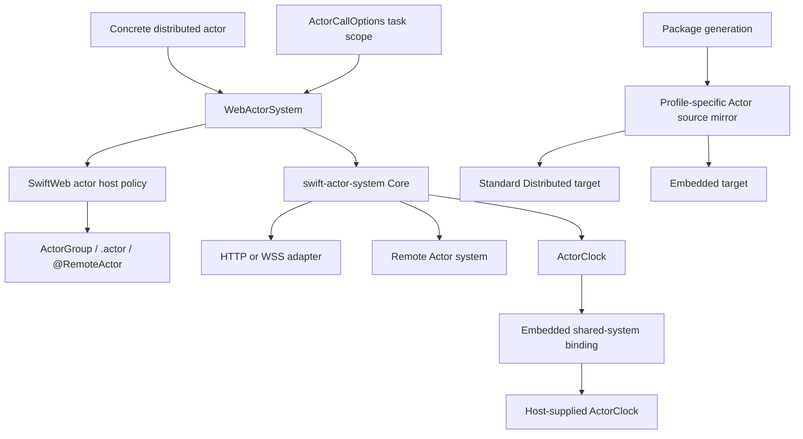

# SwiftWeb Actors

## Purpose and Scope

This module owns SwiftWeb's application-facing integration with the standalone
[swift-actor-system](https://github.com/1amageek/swift-actor-system) package.
It is a child of the [SwiftWeb package design](../../../DESIGN.md). The detailed
runtime contract remains in [Actors README](README.md); this document records
ownership and change impact without copying that contract.

## Responsibilities and Boundaries

`WebActorSystem` adapts Swift Distributed Actor requirements to the released
Actor runtime. SwiftWeb actor host types own application authorization,
activation, scene binding, and host policy. `ActorGroup`, `.actor(_:identity:)`,
and `@RemoteActor` preserve the concrete actor authoring surface.

The module does not own frame encoding, correlation, generic transport
semantics, or Embedded Actor storage; those remain in swift-actor-system. HTTP,
WebSocket, TLS, and deployment adapters own their transport and platform
boundaries.

## Related Designs

| Design | Relationship | Contract used | Cautions |
|---|---|---|---|
| [SwiftWeb package master](../../../DESIGN.md) | parent | Released dependency and profile invariants | Recheck generated source mirroring when Actor targets change. |
| [Actor runtime contract](README.md) | module authority | Concrete actor authoring, host policy, routing, and verification | This design indexes it; it does not duplicate its runtime rules. |
| [swift-actor-system](https://github.com/1amageek/swift-actor-system) | depends on | Core, Distributed, Embedded, generation, and build-support products | The standalone release is the only Actor source owner. |
| [Adapter contract](../../../docs/AdapterContract.md) | used by service binding | Structured service actor routes and deployment ownership | A service entry remains a build/deploy unit, not a generated Swift protocol. |
| [Client runtime](../../SwiftWebBrowser/ClientRuntime/DESIGN.md) | coordinates with | Browser Actor HTTP byte ownership | Owns the measured JavaScript ABI copy boundary. | Controlled ABI peers do not prove Native HTTP/WSS or cloud routing. |

## Architecture

SwiftWeb owns binding and host policy at the facade boundary. The released
Actor package owns the transport-neutral runtime beneath it.

## Contracts and Invariants

| Boundary | Guarantee |
|---|---|
| Authoring | The concrete Distributed Actor type remains the caller's interface on local and remote paths. |
| Identity | Logical actor identity is selected by Swift code; transports and deployment routes do not replace it. |
| Ownership | One actor address is either locally hosted or forwarded; conflicting ownership is rejected. |
| Profile projection | One actor source authored with `ActorSystem = WebActorSystem` and one schema lock produce a Native authored actor plus generated registration, and an Embedded generated client. Native `WebActorSystem` delegates registration and invocation to its `SwiftActorSystem` backend; on Embedded, `WebActorSystem` aliases the generated client's `EmbeddedActorSystem`. Actor type, method, error type, and schema fingerprint identities remain equal even though the Swift actor types differ. |
| Embedded deadline clock | `WebActorSystem.installActorClock(_:)` returns `true` after binding the platform clock for the default Embedded system before the first deadline-clock use, and `false` for a custom system whose configuration is left untouched. A deadline-free call keeps the binding window open; the first clock sleep seals it. Repeated and late installation throw typed configuration errors. |
| Call options | `ActorCallOptions.withValue(_:operation:)` scopes options to an asynchronous task. The active scope, including `.defaults` with no timeout, wins over the actor system's initializer default; nested scopes restore and parallel scopes remain isolated without mutating the shared Embedded system. |
| Failure | Actor invocation failures remain typed/observable and do not silently retry through the legacy JSON path. |
| Source ownership | SwiftWeb imports ActorSystem 0.2.x products from the resolved standalone checkout and mirrors source only from that checkout for generated WASM packages. Unreleased cross-repository development may consume an exact immutable upstream revision; revision, branch, and local-path overrides are not part of the published release graph. |

## Runtime Flows

For a bound call, Swift resolves the concrete actor reference, the SwiftWeb
facade delegates to the Actor runtime, and the selected host or transport
completes the invocation. A Service binding adds deployment-owned routing after
the identity and authorization checks; it does not alter the call site.

On Embedded, the Cloudflare host installs its `ActorClock` binding before
rendering. The default shared system keeps that binding available through
deadline-free calls; the first deadline sleep selects the installed clock and
closes the installation window. An unavailable default sleep is terminal for
the binding window and remains an explicit `ActorClockUnavailable` failure.

An application can surround an ordinary generated call with
`ActorCallOptions.withValue(_:operation:)`. The Embedded facade reads that
task-local value, encodes its timeout in the outbound invocation frame, and
uses the host-installed clock for the caller-side deadline. Scope restoration
does not reinterpret the call's typed application, system, or cancellation
failure.

Generated WASM clients receive source projections for the active profile. The
standard browser flow is separately validated by the real counter E2E; the
Embedded Actor runtime and the native Service browser boundary are distinct
gates.

## State, Ownership, and Lifecycle

SwiftWeb host policy owns actor admission, activation, passivation, and scene
bindings. swift-actor-system owns invocation correlation, timeout,
cancellation, transport lifecycle, and profile runtime storage. Generated
projections are replaceable build inputs and never become a second runtime
owner.

| State | Owner | Isolation | Read and mutation | Release |
|---|---|---|---|---|
| `SwiftWebActorClockBinding.State` | One `SwiftWebActorClockBinding` reference held by the shared Embedded system holder | One `Synchronization.Mutex<State>` on every target | `install` and the first `sleep` transition use `withLock`; the selected clock is retained locally before awaiting outside the lock | The shared holder owns the binding for its lifetime; custom system configuration clocks are not replaced |
| Active call options | Current task context in swift-actor-system | Immutable `TaskLocal` dynamic scope on every supported target | Each facade selects the active scoped value or its immutable initializer default before invoking Core | Normal return, thrown error, cancellation, and nested-scope exit restore the predecessor automatically |

## Failure, Concurrency, and Constraints

Actor calls cross an explicit asynchronous boundary and preserve the runtime's
correlation, cancellation, and shutdown contracts. Shared state remains behind
the runtime's common synchronization contract on Native, standard WASM, and
Embedded targets. A task-scoped call policy is not shared mutable system state;
it must not leak across parallel requests or survive failure/cancellation.
Browser and Service gates have bounded request and process lifetimes. Cloud
deployment is outside this release's verified runtime scope.

## Verification and Change Impact

The module's focused evidence includes
[`SwiftWebActorClockBindingTests`](../../../Tests/SwiftWebTests/SwiftWebActorClockBindingTests.swift),
`SwiftWebActorGroupTests`,
`SwiftWebActorHostTests`, `ClientRuntimeConcurrencyTests`,
`SwiftWebHTTPServerHostTests`, and `SwiftWebServiceActorBrowserTests`. The
standalone Actor package's own tests establish its lower-level contracts. The
parent package's required Chromium and WebKit `counter-wasm` gate proves
generated standard-WASM browser execution and a real Actor-backed state
mutation in both engines; generated Embedded compile/link and the standalone
Embedded runtime validation do not claim full Embedded browser or cloud E2E.
A generated Cloudflare page-worker deadline gate must originate in an ordinary
generated Embedded actor call under `ActorCallOptions.withValue`; injecting a deadline
only at a Native service's inbound Core boundary does not prove this path.

The retained 1 MiB probes in `SwiftWebHostActorBinaryChannelTests` and
`SwiftWebHTTPServerHostTests` passed 37 tests across two suites. Their ownership
claims remain local to these unchanged paths:

| Boundary | Retained behavior and required-copy reason |
|---|---|
| Actor frame codec | Encoded frame storage is reserved once and filled through scoped payload borrows; equality and frame/payload limits remain checked. |
| Native binary channel and NIO WebSocket adapter | Owner identity and readable ranges survive slicing/forwarding without whole-payload array materialization. |
| Native HTTP request and response | Public `[UInt8]` collection/response boundaries intentionally materialize owned bytes; the real HTTP 1 MiB echo preserves equality. |
| HTTPS/WSS | Real encrypted 1 MiB echo preserves content; TLS encryption, decryption, and socket/client copies are not eliminated by owner/range reuse. |

Browser transport copy changes do not alter these Native owners. Their retained
evidence is complemented, not replaced, by the ClientRuntime ABI measurements.

Changes to the facade or host policy require rechecking this contract and the
parent package design. Changes to the standalone Actor package are reviewed in
that repository before SwiftWeb consumes a new source revision. An unreleased
cross-repository revision is pinned by commit until a future semver release
can replace it.
