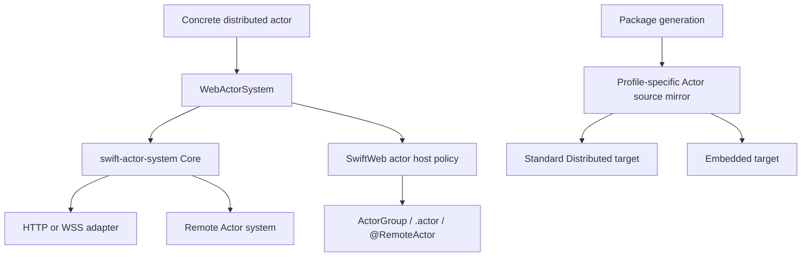

# SwiftWeb Actors

## Purpose and Scope

This module owns SwiftWeb's application-facing integration with the standalone
[swift-actor-system](https://github.com/1amageek/swift-actor-system) package.
It is a child of the [SwiftWeb package design](../../../DESIGN.md). The detailed
runtime contract remains in [Actors README](README.md); this document records
ownership and change impact without copying that contract.

## Responsibilities and Boundaries

`WebActorSystem` adapts Swift Distributed Actor requirements to the released
Actor runtime. SwiftWeb actor host types own application authorization,
activation, scene binding, and host policy. `ActorGroup`, `.actor(_:identity:)`,
and `@RemoteActor` preserve the concrete actor authoring surface.

The module does not own frame encoding, correlation, generic transport
semantics, or Embedded Actor storage; those remain in swift-actor-system. HTTP,
WebSocket, TLS, and deployment adapters own their transport and platform
boundaries.

## Related Designs

| Design | Relationship | Contract used | Cautions |
|---|---|---|---|
| [SwiftWeb package master](../../../DESIGN.md) | parent | Released dependency and profile invariants | Recheck generated source mirroring when Actor targets change. |
| [Actor runtime contract](README.md) | module authority | Concrete actor authoring, host policy, routing, and verification | This design indexes it; it does not duplicate its runtime rules. |
| [swift-actor-system](https://github.com/1amageek/swift-actor-system) | depends on | Core, Distributed, Embedded, generation, and build-support products | The standalone release is the only Actor source owner. |
| [Adapter contract](../../../docs/AdapterContract.md) | used by service binding | Structured service actor routes and deployment ownership | A service entry remains a build/deploy unit, not a generated Swift protocol. |

## Architecture

SwiftWeb owns binding and host policy at the facade boundary. The released
Actor package owns the transport-neutral runtime beneath it.

## Contracts and Invariants

| Boundary | Guarantee |
|---|---|
| Authoring | The concrete Distributed Actor type remains the caller's interface on local and remote paths. |
| Identity | Logical actor identity is selected by Swift code; transports and deployment routes do not replace it. |
| Ownership | One actor address is either locally hosted or forwarded; conflicting ownership is rejected. |
| Profile projection | Generated standard clients use Core plus Distributed; Embedded clients use Core plus Embedded. |
| Failure | Actor invocation failures remain typed/observable and do not silently retry through the legacy JSON path. |
| Source ownership | SwiftWeb imports released Actor products and mirrors source only from the resolved standalone checkout for generated WASM packages. |

## Runtime Flows

For a bound call, Swift resolves the concrete actor reference, the SwiftWeb
facade delegates to the Actor runtime, and the selected host or transport
completes the invocation. A Service binding adds deployment-owned routing after
the identity and authorization checks; it does not alter the call site.

Generated WASM clients receive source projections for the active profile. The
standard browser flow is separately validated by the real counter E2E; the
Embedded Actor runtime and the native Service browser boundary are distinct
gates.

## State, Ownership, and Lifecycle

SwiftWeb host policy owns actor admission, activation, passivation, and scene
bindings. swift-actor-system owns invocation correlation, timeout,
cancellation, transport lifecycle, and profile runtime storage. Generated
projections are replaceable build inputs and never become a second runtime
owner.

## Failure, Concurrency, and Constraints

Actor calls cross an explicit asynchronous boundary and preserve the runtime's
correlation, cancellation, and shutdown contracts. Shared state remains behind
the runtime's common synchronization contract on Native, standard WASM, and
Embedded targets. Browser and Service gates have bounded request and process
lifetimes. Cloud deployment is outside this release's verified runtime scope.

## Verification and Change Impact

The module's focused evidence is `SwiftWebActorGroupTests`,
`SwiftWebActorHostTests`, `ClientRuntimeConcurrencyTests`,
`SwiftWebHTTPServerHostTests`, and `SwiftWebServiceActorBrowserTests`. The
standalone Actor package's own tests establish its lower-level contracts. The
real `counter-wasm` gate proves generated standard-WASM browser execution and
state mutation; generated Embedded compile/link and the standalone Embedded
runtime validation do not claim full Embedded browser or cloud E2E.

Changes to the facade or host policy require rechecking this contract and the
parent package design. Changes to the standalone Actor package are reviewed and
released in that repository before SwiftWeb consumes a new version.
