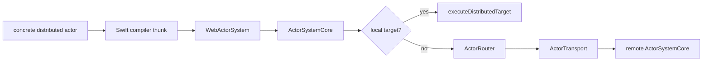
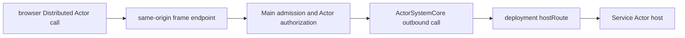

# SwiftWebActors

SwiftWebActors is SwiftWeb's application-facing integration for the
transport-neutral actor runtime in `Packages/swift-actor-system`.

The concrete `distributed actor` declaration is the actor contract on Native
and standard WASM. Embedded WASM consumes a generated semantic twin with the
same actor identity, method surface, schema, payload, and error model. Actor
code never selects HTTP, WebSocket, or another transport.

An Actor connection is used only for an identity-scoped destination that
satisfies Actor ownership and isolation. Ordinary remote servers and external
APIs remain Server connections. A deployed Service application may expose
either model or both; its deployment entry does not create an Actor contract.

## Responsibility

| Area | Responsibility |
|---|---|
| Compiler-facing facade | `WebActorSystem` delegates Swift Distributed Actor requirements to `SwiftActorSystem`. |
| Common runtime | `ActorSystemCore` owns identity, frames, routing, correlation, timeout, cancellation, and lifecycle. |
| Host policy | `SwiftWebActorHost` owns authorization, virtual activation, persistence, passivation, reminders, and remote state. |
| Transport adapters | SwiftWeb HTTP and WebSocket adapters move bounded binary actor frames and authenticated metadata. |
| Scene binding | `ActorGroup`, `.actor(...)`, and `@RemoteActor` bind concrete actor references without exposing transport handles. |
| Service binding | Deployment-generated route templates are combined with the logical identity from `.actor(Type.self, identity:)`. |
| Embedded projection | Generated actor twins use `EmbeddedActorSystem` without importing `Distributed`, `Codable`, or ActorRuntime. |
| Compatibility | `LegacyWebActorSystem` and legacy JSON envelopes remain explicit deprecated migration paths. |

## Runtime Flow



The portable frame and payload formats end at `ActorTransport`. HTTP,
WebSocket, UART, BLE, and application-defined links do not become actor APIs.
Browser-originated request/reply calls use the same-origin HTTP frame transport
by default. WebSocket remains a separate transport capability for bidirectional
connections; neither choice changes the concrete Distributed Actor call
surface.

## Browser Service Routing

When the selected actor is hosted by another Service and the deployment does
not supply a `clientRoute`, the same-origin frame endpoint is the browser
gateway for that exact scene-bound actor address:



The gateway forwards only an address produced by `.actor(Type.self,
identity:)` that resolved to a deployment `hostRoute` with no `clientRoute`.
An unbound address is not a forwarding destination. Main authorization and
host policy run before the Service hop; the default `trustedOnly` policy still
rejects browser traffic. Forwarding uses Core's normal correlation, timeout,
cancellation, failure, and lifecycle path. It does not copy browser
credentials into Service authority: the deployment adapter continues to own
authentication of the Service hop, while the Service validates its hosted
actor identity. A `clientRoute` remains a direct browser route and does not
enable this same-origin gateway. One address cannot be both locally hosted and
forwarded; scene registration rejects that ownership conflict before the actor
system starts, independent of scene order.

| Gateway state | Owner and access | Native / standard WASM | Embedded WASM |
|---|---|---|---|
| Execution claim | `ActorInvocationExecutionState.claim()`; retained by the invocation | `Mutex<Bool>` | The same `Mutex<Bool>` |
| Forwarding addresses | `SwiftWebActorHost`; pre-seal registration, isolated lookup, cleared after shutdown drains | Actor-isolated `Set<ActorAddress>` | No inbound HTTP host is provided |

See [Verification](#verification) for the evidence owned by each boundary.

## Authoring Model

An application declares one concrete actor:

```swift
import Distributed
import SwiftWeb

public distributed actor Counter {
    public typealias ActorSystem = WebActorSystem

    private var value = 0

    public distributed func increment(by amount: Int) async throws -> Int {
        value += amount
        return value
    }
}
```

Direct resolution and invocation retain the Distributed Actor surface:

```swift
let counter = try Counter.resolve(id: address, using: actorSystem)
let value = try await counter.increment(by: 1)
```

SwiftWeb can inject that same concrete reference:

```swift
public struct CounterClient: ClientComponent {
    @RemoteActor
    private var counter: Counter

    public func increment() async throws -> Int {
        try await counter.increment(by: 1)
    }
}
```

An application binds an actor hosted by another Service application without a
wrapper scene or service proxy:

```swift
CounterPage()
    .actor(Counter.self, identity: "primary")
```

The modifier is available on both `PageRoute` and `Scene`. The project Service
declaration names `Counter` as a concrete contract, while the deployment
adapter supplies a structured route template. Neither manifest owns the
logical identity.

The application that hosts the actor registers its construction policy:

```swift
ActorGroup { actorSystem in
    Counter(actorSystem: actorSystem)
}
```

When moving that actor to a Service, move its hosting registration out of the
primary application and into the Service application. The caller keeps its
`.actor` modifier and `@RemoteActor` property. Configure authorization on the
host and gateway for the intended callers; registration does not grant access.

`@RemoteActor` is a context-bound accessor, not a stored connection. A missing
binding or access outside a binding context is a programmer error and traps;
communication failures from the distributed method are thrown. Resolve the
reference within the bound handler before handing it to work that does not
inherit that context. See [ClientCounter](../../../Examples/CounterApp/Sources/CounterApp/ClientCounter.swift)
for asynchronous event handling and error display.

The actor type receives generated `ActorSystemReference` metadata. Applications
do not author a service protocol, contract annotation, implementation
annotation, method ID, wire layout, or transport binding.

## SwiftWeb Host Boundary

`WebActorSystem` is the facade owner that composes Core with SwiftWeb-specific
host policy:

```text
AppRuntime
└── WebActorSystem
    ├── SwiftActorSystem
    │   └── ActorSystemCore
    └── SwiftWebActorHost
        ├── authorization and activation
        ├── persistence and passivation
        ├── reminders
        └── remote state
```

`AppRuntime` owns only the facade's application lifetime. `WebActorSystem`
seals host configuration before starting Core. During shutdown it stops host
admission, shuts down Core transports and pending calls, then passivates and
releases host actors. Its termination ticket reports persistence failures only
after best-effort cleanup has completed.

## Difference From Server Actions

| Method | Caller surface | Runtime boundary |
|---|---|---|
| Distributed actor call | `try await counter.increment(by: 1)` | Binary actor frame through `ActorSystemCore` and `ActorTransport` |
| Server Action | `Button` or form action | Page-local typed HTTP endpoint and `ActionReference` |

Server Actions are not actor stubs. Distributed actor calls do not fall back to
Server Actions or to the legacy JSON actor endpoint.

Actor connections require identity, ownership, and isolation. Destinations
without those properties remain Server connections and do not enter this
runtime.

## Legacy Compatibility

The deprecated `@Resolvable` protocol, `@ResolvableActor`,
`LegacyWebActorSystem`, `WebActorTransport`, and the JSON invocation envelope
path are compiled only with the explicit `LegacyActors` trait. `Actors` alone
links only the binary runtime; only `ActorSystemCompatibility` imports the old
`ActorRuntime` module. Legacy and binary traffic use separate endpoints or
media types. Failure on the concrete actor path never retries through the
legacy path.

## Verification

| Evidence | What it checks | Boundary |
|---|---|---|
| [Core execution tests](../../../Packages/swift-actor-system/Tests/ActorSystemCoreTests/ActorSystemCoreBehaviorTests.swift) | Local execution and forwarding share an exactly-once claim; missing forwarding capability fails | Core behavior, not browser integration |
| [Actor host tests](../../../Tests/SwiftWebTests/SwiftWebActorHostTests.swift) and [Scene binding tests](../../../Tests/SwiftWebTests/SwiftWebActorGroupTests.swift) | Exact-address admission, authorization, ownership conflicts, direct-route isolation, timeout, cancellation, failure, and shutdown | Native host and in-process transport fixtures |
| [Service Actor browser test](../../../Tests/SwiftWebTests/SwiftWebServiceActorBrowserTests.swift) | Chromium calls Main's real HTTP endpoint; only the authorized, bound call reaches an Actor on a separate Service host | Two native HTTP hosts; pre-encoded browser frames, not generated Swift-WASM calls |
| [CounterApp development gate](../../../Tests/BrowserE2E/counter-wasm-runtime-e2e.mjs) | Swift-WASM events, actor calls, state, Server Actions, and development updates | The Actor is hosted in the same application |

Follow the [browser test runbook](../../../Tests/BrowserE2E/README.md#service-actor-http-boundary)
for prerequisites and commands. These gates do not establish a complete
generated Swift-WASM-to-separate-Service deployment or Embedded runtime E2E.

## Not Responsible For

| Not owned by SwiftWebActors | Owner |
|---|---|
| Actor schema scanning and profile source generation | `ActorSystemGeneration` and SwiftWeb package generation |
| HTTP listener and RFC 6455 implementation | SwiftWeb host adapters |
| Page routing and rendering | `SwiftWebCore` and `SwiftHTML` |
| Component state and DOM patching | `SwiftWebUIRuntime` |
| Board-specific UART, BLE, TCP, ISR, or DMA adaptation | Deployment-provided `ActorTransport` |

This implementation-adjacent document and the executable actor tests are the
authoritative runtime contract.
