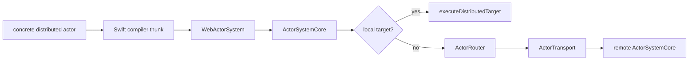

# SwiftWebActors

SwiftWebActors is SwiftWeb's application-facing integration for the
transport-neutral actor runtime in `Packages/swift-actor-system`.

The concrete `distributed actor` declaration is the actor contract on Native
and standard WASM. Embedded WASM consumes a generated semantic twin with the
same actor identity, method surface, schema, payload, and error model. Actor
code never selects HTTP, WebSocket, or another transport.

## Responsibility

| Area | Responsibility |
|---|---|
| Compiler-facing facade | `WebActorSystem` delegates Swift Distributed Actor requirements to `SwiftActorSystem`. |
| Common runtime | `ActorSystemCore` owns identity, frames, routing, correlation, timeout, cancellation, and lifecycle. |
| Host policy | `SwiftWebActorHost` owns authorization, virtual activation, persistence, passivation, reminders, and remote state. |
| Transport adapters | SwiftWeb HTTP and WebSocket adapters move bounded binary actor frames and authenticated metadata. |
| Scene binding | `ActorGroup`, `.actor(...)`, and `@RemoteActor` bind concrete actor references without exposing transport handles. |
| Embedded projection | Generated actor twins use `EmbeddedActorSystem` without importing `Distributed`, `Codable`, or ActorRuntime. |
| Compatibility | `LegacyWebActorSystem` and legacy JSON envelopes remain explicit deprecated migration paths. |

## Runtime Flow



The portable frame and payload formats end at `ActorTransport`. HTTP,
WebSocket, UART, BLE, and application-defined links do not become actor APIs.

## Authoring Model

An application declares one concrete actor:

```swift
public distributed actor Counter {
    public typealias ActorSystem = WebActorSystem

    private var value = 0

    public distributed func increment(by amount: Int) async throws -> Int {
        value += amount
        return value
    }
}
```

Direct resolution and invocation retain the Distributed Actor surface:

```swift
let counter = try Counter.resolve(id: address, using: actorSystem)
let value = try await counter.increment(by: 1)
```

SwiftWeb can inject that same concrete reference:

```swift
public struct CounterClient: ClientComponent {
    @RemoteActor
    private var counter: Counter

    public func increment() async throws -> Int {
        try await counter.increment(by: 1)
    }
}
```

The actor type receives generated `ActorSystemReference` metadata. Applications
do not author a service protocol, contract annotation, implementation
annotation, method ID, wire layout, or transport binding.

## SwiftWeb Host Boundary

`WebActorSystem` is the facade owner that composes Core with SwiftWeb-specific
host policy:

```text
AppRuntime
└── WebActorSystem
    ├── SwiftActorSystem
    │   └── ActorSystemCore
    └── SwiftWebActorHost
        ├── authorization and activation
        ├── persistence and passivation
        ├── reminders
        └── remote state
```

`AppRuntime` owns only the facade's application lifetime. `WebActorSystem`
seals host configuration before starting Core. During shutdown it stops host
admission, shuts down Core transports and pending calls, then passivates and
releases host actors. Its termination ticket reports persistence failures only
after best-effort cleanup has completed.

## Difference From Server Actions

| Method | Caller surface | Runtime boundary |
|---|---|---|
| Distributed actor call | `try await counter.increment(by: 1)` | Binary actor frame through `ActorSystemCore` and `ActorTransport` |
| Server Action | `Button` or form action | Page-local typed HTTP endpoint and `ActionReference` |

Server Actions are not actor stubs. Distributed actor calls do not fall back to
Server Actions or to the legacy JSON actor endpoint.

## Legacy Compatibility

The deprecated `@Resolvable` protocol, `@ResolvableActor`,
`LegacyWebActorSystem`, `WebActorTransport`, and the JSON invocation envelope
path are compiled only with the explicit `LegacyActors` trait. `Actors` alone
links only the binary runtime; only `ActorSystemCompatibility` imports the old
`ActorRuntime` module. Legacy and binary traffic use separate endpoints or
media types. Failure on the concrete actor path never retries through the
legacy path.

## Not Responsible For

| Not owned by SwiftWebActors | Owner |
|---|---|
| Actor schema scanning and profile source generation | `ActorSystemGeneration` and SwiftWeb package generation |
| HTTP listener and RFC 6455 implementation | SwiftWeb host adapters |
| Page routing and rendering | `SwiftWebCore` and `SwiftHTML` |
| Component state and DOM patching | `SwiftWebUIRuntime` |
| Board-specific UART, BLE, TCP, ISR, or DMA adaptation | Deployment-provided `ActorTransport` |

The authoritative architecture and completion gates are recorded in
[`docs/SwiftActorSystemDesign.md`](../../../docs/SwiftActorSystemDesign.md).
