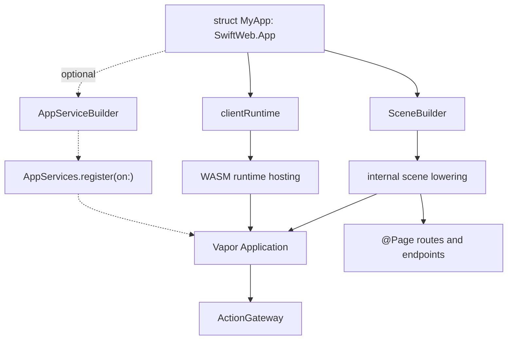
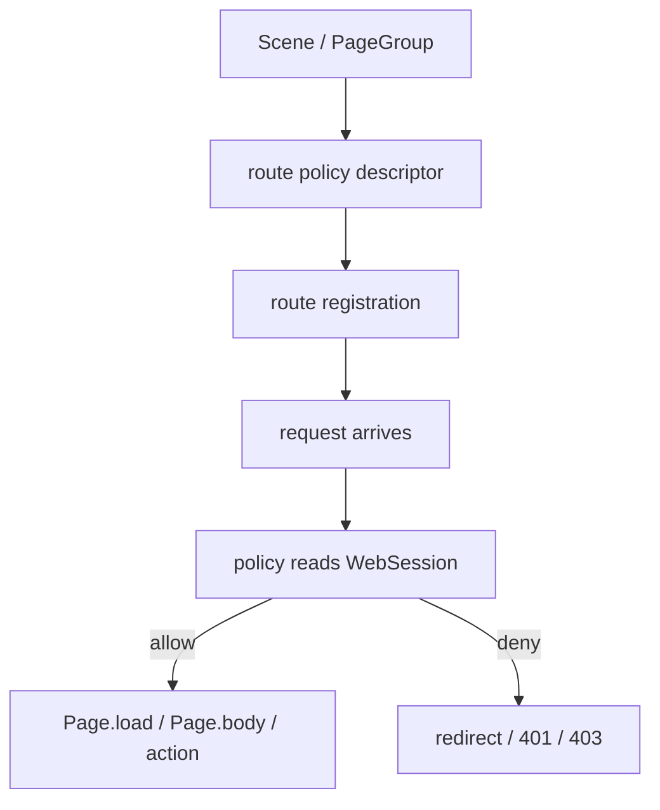
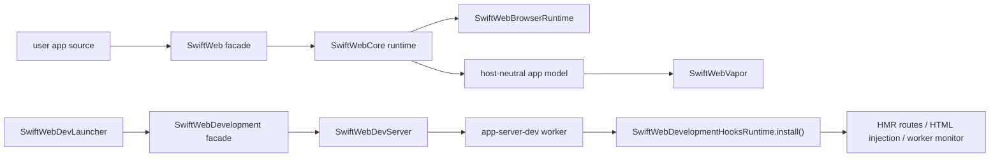
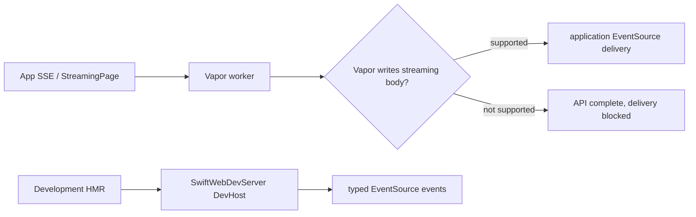
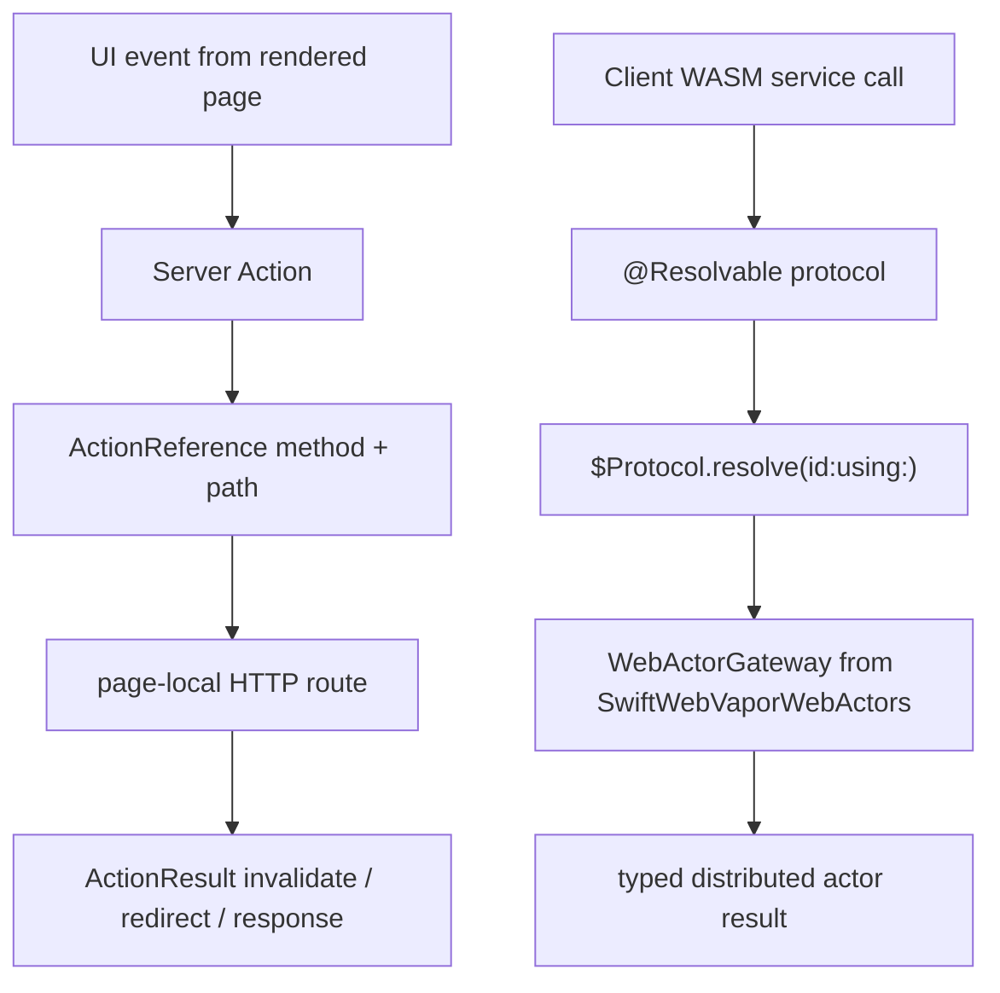
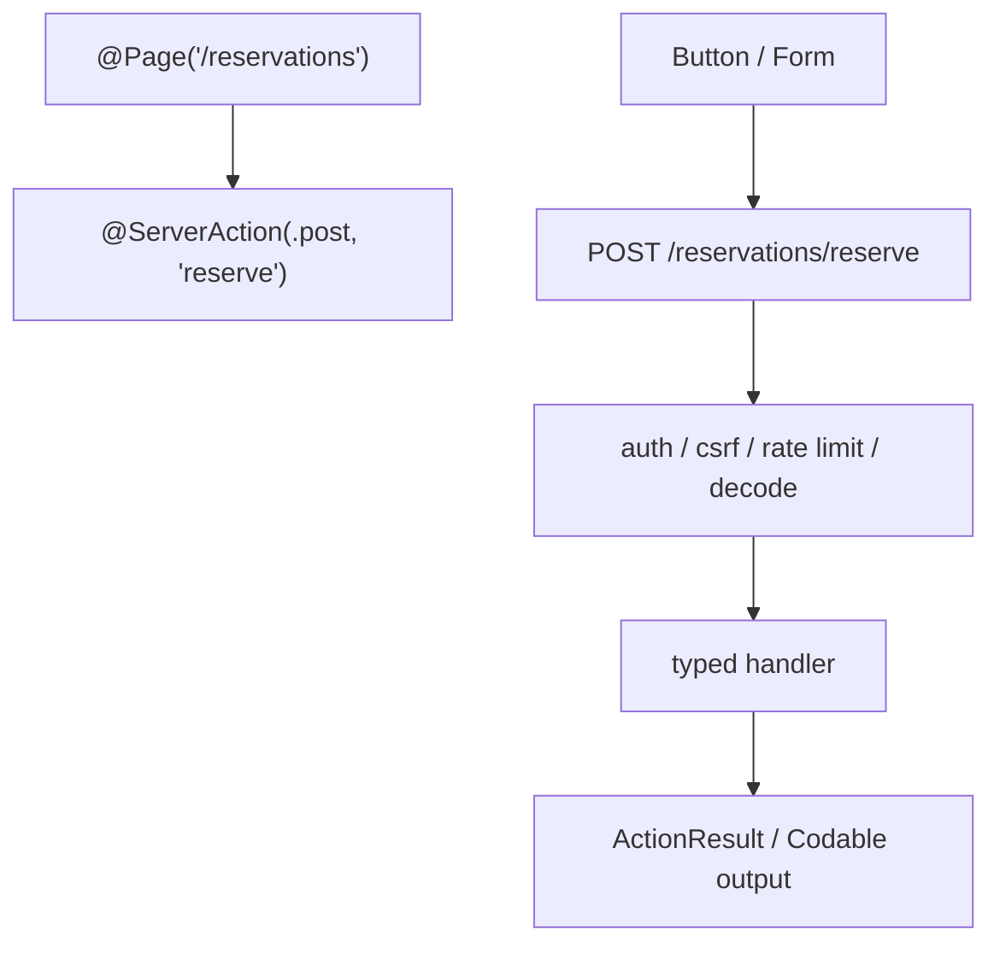
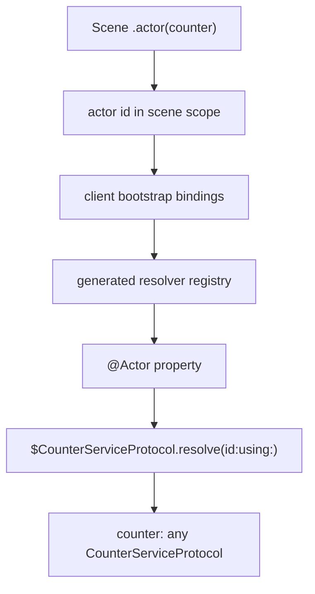
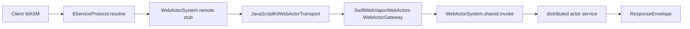
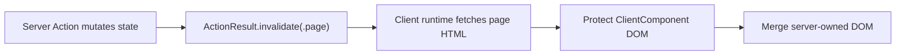
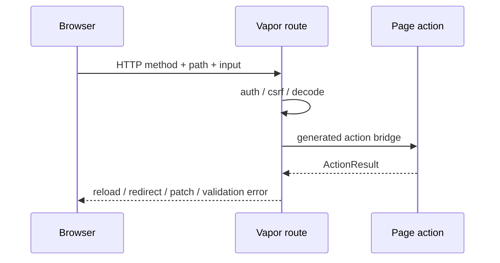

# SwiftWebCore

SwiftWebCore is the current page/runtime target for SwiftHTML. It owns Vapor-backed route lowering, request context, route actions, streaming, uploads, WebSocket/SSE registration, HTML responses, production runtime hooks, and the app-facing browser runtime configuration surface. Browser runtime descriptors, rendered HTML injection, and hosted WASM runtime assets live in `SwiftWebBrowserRuntime`. SwiftWebCore does not own the visual component library, the HTML graph engine, or the development watch/HMR implementation.

This README describes the current Vapor-backed runtime target. The target architecture separates the host-neutral app/runtime model from host adapters such as Vapor and Cloudflare; see [`../../docs/PlatformHostArchitecture.md`](../../../docs/PlatformHostArchitecture.md).

## Responsibility

| Area | Responsibility |
|---|---|
| App composition | Defines `App`, `Scene`, `SceneBuilder`, app-level route/runtime declarations, and optional app-wide service registration. |
| Page routing | Defines `Page`, `PageRoute`, `NoParams`, `NoSearchParams`, route path handling, and parameter decoding. |
| Page metadata | Resolves async `title`, `description`, and `language` values before rendering the document shell. |
| Macro surface | Exposes `@Page` as the public macro imported by applications. |
| Request context | Provides request-scoped values, params, search params, route environment, and session access. |
| Responses | Wraps page bodies in `PageDocument` and converts rendered SwiftHTML artifacts into Vapor `Response` values. |
| Actions | Provides route actions, form/button server action gateway contracts, `ClientAction`, `ActionResult`, `ActionReference`, and action contexts. |
| Action gateway contract | Server Action contracts live in SwiftWebCore. The ActorRuntime gateway for `@Resolvable` RPC lives in `SwiftWebVaporWebActors` and uses `SwiftWebActors`. |
| Streaming | Defines `StreamingPage`, `StreamWriter`, `SSERoute`, and SSE event types. End-to-end delivery depends on Vapor HTTP response streaming support. |
| Uploads | Provides upload route registration and upload context types. |
| WebSockets | Provides WebSocket route registration and context wrappers. |
| Browser runtime configuration | Defines app-facing client runtime configuration and delegates browser descriptors, HTML injection, and WASM hosting to `SwiftWebBrowserRuntime`. |
| Development hook boundary | Provides no-op production hooks that `SwiftWebDevelopment` can install during `sweb dev`. |

## Directory Layout

| Directory | Responsibility |
|---|---|
| `App/` | Declarative application composition, redirects, page/action registration, route endpoints, optional `AppServices`, and WASM bundle mounting. |
| `Core/` | Public page protocols, page metadata, cache policy, query defaults, and macro exports. |
| `Routing/` | Vapor route lowering, request context, route environment, parameter decoding, and HTML response conversion. |
| `Actions/` | Form actions, upload actions, typed server action references, action gateway contracts, and action results. |
| `Streaming/` | Streaming pages, stream writer, SSE route registration, and SSE event/context types. |
| `Realtime/` | WebSocket route registration and socket context wrappers. |
| `Runtime/DevelopmentSupport/` | No-op production hook registry used by `SwiftWebDevelopment` when a dev child server is launched. |
| `Runtime/Diagnostics/` | Debug diagnostics emitted during rendering and hydration setup. |

## Route Lowering Model

SwiftWeb is a thin layer over Vapor routing.


## App Composition

`SwiftWeb.App` is the application-level declaration surface. It keeps Vapor setup, generated page registries, action gateways, and WASM hosting out of the user entrypoint while still lowering to native Vapor routes.



`body`, `services`, and `clientRuntime` are intentionally separate. Routes describe the HTTP surface, optional app services describe shared application-level capabilities, and client runtime describes how browser-side WASM is hosted. Page-specific services should normally be stored on the page that uses them.

```swift
public struct CounterApp: SwiftWeb.App {
    public init() {}

    public var clientRuntime: ClientRuntimeConfiguration {
        .wasm(
            id: "counter-runtime",
            assetPath: "/assets/counter-wasm-runtime.wasm",
            artifact: SwiftPMWasmArtifact.location(target: "CounterWasmRuntime"),
            metricsMode: .detailed
        )
    }

    public var body: some Scene {
        Redirect("/", to: "/counter")
        CounterPage()
    }
}
```

`PageGroup` scopes child scenes under a shared path prefix. App bodies can still mount
pages directly; direct pages live under the implicit root group.

```swift
public var body: some Scene {
    HomePage()

    PageGroup("admin") {
        AdminDashboardPage()
        AdminUsersPage()
    }
}
```

User app packages should expose an app library. The generated package owns the concrete `@main` launchers for CLI dev, Xcode dev, and server builds.

Page-specific server services should be ordinary stored properties on the page. They are held for the route lifetime because `@Page` registers the page instance, not a fresh `Self()` per request.

```swift
@Page("/counter")
struct CounterPage {
    private let counterService = CounterService(actorSystem: .shared)

    var cache: CachePolicy {
        .noStore
    }

    func load() async throws -> Int {
        try await counterService.currentValue()
    }

    func body(_ value: Int) -> some HTML {
        HStack {
            Button("Decrement", action: counterService.decrementAction)
            Text(String(value))
            Button("Increment", action: counterService.incrementAction)
        }
    }
}
```

| Location | Responsibility |
|---|---|
| `body: Scene` | Mount pages, redirects, and endpoints. |
| `services: AppServices` | Optionally register application-wide services and gateways. Page-local server actions do not require this. |
| Page stored properties | Hold page-local route-lifetime services. |
| `Page.cache` | Declare response cache behavior for the page. |
| `.environment(...)` | Pass client-visible UI context such as locale, color scheme, and style system. |

## Request Session

`@Session` exposes the current client session to request-time surfaces such as page
bodies and server actions. The public value is `WebSession`, so app code can read and
mutate session state without depending on the host request type.

```swift
@Page("/account")
struct AccountPage {
    @Session var session

    func body() -> some HTML {
        if session.isAuthenticated {
            AccountView()
        } else {
            LoginView()
        }
    }
}
```

| API | Behavior |
|---|---|
| `session.isAuthenticated` | Reads the SwiftWeb authentication marker or the stored `userID`. |
| `session.userID` | Reads the stored user identifier. |
| `session["key"]` | Reads or writes a string session value. |
| `session.authenticate(userID:)` | Stores the user identifier and marks the session authenticated. |
| `session.clearAuthentication()` | Removes SwiftWeb authentication keys. |
| `session.destroy()` | Invalidates the current persisted session. |

Reading `@Session` does not create a new browser cookie. A session is materialized
only when app code writes a value, authenticates, or mutates an existing restored
session.

Application page files should import `SwiftWeb`, not raw host modules. Host-specific
embedding code belongs in `SwiftWebVapor`; page/session code should stay on the
SwiftWeb surface.

## Route Access Policy Direction

`@Session` is the right tool for request-local rendering and action logic. Shared
route access control should be declared on the scene graph as a policy descriptor,
not repeated inside every page body.



The target modifier shape is:

```swift
public var body: some Scene {
    PageGroup("admin") {
        AdminDashboardPage()
        AdminUsersPage()
    }
    .restrict(.authenticated, redirectTo: "/login")
}
```

This modifier is design direction, not current public API. Until it exists,
route-specific checks belong in request-time surfaces that can read `@Session`.

| Contract | Reason |
|---|---|
| Apply to `Page` and `PageGroup`. | Auth policy must work for one route and for route subtrees. |
| Inherit into child scenes. | A group-level policy should cover nested pages and endpoints. |
| Evaluate after route match and before `load`, `body`, or action invocation. | Protected code should not run for denied requests. |
| Represent denial as redirect, `401`, or `403`. | HTML pages and API/action surfaces need different failure behavior. |
| Store policy as data on the scene graph. | `Scene.body` is app-build time and cannot read `@Session`. |

## Development Boundary

The application runtime model lives in `SwiftWebCore`. The public `SwiftWeb` product is a thin facade that re-exports `SwiftWebCore` and exposes source macros such as `@Page` and `@ServerAction`. Browser runtime descriptors and WASM asset routes live in `SwiftWebBrowserRuntime`. Vapor server execution lives in `SwiftWebVapor`, which provides `App.run()` and the Vapor `Application` lifecycle. The long-lived dev host uses `SwiftWebDevServer` through the `SwiftWebDevelopment` facade; the short-lived Vapor worker imports `SwiftWebVapor` and installs the smaller `SwiftWebDevelopmentHooks` runtime before `App.run()`.

Custom Vapor embedders that call `AppRunner.configure(_:)` directly must keep the returned `AppRunnerInstallation` and call `shutdown()` when the host application stops. `shutdown()` cancels development parent monitoring and clears the shared web actor registry; `shutdown(_:)` also shuts down the provided Vapor application.



| Mechanism | Responsibility |
|---|---|
| `SwiftWebCore` product | Contains route/action/page runtime contracts and no source macro dependency. |
| `SwiftWebBrowserRuntime` product | Contains browser runtime descriptors, WASM asset route helpers, and HTML runtime injection. |
| `SwiftWeb` product | Public facade for app source that re-exports `SwiftWebCore` and provides macros. |
| `SwiftWebVapor` product | Provides Vapor host execution, `App.run()`, middleware installation, and native/container server lifecycle. |
| `SwiftWebDevelopment` product | Re-exports development modules for CLI/generated launcher convenience. |
| `SwiftWebDevelopmentHooks` product | Contains only worker-side development hooks and typed HMR contracts needed inside the Vapor worker. |
| `SwiftWebPackageGeneration` product | Contains generated package materialization and package manifest inspection. |
| `SwiftWebDevServer` product | Contains FSEvents watching, HMR events, reload fallback, DevHost proxying, artifact cleanup, and dev process supervision. |
| `SwiftWebWasmBuild` product | Contains WASM toolchain resolution, artifact processing, size reports, and compression sidecars. |
| `SwiftWebStoryboardTooling` product | Contains managed Storyboard package scaffold and launch tooling. |
| Generated server package | Builds the production `app-server` product without linking `SwiftWebDevelopment`. |
| Generated dev package | Builds the dev launcher and the dev child server product that installs `SwiftWebDevelopmentHooks`. |

### Streaming Runtime Boundary

`StreamingPage` and `SSERoute` lower to Vapor streaming responses, so application-level SSE delivery depends on Vapor's HTTP response-body streaming implementation. The development HMR EventSource endpoint is different: it is served by `SwiftWebDevServer`'s persistent DevHost, which uses a streaming-capable HTTP server and proxies to the current Vapor worker.



WASM builds use the same generated package boundary but switch to a client-only graph. The generated package copies the app's client components plus runtime-only `SwiftHTML`, `SwiftWebActors`, `SwiftWebUI`, `SwiftWebUIRuntime`, and JavaScriptKit source targets. It intentionally excludes SwiftHTML preview macros, JavaScriptKit BridgeJS macros, and their `swift-syntax` toolchain dependencies from the WASM package graph. `SwiftHTML` and `SwiftWebUI` stay browser-runtime neutral, while `SwiftWebUIRuntime` carries the JavaScriptKit-backed browser adapter used by the generated WASM runtime targets.

`SwiftPMWasmArtifact.location(target:)` resolves the served `.wasm` file from the user app package root, the app's `.swiftweb/generated` package root, and local `.package(path:)` dependency roots. This lets `sweb build --wasm` write into the shared SwiftWeb scratch directory while the app still declares the asset from its own `clientRuntime`.

Client bundle loading is contract-first and documented in [`docs/ClientBundleLoadingDesign.md`](../../../docs/ClientBundleLoadingDesign.md). `SwiftWeb` hosts resolved manifests and content-hashed WASM assets; `ClientComponent` contracts and modifiers decide bundle/load policy, while the runtime validates those contracts and serves the resulting assets. Same-origin browser navigation for WASM pages is defined in [`docs/ClientNavigationDesign.md`](../../../docs/ClientNavigationDesign.md).

WASM asset routes are sidecar-aware. If a built artifact has `.wasm.br` or `.wasm.gz` siblings, `SwiftWeb` selects the best accepted variant from `Accept-Encoding` and sets `Content-Encoding` plus `Vary: Accept-Encoding`. The production artifact processor that creates those sidecars lives in `SwiftWebWasmBuild` and is invoked by `sweb build --wasm`; `SwiftWeb` only owns HTTP serving.

## Server Interaction Methods

SwiftWeb intentionally supports two server interaction methods. They are related because both can execute server-side service code, but they serve different developer intents and use different runtime contracts.



| Method | Use when | Developer-facing API | Runtime path | Result model |
|---|---|---|---|---|
| Server Action | A button/form intentionally mutates server state and the page should refresh, redirect, or return a command result. | `@ServerAction` + generated `ActionReference` consumed by `Button`/`Form`. | HTTP method + path -> page-local Vapor route -> generated action bridge. | `ActionResult` or another typed codable output. |
| Resolvable RPC | Client WASM needs to talk to a typed service directly, especially for stateful sessions or repeated service calls. | Apple `@Resolvable protocol`; the standard component surface is `@Actor var service: any ServiceProtocol`, backed by `$Protocol.resolve(id:using:)`. | ActorRuntime envelope -> `WebActorGateway` -> `WebActorSystem`. | Direct typed `distributed func` return value. |

`ActionReference` is a form/action handle. It is not Apple's `@Resolvable` model. Client-visible typed service APIs should use an `@Resolvable` protocol. Conversely, a `@Resolvable` protocol is not a replacement for a page mutation action when the intended result is page invalidation.

| Question | Prefer |
|---|---|
| Does this start from a rendered button or form and submit ordinary HTTP? | Server Action |
| Does this need direct typed calls from a ClientComponent running in WASM? | Resolvable RPC |
| Does this need long-lived conversational/session state such as chat, terminal, game room, or collaborative document state? | Resolvable RPC |
| Does this mutate server data through a page-local HTTP endpoint? | Server Action |

### Server Action Flow

Server Action is the typed HTTP boundary from a SwiftWeb page into server-side code. It is not the `@Resolvable` RPC path and it does not expose an actor method. A server action is a page-local HTTP endpoint with a method and path.



`@ServerAction` is attached to an instance method on a page or page-owned server handler. The action has an HTTP method and a path. Relative paths are resolved under the owning page path; absolute paths are registered as written.

```swift
@Page("/reservations")
struct ReservationsPage {
    @ServerAction(.post, "reserve")
    func reserve(
        _ input: ReservationInput,
        context: ActionInvocationContext
    ) async throws -> ActionResult {
        // Mutate server-side state or call a server-side service.
    }
}
```

The generated action reference is a typed HTTP endpoint. It carries the resolved path and HTTP method, not a handler name, action identity, target identifier, or actor metadata.

The UI consumes the generated action reference. It should not hold a server closure or remote actor stub.

```swift
Button("Reserve", action: reserveAction)
```

HTML forms can submit `GET` and `POST` directly. `PUT` and `DELETE` actions are still first-class HTTP server actions for client runtimes and can be submitted from plain forms through method override when rendered as a form.

Server Action should be the default for page-local HTTP work:

| Trait | Server Action behavior |
|---|---|
| Transport | HTTP `GET`, `POST`, `PUT`, or `DELETE` through Vapor routes. |
| Security | Same-origin, CSRF, auth middleware, and rate limiting happen before invocation. |
| State ownership | The page or page-owned service owns the HTTP handler; client state is not the source of truth. |
| UI update | `ActionResult.invalidate(.page)` refreshes server-rendered DOM while preserving compatible ClientComponent state. |
| API shape | The UI receives an `ActionReference` with method and path, not a remote actor stub. |

### Resolvable Distributed Services

Client WASM should call long-lived or session-scoped services through an Apple `@Resolvable` protocol. This is the Swift-native RPC path and is the right model for typed service APIs, AI chat sessions, terminal sessions, collaborative editing, and other stateful service conversations.

The SwiftWeb component API is documented in [`docs/ActorInjectionDesign.md`](../../../docs/ActorInjectionDesign.md). A client component should read an `@Actor` property as the resolved service object; `WebActorSystem`, actor ids, and `$Protocol.resolve(id:using:)` remain runtime details for the standard API.

```swift
@Resolvable
public protocol CounterServiceProtocol: DistributedActor
where ActorSystem == WebActorSystem {
    distributed func currentValue() async throws -> Int
    distributed func increment() async throws -> Int
}
```

```swift
@ResolvableActor(CounterServiceProtocol.self)
public distributed actor CounterService: CounterServiceProtocol {
    public typealias ActorSystem = WebActorSystem

    private var value = 0

    public distributed func currentValue() async throws -> Int {
        value
    }

    public distributed func increment() async throws -> Int {
        value += 1
        return value
    }
}
```

```swift
let service = try $CounterServiceProtocol.resolve(id: actorID, using: actorSystem)
let value = try await service.increment()
```

That direct call is the low-level primitive. The standard component surface should
be:

```swift
public struct CounterClient: ClientComponent {
    @Actor
    private var counter: any CounterServiceProtocol
}
```

The scene that renders the component provides the actor instance:

```swift
CounterPage()
    .actor(counterService)
```





`WebActorGateway` is provided by `SwiftWebVaporWebActors` and is mounted at `/_swiftweb/actors/invoke` only when that adapter is imported and registered. It validates state-changing request security, decodes the raw ActorRuntime `InvocationEnvelope`, dispatches through `WebActorSystem.shared`, and returns a `ResponseEnvelope`. Browser WASM clients use `SwiftWebUIRuntime.JavaScriptKitWebActorTransport` to post the envelope with same-origin credentials and the active CSRF header from the runtime security descriptor.

Resolvable RPC should be the default for client-owned interaction loops:

| Trait | Resolvable RPC behavior |
|---|---|
| Transport | ActorRuntime envelope over `WebActorTransport`. |
| Security | Gateway request validation plus application middleware around the actor gateway route. |
| State ownership | Actor identity represents the service/session being called. |
| UI update | Client code decides how to update local state from the typed result. |
| API shape | Client components use `@Actor` as the resolved service object and call `distributed func` as if it were local. |

The manual `$ServiceProtocol.resolve` form is reserved for low-level runtime or
diagnostic code.

### Action Results

`ActionResult.invalidate(.page)` is the default result for server-side mutations that should refresh server-rendered data without resetting client-owned state. The WASM runtime posts the action, fetches the current page, protects client bundle subtrees, and merges only server-owned DOM.



| Result | Browser behavior |
|---|---|
| `.invalidate(.page)` | Revalidates the current page and preserves ClientComponent `@State`. |
| `.invalidate(.path(path))` | Revalidates another rendered path and merges the returned server DOM. |
| `.redirect(path)` | Performs navigation and starts a fresh page/runtime state. |
| `.html`, `.text`, `.json`, `.empty` | Returns direct action output for specialized handlers. |

Client navigation is a separate runtime path from action invalidation. Eligible
same-origin anchors fetch the next server-rendered document, update browser
history, replace the document body for the new route, and rebootstrap active
WASM bundles against the new hydration index without reloading already loaded
runtime artifacts. Action invalidation keeps the protected node-level merge path
because it refreshes server-owned DOM on the current route while preserving
active client islands.

### Vapor Architecture

Vapor hosts the transport and security boundary. For Server Action, the service execution boundary is a typed method on a registered handler, reached through the macro-generated action bridge. SwiftWeb does not reconstruct compiler-internal distributed targets from form metadata. Direct `@Resolvable` RPC remains a separate WebActor path.

| Layer | Responsibility |
|---|---|
| `Application.swiftWebServerActions` | Holds generated action descriptors keyed by HTTP method and path. |
| Vapor middleware | Provides session, authentication, CSRF, rate limiting, tracing, and request IDs. |
| `ActionGateway` | Registers page-local action routes, decodes input, builds `ActionInvocationContext`, invokes the generated action bridge, maps errors, and encodes `ActionResult`. |
| `SwiftWebVaporWebActors.WebActorGateway` | Receives raw ActorRuntime invocation envelopes for `@Resolvable` distributed service calls. |
| Page or service handler | Owns server state, domain mutation, external side effects, and session-scoped behavior. |



### Action Reference Metadata

Generated server actions export HTTP metadata into the rendered form or hydration surface. The metadata identifies the endpoint path and method. It does not resolve to a remote actor proxy by itself.

```swift
public struct ActionReference<Input, Output>: Sendable, Codable
where Input: Codable & Sendable, Output: Sendable {
    public let path: String
    public let httpMethod: ServerActionMethod
}
```

Server action methods may live directly on a page or on a page-owned service.

| Location | Path behavior | Use cases |
|---|---|---|
| Page method | Relative action paths are resolved under the page path. | One-page forms, settings, login, contact, reservation. |
| Page-owned service | Relative action paths are resolved under the owning page path when the stored service conforms to `PageOwnedServerActions`. | Shared page-local domain handlers and dependency-injected services. |

Stored page properties are not scanned as implicit server handlers. A stored service opts into page-local route registration by conforming to `PageOwnedServerActions`; ordinary stored values are ignored by the action registrar.

`ActionInvocationContext` should be a normalized, sendable context. It must not expose raw `Vapor.Request` to the action handler.

```swift
public struct ActionInvocationContext: Sendable, Codable {
    public let id: UUID
    public let requestPath: String
    public let method: String
    public let idempotencyKey: String?
}
```

## Not Responsible For

| Not owned by SwiftWeb | Owner |
|---|---|
| HTML component protocol and graph | `SwiftHTML` |
| Diff algorithm | `SwiftHTML` |
| SwiftUI-like components and style defaults | `SwiftWebUI` |
| Macro code generation details | `SwiftWebMacros` |
| App templates and file watching | `SwiftWebCLI` |
| Replacing Vapor routing | Vapor / RoutingKit |

## Design Notes

- `@Page` lowers to Vapor routes; SwiftWeb must not become a custom router.
- Route grouping, middleware, priority, and matching belong to Vapor.
- Params and search params are decoded before page execution.
- Page `body` returns page content only; `PageDocument` owns `html`, `head`, `title`, metadata, and `body`.
- `title`, `description`, and `language` are async page properties so they may read request context or server-side stores.
- Server Action represents explicit intent to mutate server-side state or call a server-side service.
- Server Action uses an HTTP method and path plus typed handler invocation, and remains a page command model, not the `@Resolvable` RPC model.
- Server Action references are form/action metadata; client-side typed service calls use Apple `@Resolvable` protocols and `WebActorSystem`.
- Render-time anonymous server closures are not the canonical Server Action model and must not be used for distributed or production service boundaries.
- Server-only values are explicit and must not leak into client components.
- Development browser updates use the DevHost typed EventSource stream and fall back to reload-token waiting only as a compatibility path.
- True component-level HMR requires streaming response delivery, successful client WASM asset builds, and matching state/environment schema hashes.
- Streaming route APIs are defined in SwiftWeb, but end-to-end incremental delivery depends on Vapor 5 HTTP response streaming support.
- Runtime assets are served through explicit SwiftWeb routes.
