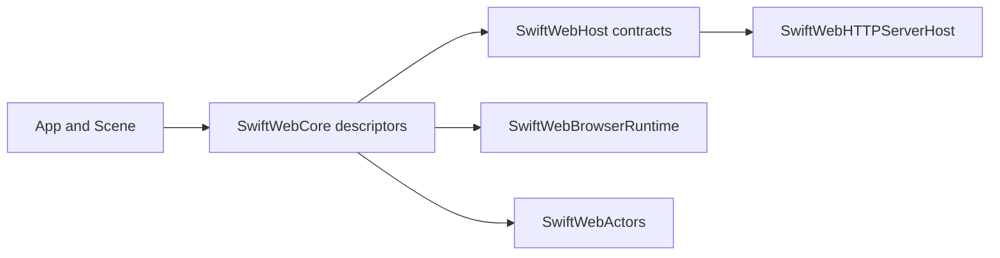
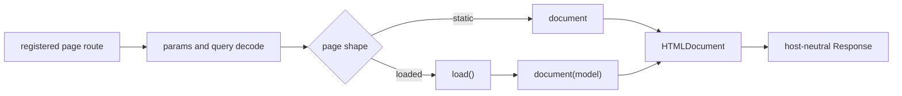

# SwiftWebCore

SwiftWebCore owns the host-neutral application and page runtime. It describes
routes against `SwiftWebHost` contracts and does not depend on a concrete HTTP
server implementation.

## Responsibilities

| Area | SwiftWebCore owns |
|---|---|
| Application topology | `App`, `Scene`, groups, redirects, endpoints, and environment scopes |
| Pages | Static and loaded page contracts, metadata, caching, and `PageDocument` |
| Routing | Paths, parameters, query values, request context, and URL construction |
| Actions | Form, upload, and client-action descriptors and result contracts |
| Realtime | WebSocket, SSE, and streaming route contracts |
| Security | CORS, CSRF, origin, forwarded-header, redirect, CSP, and response-header policies |
| Browser boundary | Client runtime configuration and rendered-document injection |
| Development boundary | Production no-op hooks that `sweb dev` replaces in generated workers |

The concrete native server lives in `SwiftWebHTTPServerHost`. Browser boot
descriptors and host scripts live in `SwiftWebBrowserRuntime`. Actor transport
and activation live in `SwiftWebActors`. Visual components live in
`SwiftWebUI`.

```mermaid
flowchart LR
  App["App and Scene"] --> Core["SwiftWebCore descriptors"]
  Core --> Host["SwiftWebHost contracts"]
  Host --> HTTP["SwiftWebHTTPServerHost"]
  Core --> Browser["SwiftWebBrowserRuntime"]
  Core --> Actors["SwiftWebActors"]
```

## Directory Layout

| Directory | Responsibility |
|---|---|
| `App/` | Application composition, scenes, endpoints, actor scopes, and client runtime configuration |
| `Core/` | Page protocols, metadata, cache policy, documents, and macro exports |
| `Routing/` | Request context, session, paths, query values, parameters, URLs, and HTML responses |
| `Actions/` | Action descriptors, invocation context, references, uploads, and results |
| `Streaming/` | Streaming pages, SSE routes, events, contexts, and writers |
| `Realtime/` | WebSocket route and context contracts |
| `Security/` | Request validation, middleware, and response security policy |
| `Rendering/` | SwiftWeb head and style asset composition |
| `Runtime/` | Development hook and diagnostic boundaries |

## Page Resolution

```mermaid
flowchart LR
  Route["registered page route"] --> Decode["params and query decode"]
  Decode --> Resolve{"page shape"}
  Resolve -->|static| Document["document"]
  Resolve -->|loaded| Load["load()"]
  Load --> Loaded["document(model)"]
  Document --> HTML["HTMLDocument"]
  Loaded --> HTML
  HTML --> Response["host-neutral Response"]
```

`@Page` recognizes both the static `document` shape and the loaded
`load() → document(model)` shape. The public boundary is documented in
[HTML Authoring Model](../../../docs/HTMLAuthoringModel.md).

## Host Boundary

Core code may depend on `SwiftWebHost`, `HTTPTypes`, SwiftHTML, browser runtime
descriptors, actors, and style contracts. It must not import a concrete server
framework or perform process-level development orchestration.

The host is responsible for:

- listening and connection lifecycle;
- lowering `RoutesBuilder` registrations;
- request and response body transport;
- sessions and server-side application storage;
- WebSocket and streaming I/O.

SwiftWebCore is responsible for the semantics that must remain identical when
the host implementation changes.
