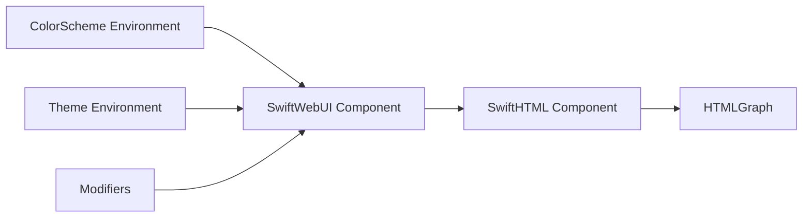
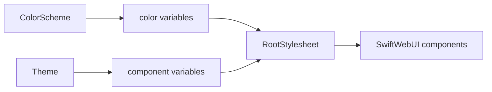
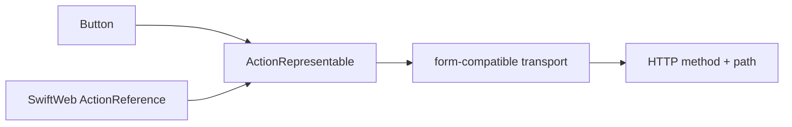
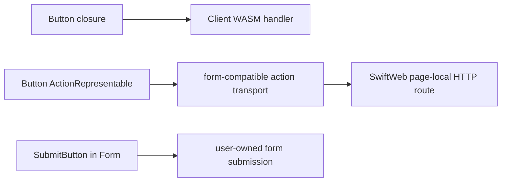

# SwiftWebUI

SwiftWebUI is the SwiftUI-inspired component layer built on top of SwiftHTML.

It owns reusable visual components, layout primitives, color scheme propagation, and developer-friendly modifiers. It does not own the HTML graph, page metadata, route registration, Vapor request handling, macros, or the CLI.

The core architecture is documented in [`docs/SwiftWebUICoreDesign.md`](../../../docs/SwiftWebUICoreDesign.md). That document defines the component graph, dynamic property lifecycle, modifier graph, and style abstraction boundaries.

The public style contract is documented in [`docs/SwiftWebUIStyleDesign.md`](../../../docs/SwiftWebUIStyleDesign.md). That document defines the ColorScheme / Theme / CSS ownership model, component taxonomy, contextual styling rules, and styling gates for built-in components.

Client WASM loading is documented in [`docs/ClientBundleLoadingDesign.md`](../../../docs/ClientBundleLoadingDesign.md). That document defines the `ClientComponent` loading contract, modifier precedence, nested island ownership, and bundle policy rules. Client-side document navigation is documented in [`docs/ClientNavigationDesign.md`](../../../docs/ClientNavigationDesign.md).

## Responsibility

| Area | Responsibility |
|---|---|
| Layout primitives | Provides `GridSystem`, `Pane`, `VStack`, `HStack`, `ZStack`, `Spacer`, `ScrollView`, grids, and lazy stacks. |
| UI controls | Provides `Button`, server action reference buttons, `SubmitButton`, `TextField`, `SecureField`, `Toggle`, and links. |
| Text components | Provides `Text`, the `as(_:)` modifier for semantic `TextElement` (tag) selection, and text tones. |
| Containers | Provides `GroupBox`, `Section`, and `List` — every direct child is a row, with `List(_:rowContent:)` for data-driven rows. The toolbar is the `.toolbar { ToolbarItem(placement:) }` modifier. |
| Color scheme | Provides component-facing environment integration for color scheme and theme values. Host-neutral style values live in `SwiftWebUITheme`. |
| Modifiers | Provides SwiftUI-like modifier graph wrappers for styles, attributes, frame, padding, alignment, accessibility, and events. |
| Navigation | Provides `NavigationStack`, `NavigationLink`, `NavigationPath`, and `navigationTitle` metadata hooks. |

## Directory Layout

| Directory | Responsibility |
|---|---|
| `Core/` | Shared primitives used by components, including axes, edges, UI-specific geometry, attributes, modifiers, and theme environment glue. |
| `Components/Layout/` | Layout containers and sizing primitives such as `GridSystem`, `Pane`, stacks, grids, lazy stacks, `Spacer`, and `ScrollView`. |
| `Components/Text/` | Text rendering, semantic tag switching through `as`, headings, and text block helpers. |
| `Components/Controls/` | Interactive controls such as `Button`, forms, links, text fields, toggles, and submit controls. |
| `Components/Navigation/` | Navigation containers, navigation links, paths, and title metadata hooks. |
| `Components/Containers/` | Structural UI components such as group boxes, sections, lists, toolbars, and badges. |
| `Components/Media/` | Media-oriented components such as `Image`. |
| `SwiftWebUITheme` target | Color values, materials, `Theme` values, root stylesheet defaults, utility classes, and host-neutral style primitives. |

## Boundaries

SwiftWebUI should make common UI concise without hiding SwiftHTML.



## Not Responsible For

| Not owned by SwiftWebUI | Owner |
|---|---|
| Lowercase raw HTML tags | `SwiftHTML` |
| HTML graph construction and diffing | `SwiftHTML` |
| Browser runtime descriptors and WASM asset routes | `SwiftWebBrowserRuntime` |
| JavaScriptKit browser runtime adapter | `SwiftWebUIRuntime` |
| Page metadata and document shell | `SwiftWeb` |
| Route registration | `SwiftWeb` |
| `@Page` expansion | `SwiftWebMacros` |
| File watching and app generation | `SwiftWebDevServer`, `SwiftWebPackageGeneration`, and `SwiftWebCLI` |

## Design Notes

- Components should follow SwiftUI naming and initializer shape where it maps cleanly to the web.
- Color mode should be scheme-driven through `.preferredColorScheme(_:)`.
- Component design language should be theme-driven through `.environment(\.theme, value)`.
- Default CSS should be declared through SwiftHTML `Style` helpers and `Stylesheet` rules, not concatenated raw stylesheet strings.
- Concrete CSS property output should use SwiftHTML generated standard property helpers so SwiftWebUI does not maintain a separate CSS property surface.
- Public styling should prefer `foregroundStyle`, `backgroundStyle`, and `tint` over color-specific APIs.
- `Space` is the component spacing scale. Page margins and responsive grid insets belong to `GridSystem` and the `Theme` `.root { .pageInlinePadding(...) }` token; outer width constraints belong to `.frame(maxWidth:)`.
- Modifiers should be ordered wrapper values that work on any `HTML`, not only components that store attributes directly.
- Control state should flow through environment values such as `isEnabled`, `controlSize`, `tint`, and `buttonStyle`.
- Semantic HTML should be explicit. `Text("Title").as(.h1)` changes only the tag (no separate component); appearance comes from modifiers like `.font(_:)`, never from the tag.
- `Button` supports client closures for Client WASM work and `ActionRepresentable` values for route or server-side actions.
- Action buttons consume SwiftHTML action contracts. They should not capture server closures or own distributed actor resolution.
- Action buttons are user intents. They may render form-compatible transport markup for progressive enhancement, but the public concept is still `ActionRepresentable`, not a separate `ServerButton`.
- Use `SubmitButton` inside `Form` only when a custom form owns multiple controls.
- `ClientComponent` uses contract-first WASM loading. The default joins the main eager bundle; explicit split loading uses `.loadPolicy(...)` and `.bundle(...)` modifiers at the outermost client island.
- Components may wrap SwiftHTML primitives but should not introduce a second rendering model.
- Components should not create `html`, `head`, `title`, or document-level metadata; those belong to SwiftWeb `Page`.

## Color Scheme And Theme

`ColorScheme` selects the semantic color palette (background, text, accent, border) between light and dark. `Theme` controls component-wide design choices such as container radius, button shape, field padding, material effects, and motion timing.



`Theme.default` is complete. Custom styles should start from that default and override only the parts that differ, so every component always has a fallback token.

Every chrome surface — group box, toolbar, badge, field, toggle track, and the bordered/glass buttons — composes one shared material recipe instead of hand-rolling its own translucency. A `Theme` tunes that single recipe through the `material` block: `opacity` (with the per-level `opacityStep`), `blur`, `saturate`, the specular `rim`, and the SVG `refraction`. Components pick a *level* (`.regularMaterial`, `.thinMaterial`, `.bar`, …) and the CSS derives the level's fill from these knobs, so the glass stays consistent across the whole UI.

```swift
let glass = Theme(id: "glass") {
    .surface {
        .containerRadius(22)
        .containerShadow(.drop(y: 18, blur: 48, color: Color(hex: 0x0F172A).opacity(0.18)))
    }
    .button {
        .radius(999)
    }
    .material {
        .opacity(0.62)
        .opacityStep(0.07)
        .blur(24)
        .saturate(1.6)
        .refraction(.svgFilter(id: "swui-glass-refraction"))
        .solidFill(Color.surface.mix(with: .border, by: 0.12))
    }
}

CounterView()
    .preferredColorScheme(.dark)
    .environment(\.theme, glass)
```

`solidFill` is the opaque fallback used where `backdrop-filter` is unsupported (e.g. Safari ignores `url()` filters) or when the reader requests reduced transparency. This degradation is part of the recipe, not a silent default. The built-in `.liquidGlass` preset already sets all of these knobs.

When both values are set through modifiers, place `theme` outside the color scheme scope as shown above. Modifier order is semantic: the stylesheet scope created by `preferredColorScheme` reads outer environment values.

## Action Boundary

SwiftWebUI makes action calls concise, but it does not execute them. A button declares a user intent and consumes a SwiftHTML action contract. SwiftWeb can provide that contract with a generated Server Action reference.



This keeps visual components independent from Vapor and Distributed Actor runtime details.

## Button Action Semantics

`Button` has three distinct use cases. They share visual styling, but they do not share ownership responsibilities.



| API shape | Owner of behavior | Rendered transport |
|---|---|---|
| `Button("Save") { ... }` | ClientComponent / WASM runtime | Plain button with event handler identity |
| `Button("Reserve", action: service.reserveAction)` | A value conforming to `ActionRepresentable` | Button wrapped in action metadata that can be intercepted by WASM or submitted as HTTP fallback |
| `Form { SubmitButton(...) }` | User-authored form route | Traditional form submission |

This is why SwiftWebUI does not provide `ServerButton`. A normal `Button` can express route or server intent when it receives an `ActionRepresentable` value.

## SwiftUI-Style API Surface

```swift
NavigationStack {
    Text("Counter")
        .as(.h1)
        .font(.largeTitle)
        .foregroundStyle(.primary)

    Button("Increment") {
        count += 1
    }
    .buttonStyle(.borderedProminent)
    .controlSize(.large)
    .tint(.accent)
}
.navigationTitle("Counter")
```

| API | Responsibility |
|---|---|
| `GridSystem` / `Pane` | Applies responsive inline inset, grid columns, gutters, page vertical rhythm, and pane spans. Use `.frame(maxWidth:)` for outer width constraints. |
| `foregroundStyle`, `backgroundStyle`, `tint`, `border` | Resolves `ShapeStyle` values (`Color`, `Material`, `LinearGradient`) through the color scheme/environment and lowers to CSS. |
| `font`, `fontWeight`, `fontDesign`, `bold`, `italic`, `monospaced` | Provides SwiftUI-like typography without requiring raw CSS. |
| `disabled`, `controlSize`, `buttonStyle`, `pickerStyle` | Propagates control state and semantic style selection through environment while controls render native attributes. |
| `TextField`, `Toggle`, `Slider`, `Stepper`, `Picker` | Use `Binding` as the primary state interface. |
| `accessibilityLabel`, `accessibilityHint`, `accessibilityValue`, `accessibilityHidden`, `accessibilityRole` | Maps common accessibility intent to semantic attributes. |
| `NavigationStack`, `NavigationLink`, `navigationTitle` | Creates semantic navigation anchors and metadata that the SwiftWeb WASM host can enhance into same-origin browser history transitions. |
| `animation(_:value:)`, `transition(_:)`, `withAnimation(_:_:)` | Lower SwiftUI-style animation to CSS so the browser interpolates the change; there is no Swift-side animation engine. |

## Animation

Animation lowers to CSS — the browser performs every interpolation, and SwiftWebUI
ships no Swift-side animation engine. Three SwiftUI-shaped entry points cover the
declarative and imperative surfaces:

```swift
// Declarative: animate a value-driven change across a subtree.
card
    .opacity(isOn ? 1 : 0.3)
    .scaleEffect(isOn ? 1.05 : 1)
    .animation(.easeInOut(duration: 0.3), value: isOn)

// Declarative: animate insertion and removal.
if isShown {
    Banner().transition(.scale.combined(with: .opacity))
}

// Imperative: animate the state changes a closure makes.
Button("Toggle") {
    withAnimation(.spring(duration: 0.4, bounce: 0.3)) { isShown.toggle() }
}
```

| API | How it lowers |
|---|---|
| `.animation(_:value:)` | A `.swui-animation-scope` wrapper publishes an inherited `--swui-animation` custom property; descendants transition on it. |
| `.transition(_:)` | Insertion uses CSS `@starting-style`; removal animates before the runtime detaches the node. Presets: `.opacity`, `.scale`, `.move(edge:)`, `.slide`, `.offset`, plus `.asymmetric` / `.combined`. |
| `withAnimation(_:_:)` | Records the animation on the update's transaction; the runtime makes the document a temporary animation scope for that update. Per-event granularity: the last call in one event wins for the whole update. |

`Animation` exposes `.easeInOut` / `.easeIn` / `.easeOut` / `.linear` / `.spring`
(and their `duration:` / `bounce:` forms) plus `.delay(_:)` and `.speed(_:)`.
Springs lower to a sampled CSS `linear()` easing. `prefers-reduced-motion` is
honored automatically.
