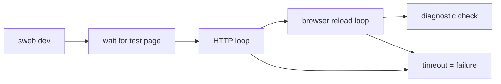
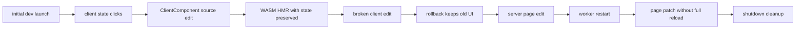

# SwiftWeb Browser E2E

These tests exercise the real browser WASM runtime. They are opt-in because they start a SwiftWeb dev server, build the ClientComponent WASM bundle, and launch a browser.

```bash
cd Tests/BrowserE2E
npm install
npm run counter-wasm
npm run storyboard-navigation
npm run page-access:perf
npm run page-access:stress
```

For the stronger local stability gate, install WebKit and require the smoke pass:

```bash
cd Tests/BrowserE2E
npm run install-webkit
npm run counter-wasm:webkit
```

The test copies `Examples/CounterApp` into a temporary directory, rewrites its dependencies to the local `swift-web` and `swift-html` packages, starts `sweb dev`, and validates:

- browser WASM runtime readiness
- WASM asset fetch and instantiation metrics
- ClientComponent `@State` updates through WASM event dispatch
- `.visible`, `.idle`, `.interaction`, and `.manual` ClientComponent loading policies
- named/shared split bundle contracts
- ServerAction page invalidation without full navigation
- Storyboard same-origin sidebar navigation without reloading or reinstantiating the WASM runtime
- Storyboard current-link state remains singular after client navigation and history traversal
- Storyboard browser history and native hash/external-link fallbacks
- ClientComponent HMR patching while preserving state
- ClientComponent HMR build failure rollback without replacing the old UI
- Server worker restart HMR followed by page patch without losing compatible client state
- repeated page access liveness under direct HTTP and browser reload pressure
- dev process shutdown cleanup
- optional WebKit smoke when Playwright WebKit is installed, or required with `counter-wasm:webkit`

The E2E uses a split toolchain policy:

| Toolchain | Purpose |
|---|---|
| Host Swift | Builds the `sweb` CLI and runs the Vapor-backed dev host. It currently needs a Swift 6.4-capable toolchain because Vapor 5 alpha depends on the current Apple HTTP server stack. |
| WASM Swift SDK | Builds client runtime bundles and remains pinned to `swift-6.3.1-RELEASE_wasm` by default. |

Environment variables:

| Name | Purpose |
|---|---|
| `SWIFTWEB_BROWSER_E2E` | Must be `1` to run. Otherwise the script exits successfully without work. |
| `SWIFTWEB_E2E_HOST_SWIFT_EXECUTABLE` | Swift executable used to build the host `sweb` CLI. Defaults to `xcrun swift`. |
| `SWIFTWEB_E2E_HEADFUL` | Set to `1` to show the browser. |
| `SWIFTWEB_E2E_PORT` | Fixed port. If omitted, an available port is selected. |
| `SWIFTWEB_E2E_TIMEOUT_MS` | Overall wait timeout for server, runtime, and HMR phases. |
| `SWIFTWEB_E2E_HMR_TIMEOUT_MS` | Timeout for individual HMR phases. Increase this when local SwiftPM server rebuilds are slow. |
| `SWIFTWEB_E2E_SWIFT_HTML_ROOT` | Override the local `swift-html` path. Defaults to `../swift-html` next to the repo. |
| `SWIFT_WEB_WASM_SDK` | Swift SDK used for WASM client runtime builds. Defaults to `swift-6.3.1-RELEASE_wasm`. |
| `SWIFT_WEB_WASM_SWIFT` | Optional Swift executable override for WASM builds. |
| `SWIFT_WEB_WASM_TOOLCHAIN_BIN` | Optional WASM toolchain bin directory override. |
| `SWIFTWEB_E2E_BROWSER_EXECUTABLE_PATH` | Use a specific Chromium-compatible browser executable. |
| `SWIFTWEB_E2E_REQUIRE_WEBKIT` | Set to `1` to fail when the optional WebKit smoke cannot run. |
| `SWIFTWEB_E2E_KEEP_STORYBOARD` | Set to `1` to keep the generated `.swiftweb/storyboard` package after Storyboard navigation E2E. |

## Stability Gates

| Gate | Command | Expected browser coverage |
|---|---|---|
| Default browser E2E | `npm run counter-wasm` | Chromium-compatible browser plus optional WebKit smoke. |
| Storyboard navigation E2E | `npm run storyboard-navigation` | Chromium-compatible browser, same-origin client navigation, singular current sidebar link, back/forward, native hash/external fallback. |
| Page access performance | `npm run page-access:perf` | Opt-in local latency gate for repeated test-page HTTP requests plus same-page browser reloads. |
| Page access stress | `npm run page-access:stress` | Opt-in liveness gate for repeated test-page direct HTTP and browser access with per-request timeouts. |
| Full local browser E2E | `npm run counter-wasm:webkit` | Chromium-compatible browser and required WebKit smoke. |

The page access performance and stress gates are special tests and should not be part of
the default fast test loop. They exist to detect the dev host becoming unresponsive during
continued page access:



Useful tuning variables:

| Name | Purpose |
|---|---|
| `SWIFTWEB_PAGE_ACCESS_HTTP_ITERATIONS` | Number of direct test-page requests. |
| `SWIFTWEB_PAGE_ACCESS_HTTP_CONCURRENCY` | Direct HTTP request concurrency. |
| `SWIFTWEB_PAGE_ACCESS_BROWSER_ITERATIONS` | Number of browser page access iterations. |
| `SWIFTWEB_PAGE_ACCESS_REQUEST_TIMEOUT_MS` | Per direct HTTP request timeout. |
| `SWIFTWEB_PAGE_ACCESS_BROWSER_TIMEOUT_MS` | Per browser navigation/readiness timeout. |
| `SWIFTWEB_PAGE_ACCESS_MAX_HTTP_P95_MS` | Optional p95 threshold; enabled by default for `page-access:perf`. |
| `SWIFTWEB_PAGE_ACCESS_REUSE_BROWSER_PAGE` | Override browser mode; `page-access:perf` reuses one page, `page-access:stress` opens fresh pages by default. |

The full gate is intended to prove the browser-visible dev loop, not just unit-level runtime helpers:



Cold start time remains a separate performance signal tracked in
[`docs/BuildTimePerformanceTODO.md`](../../docs/BuildTimePerformanceTODO.md). A passing E2E
means the HMR loop behaved correctly and cleaned up after itself; it does not mean the first
`app-server-dev` build is fast enough. Record the first `Build complete!` line from the log
when evaluating developer experience regressions.
