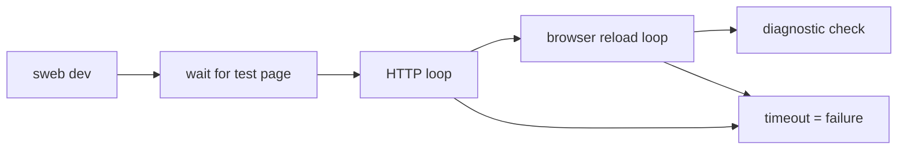
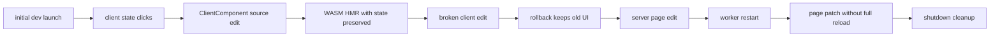

# SwiftWeb Browser E2E

These opt-in tests exercise the real browser. The development-loop tests build
and run the browser WASM runtime; the Service Actor test below isolates the
same-origin HTTP boundary without rebuilding the browser WASM bundle.

```bash
cd Tests/BrowserE2E
npm install
npm run install-webkit
npm run counter-wasm
npm run storyboard-navigation
npm run page-access:perf
npm run page-access:stress
```

`env-badge-smoke.mjs` is a focused smoke (not part of the npm scripts): given a
running dev server whose app renders `ClientEnvironmentBadge`, it verifies the
scene `.environment()` value travels SSR snapshot → wasm hydration →
`@Environment` after a client-side state change:

```bash
node env-badge-smoke.mjs "http://127.0.0.1:<port>"
```

Both counter commands run the same required two-engine gate. Install WebKit
before either command; its launch and close are checked before app preparation
or Swift builds:

```bash
cd Tests/BrowserE2E
npm run install-webkit
npm run counter-wasm:webkit
```

The test copies `Examples/CounterApp` into a temporary directory and rewrites
only `swift-web` to the local checkout. The example's `swift-html` declaration
remains `from: "0.16.0"`, but the current SwiftWeb graph pins the public revision
`573aba6454604780c07ad8a7aabd0e153423fe4b`; it does not resolve the `0.16.0` tag.
See the root [manifest](../../Package.swift) and [resolved pins](../../Package.resolved),
and retain the temporary CounterApp's `Package.resolved` as run-specific evidence.
The runner starts `sweb dev` and validates:

- an edit during the initial build converges to the latest source fingerprint
- a timestamp-only touch does not rebuild or replace the worker
- a killed worker relaunches from the existing artifact without rebuilding
- browser WASM runtime readiness
- WASM asset fetch and instantiation metrics
- ClientComponent `@State` updates through WASM event dispatch
- `.visible`, `.idle`, `.interaction`, and `.manual` ClientComponent loading policies
- named/shared split bundle contracts
- ServerAction page invalidation without full navigation
- Storyboard same-origin sidebar navigation without reloading or reinstantiating the WASM runtime
- Storyboard current-link state remains singular after client navigation and history traversal
- Storyboard browser history and native hash/external-link fallbacks
- ClientComponent HMR patching while preserving state
- ClientComponent HMR build failure rollback without replacing the old UI
- expired-generation `410 Gone` followed by an explicit reload onto the latest runtime
- Server worker restart HMR followed by page patch without losing compatible client state
- repeated page access liveness under direct HTTP and browser reload pressure
- dev process shutdown cleanup
- required WebKit hydration, client-to-Native Actor mutation without navigation, and server-rendered Actor value after reload

Chromium retains the full development/HMR suite above. WebKit then uses the
same server, reads its current Actor value, increments through the hydrated
client, and verifies the persisted value after reload. It waits for eager
hydration and the scheduled idle bundle before mutation/reload, then repeats
that readiness after reload before reporting and closing. Neither engine may skip.

The E2E uses separate host and WASM processes under one Swift 6.4 snapshot
contract:

| Toolchain | Purpose |
|---|---|
| Host Swift | Builds the `sweb` CLI and runs the development host with the pinned `swift-6.4.x-DEVELOPMENT-SNAPSHOT-2026-08-14-a` toolchain. |
| WASM Swift SDK | Builds client runtime bundles with the matching `swift-6.4.x-DEVELOPMENT-SNAPSHOT-2026-08-14-a_wasm` SDK. |

Configure the exact toolchain before running an E2E command:

```bash
export SWIFT_WEB_TOOLCHAIN_BIN="$HOME/Library/Developer/Toolchains/swift-6.4.x-DEVELOPMENT-SNAPSHOT-2026-08-14-a.xctoolchain/usr/bin"
export SWIFTWEB_E2E_HOST_SWIFT_EXECUTABLE="$SWIFT_WEB_TOOLCHAIN_BIN/swift"
export SWIFT_WEB_WASM_SWIFT="$SWIFT_WEB_TOOLCHAIN_BIN/swift"
export SWIFT_WEB_WASM_TOOLCHAIN_BIN="$SWIFT_WEB_TOOLCHAIN_BIN"
```

Environment variables:

| Name | Purpose |
|---|---|
| `SWIFTWEB_BROWSER_E2E` | Must be `1` to run. Raw execution without opt-in or an explicit requirement skips; an explicit required invocation without opt-in fails. |
| `SWIFTWEB_E2E_HOST_SWIFT_EXECUTABLE` | Swift executable used to build the host `sweb` CLI. Set this to the real pinned snapshot executable. |
| `SWIFTWEB_E2E_HEADFUL` | Set to `1` to show the browser. |
| `SWIFTWEB_E2E_PORT` | Fixed port. If omitted, an available port is selected. |
| `SWIFTWEB_E2E_TIMEOUT_MS` | Overall wait timeout for server, runtime, and HMR phases. |
| `SWIFTWEB_E2E_HMR_TIMEOUT_MS` | Timeout for individual HMR phases. Defaults to 300 seconds so cold Swift 6.4 snapshot builds can complete. |
| `SWIFT_WEB_WASM_SDK` | Swift SDK used for WASM client runtime builds. Defaults to `swift-6.4.x-DEVELOPMENT-SNAPSHOT-2026-08-14-a_wasm`. |
| `SWIFT_WEB_WASM_SWIFT` | Optional Swift executable override for WASM builds. |
| `SWIFT_WEB_WASM_TOOLCHAIN_BIN` | Optional WASM toolchain bin directory override. |
| `SWIFTWEB_E2E_BROWSER_EXECUTABLE_PATH` | Use a specific Chromium-compatible browser executable. |
| `SWIFTWEB_E2E_REQUIRE_WEBKIT` | Invocation-intent guard set to `1` by both npm counter commands. It rejects a missing opt-in; every enabled counter run requires WebKit regardless of this value. |
| `SWIFTWEB_E2E_KEEP_STORYBOARD` | Set to `1` to keep the generated `.swiftweb/storyboard` package after Storyboard navigation E2E. |

## Service Actor HTTP Boundary

`SwiftWebServiceActorBrowserTests` starts independent native Main and Service
hosts. Only the Service owns the concrete distributed actor. Chromium sends
Actor frames to Main's standard same-origin endpoint; `.actor` and `hostRoute`
must deliver the successful call without a local factory, `clientRoute`, or
application relay. Authorization rejection and an unbound identity must leave
the Service invocation count unchanged. CSRF and origin checks stay enabled.
This is browser HTTP-boundary evidence, not a Swift-WASM hydration test.

After configuring the pinned executable above, install the JavaScript test
dependencies from the repository root:

```bash
npm ci --prefix Tests/BrowserE2E
```

Install the Chromium build expected by the resolved Playwright version:

```bash
./Tests/BrowserE2E/node_modules/.bin/playwright install chromium
```

Alternatively, select an existing Chromium-compatible executable explicitly
before running the test, for example on macOS with Google Chrome installed:

```bash
export SWIFTWEB_E2E_BROWSER_EXECUTABLE_PATH="/Applications/Google Chrome.app/Contents/MacOS/Google Chrome"
```

With the browser available, build and run from the repository root:

```bash
scripts/swift-test-timeout.sh 1200 -- "$SWIFTWEB_E2E_HOST_SWIFT_EXECUTABLE" build --build-tests -j 2
SWIFTWEB_BROWSER_E2E=1 scripts/swift-test-timeout.sh 120 -- "$SWIFTWEB_E2E_HOST_SWIFT_EXECUTABLE" test --skip-build --filter SwiftWebServiceActorBrowserTests
```

A cached browser from another Playwright version is not selected automatically;
an `Executable doesn't exist` launch error is a missing test prerequisite, not
an Actor forwarding result. After correcting the executable, rerun the browser
test without rebuilding unchanged Swift sources.

The Swift test owns both hosts and the browser subprocess and has a
one-minute limit. Browser startup and each HTTP request also have bounded
timeouts.

## Stability Gates

| Gate | Command | Expected browser coverage |
|---|---|---|
| Default browser E2E | `npm run counter-wasm` | Full Chromium suite plus required WebKit hydration, Actor mutation, reload persistence, and diagnostics. |
| Storyboard navigation E2E | `npm run storyboard-navigation` | Chromium-compatible browser, same-origin client navigation, singular current sidebar link, back/forward, native hash/external fallback. |
| Page access performance | `npm run page-access:perf` | Opt-in local latency gate for repeated test-page HTTP requests plus same-page browser reloads. |
| Page access stress | `npm run page-access:stress` | Opt-in liveness gate for repeated test-page direct HTTP and browser access with per-request timeouts. |
| Full local browser E2E | `npm run counter-wasm:webkit` | Alias for the same required two-engine counter gate. |
| Actor HTTP ABI boundary | [ActorTransportBoundary](ActorTransportBoundary/README.md) | Pinned Standard and Embedded WASM in Chromium, controlled fetch/host peers, 0/1 MiB equality, required copies, exact failures, and cleanup; not generated Embedded page or cloud E2E. |

The fail-fast regression probes require no Swift build or running server:

```bash
../../scripts/swift-test-timeout.sh 90 -- node --test counter-wasm-preflight.test.mjs
```

The page access performance and stress gates are special tests and should not be part of
the default fast test loop. They exist to detect the dev host becoming unresponsive during
continued page access:


```mermaid
flowchart LR
  A["sweb dev"] --> B["wait for test page"]
  B --> C["HTTP loop"]
  C --> D["browser reload loop"]
  D --> E["diagnostic check"]
  C --> F["timeout = failure"]
  D --> F
```

Useful tuning variables:

| Name | Purpose |
|---|---|
| `SWIFTWEB_PAGE_ACCESS_HTTP_ITERATIONS` | Number of direct test-page requests. |
| `SWIFTWEB_PAGE_ACCESS_HTTP_CONCURRENCY` | Direct HTTP request concurrency. |
| `SWIFTWEB_PAGE_ACCESS_BROWSER_ITERATIONS` | Number of browser page access iterations. |
| `SWIFTWEB_PAGE_ACCESS_REQUEST_TIMEOUT_MS` | Per direct HTTP request timeout. |
| `SWIFTWEB_PAGE_ACCESS_BROWSER_TIMEOUT_MS` | Per browser navigation/readiness timeout. |
| `SWIFTWEB_PAGE_ACCESS_MAX_HTTP_P95_MS` | Optional p95 threshold; enabled by default for `page-access:perf`. |
| `SWIFTWEB_PAGE_ACCESS_REUSE_BROWSER_PAGE` | Override browser mode; `page-access:perf` reuses one page, `page-access:stress` opens fresh pages by default. |

The retained HelloWorld baseline at SwiftWeb `32d66b2` used the pinned August 14
Swift 6.4 toolchain and default profiles after removing the unsupported
`sweb dev --scratch-path` argument. No new CLI option or latency policy was added.

| Profile | HTTP workload / observed p95 | Browser workload / observed p95 | Acceptance |
|---|---|---|---|
| Performance | 60 requests, concurrency 4 / 13 ms | 12 same-page accesses / 493 ms | Existing HTTP p95 limit 2500 ms and existing operation timeouts |
| Stress | 240 requests, concurrency 8 / 20 ms | 40 new-page accesses / 430 ms | Existing operation timeouts; no added latency threshold |

Both reports had empty unexpected-diagnostic collections, server exit 0, and
no remaining owned process/listener. This unchanged page owner is not rerun for
the browser Actor-copy-only change. The separate ABI fixture's before/after
copy measurements are documented by [ClientRuntime](../../Sources/SwiftWebBrowser/ClientRuntime/DESIGN.md),
not inferred from these page timings.

The full gate is intended to prove the browser-visible dev loop, not just unit-level runtime helpers:


```mermaid
flowchart LR
  A["initial dev launch"] --> B["client state clicks"]
  B --> C["ClientComponent source edit"]
  C --> D["WASM HMR with state preserved"]
  D --> E["broken client edit"]
  E --> F["rollback keeps old UI"]
  F --> G["server page edit"]
  G --> H["worker restart"]
  H --> I["page patch without full reload"]
  I --> J["shutdown cleanup"]
```

A passing E2E means the HMR loop behaved correctly and cleaned up after itself;
it does not establish a cold-start performance budget. Record build-phase timing
from the JSON report when evaluating developer experience regressions. The full
release acceptance contract is in
[`docs/DevServerReconcilerVerification.md`](../../docs/DevServerReconcilerVerification.md).
