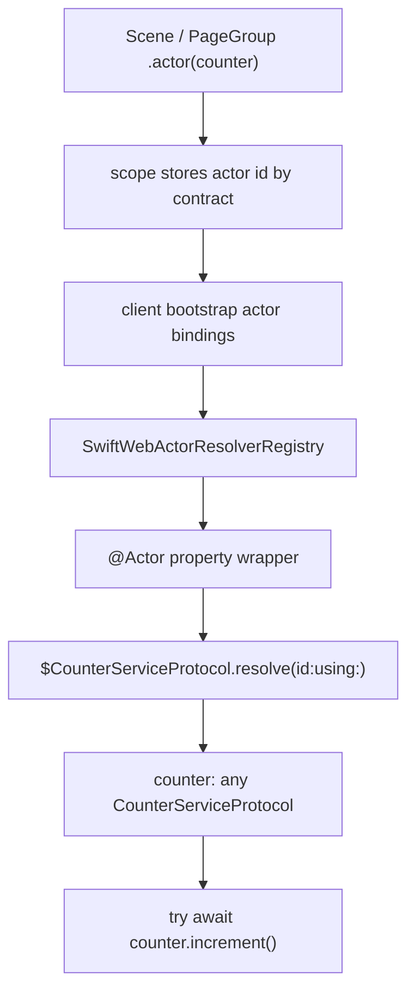
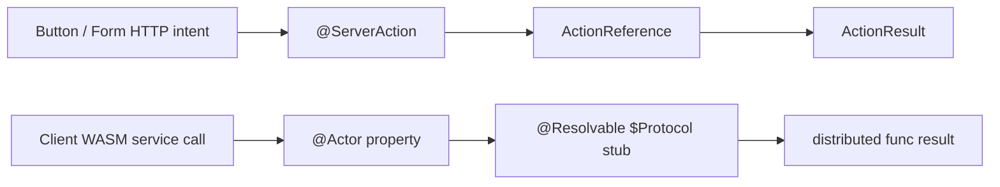

# Actor Injection Design

Status: implemented contract for the `@Actor` client component API.

SwiftWeb actor injection is a convenience layer over Apple's `@Resolvable`
distributed actor protocol model. It must not introduce a second RPC system.
The public goal is that a client component reads an `@Actor` property as the
resolved service object and calls distributed methods directly.



## Public Surface

The service contract is an Apple `@Resolvable` distributed actor protocol.

```swift
@Resolvable
public protocol CounterServiceProtocol: DistributedActor
where ActorSystem == WebActorSystem {
    distributed func currentValue() async throws -> Int
    distributed func increment() async throws -> Int
}
```

The server implementation is an ordinary distributed actor using
`WebActorSystem`.

```swift
@ResolvableActor(CounterServiceProtocol.self)
public distributed actor CounterService: CounterServiceProtocol {
    public typealias ActorSystem = WebActorSystem

    private var value = 0

    public distributed func currentValue() async throws -> Int {
        value
    }

    public distributed func increment() async throws -> Int {
        value += 1
        return value
    }
}
```

The app or scene provides the actor instance declaratively.

```swift
public struct MyApp: App {
    private let counter = CounterService(actorSystem: .shared)

    public var body: some Scene {
        CounterPage()
            .actor(counter)
    }
}
```

The client component consumes the resolved actor object.

```swift
public struct CounterClient: ClientComponent {
    @Actor
    private var counter: any CounterServiceProtocol

    public func increment() async throws -> Int {
        try await counter.increment()
    }
}
```

## Contract

| Area | Required behavior |
|---|---|
| Wrapped value | `@Actor` exposes the resolved `@Resolvable` protocol object, not an actor id, resolver, or transport handle. |
| Resolver | Resolution uses Apple's generated `$Protocol.resolve(id:using:)` entrypoint. |
| Contract key | Actor bindings are keyed by the `@Resolvable` contract generated for the declared property type. String keys are not part of the standard API. |
| Scene export | `.actor(actor)` exports a server-side distributed actor id into the current scene scope. |
| Component scope | Client components receive actor bindings from the page or scene scope that rendered them. |
| Missing actor | Missing bindings are configuration errors detected before component activation. Component code should not handle missing actor ids. |
| Ambiguous actor | More than one actor for the same contract in the same scope is invalid. Nested scopes may override parent bindings. |
| Standard API | Component authors do not read `WebActorSystem`, `ActorID`, or `$Protocol.resolve` directly. |

## Actor Export Contract Discovery

`.actor(actor)` is type-based, not string-based. The implementation must attach
compile-time export metadata to actor implementations so SwiftWeb can map the
server actor instance to the `@Resolvable` contract used by `@Actor`.

| Actor implementation shape | `.actor(actor)` behavior |
|---|---|
| Actor has exactly one SwiftWeb-exported `@Resolvable` contract | Valid; the actor id is registered for that contract in the current scope. |
| Actor has no SwiftWeb-exported `@Resolvable` contract | Invalid; emit a compile-time diagnostic where possible, otherwise fail app startup. |
| Actor has multiple exported contracts | Invalid for the initial `.actor(actor)` surface; require a future typed disambiguation API, not a string key. |

The contract metadata can be produced by a dedicated macro or by compiler-visible
conformance analysis, but it is an implementation detail. The app-facing scene
API remains:

```swift
CounterPage()
    .actor(counter)
```

The component-facing API remains:

```swift
@Actor
private var counter: any CounterServiceProtocol
```

## Macro And Runtime Responsibilities

| Layer | Responsibility |
|---|---|
| `@Resolvable` | Generates the concrete `$Protocol` distributed actor stub and typed `resolve(id:using:)` entrypoint. |
| `SwiftWebMacros.@ResolvableActor` | Adds `SwiftWebActorExporting` conformance to a server actor implementation and records the exported `@Resolvable` contract. |
| `SwiftWebPackageGeneration` | Reads `@Actor` property declarations in copied client component source and emits a WASM resolver registry using the generated `$Protocol` stub type. |
| `SwiftWeb` scene model | Records `.actor(actor)` exports as scene metadata and includes matching actor ids in client bootstrap data. |
| `SwiftWebActors` | Provides `WebActorSystem`, invocation envelope encoding/decoding, local actor registry, `WebActorTransport`, `@Actor`, and actor binding resolution. |
| `SwiftWebUIRuntime` | Provides the browser-side `WebActorTransport` and installs bootstrap actor bindings around client render and event dispatch. |
| Host adapter | Mounts the actor gateway, validates requests, and dispatches envelopes into `WebActorSystem.shared`. |

## Expansion Model

`@Actor` is a runtime property wrapper. It derives its binding key from the
declared wrapped value type. The generated WASM entrypoint separately registers
the matching resolver for the same contract:

```swift
@Actor
private var counter: any CounterServiceProtocol
```

```swift
private let actorResolvers = SwiftWebActorResolverRegistry([
    SwiftWebActorResolver(
        contract: SwiftWebActorContractKey(
            String(reflecting: (any CounterServiceProtocol).self)
        ),
        actorContract: $CounterServiceProtocol.self
    )
])
```

The component receives `counter` as an already resolved object. Resolution
failure is a SwiftWeb configuration/runtime bootstrap error, not an ordinary
application branch inside component code.

## Boundary With Low-Level APIs

Low-level code may still call `$Protocol.resolve(id:using:)` directly. That is
the primitive operation provided by Apple's `@Resolvable` model and
`WebActorSystem`.

The standard component API is higher level:

| Low-level primitive | Standard SwiftWeb surface |
|---|---|
| `WebActorSystem` | Hidden from ordinary components. |
| `ActorID` | Derived from scene actor bindings. |
| `$Protocol.resolve(id:using:)` | Generated behind `@Actor`. |
| Manual actor stub storage | `@Actor var service: any ServiceProtocol`. |

## Server Actions Remain Separate

`@Actor` is not a server action shortcut. Server Actions are page-local HTTP
commands that return `ActionResult` or typed codable responses. Actor injection
is for direct, typed calls from a client component to a long-lived or
session-scoped distributed actor service.



## Rejected Shapes

| Shape | Reason |
|---|---|
| `@ActorSystem` as the standard component API | It exposes transport and runtime plumbing instead of the service object the component needs. |
| `@ActorID` as the standard component API | It forces component code to resolve manually and duplicates bootstrap logic. |
| SwiftWeb-owned RPC proxy | It competes with Apple's `@Resolvable` model and creates two RPC systems. |
| `@Actor("name")` | String keys weaken type safety and make actor bindings harder to refactor. |
| `.actor(actor, as: Protocol.self)` as the primary API | Protocol metatypes are useful as erased keys, but they do not satisfy `DistributedActor` generic constraints and can imply more type safety than Swift can prove. |
