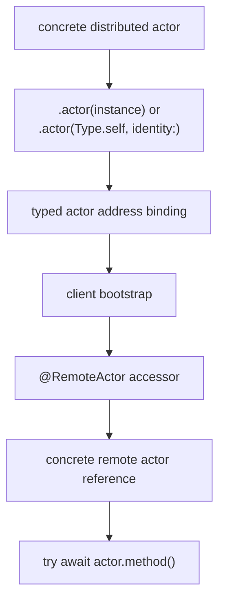
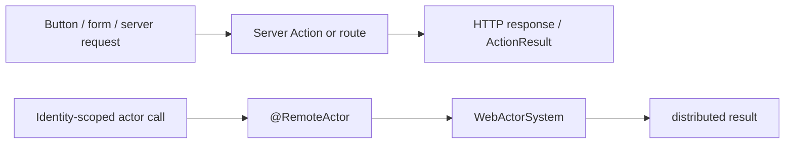

# Actor Injection Design

Status: concrete same-application and deployment-bound cross-application actor
binding are implemented. The former `@Resolvable` protocol model is
legacy-only.

Last updated: 2026-08-23.

`@RemoteActor` is a SwiftWeb injection convenience for a concrete Swift
Distributed Actor reference. It does not define a service protocol, proxy, or
transport API.


```mermaid
flowchart TD
  Actor["concrete distributed actor"] --> Scene[".actor(instance) or<br/>.actor(Type.self, identity:)"]
  Scene --> Binding["typed actor address binding"]
  Binding --> Bootstrap["client bootstrap"]
  Bootstrap --> Macro["@RemoteActor accessor"]
  Macro --> Reference["concrete remote actor reference"]
  Reference --> Call["try await actor.method()"]
```

## Public Surface

The concrete actor declaration is the contract and host-side implementation.

```swift
import Distributed
import SwiftWeb

public distributed actor CounterService {
    public typealias ActorSystem = WebActorSystem

    private var value = 0

    public distributed func currentValue() async throws -> Int {
        value
    }

    public distributed func increment() async throws -> Int {
        value += 1
        return value
    }
}
```

The app binds an existing actor instance to a scene when it owns that actor.

```swift
public struct CounterApp: App {
    private let counter = CounterService(actorSystem: .shared)

    public var body: some Scene {
        ActorScene(counter) {
            CounterPage(counterService: counter)
        }
    }
}
```

The equivalent modifier form is:

```swift
CounterPage(counterService: counter)
    .actor(counter)
```

For an actor hosted by another Service application, the caller binds the
concrete type and logical identity at the page or scene. It does not construct
the actor, endpoint, or transport.

```swift
public struct CalendarApp: App {
    public var body: some Scene {
        CalendarPage()
            .actor(
                CalendarDatabaseActor.self,
                identity: CalendarDatabaseActorIdentity.production
            )
    }
}
```

`PageRoute` and `Scene` remain separate protocols, just as SwiftUI keeps
`View` and `Scene` separate. Both expose the same semantic modifier name.
Applying the modifier to a `PageRoute` lowers that page into a scene; applying
it to a `PageGroup` or another `Scene` scopes every route below it.

A client component consumes the concrete reference.

```swift
public struct CounterClient: ClientComponent {
    @RemoteActor
    private var counter: CounterService

    public func increment() async throws -> Int {
        try await counter.increment()
    }
}
```

Component code does not read `ActorAddress`, construct `WebActorSystem`, call a
resolver, or select HTTP/WebSocket endpoints.

## Binding Contract

| Area | Required behavior |
|---|---|
| Property value | `@RemoteActor` exposes the concrete actor reference declared by the property type |
| Contract key | Generated from the actor's stable `ActorTypeID`, not a reflection string |
| Local scene export | `ActorScene` and `.actor(instance)` export an existing actor address into the rendering scope |
| Remote scene export | `.actor(Type.self, identity:)` resolves the concrete reference and exports it into a page or scene scope |
| Virtual actors | `ActorGroup` registers a concrete actor factory by generated actor type metadata |
| Component scope | Client components receive bindings from the scene scope that rendered them |
| Missing binding | Configuration error; application code does not receive an optional transport handle |
| Ambiguous binding | One rendering scope contains at most one injected address for one concrete actor contract |
| Routing | The resolved actor reference delegates location selection to `WebActorSystem`; deployment binding data supplies transport and endpoint templates |
| Failure | Calls propagate typed Actor-system or application failure without Server Action fallback |

The binding contains logical identity. It does not make endpoint location part
of actor identity. Cross-application routes are supplied separately by the
runtime design in [Remote Connection Architecture](RemoteConnectionArchitecture.md).

## Runtime Responsibilities

| Layer | Responsibility |
|---|---|
| Swift compiler | Emits the Distributed Actor invocation thunk and concrete actor reference behavior |
| `ActorSystemGeneration` | Produces stable actor descriptors, client projections, and resolver bootstrap metadata |
| `SwiftWebMacros.RemoteActorMacro` | Expands the property accessor into typed binding resolution |
| SwiftWeb package generation | Pre-expands client-source accessors and installs generated actor metadata in standard/Embedded WASM artifacts |
| `ActorScene` / `.actor(instance)` | Registers a bound host actor and exports its address into the scene scope |
| `.actor(Type.self, identity:)` | Resolves a location-free reference and materializes the deployment route for that identity |
| `ActorGroup` | Registers a host-side factory for virtual activation |
| `SwiftWebActorBindingScope` | Maps the concrete actor contract to its address and resolving actor system |
| `WebActorSystem` | Executes locally or routes the invocation through `ActorSystemCore` |
| Host adapter | Authenticates and moves bounded actor frames; it does not define the actor API |

## Expansion Model

`@RemoteActor` is an attached accessor macro, not a property wrapper type. The
source form:

```swift
@RemoteActor
private var counter: CounterService
```

expands conceptually to a typed lookup:

```swift
private var counter: CounterService {
    get {
        SwiftWebActorBinding.resolveActor(
            CounterService.self,
            contract: SwiftWebActorContractKey(CounterService.self)
        )
    }
}
```

Generated browser packages compile without the macro plugin. Package
generation applies the same accessor expansion while copying selected client
sources and installs the generated concrete actor resolver in the client
bootstrap.

## Server Connections Remain Separate

`@RemoteActor` is not a shortcut for an arbitrary remote server.


```mermaid
flowchart LR
  Intent["Button / form / server request"] --> Server["Server Action or route"]
  Server --> Response["HTTP response / ActionResult"]

  ActorIntent["Identity-scoped actor call"] --> Property["@RemoteActor"]
  Property --> System["WebActorSystem"]
  System --> ActorResult["distributed result"]
```

A Service application may host both routes and actors. Its build/deploy entry
does not change which Swift programming model the caller uses.

## Low-level Resolution

Infrastructure and advanced actor code may resolve a known identity through
the native Distributed Actor surface:

```swift
let actor = try CounterService.resolve(
    id: address,
    using: actorSystem
)
```

This remains a primitive for actor-system and virtual-actor code. The standard
component surface is the injected concrete actor reference.

## Legacy Compatibility

The former primary model used `@Resolvable` protocols,
`@ResolvableActor(Protocol.self)`, compiler-generated `$Protocol` stubs,
`LegacyWebActorSystem`, and JSON envelopes. It is available only through the
explicit `LegacyActors` package trait.

Legacy bindings do not define the current architecture:

- new source declares one concrete distributed actor;
- new `@RemoteActor` properties use that concrete type;
- binary actor frames do not fall back to the legacy JSON endpoint; and
- standard/Embedded generated clients reject legacy protocol-existential
  bindings.

Git history retains the detailed 0.11.0 legacy expansion design. Current
migration and isolation rules are authoritative in
[Swift Actor System Design](SwiftActorSystemDesign.md#legacy-compatibility).

## Rejected Shapes

| Shape | Reason |
|---|---|
| `@ActorSystem` as the standard component dependency | Exposes runtime plumbing instead of the actor reference |
| `@ActorID` as the standard component dependency | Forces application code to perform manual resolution |
| SwiftWeb-owned RPC proxy | Creates a second invocation model beside Swift Distributed Actors |
| `@ServiceClient` for an actor | Reclassifies an identity-scoped actor as an endpoint-scoped service |
| `@RemoteActor("name")` | Replaces generated type identity with an unverified application string |
| Endpoint or adapter arguments on `@RemoteActor` | Breaks location transparency and environment-independent Swift source |

## Related Documents

- [Remote Connection Architecture](RemoteConnectionArchitecture.md)
- [Swift Actor System Design](SwiftActorSystemDesign.md)
- [SwiftWebActors runtime overview](../Sources/SwiftWebRuntime/Actors/README.md)
