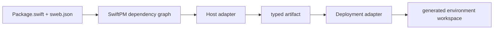
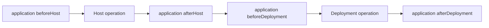

# Host and Deployment Adapter Contract

SwiftWeb applications select a host and a deployment environment through a
source-controlled `sweb.json`. Adapter packages are ordinary direct SwiftPM
dependencies. `sweb` discovers their `Adapter/sweb.json` manifests from the
resolved package graph; it has no Cloudflare, Vapor, or other platform-specific
command implementation.



## Application manifest

The application owns `<package-root>/sweb.json` with schema version 2:

```json
{
  "schemaVersion": 2,
  "application": {
    "product": "MyApp",
    "module": "MyApp",
    "type": "MyApp"
  },
  "environments": {
    "local": {
      "host": "swift-web/http-server",
      "deployment": "swift-web/local"
    },
    "production": {
      "host": "swift-web-cloudflare/page-worker",
      "deployment": "swift-web-cloudflare/page-worker",
      "overlays": [],
      "operations": {}
    }
  },
  "defaults": {
    "build": "production",
    "dev": "local",
    "deploy": "production"
  }
}
```

Selectors use `<adapter-id>/<component>`. Omitting the component selects the
adapter manifest's default. `module` may be omitted when it equals `product`.
`overlays` copy application-owned files into the generated workspace after the
selected adapter templates, so application configuration remains authoritative.

## Adapter package manifest

An adapter package exposes `Adapter/sweb.json`:

```json
{
  "schemaVersion": 2,
  "kind": "adapter",
  "id": "example-platform",
  "defaults": {
    "host": "worker",
    "deployment": "production"
  },
  "hosts": {
    "worker": {
      "produces": ["example.wasm-module"],
      "templates": [],
      "variables": {},
      "operations": {}
    }
  },
  "deployments": {
    "production": {
      "accepts": ["example.wasm-module"],
      "produces": ["example.deployment-version"],
      "templates": [],
      "variables": {},
      "operations": {}
    }
  }
}
```

Host and Deployment are separate responsibilities. A Host turns the SwiftWeb
application into a runnable artifact. A Deployment accepts that artifact and
owns the external platform lifecycle. `sweb` rejects a selected pair when the
Host's `produces` and Deployment's `accepts` have no matching artifact.

## Templates and generated state

Templates are relative to the adapter package root and are copied into:

```text
.swiftweb/generated/environments/<environment>/workspace/
```

Text templates may use:

| Placeholder | Value |
|---|---|
| `{{project.root}}` | Application package root |
| `{{generated.root}}` | Selected environment's generated root |
| `{{workspace.root}}` | Materialized workspace root |
| `{{environment.name}}` | Environment name |
| `{{application.packageIdentity}}` | Resolved SwiftPM package identity |
| `{{application.product}}` | Application library product |
| `{{application.module}}` | Application module |
| `{{application.type}}` | Concrete `App` type |
| `{{application.kebabName}}` | Product name converted to kebab case |
| `{{adapter.<id>.root}}` | Resolved adapter package root |
| `{{adapter.<id>.swiftPackageRequirement}}` | Resolved SwiftPM URL/version or local path arguments |

Adapter component variables extend this set. Binary files are copied unchanged.
Symlinks and paths escaping their declared root are rejected. Re-materialization
removes stale managed files but preserves untracked build state such as
`node_modules` and compiler caches.

The selected components and resolved package paths are recorded in
`plan.lock.json`. This is generated evidence, not application configuration.

## Lifecycle tasks

Each component and application environment can declare tasks for `prepare`,
`build`, `dev`, and `deploy`. A command task has a stable `id`, `executable`,
optional `arguments`, `workingDirectory`, `environment`, `dependsOn`, `inputs`,
and `outputs`. Application tasks can select `beforeHost`, `afterHost`,
`beforeDeployment`, or `afterDeployment`.



Dependencies form one directed acyclic graph per operation. Duplicate task IDs,
missing dependencies, and cycles fail before execution. `sweb deploy` executes
prepare, build, and deploy in that order; only the final deployment operation may
change remote state.

A Host adapter sets `SWIFTWEB_HOSTED_APPLICATION=1` while it builds the
application artifact. Application packages may use this semantic build context
to exclude development-only products and sources. Adapter- or provider-specific
environment names must not be required by the application package.

## Responsibility boundary

| Owner | Responsibility |
|---|---|
| Application | Host-neutral Swift source, environment selection, overlays, application-specific verification |
| Host adapter | Launcher, runtime binding, build toolchain, artifact production |
| Deployment adapter | Platform files, local platform process, validation, deployment |
| `sweb` | SwiftPM discovery, validation, materialization, task planning, execution |
| SwiftWeb runtime | `AppRenderer`, `RenderedApp`, routes, middleware, actions, and application semantics |

Platform packages do not ship a competing CLI. Adding one to `Package.swift`
is sufficient for `sweb` to discover it.
