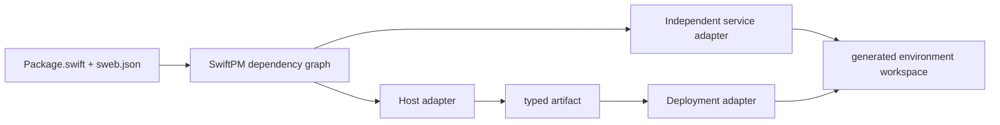
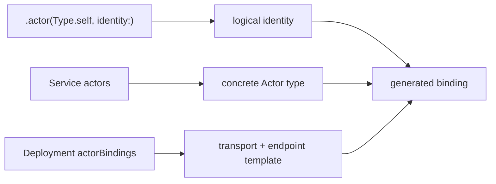
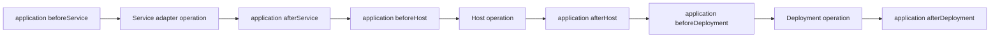

# Host, Deployment, and Service Adapter Contract

SwiftWeb applications select a host and a deployment environment through a
source-controlled `sweb.json`. Adapter packages are ordinary direct SwiftPM
dependencies. `sweb` discovers their `Adapter/sweb.json` manifests from the
resolved package graph; it has no Cloudflare, Vapor, or other platform-specific
command implementation.

This document describes the schema-version-3 implementation released in
SwiftWeb 0.12.0. Use a CLI, SwiftWeb dependency, and adapter manifests with
that same schema contract.



## Application manifest

The application owns `<package-root>/sweb.json` with schema version 3:

```json
{
  "schemaVersion": 3,
  "application": {
    "product": "MyApp",
    "module": "MyApp",
    "type": "MyApp"
  },
  "services": {
    "database": {
      "application": {
        "product": "MyDatabase",
        "module": "MyDatabase",
        "type": "MyDatabaseApplication"
      },
      "adapter": "database-platform/cloudflare",
      "adapterTraits": ["GraphIndexes"],
      "actors": [
        {
          "product": "MyDatabaseContract",
          "module": "MyDatabaseContract",
          "type": "DatabaseActor"
        }
      ]
    }
  },
  "environments": {
    "local": {
      "host": "swift-web/http-server",
      "deployment": "swift-web/local"
    },
    "production": {
      "host": "swift-web-cloudflare/page-worker",
      "deployment": "swift-web-cloudflare/page-worker",
      "services": ["database"],
      "overlays": [],
      "operations": {}
    }
  },
  "defaults": {
    "build": "production",
    "dev": "local",
    "deploy": "production"
  }
}
```

Selectors use `<adapter-id>/<component>`. Omitting the component selects the
adapter manifest's default. `module` may be omitted when it equals `product`.
`overlays` copy application-owned files into the generated workspace after the
selected adapter templates, so application configuration remains authoritative.

## Adapter package manifest

An adapter package exposes `Adapter/sweb.json`:

```json
{
  "schemaVersion": 3,
  "kind": "adapter",
  "id": "example-platform",
  "defaults": {
    "host": "worker",
    "deployment": "production"
  },
  "hosts": {
    "worker": {
      "produces": ["example.wasm-module"],
      "templates": [],
      "variables": {},
      "operations": {}
    }
  },
  "deployments": {
    "production": {
      "accepts": ["example.wasm-module"],
      "acceptsServiceArtifacts": ["example.external-service"],
      "actorBindings": {
        "example.external-service": {
          "hostRoute": {
            "transport": "swiftweb.http",
            "endpointPrefix": "example-service://{{service.name}}/"
          },
          "configuration": {}
        }
      },
      "produces": ["example.deployment-version"],
      "templates": [],
      "variables": {},
      "operations": {}
    }
  },
  "services": {
    "database": {
      "produces": ["example.external-service"],
      "templates": [],
      "variables": {},
      "operations": {}
    }
  }
}
```

Host and Deployment are separate responsibilities. A Host turns the SwiftWeb
application into a runnable artifact. A Deployment accepts that artifact and
owns the external platform lifecycle. `sweb` rejects a selected pair when the
Host's `produces` and Deployment's `accepts` have no matching artifact.

A Service is another application with its own adapter, workspace, artifact,
and lifecycle. It is never linked into the primary application's artifact.
The selected Deployment declares the service artifact kinds it can bind
through `acceptsServiceArtifacts`. `sweb` validates the service graph and runs
services before the primary deployment for finite lifecycle operations.
Environment and service names begin with a lowercase ASCII letter and contain
only lowercase ASCII letters, digits, and hyphens. This keeps generated paths,
task IDs, and placeholder namespaces unambiguous. Adapter trait names contain
only ASCII letters, digits, hyphens, and underscores before they are rendered
into a generated SwiftPM manifest.

### Service programming-model boundary

A Service entry is a build/deploy unit, not a Swift-facing interface. A service
application may expose ordinary Server routes, an Actor host, or both. Server
callers continue to use the existing request/response surface. Actor callers
use the concrete Swift Distributed Actor type through `@RemoteActor` and
`WebActorSystem`; they do not use `@ServiceClient` or a manifest-generated
service protocol.

Schema version 3 does not make every Service an Actor. A project Service may
name concrete actor contracts in `actors`; it never stores their logical
identities. Identity remains in Swift at `.actor(Type.self, identity:)`.

A Deployment advertises Actor-host capability for a service artifact through a
structured `actorBindings` entry. `hostRoute` is required and `clientRoute` is
optional. Routes contain transport, endpoint prefix, and endpoint suffix.
Platform values such as a Cloudflare binding name belong in `configuration`.
The adapter manifest cannot provide identity or an arbitrary Swift expression.
When a selected Service declares actors, `sweb` requires exactly one accepted
artifact binding and fails resolution otherwise.

If `clientRoute` is absent, browser calls use the primary application's
same-origin Actor frame endpoint. The runtime admits that gateway only for the
exact `.actor(Type.self, identity:)` address associated with this `hostRoute`,
applies the primary application's Actor authorization, and then uses the
deployment-owned `hostRoute` for the Service hop. If `clientRoute` is present,
it is serialized for direct browser routing and the same-origin gateway is not
enabled for that binding. Neither form delegates browser credentials to the
Service; Service-hop authentication remains adapter-owned.



The Swift-facing binding and admission contract is defined beside the runtime
in the [Actor runtime contract](../Sources/SwiftWebRuntime/Actors/README.md).

## Templates and generated state

Templates are relative to the adapter package root and are copied into:

```text
.swiftweb/generated/environments/<environment>/workspace/
├── services/<service-name>/
└── <primary host and deployment files>
```

Text templates may use:

| Placeholder | Value |
|---|---|
| `{{project.root}}` | Application package root |
| `{{generated.root}}` | Selected environment's generated root |
| `{{workspace.root}}` | Materialized workspace root |
| `{{environment.name}}` | Environment name |
| `{{application.packageIdentity}}` | Resolved SwiftPM package identity |
| `{{application.product}}` | Application library product |
| `{{application.module}}` | Application module |
| `{{application.swiftImport}}` | Application import using its collision-safe launcher module reference |
| `{{application.type}}` | Concrete `App` type |
| `{{application.kebabName}}` | Product name converted to kebab case |
| `{{adapter.<id>.root}}` | Resolved adapter package root |
| `{{adapter.<id>.swiftPackageRequirement}}` | Resolved SwiftPM remote URL with an exact version or immutable revision, or an explicit local-development path |
| `{{actors.swiftImports}}` | Imports for concrete Actor contracts selected by the environment |
| `{{actors.swiftCompilerFlags}}` | Comma-separated quoted Swift arguments for the launcher's `.unsafeFlags([...])`, or empty when no module alias is needed |
| `{{actors.swiftProductDependencies}}` | SwiftPM product dependencies required by generated Actor descriptors |
| `{{actors.swiftServiceBindings}}` | Typed `SwiftWebActorServiceBinding` values for the host launcher |
| `{{actors.deploymentBindingsJSON}}` | Structured deployment bindings for the platform request bridge |

Service templates and tasks additionally receive `{{service.name}}`,
`{{service.workspace}}`, `{{service.application.*}}`, and
`{{service.adapter.*}}`. `{{service.adapter.swiftPackageTraits}}` renders the
validated `adapterTraits` array as a SwiftPM dependency suffix, keeping Swift
syntax out of application variables. Materialized execution values are namespaced as
`{{services.<name>.*}}`, preventing two service instances from sharing mutable
build state.

Adapter component variables extend this set. Binary files are copied unchanged.
Symlinks and paths escaping their declared root are rejected. Re-materialization
removes stale managed files but preserves untracked build state such as
`node_modules` and compiler caches.

SwiftPM dependency inspection supplies graph topology and checkout paths but
may report `version: "unspecified"` for an exact-revision dependency. The
materializer joins each remote adapter identity with its `Package.resolved` pin
and renders `.package(url:revision:)`; it does not reinterpret the checkout as
a local package. Versioned remote adapters continue to render
`.package(url:exact:)`. A remote adapter without either an exact version or a
resolved revision is an explicit materialization failure.

A local adapter selected intentionally during development continues to render
`.package(path:)`. The generated host package's `.package(path:
"{{project.root}}")` is also retained because it composes the authored
application sources into their generated host; it is not an external adapter
dependency or a substitute for source-control provenance.

Swift source permits an imported module qualifier to be shadowed by an
in-scope type with the same identifier. Before rendering Swift imports and
Actor binding expressions, the materializer compares every qualifier only with
the known top-level application and service type identifiers. This collision
set contains the first Swift path component of `application.type`, every
`service.application.type`, and every declared `service.actors[].type`. Module
identifiers do not cause collisions with themselves; they belong only to the
alias name reservation set. A colliding module is assigned the first unused
`SwiftWebGeneratedActorModule<N>` alias in sorted original-module order. The
chosen alias must not equal a known module, known type, or previously selected
alias.

`{{application.swiftImport}}` and `{{actors.swiftImports}}` import the selected
reference, and `{{actors.swiftServiceBindings}}` qualifies each Actor type with
that same reference. `{{actors.swiftCompilerFlags}}` supplies the quoted
`"-module-alias", "Alias=Original"` argument pair for each collision, joined
for direct insertion inside the launcher target's `.unsafeFlags([...])`; it is
empty when no alias exists and does not render a complete `SwiftSetting`. The
application and service packages are not rebuilt with SwiftPM `moduleAliases`,
and their recorded module names, ABI names, Actor IDs, and schema fingerprints
do not change.
Non-colliding rendered imports and binding expressions retain their existing
meaning. Actor types with the same name in different modules remain module
qualified; the materializer never resolves this collision by emitting an
unqualified Actor type.

The selected components, resolved package paths, and concrete Actor contract
types are recorded in schema-version-3 `plan.lock.json`. Logical identities and
routes are not copied into the lock. This is generated evidence, not
application configuration.

## Lifecycle tasks

Each component and application environment can declare tasks for `prepare`,
`build`, `dev`, and `deploy`. A command task has a stable `id`, `executable`,
optional `arguments`, `workingDirectory`, `environment`, `dependsOn`, `inputs`,
and `outputs`. Environment tasks can select `beforeHost`, `afterHost`,
`beforeDeployment`, or `afterDeployment`. Application-owned service tasks use
`beforeService` or `afterService`; a missing service stage means
`afterService`. Host and deployment stages are rejected inside an application
service. Service adapter tasks define the service lifecycle itself and therefore
do not declare an application lifecycle stage. Service lifecycle tasks use the
`command` kind because each service adapter owns its generated application
package; the primary Host's built-in preparation, build, and development kinds
cannot operate on a service application. Relative service task paths resolve
from `{{service.workspace}}`, while paths rooted at an explicit root
placeholder remain rooted there.

Command tasks whose process must remain alive for the complete development
session declare `"lifetime": "persistent"`. During `dev`, persistent service
and primary deployment tasks run concurrently. Exiting one persistent task
fails the lifecycle and cancels all remaining process groups.
After dependency validation, `sweb` preserves topological order within each
lifetime and normalizes the plan so every finite development task completes
before any persistent process starts. A task may depend on a finite task, but no
task may wait for a persistent task to exit.



Dependencies form one directed acyclic graph per operation. Duplicate task IDs,
missing dependencies, and cycles fail before execution. `sweb deploy` executes
prepare, build, and deploy in that order; only the final deployment operation may
change remote state.

A Host adapter sets `SWIFTWEB_HOSTED_APPLICATION=1` while it builds the
application artifact. Application packages may use this semantic build context
to exclude development-only products and sources. Adapter- or provider-specific
environment names must not be required by the application package.

## Responsibility boundary

| Owner | Responsibility |
|---|---|
| Application | Host-neutral Swift source, environment selection, overlays, application-specific verification |
| Host adapter | Launcher, runtime binding, build toolchain, artifact production |
| Deployment adapter | Platform files, local platform process, validation, deployment |
| Service adapter | Independent application templates, artifact production, and platform lifecycle |
| `sweb` | SwiftPM discovery, service DAG validation, isolated materialization, task planning, execution |
| SwiftWeb runtime | `AppRenderer`, `RenderedApp`, routes, middleware, actions, and application semantics |

Platform packages do not ship a competing CLI. Adding one to `Package.swift`
is sufficient for `sweb` to discover it.
