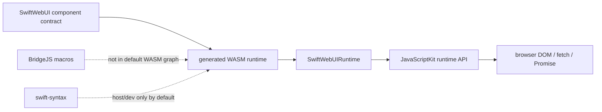

# Browser Runtime JavaScriptKit Decision

## Status

| Field | Value |
|---|---|
| Status | Accepted |
| Decision date | 2026-06-19 |
| Scope | Generated browser WASM packages and SwiftWebUIRuntime browser integration |
| Default | Runtime-only JavaScriptKit source copy |
| Explicit non-goal | Exposing JavaScriptKit BridgeJS as the default SwiftWebUI browser programming model |

## Decision

SwiftWeb browser WASM packages must use JavaScriptKit as a runtime adapter by default. They copy the JavaScriptKit runtime sources needed by `SwiftWebUIRuntime` and `_CJavaScriptKit`, but they do not include JavaScriptKit BridgeJS macro sources, BridgeJS plugins, JavaScriptKit documentation resources, or `swift-syntax`.

SwiftWebUI remains the public browser UI contract. Browser behavior should be defined as SwiftWebUI components, modifiers, state, events, actions, and environment values. The generated WASM runtime executes that contract by applying DOM commands, dispatching client events, and calling WebActors through the browser transport.

## What JavaScriptKit Provides Here

| Capability | Default runtime-only graph | Full JavaScriptKit BridgeJS graph |
|---|---:|---:|
| Access `JSObject`, `JSValue`, `JSPromise`, and browser globals | Yes | Yes |
| Apply SwiftWebUI DOM command batches | Yes | Yes |
| Call browser `fetch` for WebActor transport | Yes | Yes |
| Import arbitrary JavaScript classes, properties, and functions as typed Swift declarations | No | Yes |
| Export Swift declarations to JavaScript and generate TypeScript declarations | No | Yes |
| Use `@JS`, `@JSClass`, `@JSGetter`, `@JSSetter`, and `@JSFunction` in app client code | No | Yes |
| Pull `BridgeJSMacros` and `swift-syntax` into the generated WASM package graph | No | Yes |

The default SwiftWebUI model needs the runtime API column, not the BridgeJS column.

## Rationale

| Concern | Decision reason |
|---|---|
| SwiftWebUI ownership | Browser features should enter through SwiftWebUI primitives first, so rendering, hydration, HMR, fallback behavior, and diagnostics stay under one framework contract. |
| Browser runtime size | BridgeJS is a build-time interop layer for arbitrary JavaScript APIs. It is not needed for the core DOM patch, event, action, or WebActor runtime. |
| First build time | JavaScriptKit's full package graph depends on `BridgeJSMacros`, which depends on `swift-syntax`. Pulling that into generated WASM packages makes initial package planning and compilation slower. |
| Toolchain clarity | Host/dev targets may use SwiftSyntax for SwiftWeb macros and source classification. Generated browser WASM targets should not inherit those host-only concerns. |
| Future flexibility | A BridgeJS mode can be added later as an explicit opt-in without making the default browser runtime heavier. |

## Implementation Contract

| Layer | Contract |
|---|---|
| Generated WASM `Package.swift` | Declare local `_CJavaScriptKit` and `JavaScriptKit` targets from copied sources. Do not declare an external `JavaScriptKit` package dependency by default. |
| Generated WASM `Package.resolved` | Keep only remote package pins that are declared by the generated WASM package. The default set is `swift-actor-runtime`. |
| JavaScriptKit source copy | Copy `JavaScriptKit` and `_CJavaScriptKit` runtime sources. Skip `JavaScriptKit/Macros.swift`, `JavaScriptKit/Runtime`, and `JavaScriptKit/Documentation.docc`. |
| SwiftWeb host/dev graph | Continue using SwiftSyntax where SwiftWeb owns macro expansion or development-time source classification. |
| Public API | Prefer SwiftWebUI primitives over exposing arbitrary JavaScriptKit BridgeJS usage through client components. |

## Future Opt-in Requirements

A full JavaScriptKit BridgeJS mode is allowed only as an explicit product decision. It must not appear through lockfile copying or an incidental package dependency.

Before adding it, define:

| Requirement | Reason |
|---|---|
| Public opt-in surface | The app must intentionally choose the heavier interop graph. |
| Generated package shape | The materializer must produce a separate full-JavaScriptKit package graph. |
| Cache key input | WASM build stamps and artifact cache keys must include the JavaScriptKit mode. |
| Diagnostics | Dev output must say when BridgeJS pulls `swift-syntax` into the browser build graph. |
| Tests | Materializer tests must cover both runtime-only and full modes. |

Until that opt-in exists, `swift-syntax`, `BridgeJSMacros`, and the external JavaScriptKit package pin are excluded from generated browser WASM packages.
