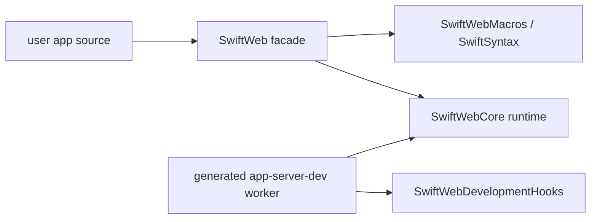
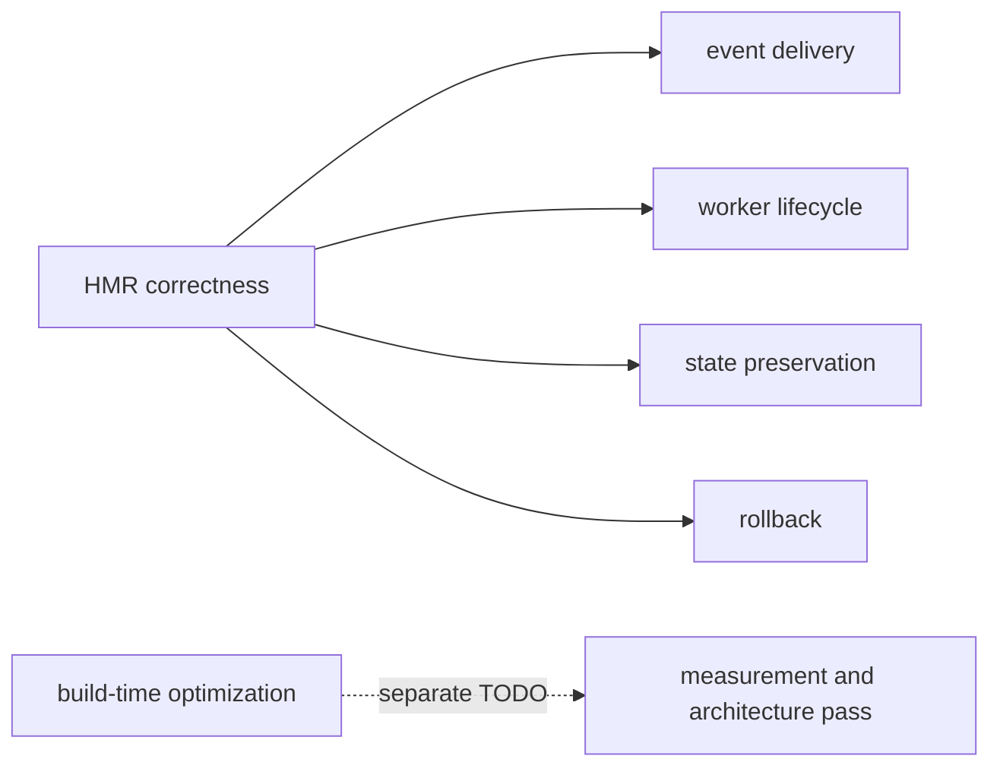

# Build Time Performance TODO

## Status

SwiftWeb has a working development HMR loop, but build-time performance is not solved.
This document tracks the build-time work separately from hot reload stability so startup
latency is not treated as a small cleanup task.

Current local evidence:

| Signal | Observation |
|---|---|
| Browser E2E HMR behavior | Passed for client WASM HMR, rollback, server worker restart, page patch, and cleanup. |
| Cold generated worker build | Around 57 seconds in the latest Counter browser E2E log. |
| Warm server worker rebuild | Around 9 seconds in the latest Counter browser E2E log. |
| Known dependency pressure | App targets that use `@Page` / `@ServerAction` still compile macro infrastructure. |

## Current Boundary

`SwiftWebCore` separates the runtime from the public macro facade. This keeps generated
worker launchers and development hooks off the macro facade. It does not eliminate macro
compilation for the app target itself, because source that declares `@Page` or
`@ServerAction` still needs macro expansion.

## Required Analysis

Before claiming build-time performance is acceptable, perform a dedicated measurement
pass:

| Area | Requirement |
|---|---|
| Baseline | Measure clean and warm `swift-web dev` startup for a minimal skeleton, CounterApp, and Storyboard. |
| Attribution | Record which packages and targets dominate wall-clock time. Include SwiftSyntax, Vapor, NIOHTTPServer, and app target compile time separately. |
| Incremental behavior | Measure app-only page edits, client-only component edits, style-only edits, and package manifest edits. |
| Cache behavior | Verify generated `.build`, DerivedData, and WASM artifact cache reuse. |
| Toolchain split | Record host Swift version and WASM SDK for every run. |
| Regression gate | Define acceptable budgets for cold start, warm worker rebuild, client WASM rebuild, and style patch. |

## Candidate Directions

| Direction | What To Prove |
|---|---|
| Macro-free generated worker source | Determine whether dev can generate route/action registration source and avoid compiling macro plugins for worker rebuilds. |
| Persistent build service | Determine whether a resident build coordinator can avoid repeated SwiftPM planning and process startup. |
| Prebuilt framework binaries | Determine which SwiftWeb runtime products can be distributed as binary artifacts without hurting local framework development. |
| Package graph split | Determine whether `SwiftWebCore`, `SwiftWeb`, `SwiftWebDevelopment`, and Storyboard can reduce dependency graph breadth further. |
| Vapor stack revision | Measure the locked Vapor HTTP stack separately and avoid accidental `swift-http-server` branch drift during generated package builds. |

## Non-Goals For HMR Stabilization

Hot reload stability work should not be blocked on solving this file. During HMR work,
build-time changes should be limited to fixes required for correctness, cleanup, or
dependency-boundary safety.

