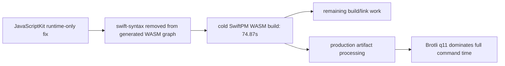
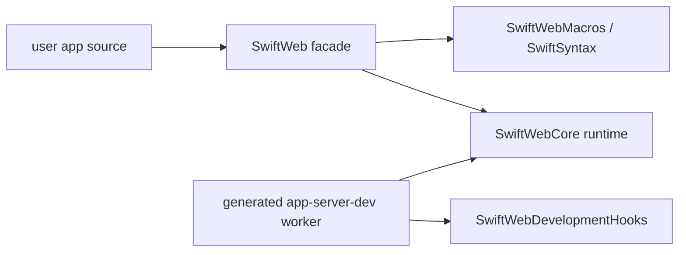
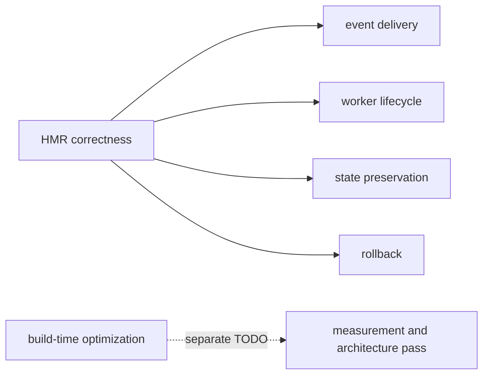

# Build Time Performance TODO

## Status

SwiftWeb has a working development HMR loop, but build-time performance is not solved.
This document tracks the build-time work separately from hot reload stability so startup
latency is not treated as a small cleanup task.

Current local evidence:

| Signal | Observation |
|---|---|
| Browser E2E HMR behavior | Passed for client WASM HMR, rollback, server worker restart, page patch, and cleanup. |
| Cold generated worker build | Around 57 seconds in the latest Counter browser E2E log. |
| Warm server worker rebuild | Around 9 seconds in the latest Counter browser E2E log. |
| Known dependency pressure | App targets that use `@Page` / `@ServerAction` still compile macro infrastructure. |
| CounterApp generated browser WASM graph after JavaScriptKit runtime-only fix | Confirmed on 2026-06-19: generated `Package.swift` and `Package.resolved` contain `swift-actor-runtime` only as a remote dependency; they do not contain external `JavaScriptKit`, `BridgeJSMacros`, or `swift-syntax`. |

## 2026-06-19 CounterApp Browser WASM Measurement

This pass measured a fresh copy of `Examples/CounterApp` under
`/private/tmp/swift-web-measure.JCQZtW/CounterApp`. The app package was rewritten only in
that temporary copy to point at the local `swift-web` and `swift-html` checkouts.

| Field | Value |
|---|---|
| Host CLI build toolchain | `xcrun swift` / Apple Swift 6.4 |
| Browser WASM toolchain | Swift 6.3.1 release toolchain |
| Browser WASM SDK | `swift-6.3.1-RELEASE_wasm` |
| Generated package | `.swiftweb/generated/wasm` |
| Product | `counter-app-wasm-runtime` |

Generated package dependency check:

| Check | Result |
|---|---|
| External `JavaScriptKit` package dependency | Absent |
| `BridgeJSMacros` | Absent |
| `swift-syntax` | Absent |
| `Package.resolved` pins | `swift-actor-runtime` only |
| Runtime JavaScriptKit source | Present |
| `_CJavaScriptKit` source | Present |
| `JavaScriptKit/Macros.swift` | Absent |
| `JavaScriptKit/Runtime` | Absent |
| `JavaScriptKit/Documentation.docc` | Absent |

Build timing:

| Measurement | Result | Notes |
|---|---:|---|
| Cold `swift-web build --wasm` SwiftPM product build | 74.87s | From SwiftPM output. Includes compile and link for runtime-only generated WASM graph. |
| Cold `swift-web build --wasm` full command | 399.67s | Includes production artifact processing and compression. |
| Same-environment direct warm SwiftPM build | 1.95s real / 1.65s SwiftPM | Re-linked the product without recompiling targets. |
| Warm CLI full command after an intervening non-CLI direct build | 281.38s | Not a clean no-op measurement; included 48.48s of SwiftPM work and production artifact processing. Repeat with one controlled command path before using as a regression gate. |

Artifact size from the cold production command:

| Artifact | Bytes |
|---|---:|
| Original WASM | 69,784,816 |
| After custom-section strip | 56,535,636 |
| gzip sidecar | 19,749,925 |
| Brotli sidecar | 12,775,421 |

The size report shows the stripped WASM is dominated by the data section:

| Section group | Bytes | Share |
|---|---:|---:|
| data | 38,051,544 | 67.3% |
| code | 18,025,072 | 31.9% |
| custom | 157,548 | 0.3% |

Standalone compression timing on the current 69.8 MB artifact after a direct SwiftPM relink:

| Command | Time | Output |
|---|---:|---:|
| `gzip -9` | 17.01s | 22,795,803 bytes |
| `brotli -q 11` | 179.33s | 15,015,228 bytes |

Conclusion:

The JavaScriptKit fix removed the avoidable macro dependency from the browser graph. The
remaining browser-runtime work is not primarily SwiftSyntax. The next optimization pass
should separate dev and production timing: dev startup should track the SwiftPM build plus
development artifact processing, while production `swift-web build --wasm` should cache or
make explicit the expensive Brotli sidecar generation.

## Current Boundary

`SwiftWebCore` separates the runtime from the public macro facade. This keeps generated
worker launchers and development hooks off the macro facade. It does not eliminate macro
compilation for the app target itself, because source that declares `@Page` or
`@ServerAction` still needs macro expansion.

## Required Analysis

Before claiming build-time performance is acceptable, perform a dedicated measurement
pass:

| Area | Requirement |
|---|---|
| Baseline | Measure clean and warm `swift-web dev` startup for a minimal skeleton, CounterApp, and Storyboard. |
| Attribution | Record which packages and targets dominate wall-clock time. Include SwiftSyntax, Vapor, NIOHTTPServer, and app target compile time separately. |
| Incremental behavior | Measure app-only page edits, client-only component edits, style-only edits, and package manifest edits. |
| Cache behavior | Verify generated `.build`, DerivedData, and WASM artifact cache reuse. |
| Toolchain split | Record host Swift version and WASM SDK for every run. |
| Regression gate | Define acceptable budgets for cold start, warm worker rebuild, client WASM rebuild, and style patch. |

## Candidate Directions

| Direction | What To Prove |
|---|---|
| Macro-free generated worker source | Determine whether dev can generate route/action registration source and avoid compiling macro plugins for worker rebuilds. |
| Persistent build service | Determine whether a resident build coordinator can avoid repeated SwiftPM planning and process startup. |
| Prebuilt framework binaries | Determine which SwiftWeb runtime products can be distributed as binary artifacts without hurting local framework development. |
| Package graph split | Determine whether `SwiftWebCore`, `SwiftWeb`, `SwiftWebDevelopment`, and Storyboard can reduce dependency graph breadth further. |
| Vapor stack revision | Measure the locked Vapor HTTP stack separately and avoid accidental `swift-http-server` branch drift during generated package builds. |
| Production sidecar cache | Avoid regenerating gzip/Brotli sidecars when the post-processed WASM content hash is unchanged. |
| Brotli policy | Decide whether local `swift-web build --wasm` should default to q11 or require an explicit production compression mode. |

## Non-Goals For HMR Stabilization

Hot reload stability work should not be blocked on solving this file. During HMR work,
build-time changes should be limited to fixes required for correctness, cleanup, or
dependency-boundary safety.

