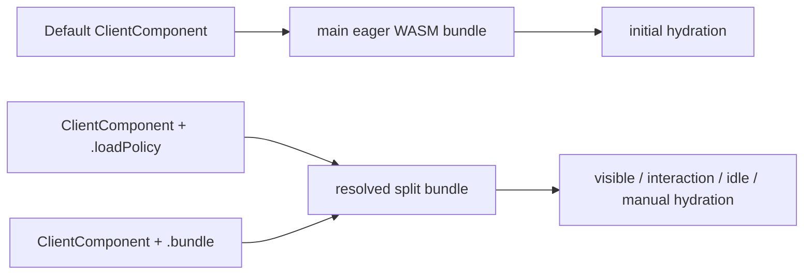
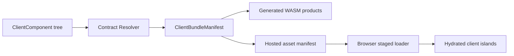
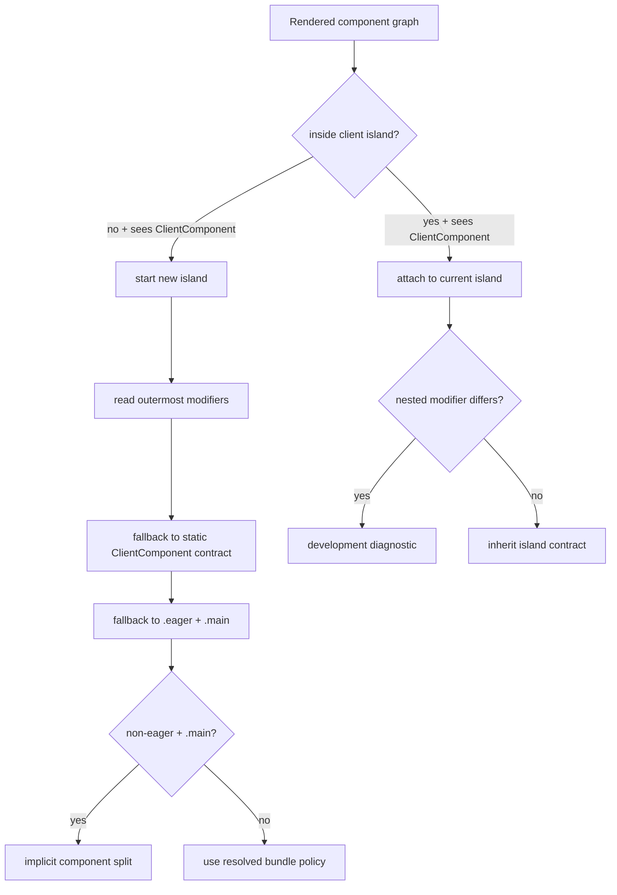
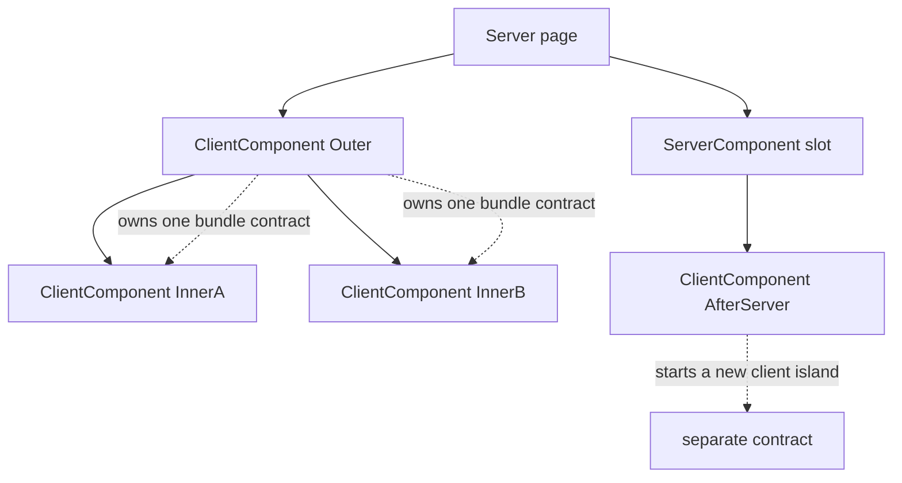
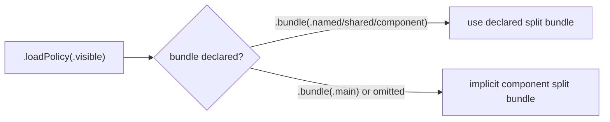
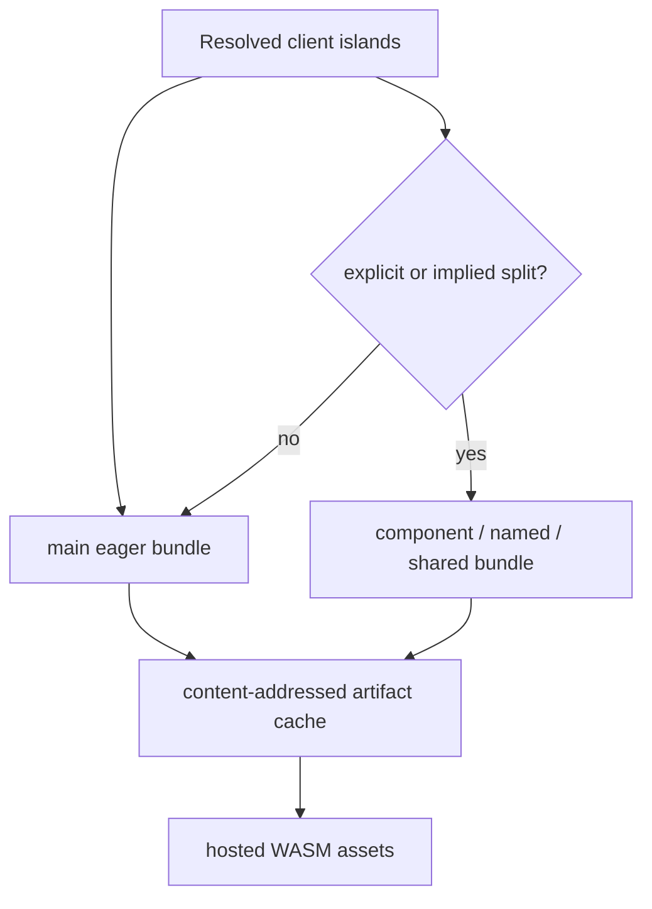
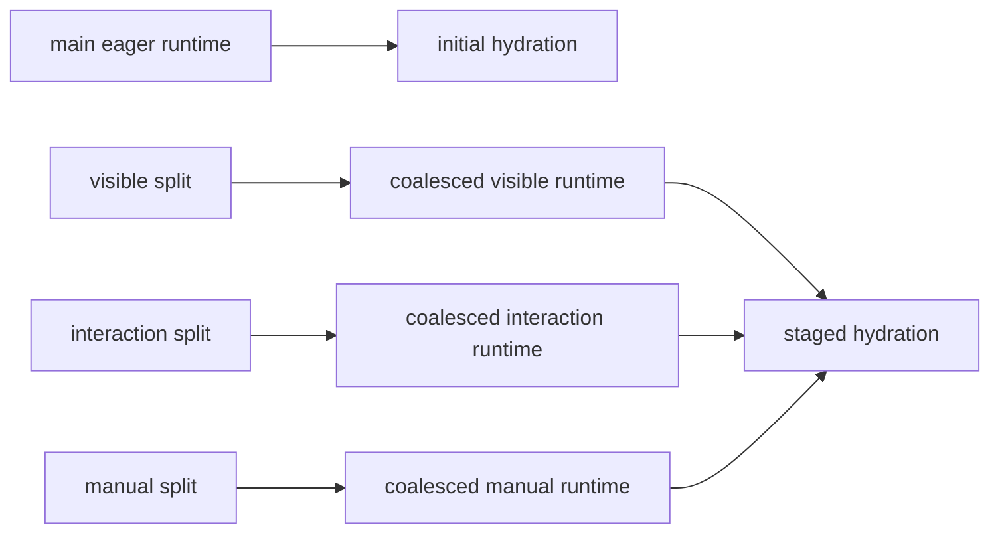
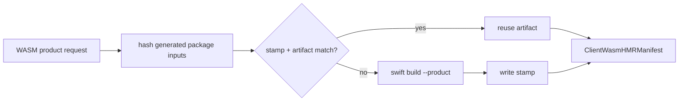
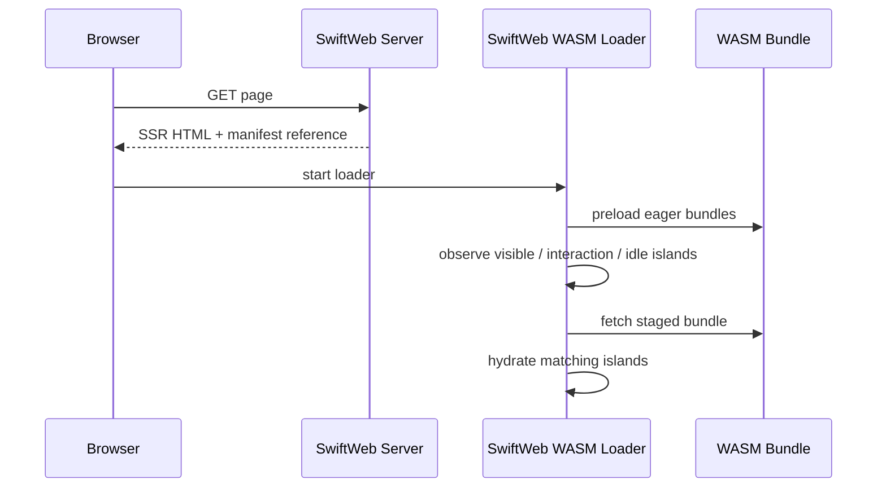

# Client Bundle Loading Design

SwiftWeb uses a contract-first model for client-side WASM loading. The framework does not infer arbitrary bundle boundaries from the component tree. A `ClientComponent` declares how it should be loaded, and SwiftWeb lowers that declaration into generated WASM products, hosted assets, and a browser loading manifest.

The default is intentionally conservative: all client components join one eager main bundle. Split loading is an explicit optimization for client islands that are expensive, below the fold, interaction-only, or shared by a small set of heavy UI surfaces.

## Status

| Field | Value |
|---|---|
| Status | Accepted design direction |
| Decision date | 2026-06-17 |
| Primary goal | Optimize first browser load while keeping the default app model simple. |
| Secondary goal | Preserve fast incremental builds by generating only the bundle products required by explicit contracts. |
| Public API shape | `LoadPolicy` and `BundlePolicy` on `ClientComponent`, with call-site modifiers as the preferred override. |
| Explicit non-goal | Automatic planner-driven component splitting is not part of the public model. |

## Size Optimization Direction

The split-loading contract optimizes the first interactive surface by delaying selected client islands. The current Swift/WASI toolchain still links each executable WASM product as a standalone artifact, so a naive one-product-per-split implementation duplicates the Swift runtime, SwiftHTML, SwiftWebUIRuntime, and JavaScriptKit-facing runtime glue in every split bundle. The JavaScriptKit boundary is defined in [`BrowserRuntimeJavaScriptKitDecision.md`](BrowserRuntimeJavaScriptKitDecision.md): generated browser WASM packages use a runtime-only JavaScriptKit source copy by default, not BridgeJS. After removing macro-only dependencies and stripping debug/producers custom sections, the browser E2E run on 2026-06-17 loaded an eager main bundle of about 56.5 MB uncompressed.

SwiftWeb therefore separates the developer contract from the physical build strategy:

| Layer | Contract |
|---|---|
| Developer API | Components declare `LoadPolicy` and `BundlePolicy`. This remains stable. |
| Manifest | Each island keeps its resolved logical bundle and loading policy. |
| Build strategy | The materializer may lower multiple logical split contracts into fewer physical WASM products when the toolchain cannot produce thin component modules. |
| Future toolchain path | When stable thin component modules are available, the same manifest contract can map each logical split to a thin module loaded over a shared base runtime. |

### Current Build Strategies

| Strategy | Physical output | When to use |
|---|---|---|
| `coalescedPolicyBundles` | Main runtime plus up to one standalone WASM product per non-eager load policy. | Default for the current Swift/WASI toolchain because it avoids multiplying the full runtime by every split bundle while preserving load timing. |
| `resolvedBundles` | Main runtime plus one standalone WASM product per resolved split bundle. | Precise incremental rebuilds and diagnostics when byte duplication is acceptable. |

The selected strategy is internal to generation. Apps still express priority with `.loadPolicy(...)` and `.bundle(...)`; SwiftWeb decides how many physical artifacts can safely realize that contract.

`SWIFTWEB_WASM_SPLIT_BUILD_STRATEGY=resolved-bundles` can force the precise standalone split shape for diagnostics. Without that override, generated packages use `coalescedPolicyBundles`.

### Current Artifact Processing

SwiftWeb separates dev responsiveness from production transfer optimization:

| Mode | Artifact processing | Compression sidecars |
|---|---|---|
| `sweb dev` / Storyboard dev | Strip debug, `name`, `producers`, and `sourceMappingURL` custom sections; write `<artifact>.wasm.size.json`; include the processing signature in the build stamp. | Disabled by default to keep local HMR builds fast. Stale `.gz` and `.br` sidecars are removed. |
| `sweb build --wasm` | Strip the same custom sections; run `wasm-opt -Oz` when Binaryen is available; write `<artifact>.wasm.size.json`. | Writes `.gz` and `.br` sidecars. Brotli defaults to quality 11 and can be changed with `SWIFTWEB_WASM_BROTLI_QUALITY`. Existing sidecars are reused when `<artifact>.wasm.compression.json` matches the post-processed WASM content hash and compression signature. |
| Runtime asset route | Serves raw `.wasm` unless the request accepts an available `.br` or `.gz` sidecar. | Adds `Content-Encoding` and `Vary: Accept-Encoding` for sidecar responses. |

`SWIFTWEB_WASM_OPTIMIZE=0` disables `wasm-opt` even for production builds. `SWIFTWEB_WASM_OPTIMIZE=1` enables it for dev builds when the tool is available, but this is intended for diagnostics because it slows HMR.

### Remaining Optimization Work

The next optimization pass should focus on these layers:

| Priority | Work | Expected impact |
|---:|---|---|
| Done | Remove macro, development, and SwiftSyntax dependencies from generated WASM products. | Reduced avoidable code in runtime artifacts and lowered the eager bundle from about 70 MB to about 56.5 MB in E2E. |
| Done | Add artifact processing: debug/producers section stripping, optional `wasm-opt -Oz`, and size reports. | Gives a deterministic artifact pass and size attribution without changing public API. |
| Done | Serve precompressed gzip/Brotli variants when production sidecars exist. | Reduces network transfer size for production artifacts. |
| Done | Cache production gzip/Brotli sidecars by post-processed WASM content hash. | Avoids repeating expensive Brotli q11 work when the artifact content has not changed. |
| Done | Use `coalescedPolicyBundles` while thin component modules are unavailable. | Avoids accidental duplication from unnecessary split products without breaking `visible` / `interaction` / `idle` / `manual` timing. |
| Next | Implement a shared base runtime plus thin component modules once Swift/Wasm linking support exposes a stable browser-ready contract. | Address the root duplication problem across split bundles. |

The release-quality requirement is therefore: split loading must remain deterministic and correct, while the physical output is allowed to use the least duplicative strategy supported by the selected toolchain.

## Scope

This document defines the loading contract for browser-executed `ClientComponent` islands. It covers the public API, bundle ownership, nested component behavior, generated WASM product shape, runtime loading, build caching, diagnostics, and development/production boundaries.

It does not define the SwiftHTML graph model, the SwiftWebUI visual component catalog, Vapor route lowering, or the distributed actor gateway. Those systems consume or provide metadata for this contract, but they do not decide bundle boundaries.

## Resolved Direction

The loading model is intentionally a contract, not an optimizer. The framework gives every app one predictable default path and a small set of explicit escape hatches when a component should be prioritized differently.

| Concern | Decision |
|---|---|
| Default app behavior | Build one eager main WASM bundle that contains all default client islands. |
| First-load optimization | Split only the islands that explicitly opt into staged loading. |
| Split loading API | Opt in with `LoadPolicy` and `BundlePolicy`; SwiftWeb does not invent split points. |
| Preferred API | Use modifiers at the call site because the page knows local priority and user journey. |
| Reusable default | Use static `ClientComponent` properties only when the component has the same loading profile everywhere. |
| Nested islands | The outermost `ClientComponent` owns the client island, bundle, state schema, environment schema, and loading policy. |
| Naming | Public names are `LoadPolicy` and `BundlePolicy`; there is no `client` prefix in the user-facing API. |
| Performance goal | Keep first load fast by shipping the main bundle first, while allowing selected islands to move into staged bundles. |



## Design Forces

| Force | Design response |
|---|---|
| Fast initial browser load | Keep one main eager bundle and move only priority-sensitive islands into staged bundles. |
| Developer clarity | Make the bundle decision visible beside the component usage through modifiers. |
| Build speed | Avoid one-product-per-component generation unless a resolved contract requires a split. |
| Deterministic output | Resolve contracts from explicit declarations instead of optimizer heuristics. |
| Nested component correctness | Treat nested `ClientComponent` values as one island owned by the outermost boundary. |
| State safety | Preserve `@State` when schema hashes match, or when a hot reload can safely rebase slots by source location and value type. |
| Future optimization | Allow future tools to suggest policy changes without silently changing runtime behavior. |

## Decision Summary

| Decision | Contract |
|---|---|
| Default bundle shape | One eager main WASM bundle. |
| Split loading trigger | A `ClientComponent` static contract or, preferably, a call-site modifier. |
| User-facing naming | Use `LoadPolicy` and `BundlePolicy`; no `client` prefix because the API is already scoped to `ClientComponent`. |
| Preferred override | Modifiers on the outermost client island. |
| Nested client components | The outermost `ClientComponent` owns the island, load policy, and bundle. |
| Automatic planner | Not part of the public model. SwiftWeb uses a deterministic contract resolver. |
| Build strategy | Generate stable packages and rebuild only dirty resolved bundles. |
| Production output | Include only manifest, assets, and hydration metadata required by the runtime. Dev diagnostics and HMR metadata stay out of production. |

## Developer Contract

The normal case needs no loading API:

```swift
Counter()
```

The page can prioritize a specific island with modifiers:

```swift
HeavyChart()
    .loadPolicy(.visible)
    .bundle(.named("analytics"))
```

The outermost `ClientComponent` owns nested client components:

```swift
DashboardIsland()
    .loadPolicy(.interaction)
    .bundle(.named("dashboard"))
```

Every nested `ClientComponent` inside `DashboardIsland` joins the `dashboard` bundle. A nested `.loadPolicy(...)` or `.bundle(...)` modifier is diagnosed in development because it cannot create a separate island boundary.

## Architecture



The resolver is intentionally smaller than a planner. It walks the rendered component graph, identifies outermost client islands, resolves their declared contracts, validates nested usage, and emits manifest records. It does not optimize across routes, estimate graph costs, or invent split points.

## Responsibility Boundaries

| Layer | Responsibility | Not responsible for |
|---|---|---|
| `SwiftHTML` | Component graph, island metadata, state/environment schema hashes, diff and hydration primitives. | Deciding app-level WASM product layout. |
| `SwiftWebUI` | SwiftUI-like `ClientComponent` authoring API, loading modifiers, and style/color-scheme environment values. | Serving assets or registering Vapor routes. |
| `SwiftWeb` | Build a client manifest from rendered islands, host content-hashed WASM assets, and inject the browser loader. | Inferring arbitrary split points from usage frequency or bundle size. |
| `SwiftWebDevelopment` | Materialize generated packages, build dirty WASM products, cache build stamps, and emit HMR events. | Owning the public component API. |
| `SwiftWebCLI` | Start dev/storyboard/build commands and delegate generation/build work to the runtime layers. | Implementing browser hydration or framework-specific component behavior. |

This split keeps the app-facing API small while still allowing the build system to evolve. A future optimizer can read the same manifest and suggest policy changes, but it should not silently change bundle boundaries.

## Public API

`ClientComponent` owns browser-executed UI. Its loading contract belongs to that boundary.

```swift
public protocol ClientComponent: Component {
    static var loadPolicy: LoadPolicy { get }
    static var bundle: BundlePolicy { get }
}

public extension ClientComponent {
    static var loadPolicy: LoadPolicy { .eager }
    static var bundle: BundlePolicy { .main }
}
```

```swift
public enum LoadPolicy: Sendable, Codable, Hashable {
    case eager
    case visible
    case interaction
    case idle
    case manual
}

public enum BundlePolicy: Sendable, Codable, Hashable {
    case main
    case component
    case named(String)
    case shared(String)
}
```

## Developer Interface

Modifiers are the preferred way to declare page-local priority because the loading decision is visible where the client island is used.

```swift
HeavyChart()
    .loadPolicy(.visible)
    .bundle(.named("analytics"))
```

```swift
PaymentForm()
    .loadPolicy(.interaction)
```

Static contracts are useful when a reusable component has a stable loading profile everywhere it appears.

```swift
struct RichTextEditor: ClientComponent {
    static let loadPolicy: LoadPolicy = .visible
    static let bundle: BundlePolicy = .shared("editor")

    var body: some HTML {
        EditorSurface()
    }
}
```

### Precedence

| Priority | Source | Reason |
|---|---|---|
| 1 | Outermost island modifier | The page knows the local performance priority. |
| 2 | Outermost component static contract | The reusable component can declare a safe default. |
| 3 | Framework default | Small components should require no loading API. |

Modifiers inside an already-owned island do not create nested bundle boundaries. In development, SwiftWeb should emit an actionable diagnostic that asks the developer to move `.loadPolicy(...)` or `.bundle(...)` to the outermost `ClientComponent`.

### Contract Resolution Algorithm

The resolver follows a deterministic order. This is the full contract; there is no hidden planning phase.



1. Walk the rendered graph in document order.
2. Start a client island only when a `ClientComponent` appears outside any current client island.
3. Resolve modifiers on that outermost island first.
4. If no modifier exists, use the outermost component static contract.
5. If no static contract exists, use `.loadPolicy(.eager)` and `.bundle(.main)`.
6. If the resolved policy is not `.eager` and the bundle remains `.main`, lower to an implicit component split bundle.
7. Treat nested `ClientComponent` values as members of the current island.
8. Emit development diagnostics for nested loading modifiers because they cannot own a separate runtime boundary.

## Island Ownership

A client island starts when the renderer sees a `ClientComponent` outside any existing client island. If another `ClientComponent` appears inside that island, it is part of the same WASM runtime boundary.



| Structure | Bundle behavior |
|---|---|
| `ClientComponent` inside `ClientComponent` | The outermost client island owns the bundle and load policy. |
| Sibling client islands | Each sibling resolves independently unless both declare the same named or shared bundle. |
| Client island after a server boundary | A new client island starts because ownership returned to the server graph. |
| Modifier on a nested client component | Ignored for bundle resolution and diagnosed in development. |

This rule prevents accidental fragmentation. It also makes state preservation easier because one visible runtime boundary owns one state schema and one environment schema.

## Bundle Policy Semantics

| Policy | Lowering | Use case |
|---|---|---|
| `.main` | Join the eager main bundle when the load policy is `.eager`. | Small or common components. |
| `.component` | Build a component-owned split bundle. | A large isolated island. |
| `.named(String)` | Join an application-named split bundle. | Page-level groups such as analytics, media, or dashboard tools. |
| `.shared(String)` | Join a reusable shared split bundle. | Library components such as editor families reused across pages. |

`named` and `shared` both lower to stable bundle IDs and content-hashed WASM assets. The distinction exists for diagnostics and readability: `named` expresses app/page intent, while `shared` expresses reusable component/library intent.

### Non-Eager Main Policy

Changing only the load policy should be enough to prioritize an island. If a component declares `.loadPolicy(.visible)`, `.interaction`, `.idle`, or `.manual` while leaving `.bundle(.main)`, the resolver lowers it to a component split bundle. Keeping it in the eager main bundle would still download it during initial load, which would violate the purpose of the policy.



## Load Policy Semantics

| Policy | Browser behavior |
|---|---|
| `.eager` | Preload and instantiate as soon as the page runtime starts. |
| `.visible` | Load when the island approaches the viewport. |
| `.interaction` | Load when the user focuses, hovers, presses, or otherwise signals intent. |
| `.idle` | Load after the browser reaches an idle window. |
| `.manual` | Do not load until application code explicitly requests the bundle. |

SSR HTML is rendered for every policy. Load policy controls when the client runtime becomes interactive, not whether the server sends markup.

## Manifest Contract

The renderer lowers resolved island contracts into a manifest consumed by the browser loader.

| Field | Purpose |
|---|---|
| `islandID` | Stable DOM/runtime boundary identifier. |
| `componentType` | Diagnostic-readable root component type. |
| `bundleID` | Resolved bundle identity. |
| `assetPath` | Served content-hashed WASM asset path. |
| `contentHash` | Immutable asset identity. |
| `stateSchemaHash` | Compatibility check for `@State` snapshot restoration. |
| `environmentSchemaHash` | Compatibility check for client-visible environment restoration. |
| `loadPolicy` | Browser staging behavior. |

Bundle records describe the physical WASM assets, their dependencies, and exported runtime symbols. Component records point at those bundle records.

## Build Contract

SwiftWeb builds the main bundle plus only the split bundles produced by the resolver. It should not create one WASM target per component by default.



### Logical Product Shape

| Resolved contract | Generated product |
|---|---|
| `.eager + .main` | One app-level main runtime product containing all default islands. |
| Non-eager policy with no explicit bundle | One component-owned split runtime product for that island. |
| `.bundle(.component)` | One component-owned split runtime product for that island. |
| `.bundle(.named("name"))` | One app-named split runtime product shared by islands with the same name. |
| `.bundle(.shared("name"))` | One reusable split runtime product shared by islands with the same shared name. |

The main bundle is the baseline. Split products are created only when a resolved contract requires staged loading. A bundle can contain more than one root component type when the contract intentionally groups those islands.

### Physical Product Shape

The logical product shape is the target model for a toolchain that can produce thin component modules. Until that is reliable for browser Swift/Wasm, the materializer supports a static-link fallback:



| Build strategy | Main runtime | Deferred runtime | Tradeoff |
|---|---|---|---|
| `resolvedBundles` | Contains eager `.main` islands. | One standalone artifact per logical split. | Best rebuild locality, worst duplicated bytes. |
| `coalescedPolicyBundles` | Contains eager `.main` islands. | One standalone artifact per non-eager load policy. | Less duplicated runtime code while preserving policy-level download timing. |

`coalescedPolicyBundles` preserves both logical bundle IDs and load-policy timing. Multiple `.visible` islands may share one visible artifact, and multiple `.manual` islands may share one manual artifact, but a visible or idle load must not fetch interaction-only or manual code.

Build-speed requirements:

| Requirement | Reason |
|---|---|
| Stable generated package layout | Avoids invalidating SwiftPM package planning. |
| Write generated files only when content changes | Preserves incremental compilation. |
| Rebuild dirty resolved bundles only | Editing one split island should not rebuild unrelated bundles. |
| Content-addressed artifact cache | Reuses artifacts across dev, storyboard, and production build commands. |
| Cache key includes toolchain, SDK, dependencies, and build flags | Prevents incompatible artifacts from being reused. |
| Runtime-only generated source targets | Keeps SwiftHTML preview macros, JavaScriptKit BridgeJS macros, and `swift-syntax` out of the WASM package graph. See [`BrowserRuntimeJavaScriptKitDecision.md`](BrowserRuntimeJavaScriptKitDecision.md). |
| No automatic component target explosion | Keeps normal development fast and package graphs understandable. |
| Build metrics | Makes slow paths measurable before changing policy. |

The development build process stores a small build stamp per generated WASM product. The stamp contains the input hash and the emitted artifact hash. If the generated package inputs, selected SDK, Swift executable, bundle ID, product, and component set are unchanged and the WASM artifact still exists with the same content hash, SwiftWeb can skip `swift build` and reuse the existing asset manifest.



## Runtime Loading



State preservation uses a two-step compatibility check. Exact schema matches are restored directly. If a hot reload changes only generated component IDs, SwiftWeb rebases snapshot slots by `@State` source location and value type before restoring.

| Check | Runtime behavior |
|---|---|
| `stateSchemaHash` matches | Restore the `@State` snapshot directly. |
| Schema hash differs, but state source location and value type match | Rebase snapshot values to the new slot IDs and restore. |
| State source or value type differs | Remount the affected island. |
| `environmentSchemaHash` matches | Client-visible environment may be reused. |
| Environment schema differs | Remount or refresh the affected island with the new environment snapshot. |

The loader can keep multiple component runtimes in one physical bundle. This is required for the main bundle and for named/shared bundles that contain more than one client island type.

Server page invalidation must preserve client islands. The browser merge algorithm treats `data-hmr-boundary`, `data-component-type`, and `data-bundle` as protected runtime boundaries, so a server patch updates server-owned DOM while leaving active WASM-owned subtrees and their `@State` stores intact.

## Development And Production Boundary

| Capability | Development | Production |
|---|---|---|
| Boundary diagnostics | Included | Excluded |
| HMR metadata | Included | Excluded |
| Storyboard overlays | Included | Excluded |
| Bundle manifest | Included | Included |
| Content-hashed WASM assets | Included | Included |
| State/environment schema hashes | Included | Included when needed for safe hydration |

Development may include extra DOM attributes such as component IDs and HMR boundary markers. Production should include only the metadata required to load, hydrate, and safely preserve state.

## Diagnostics

Diagnostics must be actionable and development-only.

| Diagnostic | Message intent |
|---|---|
| Nested bundle modifier ignored | Move `.bundle(...)` or `.loadPolicy(...)` to the outermost `ClientComponent`. |
| Missing bundle artifact | The manifest references a bundle that was not built or served. |
| Schema mismatch remount | State was not preserved because the component state or environment contract changed. |
| Manual bundle not loaded | The island is intentionally non-interactive until requested. |
| Empty named/shared bundle | A declared bundle policy did not produce any island. |

## Acceptance Criteria

| Area | Required behavior |
|---|---|
| API | `LoadPolicy`, `BundlePolicy`, static `ClientComponent` defaults, and modifiers are available. |
| Precedence | Outermost modifiers override static contracts; nested modifiers are ignored with diagnostics. |
| Manifest | Resolved bundle IDs, load policies, asset paths, content hashes, and schema hashes are emitted. |
| Build | The main bundle is built by default; split bundles are built only when resolved contracts require them. |
| Runtime | Eager, visible, interaction, idle, and manual policies stage loading correctly. |
| State | Hydration restores state when schemas match, and HMR preserves state across generated component ID changes when source location and value type still match. |
| Performance | Generated files are write-if-changed, stale generated sources are cleaned, and unrelated bundles are not rebuilt. |
