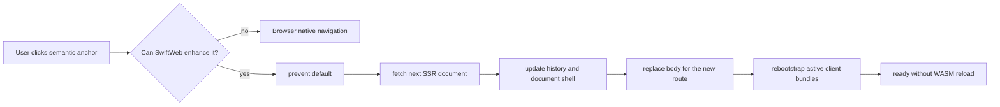
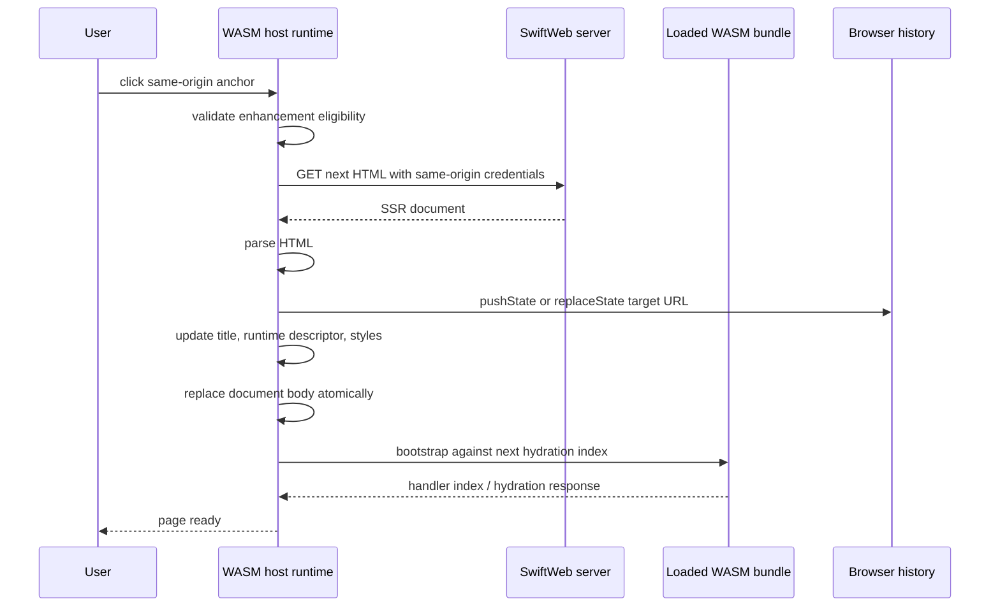

# Client Navigation Design

SwiftWeb navigation is progressive enhancement over semantic HTML anchors. A
`Link` or `NavigationLink` must still render a real `<a href="...">` so the page
works without browser WASM, with modifier-clicks, and with standard browser
features. When the WASM runtime is active, same-origin document navigation is
upgraded into a client-side document transition that avoids reloading already
loaded WASM bundles.

## Status

| Field | Value |
|---|---|
| Status | Required runtime contract |
| Decision date | 2026-06-27 |
| Applies to | `Link`, `NavigationLink`, Storyboard sidebar links, and same-origin anchors in WASM pages |
| Runtime owner | `SwiftWeb` WASM host script |
| UI owner | `SwiftWebUI` semantic link components |
| Main goal | Navigate between server-rendered routes without a full page reload or WASM runtime restart. |
| Secondary goal | Preserve browser-native anchor behavior when SwiftWeb cannot safely enhance the navigation. |

## Model



SwiftWeb distinguishes two document update paths:

| Path | Trigger | URL/history | Client island treatment |
|---|---|---|---|
| Invalidation | `ActionResult.invalidate(...)`, dev HMR page patch | No route transition unless the action explicitly redirects. | Preserve active `ClientComponent` DOM and compatible `@State`. |
| Navigation | Same-origin `Link` / `NavigationLink`, `popstate` | Update browser history and document title. | Replace the server document for the new route, then rebootstrap active bundles against the new hydration index. Compatible state stores may be reused by the WASM runtime. |

Invalidation is a refresh of server-owned data on the current page. Navigation
is a route transition. They share the document parser and managed head updates,
but they do not share the DOM application algorithm or state-preservation rules.

## Link Contract

`Link` and `NavigationLink` must render a normal anchor with `href`.

| Requirement | Reason |
|---|---|
| Keep `<a href>` in SSR output. | Native fallback, accessibility, context menu, copy link, open in new tab. |
| Do not attach framework-only pseudo navigation attributes as the primary contract. | The semantic URL is the source of truth. |
| `NavigationLink` may emit metadata such as `data-navigation-link`. | Metadata can support styling and diagnostics, but it must not be required for basic navigation. |
| External URLs, downloads, non-HTTP schemes, and target windows use native browser navigation. | SwiftWeb must not capture work it cannot safely complete. |

## Enhancement Eligibility

The WASM runtime may enhance an anchor click only when all of these are true:

| Check | Required value |
|---|---|
| Event | Not already `defaultPrevented`. |
| Pointer | Primary unmodified click. |
| Anchor | Closest target is an `<a href>`. |
| Target | Empty or `_self`. |
| Destination | Same origin as `window.location`. |
| Scheme | `http:` or `https:`. |
| Download | No `download` attribute. |
| Route change | Path or query changes, or history navigation is being replayed. Same-document hash jumps stay native. |
| Runtime handler | The anchor or clicked path is not already owned by a Swift event handler that intentionally handles the click. |

If any check fails, the browser owns the navigation.

## Runtime Algorithm



Required behavior:

| Step | Contract |
|---|---|
| Fetch | Request `Accept: text/html` and same-origin credentials. |
| Response validation | Non-HTML, failed, or unsafe responses fall back to native `window.location.assign`. |
| Head update | Merge SwiftWeb managed style tags and update `document.title`. |
| Descriptor update | Replace `#client-runtime` descriptor from the fetched document before rebootstrap. |
| DOM application | Navigation replaces the fetched document body atomically because route input changed. Invalidation uses protected node-level merging and must preserve client island DOM. |
| Bundle loading | Reuse already loaded bundles. Load any newly required eager bundle before rebootstrap. |
| Rebootstrap | Call `swiftweb_bootstrap` for active initial bundles with mode `navigation`. |
| History | `pushState` for user clicks, `replaceState` only when explicitly requested by the runtime, and no push during `popstate`. |
| Failure | Log the failure and fall back to native navigation rather than leaving the UI stuck. |

## State Rules

Navigation does not mean "always keep every client state value." It means "avoid
reloading the browser runtime while applying the next route document."

| Situation | Required behavior |
|---|---|
| Same client component type and compatible state schema | Runtime may reuse the existing state store. |
| Different component type or incompatible schema | Runtime must remount from the server document. |
| Route-derived initializer input changes | Runtime must pass the new `location` to bootstrap so components can rebuild from the URL. |
| Server invalidation on current route | Preserve active client DOM and compatible state. |
| Redirect | Use native navigation or a fresh runtime state unless a future router contract explicitly supports redirect transitions. |

Storyboard relies on this rule: changing `/storyboard/grid` to
`/storyboard/style` must update the selected route and detail island without
downloading or restarting the 57 MB runtime artifact.

## Browser Behavior

| Browser feature | Contract |
|---|---|
| Back / forward | `popstate` fetches and merges the target route without pushing another entry. |
| Hash links | Same-document hash links remain native so browser scrolling and focus behavior are preserved. |
| Modifier click | Native browser handling. |
| New tab/window target | Native browser handling. |
| Reload | Native full reload. |
| Address bar navigation | Native full navigation. |

## Security And Scope

The runtime must only enhance same-origin HTML document transitions. Cross-origin
URLs, non-HTTP schemes, downloads, and target windows remain browser native.
Requests include same-origin credentials and the active CSRF header when present.

SwiftWeb must not parse arbitrary CSS or manually execute scripts from fetched
documents during navigation. The runtime imports managed style tags and the new
body DOM; executable script handling remains owned by the already loaded runtime.

## Diagnostics And Release Gates

| Gate | Requirement |
|---|---|
| Runtime metrics | Record navigation start, complete, fallback, and failure events. |
| Storyboard E2E | Sidebar clicks must update the selected page, keep exactly one current sidebar link, and avoid a full WASM runtime restart. |
| Storyboard runtime log | Storyboard must show the active runtime phase, WASM summary, and recent navigation events in the browser UI. |
| Asset reuse | Repeated Storyboard navigation must not transfer the 57 MB WASM body after cache validation. |
| Console | Same-origin navigation must not emit runtime errors. |
| History | Back and forward must restore route content and selected navigation state. |
| Fallback | Disallowed anchors must keep native behavior. |

## URL-Backed NavigationStack

`NavigationStack(path:)` is URL-backed: `NavigationPath` is the ordered list of
URL path segments below the stack's base route. Programmatic path mutation is a
same-origin document transition through the runtime algorithm above — never a
separate client-side view stack.

| Contract | Required behavior |
|---|---|
| Path model | `NavigationPath.components` are URL path segments. A component must be a non-empty segment without `/`, `?`, or `#`; violations are programmer errors. |
| Base derivation | The runtime derives the stack's base once per mounted element: the document path with the SSR-rendered `data-navigation-path` suffix removed. |
| Path writes | A client-side write to the bound path re-renders `data-navigation-path`; the runtime observes the attribute and performs the enhanced same-origin transition to `base/…segments`, pushing history. |
| No-op writes | Writing a path whose URL equals the current document URL performs no navigation. |
| Back/forward | `popstate` replays the target document; the page re-derives its path from the URL at render time. The runtime never rewrites the binding. |
| Destination | `navigationDestination(for:destination:)` renders the pushed leaf: when the stack's path is non-empty and the top segment losslessly converts to the destination's value type, the destination view renders and the stack root content hides. |
| Route pairing | The page's `@Page` route must match the deeper URLs (a parameter or `**` catch-all segment); the stack does not invent server routes. |
| Value types | Destination value types convert via `LosslessStringConvertible`, keeping segments honest as URL text. |

```swift
@Page("/files/**")
struct FilesPage {
    func body() -> some HTML {
        FilesBrowser()
    }
}

public struct FilesBrowser: ClientComponent {
    @State private var path = NavigationPath()

    public var body: some HTML {
        NavigationStack(path: $path) {
            FileList(onOpen: { name in path.append(name) })
        }
        .navigationDestination(for: String.self) { name in
            FileDetail(name: name)
        }
    }
}
```

## Implementation Placement

| Layer | Responsibility |
|---|---|
| `SwiftWebUI` | Render semantic anchors and optional navigation metadata; render `data-navigation-stack`/`data-navigation-path` and the destination switch. |
| `SwiftWeb` WASM host | Intercept eligible anchors, observe `data-navigation-path` writes, fetch SSR documents, merge, rebootstrap, and manage history. |
| `SwiftWebUIRuntime` | Rebuild client component sessions from the new bootstrap request and compatible state store. |
| `SwiftWebDevServer` | Verify HMR and same-origin navigation behavior against the same runtime contract. |
| `SwiftWebStoryboardTooling` | Run Storyboard against the dev runtime so catalog navigation exercises the production browser contract. |
