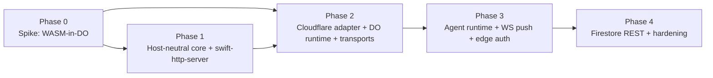

# Cloudflare Actor Platform — Roadmap

The single source of truth for moving SwiftWeb to a **Cloudflare-based, type-safe distributed
actor runtime**. It ties together the vision, the target architecture, every workstream that
must be built, the phasing, the risks, and links to the detailed design docs.

## Status

| Field | Value |
|---|---|
| Status | Program roadmap — active direction |
| Decision date | 2026-07-06 |
| North star | Run **agents as distributed actors** on Cloudflare, addressed per identity, streaming to clients over WebSocket, with end-to-end type safety. |
| First goal | Reach the architecture in the diagram below: a client talks to an `Agent` in a Durable Object over WebSocket, type-safe. |
| Deferred | The FirebaseAPI (gRPC) data path — moves to a container / a REST edge client, later. |

## 1. Vision & north star

Build agents as **Swift distributed actors** that live in **Cloudflare Durable Objects**:

- Each agent is a globally-addressable, single-threaded, durable object — the actor model,
  natively.
- Clients connect over **WebSocket** and receive streaming output (tokens, tool-calls,
  status) as **type-safe push** from the agent.
- The programming model is Swift distributed actors; the runtime is the edge.
- State lives in Durable Object storage, so the hot path needs **no gRPC**.

The differentiator: Orleans-style virtual actors + Swift's compile-time type safety + edge
deployment, in one model.

## 2. Target architecture

```mermaid
flowchart TD
  C["Client (browser / SwiftWebUI · WASM)<br/>hosts observer actor"] -->|WebSocket · Envelope| W
  W["Edge Worker (stateless)<br/>auth · routing · upgrade"] -->|get(id).fetch / ws| D
  subgraph Edge["Cloudflare"]
    W
    subgraph DOs["Durable Objects (stateful · 1 per identity · Swift/WASM)"]
      D["Agent actor + DO storage + WebSocket"]
    end
  end
  D -. "only when needed" .-> X["Container (Cloud Run)<br/>gRPC / heavy jobs"]
  D -. "simple reads" .-> R["Firestore REST (fetch)"]
```

- **Edge Worker** — stateless front door: auth, route `actor id → DO`, forward.
- **Durable Object** — the actor itself (Swift/WASM), holds state, holds the client
  WebSocket(s), pushes streaming output.
- **Container / Firestore REST** — optional, only where gRPC or heavy work is genuinely
  needed.

## 3. Principles & key decisions

| # | Decision | Rationale | Detail |
|---|---|---|---|
| P1 | **Match the protocol to the runtime.** Edge/WASM → REST over `fetch`; realtime → WebSocket; gRPC only in a container/OS. | WASM has no I/O of its own; sandboxed hosts (browser, Workers) expose `fetch`, not sockets. gRPC needs sockets + HTTP/2 trailers + threads that a DO does not have. | — |
| P2 | **Host-neutral core; Vapor is an optional adapter.** | Same `App/Scene/Page/Actor` model must lower onto native, container, and Cloudflare hosts. | `PlatformHostArchitecture.md` |
| P3 | **Lightweight native/container host = `swift-http-server`.** | Vapor is heavy for an API host; `swift-http-server` is the standard runtime and is already used by the dev host. | `LightweightHTTPServerDecision.md` |
| P4 | **Actor state in DO storage; realtime from the DO WebSocket** (not Firestore Listen). | Removes the gRPC/streaming need from the hot path; the DO is the source of truth and of push. | `WebSocketActorTransportDesign.md` |
| P5 | **Auth at the edge via WebCrypto** (verify Firebase ID token in the Worker), reusing the standalone `FirebaseAuth` model. | `fetch`/WebCrypto exist in Workers; no gRPC, no heavy crypto in WASM. | `~/Desktop/FirebaseAuth` |
| P6 | **FirebaseAPI (gRPC) is deferred** to the container path; edge uses Firestore REST if needed. | gRPC cannot run in a DO. | this doc, §Deferred |

## 4. Workstreams

Everything that must be built, grouped. Status: ☐ not started · ◐ in progress · ☑ done.

| ID | Workstream | Goal / key deliverables | Depends on | Status |
|---|---|---|---|---|
| **WS-1** | **Host-neutral core** | Remove Vapor types from `SwiftWebCore`: introduce host-neutral request/response, session, route, and `AppServices` abstractions. Refit `RequestContext`, `WebSession`, `Redirect`, `@Page`/`@ServerAction` route lowering, `PageRouteScene`. | — | ☑ |
| **WS-2** | **`swift-http-server` host adapter** | A native/container host that lowers the core onto `NIOHTTPServer` (reuse the dev host setup). Minimal router + middleware + session/cookie. The default fast local-dev + Cloud Run host. | WS-1 | ☑ |
| **WS-3** | **Vapor as a separate package** | Extract `SwiftWebVapor` into an optional package/adapter mapping the core to Vapor; keep for those who want it, not the default. | WS-1 | ☑ |
| **WS-4** | **Cloudflare Worker adapter** | Lower the app model into a Workers `fetch` entrypoint (TS shim + Swift/WASM). Routing `actor id → DO`. Build/deploy via `wrangler`. | WS-1 | ☐ |
| **WS-5** | **Durable Object actor runtime** | JS DO class that hosts the Swift/WASM module; binds DO storage, alarms, and (hibernatable) WebSocket into Swift via JavaScriptKit; dispatches inbound invocations to the local actor and drives outbound pushes. | WS-4 | ☐ |
| **WS-6** | **Actor transports** | `DurableObjectActorTransport` (`call` → `get(id).fetch(envelope)`) **and** `WebSocketActorTransport` (bidirectional, multiplexed, push). Both satisfy `WebActorTransport`. | WS-5 | ☐ |
| **WS-7** | **Client-side inbound dispatch** | The client must *receive* server-initiated invocations (route to client-hosted observer actors), not only send. Mirror the server dispatch machinery. | WS-6 | ☐ |
| **WS-8** | **Agent runtime & programming model** | The product layer: `Agent`/`AgentClient` distributed actors, run loop, streaming push, tool-calls, cancellation, lifecycle. | WS-6, WS-7 | ☐ |
| **WS-9** | **Edge auth** | Verify Firebase ID token at the Worker (WebCrypto + JWKS via fetch), bind the session/observer, gate DO access. Reuse `FirebaseAuth` claim logic. | WS-4 | ☐ |
| **WS-10** | **Firestore REST client** *(deferred)* | Reuse `FirebaseAPI`'s `FirestoreCore`/`FirestoreCodable`, add a `fetch`-based REST transport + REST-JSON value mapping + WebCrypto service-account auth. No gRPC/protobuf. | WS-4 | ☐ (deferred) |
| **WS-11** | **WASM build & deploy pipeline** | Swift → WASM toolchain into a DO, `wrangler` deploy, **binary-size & cold-start budget**, compression, CI. | WS-4 | ☐ |
| **WS-12** | **Dev experience** | Two loops: fast **native** (swift-http-server, actors in-process) for logic; **`wrangler dev`** (Miniflare) for DO-accurate behavior. | WS-2, WS-4 | ☐ |

Already in place (reused, not rebuilt):

- **`~/Desktop/FirebaseAuth`** — standalone Firebase ID-token verification (apple/swift-crypto). Container path today; its claim logic feeds WS-9.
- **`~/Desktop/FirebaseAuthWebDemo`** — a container/Vapor demo of that auth (validated E2E). A reference, superseded at the edge by WS-9.
- **`WebActorSystem` / `WebActorTransport` / `Envelope`** — the distributed-actor seam (`invocation`/`response` + `callID` + `senderID`) that WS-6/7 build on.
- **`swift-http-server`** already drives `SwiftWebDevServer` — the precedent for WS-2.

## 5. Phases & milestones



| Phase | Focus | Workstreams | Exit criteria |
|---|---|---|---|
| **0 — Spike (de-risk first)** ☑ **GREEN** | Prove the frontier before big refactors. | subset of WS-4/5/6/11 | ✅ Done. A `distributed actor` runs in a real Durable Object (`workerd`/`wrangler dev`); Worker→DO round-trip + persistent state ✅; DO storage ✅; WebSocket token push ✅. Size **2.8 MB gzip** (paid tier), cold start **~13 ms**. Use `FoundationEssentials` + `-Osize` + `wasm-opt`. Findings: `EdgeActorSpike/PHASE0-FINDINGS.md`. Remaining for Phase 2: real `Envelope` invocation path + async executor + JavaScriptKit-in-DO. |
| **1 — Host-neutral core** | Decouple from Vapor; get a fast local host. | WS-1, WS-2, WS-3, WS-12(native) | The core builds without importing Vapor; the same app runs on the `swift-http-server` host natively; Vapor lives in its own package. |
| **2 — Cloudflare adapter** | Reach the target diagram. | WS-4, WS-5, WS-6, WS-11, WS-12(wrangler) | An app deploys to Cloudflare; a client makes a **type-safe distributed call** to an `Agent` in a DO; actor state persists in DO storage. |
| **3 — Agents over WebSocket** | The product path. | WS-6(WS), WS-7, WS-8, WS-9 | An `Agent` in a DO **streams push** (tokens/events) to a browser observer over WebSocket, type-safe; requests are authenticated at the edge. |
| **4 — Data & hardening** | Fill the data path and productionize. | WS-10, WS-11(CI), reconnect/backpressure | Edge reads/writes Firestore via REST where needed; reconnect, backpressure, limits, observability in place; gRPC/heavy work isolated to a container. |

## 6. Risks & de-risking

| Risk | Impact | Mitigation |
|---|---|---|
| **Swift→WASM binary size / cold start in a DO** | Could invalidate the whole edge approach. | **Phase 0 spike measures it first**, before refactors. Size budget, compression, trim Foundation usage. |
| **Foundation on WASM gaps** (JSON/Date/Data) | Blocks serialization / value mapping. | Verify early in the spike; fall back to lightweight JSON if needed. |
| **Vapor extraction is a large refactor** | Slows Phase 1. | It is low-regret (valuable regardless of edge outcome) and matches `PlatformHostArchitecture.md`; do it after the spike confirms the edge is viable. |
| **DO hibernation vs awaited round-trips** | Lost continuations. | Design rule: **agent→client pushes are one-way**; persist anything that must outlive a wake. (`WebSocketActorTransportDesign.md`) |
| **JavaScriptKit ↔ DO API surface** (storage/alarm/WebSocket) | New binding work. | Build a thin, tested binding layer in WS-5; the dev host already uses JavaScriptKit patterns. |

## 7. Deferred / non-goals

- **FirebaseAPI (gRPC) at the edge** — impossible in a DO (no sockets/HTTP-2 trailers); it stays a container concern (WS-10 provides a REST edge client instead).
- **Firestore realtime `Listen`** — replaced by DO-WebSocket push; external-change reactions, if needed, go through a container gRPC listener notifying the DO.
- **`AsyncSequence` streaming return values** in the actor system — the push-invocation model covers streaming for now.
- **Replacing the `fetch` actor transport** — it stays for simple unary calls.

## 8. Open questions

- WASM size budget & the acceptable cold-start target for interactive agents.
- Binary vs JSON `Envelope` framing; compression for token streams.
- Reconnect/resume semantics (missed-push replay, `callID` continuity).
- Multi-observer fan-out and multiple client connections per DO.
- Router/session/middleware shape for the host-neutral core (small internal vs thin external).
- CI: building/testing WASM + Miniflare in the pipeline.

## 8b. Progress log — 2026-07-06 (spike session)

Built and **verified in `workerd` (`wrangler dev`)** in `~/Desktop/EdgeActorSpike/`:

| Item | Status | Evidence |
|---|---|---|
| **Phase 0** (feasibility gate) | ☑ GREEN | distributed actor + Foundation JSON + DO storage + WS push in a real DO; **2.8 MB gzip, ~13 ms cold start**. |
| **WS-6** transport wire (sync variant) | ◐ first-cut | `InvocationEnvelope` JSON → WASM dispatch → `ResponseEnvelope`, `callID` correlated; state persists in the DO's WASM instance. |
| **WS-5** DO actor runtime | ◐ first-cut | JS DO class hosts the Swift/WASM (WASI shim), storage, WebSocket. |
| **WS-4** Worker adapter | ◐ first-cut | stateless Worker authenticates then routes `actor id → DO`. |
| **WS-8** streaming Agent (model B) | ◐ first-cut | client prompt over WS → DO-hosted Swift `Agent` streams tokens back (`"echo » …"`, 7 pushes). |
| **WS-9** edge auth (WebCrypto) | ◐ verified | RS256 verify + emulator mode; **8/8 tests** (valid / wrong-aud / expired / wrong-iss / tampered / emulator). |
| **WS-11** build pipeline | ◐ done | `build-wasm.sh`: `FoundationEssentials` + `-Osize` + `wasm-opt`, budget-checked. |
| **WS-1** host-neutral core | ◐ verified | `EdgeActorSpike/lighthost-core` — a **zero-dependency** package (`HostRequest`/`HostResponse`/`HostHandler`); every adapter depends only on it. |
| **WS-2** swift-http-server adapter | ◐ verified | `lighthost` (`LightHostServer` on `NIOHTTPServer`) — serves `/health`/`/echo`/404, **no Vapor**. |
| **WS-3** Vapor as separate package | ◐ verified | `lighthost-vapor` — a **separate** package on the same core serves the **same** `HostHandler` via Vapor. Graphs don't collide (core is zero-dep). Both hosts run side by side (`:8099` swift-http-server, `:8100` Vapor). |
| **WS-7** client inbound dispatch | ◐ verified | bidirectional `Envelope` over WS; client-hosted `observer` actor receives `observer.token`/`observer.finished` invocations. |
| **WS-10** Firestore REST client | ◐ verified | fetch-based edge client; **10/10** vs the Firestore emulator (set/get, all value types, missing→null, equality query). |
| **WS-12** dev loops | ◐ both exist | native fast loop (`lighthost`, swift-http-server) + accurate loop (`wrangler dev`). |

The full target architecture now runs as a verified PoC (`EdgeActorSpike/`): edge auth →
per-identity DO routing → Swift/WASM actor+agent → typed WebSocket token stream. And the
lightweight native host (host-neutral core + swift-http-server, **no Vapor**) serves HTTP.

**Reference vs migration.** WS-1/2 are proven as a working reference (`lighthost`). Applying
the same host-neutral seam to swift-web's existing Vapor-coupled `SwiftWebCore` in-place
(and extracting Vapor, WS-3) is the remaining large, careful migration.

**Key decision — async execution model: (A) CONFIRMED (2026-07-06).** The dedicated
probe (`EdgeActorSpike/jskit-async/`, findings in `ASYNC-FINDINGS.md`) ran the **real
`WebActorSystem`** — `executeDistributedTarget` on a genuine envelope, `ActorGroup`
virtual activation, state across calls (5 → 10) — inside a Durable Object in `workerd`,
with Swift async/await driven by **JavaScriptKit's event loop** (cold start 12 ms;
`SWIFTWEB_CORE_ONLY=1` keeps macros/swift-syntax out of the wasm graph). Option (B)
(synchronous core + TS orchestration) is retired; WS-5 hosts the fully-Swift async
actor runtime.

**Remaining (large blocks):** Phase 1 (`WS-1/2/3` — strip Vapor from `SwiftWebCore`, add the
`swift-http-server` adapter); `WS-6` formal transports + real `WebActorSystem` integration;
`WS-7/8` (client inbound dispatch + agent programming model); `WS-10` (Firestore REST, deferred);
`WS-12` native dev loop (needs Phase 1). These are multi-session engineering, not yet done.

## 8c. Progress log — 2026-07-06 (Phase 1: WS-1 landed in swift-web)

**WS-1 is done in swift-web itself** (not just the spike). `SwiftWebCore` and
`SwiftWebBrowserRuntime` build **without Vapor / RoutingKit / WebSocketKit / NIO**;
the full test suite (390 tests) is green through the rebuilt Vapor adapter.

- **`SwiftWebHostKit`** (deps: `swift-http-types` + `swift-log` only) now carries the
  host-neutral contracts: `WebRequest` (mirrors Vapor 5's request API — `content.decode`
  / `query.decode` / `parameters.get` — so core diffs stayed minimal), `WebResponse`
  (buffered + streaming bodies), `WebSession`, `WebRoutesBuilder`/`WebRoutes` (route
  **collector**; adapters lower the table), `WebMiddleware`/`WebMiddlewares`,
  `WebSocketChannel`, `WebApplicationProtocol` + storage, `Abort`, cookies.
  HTTP primitives are `swift-http-types` (`HTTPRequest.Method`/`HTTPFields`/
  `HTTPResponse.Status`) — shared with Vapor 5 and `HTTPAPIs`, no conversion layer.
- **Core public typealiases keep their names** (`Request`/`Response`/`RoutesBuilder`/
  `Application`…) but point at HostKit types, so `@Page`-macro-generated code and app
  sources compile unchanged. Vapor-only pieces replaced host-neutrally: CORS middleware
  ported, security middleware/policies on `WebRequest`, SSE/streaming on `WebBodyWriter`,
  `WebSocketContext` on `WebSocketChannel`.
- **`SwiftWebVapor` adapter rebuilt**: `VaporWebApplication` collects routes and lowers
  them onto Vapor (`lowerPendingRoutes()`); one `VaporWebMiddlewareChainBridge` runs the
  SwiftWeb middleware chain, reusing the handler's original `WebResponse` via a request
  stash so streaming bodies never round-trip; Vapor-native responses (404/error pages)
  are converted buffered so security/CORS headers still decorate them.
- **Wire-format rule learned**: endpoints that own a wire format (actor invocation
  envelopes) must decode the **raw body with plain `JSONDecoder`**, not the host's
  content negotiation — Vapor's JSON coder uses ISO8601 dates and silently breaks
  `Envelope.metadata.timestamp` (caught by the gateway test). `WebRequest.collectedBody()`
  exists for exactly this.

**WS-2 landed the same day** — `SwiftWebHTTPServerHost` runs a full SwiftWeb `App` on
`NIOHTTPServer` with **no framework**:

- `WebRouteMatcher` (HostKit, zero-dep): matches the collected `WebRoute` table with
  trie priority (constant > parameter > anything > catchall; HEAD→GET). Reusable by the
  Cloudflare Worker adapter as-is.
- `WebURLEncodedFormDecoder` (HostKit): query strings + form bodies → `Decodable`
  (flat keys, repeated keys = arrays) — replaces Vapor's URL-encoded form support.
- `HTTPServerAppRunner` mirrors `AppRunner.configure` (dev hooks, security, action
  gateway, client runtime, scenes) and serves via `SwiftWebHostHTTPHandler`:
  match → cookie session (lazy create; reading never sets a cookie) → SwiftWeb
  middleware chain → handler → buffered or streamed write.
- E2E-verified over a real socket: page render + security headers + CSRF cookie,
  `:id` params (valid & invalid), `@Query` search params, decorated 404, session
  round-trip, CSRF-protected form POST, SSE endpoint.
- Not yet on this host: WebSocket upgrade (routes answer 501; `NIOWebSocket` later),
  multipart field decoding, request-body streaming (`.stream` routes buffer within
  a 16 MB limit).

**WS-3 landed the same day — Phase 1 is complete.**

- Generated server/dev packages (the `sweb` dev, storyboard, and production flows)
  default to `SwiftWebHTTPServerHost`; `App.run()` there parses the same
  `--hostname`/`--port` arguments `sweb` passes to app workers.
- `SwiftWebVapor` + `SwiftWebVaporWebActors` moved to the sibling package
  **`~/Desktop/swift-web-vapor`** (own repo; depends on swift-web by path until
  swift-web is tagged — switch to the URL before tagging). Their Vapor-harness test
  suites (scene/session/security/wasm-routes/gateway, 33 tests) moved with them.
- swift-web's `Package.resolved` no longer contains vapor / routing-kit /
  websocket-kit. The adapter seams the extraction needed are now public API:
  `_SceneRenderer`/`_SceneContext`, `securityConfiguration`,
  `SecurityConfiguration.installMiddleware`, `ClientRuntimeConfiguration.install`,
  `ActionGateway.register(handler:...)`.
- swift-web suite: 371 tests green without Vapor; swift-web-vapor: 33 tests green.

## 8d. Progress log — 2026-07-06 (ActorGroup: the agent programming model's front door)

The DO-hosted actor is now expressible in the app model (feeds WS-5/WS-8):

```swift
@main
struct SupportApp: App {
    var body: some Scene {
        ActorGroup {
            SupportAgent(actorSystem: actorSystem)   // App.actorSystem (default .shared)
        }
    }
}
```

- **`ActorGroup`** is a scene in the `WindowGroup` sense: a family of identically
  structured actors, one per identity. Nothing is created at boot; the factory runs
  once per ID on first message (virtual-actor activation). Uses only the language's
  standard `init(actorSystem:)` — no protocol requirement, no macro, no magic init.
- **Activation** lives in `WebActorSystem`: IDs are `"<contract>:<name>"` (same shape
  `assignID` generates; `WebActorSystem.actorID(for:named:)`), activators register per
  contract, activation is per-ID single-flight, and the pending ID is consumed by the
  first matching `assignID` during the factory call. Wrong-system factories fail loudly.
- **Declaring an `ActorGroup` auto-registers the host-neutral invocation endpoint**
  (`/_swiftweb/actors/invoke`, raw-body plain-JSON envelope decode per the wire-format
  rule) — actors are reachable on the swift-http-server host with zero extra wiring;
  verified E2E over a real socket (state persists across calls).
- Dependency injection: init arguments in the factory, **and `.environment()` on the
  scene** — SwiftHTML's existing `@Environment` resolves inside the group's actors
  (one environment system for views and actors; no new wrapper). The system establishes
  the scene environment around activation and every invocation, so reads are stable
  per the agreed lifetime rule (scene values, never per-invocation data).
- The Cloudflare lowering of the same declaration (wrangler binding + DO class codegen +
  Worker id→stub routing) is the WS-4/5 work; the declaration and activation semantics
  are now fixed.

## 8e. Progress log — 2026-07-06 (WS-4/5 groundwork: core is WASM-clean)

- **`SwiftWebCore` compiles and links for wasm32 unchanged** (HostKit + BrowserRuntime +
  Core; only fix needed was making `WebURLEncodedFormDecoder` Foundation-free with a
  pure-Swift unescaper). The DO package therefore depends on swift-web directly —
  **no core source mirroring**.
- The **core-only manifest branch (`SWIFTWEB_CORE_ONLY=1`) now exposes
  `SwiftWebHostKit` / `SwiftWebBrowserRuntime` / `SwiftWebCore`**. This is the DO
  package's dependency path: the 6.3.1 wasm toolchain cannot resolve the full manifest
  (swift-http-server/http-api-proposal require tools 6.4), and core-only also keeps
  macros/swift-syntax out of the wasm graph.
- Size datapoint: probe + full core chain = 70 MB raw / 23 MB gzip **unoptimized** —
  over budget. Known levers, in order: sweep unconditional `import Foundation` in
  core/BrowserRuntime to the `FoundationEssentials` conditional (full Foundation is
  being linked today), `wasm-opt -Oz --strip-debug` (Phase 0: 16.9 → 8 MB raw), and
  excluding the page-serving slice from the DO build if still needed.
- **Open item for the DO package format**: the app's own sources use `@Page` /
  `@ServerAction` macros, which core-only excludes. Either pre-expand `@Page` at
  generation time (the `@Actor` pre-expansion machinery is the precedent) or project
  an app slice that avoids page macros. Decide when building
  `CloudflarePackageFormat`.

## 8f. Progress log — 2026-07-06 (SwiftWebCloudflareHost: the DO host adapter exists)

Platform adapters live outside swift-web (owner rule; same as swift-web-vapor):
**`~/Desktop/swift-web-cloudflare`** now provides `SwiftWebCloudflareHost` —
`CloudflareActorHost.start(App.self)` lowers the app's scenes inside the Durable
Object and dispatches envelopes on the app's `WebActorSystem` (async model A).

- Verified in workerd with the real user-facing declaration
  (`ActorGroup { ProbeCounter(actorSystem: actorSystem) }`): per-ID activation on
  first message, state across calls (5 → 10), **cold start 39 ms including scene
  lowering**. Reference worker: `EdgeActorSpike/jskit-async/worker`.
- **JS protocol is closure-free**: `JSClosure` traps in workerd, so envelopes cross
  as strings via the `__swiftwebEnvelope` global + wasm exports
  (`swiftwebStart`/`swiftwebInvoke` forwarded to the host library), with
  `swiftwebReady/swiftwebFailed/swiftwebComplete/swiftwebInvokeFailed` signals.
- **Size: SOLVED (same day).** The FoundationEssentials sweep across swift-web AND
  swift-html (which had been re-exporting full Foundation) plus stdlib rewrites of the
  remaining NSString APIs drops the DO binary from 70 MB raw / 23 MB gzip to
  **10.1 MB raw / 3.36 MB gzip after `wasm-opt -Oz`** — comfortably inside the paid
  tier, with the probe green (27 ms cold start). ⚠ swift-html's sweep is committed
  locally (`~/Desktop/swift-html` @ 18f0503) but **not tagged**; swift-web pins
  `from: 0.9.1`, so normal resolves won't see it until 0.9.2 is tagged and pushed.
  The probe verified it via `swift package edit`.
- **`@Page` pre-expansion: NOT NEEDED.** The `SWIFTWEB_DO=1` manifest mode resolves
  the core chain plus macros and the SwiftWeb umbrella; macros run on the host during
  6.3.1 cross-compilation and never touch the wasm graph. App sources compile as-is.
- **Worker routing: DONE** (swift-web-cloudflare `Templates/worker/`): the stateless
  Worker routes `POST /_swiftweb/actors/invoke` by `recipientID` to a per-identity
  `SwiftWebActorDO` via `idFromName` — the same path the browser fetch transport
  uses. Verified E2E in workerd: raw envelope POST → routing → activation → state
  across calls.
- **Package generation: DONE** (`swiftweb-cloudflare install --app <Name>` in
  swift-web-cloudflare): materializes `deploy/cloudflare` (worker) and `deploy/wasm`
  (DO package + build.sh with wasm-opt) into an app package. **Full generated flow
  verified E2E**: minimal app (`@Page` + `ActorGroup { MiniCounter(actorSystem: $0) }`)
  → install → build.sh → wrangler dev → POSTing an envelope captured by a **native**
  process returns 7 then 14 — per-identity DO state works, and **distributed target
  mangling matches between native and wasm builds** (the basis for native-client →
  edge type-safe calls). Note: Swift 6.4 rejects `actorSystem` (self-capture) inside
  the factory; the factory now receives the system (`$0`).
- Remaining for WS-4/5: point the browser fetch transport at the worker origin
  (config), DO storage (WS-5 `@ActorStorage`), hibernatable WebSocket (with WS-6).

## 9. Document index

- `PlatformHostArchitecture.md` — host-neutral core & adapter model (foundation for WS-1/2/3/4).
- `LightweightHTTPServerDecision.md` — `swift-http-server` adoption (WS-2).
- `WebSocketActorTransportDesign.md` — bidirectional WS actor transport & agent push (WS-6/7/8).
- **This doc** — the program roadmap tying them together.
- (external) Architecture diagram — the Worker/DO/Client visual.
