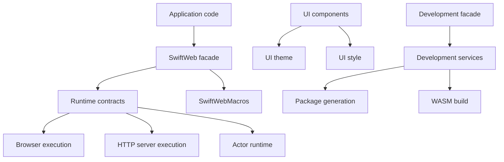

# Directory And File Structure Design

This document defines the current directory and file structure for SwiftWeb. The
goal is to make ownership visible from the path, keep compile-time boundaries
honest, and reduce the cognitive cost of finding the right place for a change.

## Design Principles

| Principle | Rule |
|---|---|
| Module before folder | A SwiftPM target is the boundary for dependencies, deployability, and ownership. A folder inside a target is only an internal navigation aid. |
| Direct dependency honesty | If a target imports or re-exports a module, `Package.swift` must list that target as a direct dependency. |
| One primary type per file | A file should contain one primary public or package type. Small private helper types may stay in the same file when they only exist for that primary type. |
| Extensions by capability | Cross-cutting extensions use `Type+Capability.swift`, not broad helper files. |
| Facades stay thin | Facade targets contain re-exports and macro entrypoints only. They do not own behavior. |
| Generated output is external | `.swiftweb/generated` is output, not source architecture. Source modules may generate it, but must not rely on generated layout internally. |

## Layer Map



## Top-Level Layout

| Path | Ownership |
|---|---|
| `Package.swift` | Product graph, target dependencies, Swift language settings. |
| `Sources/` | All library, executable, macro, runtime, and tooling targets. |
| `Tests/` | Unit, integration, runtime, and browser E2E tests. Tests should mirror product ownership. |
| `Examples/` | Minimal app examples that prove the public API. |
| `docs/` | Durable architecture, goal-state, and operational design documents. |
| `.swiftweb/` | Generated local development output. This path is not source. |

## Source Targets

```text
Sources/
  SwiftWeb/
  SwiftWebRuntime/
    Core/
    Actors/
  SwiftWebBrowser/
    Runtime/
    ClientRuntime/
  SwiftWebHTTPServer/
    Vapor/
    VaporWebActors/
  SwiftWebUI/
    Components/
    Style/
    Theme/
  SwiftWebDevelopment/
    Facade/
    Hooks/
    DevServer/
    PackageGeneration/
    WasmBuild/
    StoryboardTooling/
    Storyboard/
  SwiftWebCLI/
  SwiftWebMacros/
```

| Target | Directory | Owns | Must not own |
|---|---|---|---|
| `SwiftWeb` | `Sources/SwiftWeb/` | Public facade, macro declarations, re-exports. | Runtime behavior, host adapters, tooling. |
| `SwiftWebCore` | `Sources/SwiftWebRuntime/Core/` | App, Scene, Page, routing, actions, sessions, security, streaming contracts. | Browser host scripts, dev server, UI components. |
| `SwiftWebActors` | `Sources/SwiftWebRuntime/Actors/` | Shared distributed actor system and invocation codecs. | Host adapter policy. |
| `SwiftWebMacros` | `Sources/SwiftWebMacros/` | Source macros such as `@Page` and `@ServerAction`. | Runtime registration or file-system generation. |
| `SwiftWebBrowserRuntime` | `Sources/SwiftWebBrowser/Runtime/` | Browser runtime descriptors, hydration pruning, HTML injection, WASM asset routes, host scripts. | App routing, UI widgets, build orchestration. |
| `SwiftWebUIRuntime` | `Sources/SwiftWebBrowser/ClientRuntime/` | Browser-side WASM bridge and JavaScriptKit runtime adapter. | Server route registration or build tooling. |
| `SwiftWebVapor` | `Sources/SwiftWebHTTPServer/Vapor/` | HTTP server adapter and `App.run()` lifecycle. | Host-neutral app model or dev orchestration. |
| `SwiftWebVaporWebActors` | `Sources/SwiftWebHTTPServer/VaporWebActors/` | Optional HTTP server gateway for `@Resolvable` WebActor RPC. | Server Action registration or default app lifecycle. |
| `SwiftWebStyle` | `Sources/SwiftWebUI/Style/` | Atomic style classes, selectors, and CSS-safe declaration registration. | SwiftWebUI component policy. |
| `SwiftWebUITheme` | `Sources/SwiftWebUI/Theme/` | Host-neutral colors, materials, lengths, style system, root stylesheet, utility class definitions. | Component rendering, request routing. |
| `SwiftWebUI` | `Sources/SwiftWebUI/Components/` | SwiftUI-inspired components, modifiers, environment integration. | Browser WASM bridge, route registration, dev tooling. |
| `SwiftWebDevelopmentHooks` | `Sources/SwiftWebDevelopment/Hooks/` | Worker-side HMR hooks, dev route logging, boundary annotation. | Persistent dev host or package generation. |
| `SwiftWebWasmBuild` | `Sources/SwiftWebDevelopment/WasmBuild/` | WASM toolchain resolution, artifact processing, compression, size reports. | Watching files or launching workers. |
| `SwiftWebPackageGeneration` | `Sources/SwiftWebDevelopment/PackageGeneration/` | Generated server/dev/WASM package materialization and manifest inspection. | Long-running dev host, browser asset serving. |
| `SwiftWebDevServer` | `Sources/SwiftWebDevelopment/DevServer/` | Persistent dev host, file watching, HMR event stream, worker supervision, rebuild orchestration. | Public app API or production artifact policy. |
| `SwiftWebStoryboardTooling` | `Sources/SwiftWebDevelopment/StoryboardTooling/` | Storyboard package scaffold and dev runtime launch. | Storyboard component catalog UI. |
| `SwiftWebDevelopment` | `Sources/SwiftWebDevelopment/Facade/` | Development convenience facade. | Behavior beyond installing or re-exporting development modules. |
| `SwiftWebStoryboard` | `Sources/SwiftWebDevelopment/Storyboard/` | Storyboard catalog components and routes. | Storyboard package generation or dev host. |
| `SwiftWebCLI` | `Sources/SwiftWebCLI/` | `sweb` command parsing and delegation to tooling targets. | HMR implementation, package generation internals. |

## Target Internal Layout

### `Sources/SwiftWebRuntime/Core/`

This target is already directory-shaped and should remain the model for core
runtime code.

| Directory | File placement |
|---|---|
| `App/` | `App`, `Scene`, `SceneBuilder`, `PageGroup`, redirects, endpoint scene wrappers, app-level client runtime configuration. |
| `Core/` | `Page`, `PageRoute`, `PageDocument`, metadata, cache policy, query defaults. |
| `Routing/` | Request context, route environment, parameter decoding, session, HTML response conversion. |
| `Actions/` | Form actions, upload actions, action references, action gateway, actor gateway, action result encoding. |
| `Security/` | CSRF, CORS, CSP, security middleware, redirect/origin policy. |
| `Streaming/` | Streaming pages, SSE route, stream writer, SSE event/context. |
| `Realtime/` | WebSocket route and context. |
| `Rendering/` | Head asset assembly and document-level render helpers. |
| `Runtime/DevelopmentSupport/` | No-op production hook boundary used by development modules. |
| `Runtime/Diagnostics/` | Debug diagnostics and developer render output. |

### `Sources/SwiftWebBrowser/Runtime/`

Current files may remain flat while the target is small, but new files should
move toward this shape as the target grows:

```text
Sources/SwiftWebBrowser/Runtime/
  Descriptor/
    SwiftWebClientRuntime.swift
    SwiftWebClientRuntimeDescriptor.swift
    ClientSecurityDescriptor.swift
  Hydration/
    SwiftWebClientHydrationIndexPruner.swift
  Injection/
    SwiftWebClientRuntimeHTMLInjector.swift
    SwiftWebRenderOptions.swift
    SwiftWebRuntime.swift
  Assets/
    SwiftWebWasmClientManifestBuilder.swift
    SwiftWebWasmRuntimeRoutes.swift
    SwiftWebWasmRuntimeHostScript.swift
```

The route constants and host script must stay in the browser runtime target,
not in `SwiftWebCore`, because they describe browser boot behavior and WASM
asset serving.

### `Sources/SwiftWebUI/Components/`

```text
Sources/SwiftWebUI/Components/
  Core/
  Components/
    Containers/
    Controls/
    Layout/
    Media/
    Menus/
    Navigation/
    Presentation/
    Status/
    Text/
```

`SwiftWebUI` owns component rendering and component-facing modifiers. Host-neutral
style primitives live in `SwiftWebUITheme`; UI-specific environment glue may
remain in `SwiftWebUI/Core`.

### `Sources/SwiftWebUI/Theme/`

This target intentionally stays host-neutral.

| File group | File placement |
|---|---|
| Values | `Color`, `Length`, `Geometry`, `Material`, `ShapeStyle`, `ResolvedStyle`, `StyleResolutionContext`. |
| System | `StyleSystem`, builder files, category builders, environment model, utility registry. |
| Stylesheet | `RootStylesheet` and root-level stylesheet layer definitions. |
| Classes | `SwiftWebUIStyleClasses`, `SpaceStyleClasses`, `PaddingClassAxis`. |

If this target grows, use `Values/`, `System/`, `Stylesheet/`, and `Classes/`
subdirectories. Do not move component types into this target.

### `Sources/SwiftWebBrowser/ClientRuntime/`

This target should be split by browser runtime concern as it grows:

```text
Sources/SwiftWebBrowser/ClientRuntime/
  Bootstrap/
    ClientRuntimeBootstrapInitializable.swift
    ClientBundleRuntimeEntrypoint.swift
    ClientRuntimeEntrypoint.swift
  Bridge/
    ClientRuntimeBridge.swift
    ClientRuntimeEntrypointError.swift
  Browser/
    JavaScriptKitBrowserRuntime.swift
  Actors/
    JavaScriptKitWebActorTransport.swift
  URLQuery/
    ClientRuntimeURLQueryDecoder.swift
```

The bridge may depend on SwiftHTML and JavaScriptKit, but it must not depend on
Vapor or local development tooling.

Standard WASM is the supported browser compiler profile. Runtime sources are
named by responsibility (`ClientRuntimeBridge`, `ClientBundleRuntimeEntrypoint`,
`JavaScriptKitBrowserRuntime`) and should not grow `Wasm` or `Embedded` suffix
families for component runtime APIs.

| Name may mention WASM | Name should not mention WASM or Embedded |
|---|---|
| Toolchain resolution, binary format parsing, artifact routes, `.wasm` sidecars, generated package output paths. | Component runtime APIs, bridge types, bootstrap requests, DOM patching, page/session/app source files. |

### Development Tooling Targets

Development tooling is split by lifecycle:

```text
Sources/SwiftWebDevelopment/WasmBuild/
  Toolchain/
  Artifact/
  Compression/
  Report/

Sources/SwiftWebDevelopment/PackageGeneration/
  Discovery/
  Manifest/
  Materialization/
  Model/
  Toolchain/

Sources/SwiftWebDevelopment/DevServer/
  Runtime/
  Host/
  Watch/
  Build/
  Process/
  Network/

Sources/SwiftWebDevelopment/StoryboardTooling/
  Scaffold/
  Runtime/
```

The current flat file layout is acceptable for small targets, but once a target
passes roughly 12 files or mixes more than two lifecycles, it should adopt the
subdirectories above.

## Test Layout

Tests should mirror product ownership instead of testing everything through the
largest facade.

| Test path | Purpose |
|---|---|
| `Tests/SwiftWebTests/` | Core integration tests that need app routing, security, pages, and host-level behavior together. |
| `Tests/SwiftWebUITests/` | SwiftWebUI rendering, style policy, Storyboard catalog component checks. |
| `Tests/SwiftWebUIRuntimeTests/` | Browser WASM bridge and JavaScriptKit runtime behavior. |
| `Tests/BrowserE2E/` | Browser-level navigation, Storyboard, and latency checks. |

As tooling targets grow, prefer adding product-specific test targets such as
`SwiftWebDevServerTests`, `SwiftWebWasmBuildTests`, and
`SwiftWebPackageGenerationTests` instead of making `SwiftWebTests` depend on every
development target.

## Generated Project Layout

`SwiftWebPackageGeneration` owns this output layout:

```text
.swiftweb/
  generated/
    server/
    dev/
    wasm/
  storyboard/
```

Generated packages may import runtime products, but source targets must not import
from generated output paths. Generated package structure is a build artifact and
may change without changing source module ownership.

## Placement Decision Table

| Question | Place it in |
|---|---|
| Is it part of `App`, `Scene`, `Page`, route lowering, request/session state, or server actions? | `Sources/SwiftWebRuntime/Core/` |
| Does it describe browser boot, hydration descriptors, runtime script injection, or WASM asset routes? | `Sources/SwiftWebBrowser/Runtime/` |
| Is it a reusable UI component or SwiftUI-like modifier? | `Sources/SwiftWebUI/Components/` |
| Is it a host-neutral visual token, material, color, spacing, root stylesheet, or utility class? | `Sources/SwiftWebUI/Theme/` |
| Does it run inside browser WASM using JavaScriptKit? | `Sources/SwiftWebBrowser/ClientRuntime/` |
| Does it adapt the app to an HTTP server runtime? | `Sources/SwiftWebHTTPServer/` |
| Does it inspect or generate SwiftPM packages? | `Sources/SwiftWebDevelopment/PackageGeneration/` |
| Does it build, strip, compress, or report on WASM artifacts? | `Sources/SwiftWebDevelopment/WasmBuild/` |
| Does it watch files, supervise dev workers, or emit HMR events? | `Sources/SwiftWebDevelopment/DevServer/` |
| Does it scaffold or launch Storyboard's managed package? | `Sources/SwiftWebDevelopment/StoryboardTooling/` |
| Is it user-facing CLI parsing? | `Sources/SwiftWebCLI/` |

## Review Checklist

Run these checks when moving files or adding a module:

```bash
xcrun swift build
xcodebuild -scheme swift-web-Package -destination 'platform=macOS' -test-timeouts-enabled YES -default-test-execution-time-allowance 60 -maximum-test-execution-time-allowance 180 test -quiet
rg -n "Sources/SwiftWebDevelopment/Runtime|Runtime/Development|SwiftWebUI/Styling|Runtime/Client|Runtime/Wasm" README.md docs Sources Tests -g '*.md' -g '*.swift' -g '!docs/DirectoryFileStructureDesign.md'
rg -n "^import SwiftWeb(Development|DevServer|PackageGeneration|WasmBuild|StoryboardTooling)" Sources/SwiftWeb Sources/SwiftWebRuntime Sources/SwiftWebUI Sources/SwiftWebBrowser Sources/SwiftWebHTTPServer -g '*.swift'
```

The first search should only return valid current paths, such as
`Runtime/DevelopmentSupport`. The second search should return no production
imports of development tooling.
