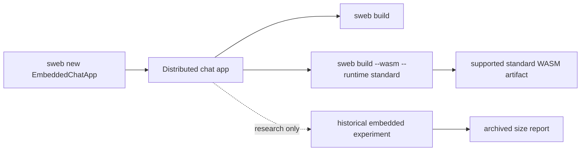
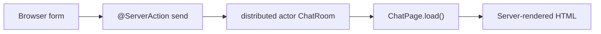
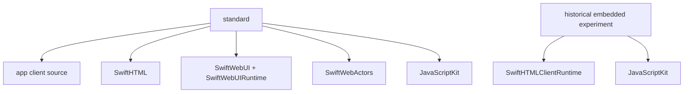

# Embedded Swift WASM Research Note

## Summary

This document is an archived research note. Embedded Swift WASM is not part of
SwiftWeb's public support boundary. The supported browser target is the standard
Swift WASM SDK:

```bash
sweb build --wasm --runtime standard
```

Earlier experiments measured a smaller generated package shape, but that path is
not a supported runtime contract. Current SwiftWeb browser functionality depends
on `Distributed`, `Codable`, and Foundation-family capabilities that the Embedded
Swift SDK does not provide.



## Validation App

| Field | Value |
|---|---|
| App path | `/Users/1amageek/Desktop/EmbeddedChatApp` |
| Creation command | `sweb new EmbeddedChatApp --output /Users/1amageek/Desktop` |
| App shape | `@Page("/")` chat UI, `distributed actor ChatRoom`, `@ServerAction send` |
| Server build | Passed |
| Standard WASM build | Passed |
| Embedded Swift experiment | Historical measurement only; not a supported profile. |

The chat app keeps messages in a server-side distributed actor. The composer posts through
a server action, invalidates the page, and renders the updated timeline from the actor.



## Commands

Host/server build:

```bash
SWIFT_WEB_PACKAGE_PATH=/Users/1amageek/Desktop/swift-web \
perl -e 'alarm 120; exec @ARGV' \
  /Users/1amageek/Desktop/swift-web/.build/debug/sweb build \
  --package-path /Users/1amageek/Desktop/EmbeddedChatApp
```

Standard release WASM:

```bash
SWIFT_WEB_WASM_SWIFT=/Users/1amageek/Library/Developer/Toolchains/swift-6.3.1-RELEASE.xctoolchain/usr/bin/swift \
SWIFT_WEB_WASM_TOOLCHAIN_BIN=/Users/1amageek/Library/Developer/Toolchains/swift-6.3.1-RELEASE.xctoolchain/usr/bin \
SWIFT_WEB_PACKAGE_PATH=/Users/1amageek/Desktop/swift-web \
perl -e 'alarm 300; exec @ARGV' \
  /Users/1amageek/Desktop/swift-web/.build/debug/sweb build \
  --package-path /Users/1amageek/Desktop/EmbeddedChatApp \
  --wasm \
  --runtime standard \
  --scratch-path /Users/1amageek/Desktop/EmbeddedChatAppWasmReports/standard \
  -c release
```

The old Embedded Swift experiment used a private runtime-profile flag. That
command is no longer part of the public SwiftWeb CLI contract.

## Size Results

| Artifact | Standard | Historical Embedded Experiment | Reduction | Ratio |
|---|---:|---:|---:|---:|
| Original WASM | 71,101,349 B | 849,781 B | 98.80% | 83.7x |
| Final WASM | 56,937,343 B | 77,836 B | 99.86% | 731.5x |
| gzip | 19,879,930 B | 28,459 B | 99.86% | 698.5x |
| Brotli | 12,839,470 B | 23,617 B | 99.82% | 543.7x |

Report files:

| Profile | Report |
|---|---|
| Standard | `/Users/1amageek/Desktop/EmbeddedChatAppWasmReports/standard/wasm32-unknown-wasip1/release/embedded-chat-app-wasm-runtime.wasm.size.json` |
| Historical Embedded Experiment | `/Users/1amageek/Desktop/EmbeddedChatAppWasmReports/embedded/wasm32-unknown-wasip1/release/embedded-chat-app-wasm-runtime.wasm.size.json` |

## Generated Package Shape

This shape is the measured fallback package shape, not the final source ownership
model.

| Profile | Generated source targets |
|---|---|
| Standard | App client source, `SwiftHTML`, `SwiftWebActors`, `SwiftWebUI`, `SwiftWebUIRuntime`, `JavaScriptKit`, `_CJavaScriptKit`, generated `*WasmRuntime` |
| Historical Embedded Experiment | `SwiftHTMLClientRuntime`, JavaScriptKit, `_CJavaScriptKit`, generated `*WasmRuntime` |



## Notes

| Item | Result |
|---|---|
| `wasm-opt` | Not installed during measurement, so `-Oz` was skipped. The reported compression still includes strip, gzip, and Brotli. |
| JavaScriptKit warning | The historical Embedded Swift experiment emitted a deprecated `JSFunction` warning from the copied JavaScriptKit source. |
| Runtime parity | The historical profile did not provide full standard `ClientComponent` hydration parity. |
| Source model | Standard WASM is the supported browser source contract. |
| Source boundary | Server-only Distributed Actor code should stay under server-only source paths such as `Actions` or `Routes`; shared DTOs can stay in shared paths such as `Services`. |
