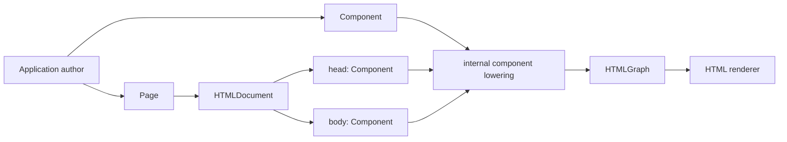
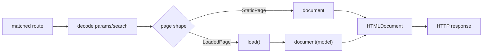

# HTML Authoring Model

## Status

| Field | Value |
|---|---|
| Status | Implemented |
| Decision date | 2026-07-26 |
| Public authoring unit | `Component` |
| Complete document unit | `HTMLDocument` |
| Internal lowering unit | Component nodes and `HTMLGraph` |
| Page output | `HTMLDocument` |

## Decision

Application authors compose reusable HTML with `Component`. The renderer may
use fragment-shaped graph nodes while lowering a component, but no separate
fragment protocol is part of the authoring API.

`HTMLDocument` is a separate `HTML` kind with explicit `head` and `body`
sections. A document is renderable, but it is not a `Component`, so the result
builder cannot nest a complete document inside an element or another
component.



## Public Vocabulary

| Concept | Public role | Nestable | Member used by authors |
|---|---|---:|---|
| `HTML` | Common renderable root for documents and components. | Depends on refinement | None |
| `Component` | Reusable authoring and composition unit. | Yes | `content` |
| `HTMLDocument` | Complete `<!doctype html>` document. | No | `head`, `body` |
| `Page` | Request-time producer of an `HTMLDocument`. | No | `document` or `document(_:)` |
| Graph lowering | Renderer implementation detail. | Not a public contract | None |

Generic constraints, result-builder signatures, modifiers, and documentation
examples use `Component` consistently.

## SwiftHTML Interface

The public shape is:

```swift
public protocol HTML: Sendable {}

public protocol Component: HTML {
    associatedtype Content: Component

    @ComponentBuilder
    var content: Content { get }
}

public protocol HTMLDocument: HTML {
    associatedtype Head: Component
    associatedtype Body: Component

    var htmlAttributes: [HTMLAttribute] { get }

    @HTMLBuilder
    var head: Head { get }

    var bodyAttributes: [HTMLAttribute] { get }

    @HTMLBuilder
    var body: Body { get }
}
```

Elements, text, builder tuples, conditionals, and modifier results participate
in the public tree as `Component` values. `ComponentBuilder` lowers authored
expressions to `ComponentContent`, a stable builder result that callers do not
construct or store directly. Primitive rendering dispatch and fragment graph
nodes remain implementation details. Primitive components may use an internal
`Content == Never` path; application code must not need to model that path.

This naming keeps the two commonly authored properties unambiguous:

```text
Component.content     reusable nested content
HTMLDocument.body     the document's <body> section
App.body              the application's Scene graph
```

## Component Example

```swift
import SwiftHTML

struct ArticleSummary: Component {
    let title: String
    let summary: String

    var content: some Component {
        article {
            h2 { title }
            p { summary }
        }
    }
}
```

`Component` is `Sendable` through `HTML`, so a component does not repeat
`Sendable` conformance unless another protocol requires an explicit
declaration for a different reason.

## Document Example

Use `Document` when the page needs direct control of both document sections:

```swift
import SwiftHTML

struct ArticleDocument: HTMLDocument {
    let titleText: String
    let summary: String

    var htmlAttributes: [HTMLAttribute] {
        [.lang("en")]
    }

    var head: some Component {
        meta(.charset("utf-8"))
        meta(.name("viewport"), .content("width=device-width, initial-scale=1"))
        title { titleText }
    }

    var body: some Component {
        main {
            ArticleSummary(title: titleText, summary: summary)
        }
    }
}
```

The equivalent closure-built document is:

```swift
let document = Document(
    htmlAttributes: [.lang("en")]
) {
    meta(.charset("utf-8"))
    title { "Article" }
} body: {
    main {
        ArticleSummary(
            title: "Article",
            summary: "Rendered from a complete HTML document."
        )
    }
}
```

## Page Integration

SwiftWeb pages produce complete documents. The route layer does not wrap an
arbitrary component in an implicit document after page evaluation.



### Static Page

```swift
import SwiftHTML
import SwiftWeb

@Page("/")
struct HomePage {
    var document: some HTMLDocument {
        PageDocument(title: "Home") {
            main {
                h1 { "Home" }
            }
        }
    }
}
```

### Loaded Page

```swift
import SwiftHTML
import SwiftWeb

@Page("/status")
struct StatusPage {
    func load() async throws -> String {
        "Ready"
    }

    func document(_ status: String) -> some HTMLDocument {
        PageDocument(title: "Status") {
            main {
                h1 { status }
            }
        }
    }
}
```

### Custom Document From a Page

```swift
import SwiftHTML
import SwiftWeb

@Page("/article")
struct ArticlePage {
    var document: some HTMLDocument {
        ArticleDocument(
            titleText: "Article",
            summary: "A page may return any HTMLDocument."
        )
    }
}
```

`PageDocument` remains SwiftWeb's convenience document. It owns page metadata,
SwiftWebUI head insertion markers, root language, and optional body class.
Return a custom `HTMLDocument` when the application needs full control of the
head or document attributes.

## Boundary Rules

| Boundary | Required contract |
|---|---|
| Reusable UI | Declare `Component` and implement `content`. |
| Result builders and modifiers | Expose `Component` in public generic constraints and return types. |
| Builder lowering | Return `some Component`; let `ComponentBuilder` produce stable `ComponentContent` storage. |
| Complete HTML | Declare `HTMLDocument` and implement `head` and `body`. |
| Page rendering | Return `some HTMLDocument`; do not return an arbitrary component. |
| Renderer internals | Lower components and document sections into fragment nodes and `HTMLGraph`. |
| Nesting | Accept `Component`; reject `HTMLDocument`. |
| Concurrency | Preserve `Sendable` through the `HTML` root protocol. |

## Verification Contract

The implementation must preserve all of the following:

1. Public SwiftHTML declarations use `Component` for nestable content.
2. Public SwiftWeb and SwiftWebUI declarations use `Component` for nestable
   authored content.
3. `HTMLDocument` uses `Component` for `head` and `body`, remains `HTML`, and
   cannot be nested by `HTMLBuilder`.
4. Primitive tags, text, tuples, conditionals, arrays, and modifiers satisfy
   the `Component` authoring contract without exposing renderer machinery.
5. Documentation snippets compile against the pinned dependency revision.
6. Rendering tests cover component composition, complete documents, rejected
   document nesting, static pages, and loaded pages.
