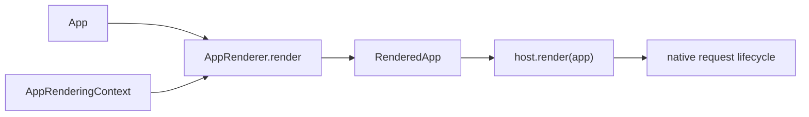
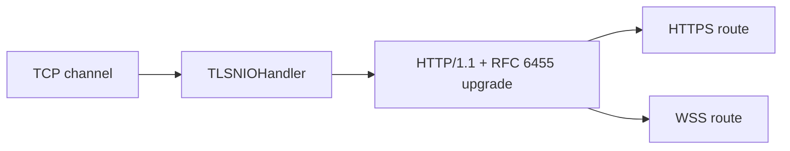
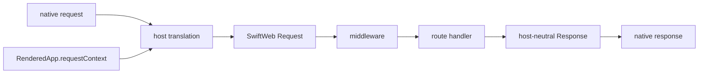

# Host Rendering Contract

SwiftWeb keeps the declarative app definition separate from the server or
platform adapter that serves it. An `App` describes scenes and app-wide policy.
It does not own a router, logger, server storage, or host lifecycle.



## Ownership

| Layer | Owns |
|---|---|
| App author | `App`, `Scene`, pages, endpoints, security policy, actor system, and client runtime declaration |
| SwiftWeb core | Scene rendering, route registration, middleware assembly, and framework request state |
| Host adapter | Native server or event source, binding configuration, logging, sessions, request/response translation, and shutdown |
| Request | One host-neutral request plus a reference to the rendered app's immutable request runtime context |

The host calls the common renderer exactly once for each installed app:

```swift
@_spi(Hosting) import SwiftWebCore

let renderedApp = try await AppRenderer.render(
    app,
    in: AppRenderingContext(
        serverConfiguration: serverConfiguration,
        clientRuntime: clientRuntime,
        developmentHooks: developmentHooks
    )
)
```

`RenderedApp` contains the route descriptors, middleware chain, and
`RequestRuntimeContext` needed to serve requests. It does not contain the
host's server instance or lifecycle owner.

## Native HTTP Host

`SwiftWebHTTPServerHost` exposes the host-facing operation as
`HTTPServerHost.render(_:)`:

```swift
import SwiftWebHTTPServerHost

let host = HTTPServerHost(hostname: "127.0.0.1", port: 8080)
let installation = try await host.render(MyApp())
defer { installation.shutdown() }
try await installation.serve()
```

`App.run()` remains a convenience over the same host and rendering path. It
does not introduce a second application container.

The host also owns transport security. A secure listener is configured with a
validated `HTTPServerTransportConfiguration` and installs one independent
`TLSNIOHandler` per accepted channel:



SwiftWeb core receives only the resulting request scheme and plaintext request
or WebSocket data. Certificate identity, TLS policy, handshake deadlines, and
encrypted buffer ownership remain in the native host and `swift-tls-nio`.
Plaintext remains an explicit transport configuration for local development and
deployments whose trusted edge terminates TLS before forwarding requests.

## Request Translation

Every native request is translated into `SwiftWebHost.Request` using the exact
`RequestRuntimeContext` returned by `AppRenderer`. The host supplies the native
method, URL, headers, body reader, session, logger, remote address, and path
parameters. Core handlers therefore depend on request data and framework
runtime state without receiving the host itself.



## Failure and Lifecycle

- Rendering is `async throws`. A host must not begin serving when rendering
  fails.
- A host releases resources it created if rendering or native binding fails.
- Serving and shutdown remain host responsibilities; SwiftWeb core does not
  listen on ports or manage platform event loops.
- Platform-specific configuration stays in the adapter. Only values that
  affect host-neutral rendering enter `AppRenderingContext`.

The removed `ApplicationProtocol`, `Application` alias, app-owned services
container, and route-installer callbacks are not part of this contract. Host
adapters migrate directly to `AppRenderer` and `RenderedApp`.
