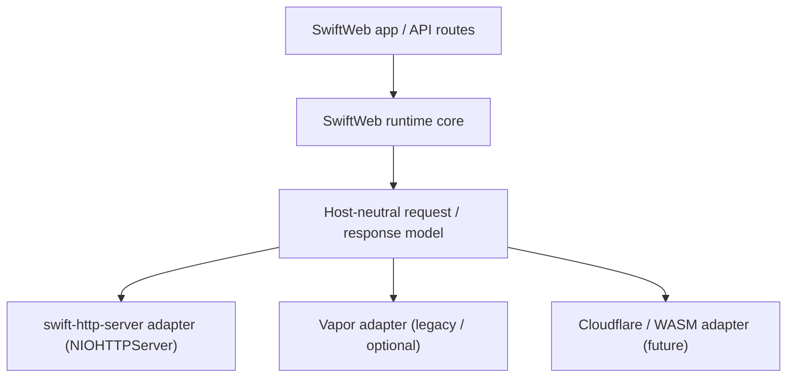

# Lightweight HTTP Server Decision

This document records the decision to build SwiftWeb's backend/API host on
`swift-http-server` (the `NIOHTTPServer` runtime over the standard HTTP API proposal)
instead of Vapor, and the motivation behind it.

## Status

| Field | Value |
|---|---|
| Status | Decided — adopt `swift-http-server` for the lightweight host |
| Decision date | 2026-07-06 |
| Primary goal | Serve backend APIs on a minimal, standard HTTP stack instead of the full Vapor framework. |
| Secondary goal | Converge the production API host onto the same runtime the SwiftWeb dev host already uses. |
| Already in place | `SwiftWebDevServer` runs on `NIOHTTPServer` + `HTTPAPIs` (`SwiftWebDevHost` / `SwiftWebDevHostHTTPHandler`). |
| Current gap | The production/app host still runs on `SwiftWebVapor`; routing, sessions, middleware, and content decoding are provided by Vapor. |

## Motivation

Our backend services are API-first: they route requests, read/write data, verify auth
tokens, and return JSON. They do **not** need most of what Vapor bundles.

### 1. Vapor is heavy for an API host

Depending on Vapor pulls in a large transitive graph — the majority of the packages this
repository resolves come from the Vapor family:

```
vapor
 ├─ console-kit        (CLI / commands)
 ├─ async-kit
 ├─ multipart-kit
 ├─ routing-kit
 ├─ websocket-kit
 ├─ swift-metrics
 ├─ swift-service-lifecycle
 ├─ swift-crypto
 └─ NIO family (nio / -ssl / -http2 / -extras / -transport-services)
```

For an API host we use only a slice of this (HTTP server, routing, sessions, middleware,
content decoding). The rest is build-time cost, binary size, and dependency surface we
carry without benefit.

### 2. There is a lighter, standard runtime — and we already use it

The SwiftWeb dev host already runs on `swift-http-server`:

- `NIOHTTPServer` + `NIOHTTPServerConfiguration` bind and serve.
- Handlers conform to `HTTPServerRequestHandler` and speak `HTTPRequest` / `HTTPResponse`
  from `swift-http-types`, with the `HTTPAPIs` request/response streaming model.

This is the emerging standard Swift server HTTP API (the swift-server HTTP API proposal),
not a framework. It is small, it is what the ecosystem is standardizing on, and it is
already proven inside this codebase for the dev host.

### 3. It matches SwiftWeb's host-neutral direction

`PlatformHostArchitecture.md` already commits to treating Vapor as **one host adapter**,
not the core runtime. Building the API host directly on `swift-http-server` is the concrete
next step of that direction: the SwiftWeb runtime core owns the request/response and
session/action model, and a thin `swift-http-server` adapter lowers it onto a socket.



### 4. Dependency alignment stays open

A lean host on `apple/swift-nio` upstream keeps the door open to link cleanly with
app-level libraries that are also on upstream (for example the standalone `FirebaseAuth`
package, which builds on `apple/swift-crypto`). Trimming Vapor does **not**, by itself,
resolve conflicts with fork-based graphs — that is a separate axis (see *Non-goals*) — but
a minimal, upstream host is the least-entangled starting point.

## Decision

Build the production API host on `swift-http-server`:

- `NIOHTTPServer` for binding and serving (HTTP/1.1 initially; HTTP/2 later as needed).
- `HTTPAPIs` + `swift-http-types` for the request/response and streaming model.
- A small routing + middleware layer owned by SwiftWeb (or a thin dependency), rather than
  Vapor's routing-kit + middleware stack.

Vapor remains available as a legacy/optional adapter during migration but is no longer the
default host for API services.

## Programming model

Handlers are plain values conforming to `HTTPServerRequestHandler`, using ownership-aware
request/response streaming:

```swift
struct APIHandler: HTTPServerRequestHandler {
    func handle(
        request: HTTPRequest,
        requestContext: HTTPRequestContext,
        requestBodyAndTrailers: consuming sending HTTPRequestConcludingAsyncReader,
        responseSender: consuming sending HTTPResponseSender<HTTPResponseConcludingAsyncWriter>
    ) async throws {
        // route on request.method / request.path, read body, write HTTPResponse
    }
}

let server = NIOHTTPServer(
    logger: logger,
    configuration: try NIOHTTPServerConfiguration(
        bindTarget: .hostAndPort(host: host, port: port),
        supportedHTTPVersions: [.http1_1],
        transportSecurity: .plaintext
    )
)
try await server.serve(handler: APIHandler())
```

## What we rebuild vs. what we drop

| Concern | Vapor today | Lightweight host |
|---|---|---|
| HTTP server | Vapor + NIO | `NIOHTTPServer` (swift-http-server) |
| Routing | routing-kit | small SwiftWeb router / trie |
| Middleware | Vapor middleware | thin middleware chain over `HTTPServerRequestHandler` |
| Sessions / cookies | Vapor sessions | small cookie/session helper (SwiftWeb owns the contract) |
| Content decode | Vapor `Content` | `Codable` + JSON, per-route |
| Body / multipart | multipart-kit | opt-in only where a route needs it |
| CLI / commands | console-kit | not needed for API hosts |
| Metrics / lifecycle | swift-metrics / service-lifecycle | opt-in only where needed |
| WebSocket | websocket-kit | opt-in module (framework realtime path) |

The goal is to **pay for only what an endpoint uses**, instead of inheriting the whole
framework.

## Non-goals

- **This is not a fix for the fork/upstream dependency conflict.** Any host on
  `apple/swift-nio` still cannot share a binary with a graph pinned to the `1amageek/*`
  NIO forks. Framework weight and dependency-line alignment are independent decisions.
- Not removing Vapor immediately; it stays as a migration adapter.
- Not building a general-purpose web framework layer here — this is the API host.

## Migration plan (high level)

1. Extract a `swift-http-server`-based host adapter alongside `SwiftWebVapor`, reusing the
   dev host's `NIOHTTPServer` setup.
2. Provide a minimal router + middleware chain and a session/cookie helper on top of the
   host-neutral request/response model.
3. Port API services off Vapor route-by-route; keep Vapor available until parity is reached.
4. Make the `swift-http-server` host the default for API targets; keep Vapor as opt-in.

## Open questions

- Router: build a small internal router, or adopt a thin external one?
- Sessions: reuse the existing `WebSession` contract with a new cookie backend, or keep it
  storage-agnostic?
- HTTP/2 / TLS: when do API hosts need them, and does that pull `swift-nio-ssl` /
  `swift-nio-http2` back in?
- Testing: a lightweight in-process request harness to replace `VaporTesting`.
