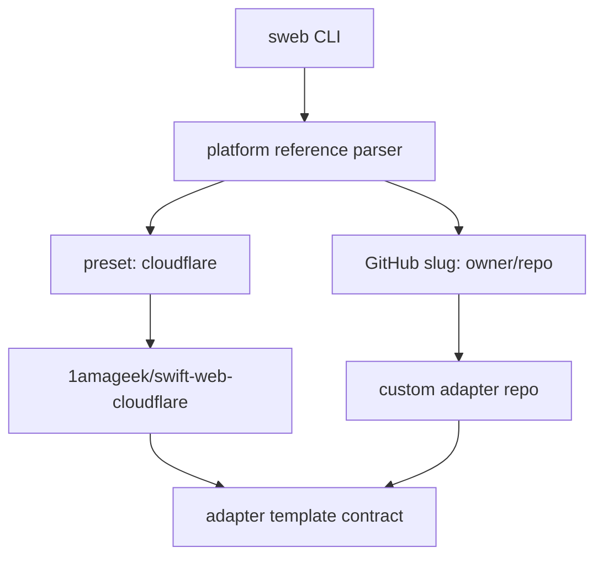

# Platform Adapter Template Contract

This document defines how `sweb` references deployment platform adapters without
embedding platform-specific implementation into the SwiftWeb CLI or app package.

## Goal

`sweb` stays in the `swift-web` repository. Platform adapters can live in separate
repositories and be selected by preset name or GitHub repository slug. During
`sweb new`, the CLI resolves the adapter repository, validates its manifest, copies
the selected template directory into the app package, and records the source in
`.swiftweb/platform.json`.



## CLI Contract

| Input | Meaning |
|---|---|
| `--platform cloudflare` | Preset for `1amageek/swift-web-cloudflare`. |
| `--platform cloud-run` | Preset for `1amageek/swift-web-cloud-run`. |
| `--platform owner/repo` | GitHub repository slug implementing this contract. |
| `--platform owner/repo/template` | GitHub repository slug plus an adapter template path inside that repository. |
| `--platform cloudflare/template` | Preset repository plus an adapter template path. |
| `--platform github:owner/repo` | Explicit GitHub repository slug. |
| `--platform https://github.com/owner/repo.git` | GitHub URL normalized into `owner/repo`. |

`sweb new` materializes the selected adapter template and records the selected
adapter in `.swiftweb/platform.json`. It does not add the platform adapter repository
to the user app's `Package.swift`.

```json
{
  "schemaVersion": 1,
  "adapter": {
    "input": "cloudflare",
    "source": "github",
    "repository": "1amageek/swift-web-cloudflare",
    "url": "https://github.com/1amageek/swift-web-cloudflare.git",
    "preset": "cloudflare",
    "templatePath": "chat"
  },
  "appTemplate": "ai-chat",
  "app": {
    "name": "Chat",
    "moduleName": "Chat",
    "kebabName": "chat"
  }
}
```

## Adapter Repository Contract

An adapter repository must expose `sweb.json` at its repository root:

```json
{
  "schemaVersion": 1,
  "id": "cloudflare",
  "name": "SwiftWeb Cloudflare",
  "templates": {
    "new": {
      "path": "templates/new",
      "reference": {
        "title": "SwiftWeb",
        "url": "https://github.com/1amageek/swift-web"
      }
    },
    "named": {
      "chat": {
        "path": "templates/chat",
        "reference": {
          "title": "SwiftWeb",
          "url": "https://github.com/1amageek/swift-web"
        }
      },
      "api": {
        "path": "templates/api",
        "reference": {
          "title": "SwiftWeb",
          "url": "https://github.com/1amageek/swift-web"
        }
      }
    }
  },
  "capabilities": {
    "scaffold": true,
    "build": false,
    "deploy": false
  }
}
```

| Field | Responsibility |
|---|---|
| `schemaVersion` | Contract version understood by `sweb`. |
| `id` | Stable platform adapter id. |
| `templates.new.path` | Default directory copied into the app package during scaffold materialization. |
| `templates.named` | Named templates exposed by the adapter repository. |
| `templates.*.reference` | Required canonical SwiftWeb reference link for the template page. |
| `templates.*.reference.title` | Human-readable link title. |
| `templates.*.reference.url` | Canonical reference URL. |
| `adapter.templatePath` | Optional selector from `owner/repo/template`, such as `chat`. A named manifest entry wins; otherwise the value is treated as a literal relative template path. |
| `capabilities` | Declares which adapter operations the repository supports. |

Template files belong to the adapter repository. Template directories are copied
relative to the SwiftWeb app package root. SwiftWeb CLI only resolves, validates,
and applies the contract. The CLI rejects adapter files that would overwrite an
existing app file and rejects symlinks in adapter templates.

## Template Variables

Adapter templates can use placeholder variables in text files. `sweb` replaces
these values when it materializes an adapter template.

| Placeholder | Value |
|---|---|
| `{{app.name}}` | Original app name passed to `sweb new`. |
| `{{app.moduleName}}` | Swift module/type-safe app identifier. |
| `{{app.kebabName}}` | Lowercase URL/file-safe app identifier. |

## Boundary

| Layer | Owns |
|---|---|
| `sweb` | Presets, GitHub slug normalization, adapter manifest validation, template application. |
| Adapter repository | Platform files such as `Dockerfile`, `wrangler.toml`, TypeScript host code, deploy docs. |
| User app package | Host-neutral SwiftWeb app source and `.swiftweb/platform.json`. |
| `SwiftWeb` product | Public app API. It does not import deployment adapter packages. |

## Non-Goals

| Non-goal | Reason |
|---|---|
| Add adapter repositories to app `Package.swift`. | Deployment tooling should not pollute the app compile graph. |
| Put Cloudflare or Cloud Run templates inside `NewCommand.swift`. | That would make the CLI own platform implementation details. |
| Run Vapor inside Cloudflare Workers. | Cloudflare uses event handlers, not a port-listening server process. |
